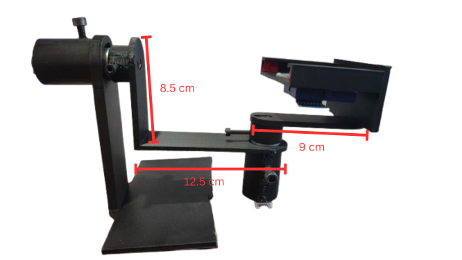

# Donanım Şeması — 2 Eksenli Gimbal (tek yaşayan referans)

> **Bu belge sistemin TEK donanım şema/pin kaynağıdır.** Kontrol teorisi için
> [`00_genel_bakis.md`](00_genel_bakis.md) neyse, donanım için bu belge odur:
> *kesişen* (faza özgü olmayan) bilgi tek yerde. Tüm faz belgeleri buraya **atıf** verir;
> pin **seçim gerekçeleri** ilgili faz belgesinde kalır ([`asama_0_altyapi.md`](asama_0_altyapi.md) §8
> enc-1/motor-1/IMU; [`asama_3_mimo_model.md`](asama_3_mimo_model.md) §12 motor-2), **şema/veri burada.**
>
> **Güncel:** 2026-06-23 — donanım topolojisi Aşama 3'te donduruldu (2 motor MIMO, asimetrik HW-039+TB6612); §4.1 decoupling/bulk kapasitör eklendi (bench-doğrulandı). Proje şu an Aşama 5 (yüklü gimbal) AÇIK — yeni pin/motor eklenmedi, donanım gerçeği değişmedi. Donanım değişince **burası** güncellenir.

---

## 1. Sistem topolojisi (ASCII bağlantı şeması)

> ⚠ **INTERIM (2026-06-17, bkz. §12.11 (revize; §12.10 çürütüldü) + §7.2):** Motor-1/HP ekseninin GÜNCEL sürücüsü **HW-039/BTS7960** (RPWM=**PB8**/LPWM=**PB9** sign-magnitude; R_EN+L_EN enable=**PB14**). §1 ASCII şeması ve güç-kutusu aşağıda **HW-039/BTS7960 ile çizildi** (Motor-1 pin gerçeği = §2 master tablosu + firmware struct + §7.2 ile tutarlı). HW-039 ile devam kararı kalıcı (`§12.11.5` — "DFR0601 gelince yeniden çiz" ertelemesi DÜŞTÜ).

```
┌─ GÜÇ DAĞITIMI ───────────────────────────────────────────────┐
│ 12V/5A adaptör (+) → HW-039 B+    +  TB6612-2.VM  (motor gücü)│
│ BlackPill 5V       → enc-1.Vcc 🔵  +  enc-2.Vcc 🔵  (encoder) │
│ BlackPill 3.3V     → HW-039 VCC   + TB6612-2.VCC + MPU6050.VCC│
│                      (lojik — IMU 3.3V! encoder'la KARIŞTIRMA)│
│ ORTAK GND ⏚ (TEK NOKTA) → BlackPill.GND + HW-039/TB6612-2.GND │
│                           + 12V(−) + enc-1/2.GND 🟢 + MPU.GND │
└──────────────────────────────────────────────────────────────┘

MOTOR-1 EKSENİ (HP, dış/yük — §7.2)           MOTOR-2 EKSENİ (LP, iç/stand — Aşama 3)
──────────────────────────────────           ──────────────────────────────
PB8  ─RPWM─▶ HW-039/BTS7960 RPWM              PB1  ─PWM ─▶ TB6612-2 PWMA
PB9  ─LPWM─▶ HW-039/BTS7960 LPWM              PB4  ─AIN1─▶ TB6612-2 AIN1
PB14 ─EN  ─▶ HW-039 R_EN+L_EN                 PB5  ─AIN2─▶ TB6612-2 AIN2
                                              PB10 ─STBY─▶ TB6612-2 STBY
             HW-039 M+ ─🔴▶ Motor1 +                      TB6612-2 AO1 ─🔴▶ Motor2 +
             HW-039 M− ─⚫▶ Motor1 −                      TB6612-2 AO2 ─⚫▶ Motor2 −
PA15 ◀─enc A 🟡 sarı                          PA8  ◀─enc A 🟡 sarı
PB3  ◀─enc B ⚪ beyaz                         PA9  ◀─enc B ⚪ beyaz
  (TIM2, 32-bit)                                (TIM1, 16-bit → yazılım count-genişletme)

IMU — MPU6050                                 ACS712 (Faz-2 — HENÜZ BAĞLI DEĞİL, §5)
─────────────                                 ──────────────────────────────────────
PB6 ─SCL─▶ MPU6050 SCL                        PA1 ◀─ ACS712-1 OUT   (rezerv, boş)
PB7 ◀─SDA─▶ MPU6050 SDA                       PA2 ◀─ ACS712-2 OUT   (rezerv, boş)
3.3V ─▶ VCC   GND ─▶ GND   AD0 ─▶ GND
  (I2C1 100 kHz, adres 0x68; MPU = 3.3V!)
```

> 📌 `─▶` MCU **çıkışı**, `◀─` MCU **girişi**. Her Pololu 25D **tek gövdedir** (motor+encoder):
> tek kablodan 6 renkli tel çıkar — kalın 2'si (🔴⚫) sürücü çıkışına, ince 4'ün 2'si güç
> rayına (🔵🟢), 2'si doğrudan MCU'ya (🟡⚪). **Sarı/beyaz asla sürücüye gitmez.**

## 2. Master pin tablosu (her kullanılan pin)

| İşlev | Pin | Çevre | Yön | Bağlantı |
|---|---|---|---|---|
| Motor-1 RPWM (CW) | PB8 | TIM4_CH3 | →çıkış | HW-039/BTS7960 RPWM |
| Motor-1 LPWM (CCW) | PB9 | TIM4_CH4 | →çıkış | HW-039/BTS7960 LPWM |
| Motor-1 EN (R_EN+L_EN) | PB14 | GPIO | →çıkış | HW-039 enable köprü |
| Encoder-1 A / B | PA15 / PB3 | TIM2_CH1/2 (32-bit) | ←giriş | M1 🟡 / ⚪ |
| Motor-2 PWM | PB1 | TIM3_CH4 | →çıkış | TB6612-2 PWMA |
| Motor-2 AIN1 / AIN2 | PB4 / PB5 | GPIO | →çıkış | TB6612-2 AIN1/AIN2 |
| Motor-2 STBY | PB10 | GPIO | →çıkış | TB6612-2 STBY (ayrı) |
| Encoder-2 A / B | PA8 / PA9 | TIM1_CH1/2 (16-bit) | ←giriş | M2 🟡 / ⚪ |
| IMU SCL / SDA | PB6 / PB7 | I2C1 | ↔ | MPU6050 SCL/SDA (3.3V) |
| USB D− / D+ | PA11 / PA12 | OTG_FS | ↔ | USB-C |
| SWD IO / CLK | PA13 / PA14 | SWJ-DP | ↔ | ST-Link |
| LED | PC13 | GPIO | →çıkış | onboard |
| KEY (+ fake-stall debug) | PA0 | GPIO | ←giriş | onboard buton |
| **ACS712-1 / -2** | **PA1 / PA2** | ADC1_IN1/2 | ←giriş | **Faz-2 rezerv (boş, §5)** |

**Kullanılmayan / yasak pinler:** PA0=KEY · PA4–PA7=SPI-flash footprint (`[WeAct_BP]`) ·
PB2=BOOT1 · PA13/14=SWD. Gerekçeler → asama_0 §8.1 (Aşama 0) + asama_3 §12.2 (motor-2).

## 3. Kablolama — renk renk (Pololu 25D motor-1 + motor-2 — ⚠ AYRI sürücüler, elektriksel paralel DEĞİL; tablo yan-yana karşılaştırma)

Renk kodu `[Pololu_25D]` Page 2. **Pololu 25D tek gövde** (motor+encoder, 6 telli tek kablo).

| Renk | İşlev | Motor-1 | Motor-2 |
|---|---|---|---|
| 🔴 Kırmızı | Motor + | HW-039 M+ | TB6612-2 AO1 |
| ⚫ Siyah | Motor − | HW-039 M− | TB6612-2 AO2 |
| 🔵 Mavi | Encoder Vcc | **5V** (PA15/PB3 FT, 5V-tol.) | **5V** (PA8/PA9 FT, 5V-tol.) |
| 🟢 Yeşil | Encoder GND | GND | GND |
| 🟡 Sarı | Encoder A | PA15 | PA8 |
| ⚪ Beyaz | Encoder B | PB3 | PA9 |

⚠ **3 kritik kural:** **(1)** Tüm GND'ler ORTAK — BlackPill + iki TB6612 + 12V(−) + encoder
yeşiller + MPU GND tek noktada (yoksa encoder sinyali gürültüye boğulur — VCC↔GND kısa-devre
de buradan gelir). **(2)** Kırmızı/siyah AO1↔AO2 sırası **yön** belirler — ters dönerse iki
ucu swap'la veya firmware'de yön çevir. **(3)** **Encoder Vcc = 5V**, **sürücü VCC = 3.3V**,
**MPU VCC = 3.3V** (üçünü karıştırma — en sık hata burada).

## 4. Güç rayları & bütçe (datasheet-doğrulanmış)

> ⚠ **INTERIM güç notu (2026-06-17):** Aşağıdaki tablo eski "2× TB6612 / tek adaptör" tasarımınadır. Asimetrik gerçek (Motor-1/HP → HW-039, Motor-2/LP → TB6612) ve eksen-başı ayrı besleme **§7.2**'de; şu an tek **Sagemcom CS50001 (Salcomp OEM 12V/5A/60W, `[Sagemcom_PSU]`)** adaptör kullanılıyor (**§12.11 (revize; §12.10 çürütüldü)**). HW-039 ile devam kararı kalıcı (`§12.11.5`).
>
> ⚠ **Akım kalemleri eski tasarımdan (güncel değerler §7.2):** Bu tablonun 3.3V/12V akım KALEMLERİ (3.3V'taki "2× TB6612 lojik", 12V'taki stall amperleri) eski **simetrik 2× TB6612** tasarımındandır — HW-039 lojik/stall için **güncellenmedi**. Güncel **asimetrik** değerler §7.2'dedir (HP ekseni duty-cap %50 stall ~2.8 A). HW-039 lojik akımı için spesifik mA, BTS7960/HW-039 datasheet'inden doğrulanmadan buraya yazılmaz (datasheet-önce); kalemlerin tek doğruluk kaynağı §7.2'dir.

| Ray | Kaynak | Tüketiciler | Limit |
|---|---|---|---|
| **3.3V** | BlackPill AP7343 reg | BlackPill 50–80 mA + MPU6050 3.9 mA + 2× TB6612 lojik 4.4 mA *(eski simetrik tasarım; güncel: HW-039 + 1× TB6612)* ≈ **58–88 mA (worst-case ~90)** | 300 mA |
| **5V** | USB direkt | 2× encoder ≈ 30 mA + reg girişi | 500 mA |
| **12V** | Sagemcom CS50001 (Salcomp OEM 12V/5A/60W) `[Sagemcom_PSU]` | 2 motor: normal ~0.6 A · ikisi stall @ duty %50 ~1.6 A · @ %100 ~2.2 A | **5.0 A** |

Güç & koruma **kararları** (mevcut Sagemcom 5A adaptör sürekli rejimde yeterli, OCP ~6A
inrush-sınırlı → bulk kapasitör geçici inrush'ı yutar §4.1; dar boğaz = sürücü 1.0 A TB6612 /
HW-039 12A, duty cap %50, polyfuse ~2.5–3 A) → `ROADMAP.md` "Aşama 3 güç & koruma planı".
Detay amper bütçesi → asama_0 §8.5. ⚠ Tam-zarf/stall sürekli rejim için ideali ≥6-7A CC-capable
besleme. Kaynaklar: `[Pololu_25D]` Page 1, `[TB6612_DS]` sf 3, `[Sagemcom_PSU]`.

### 4.1. Decoupling & bulk kapasitörler (HP/HW-039 yolu, 2026-06-23)

EMI (fırça gürültüsü) + dropout (adaptör OCP-hiccup) düzeltmesi — gerekçe + keşif öyküsü `asama_3 §12.11`:

| Konum | Kapasitör | İşlev |
|---|---|---|
| **B+ ↔ B−** (güç rayı) | 2×470µF/25V elektrolitik paralel ≈ **940µF** bulk | inrush/bulk enerji tamponu → adaptör OCP-hiccup'ı önler (0.50 dropout fix, bench-doğrulandı) |
| **M+ ↔ M−** (motor terminali) | 0.1µF (104) seramik | fırça/komütasyon HF gürültüsü bastırma → encoder noise-spike'larını siler |
| **VCC ↔ GND** (lojik besleme) | 0.1µF (104) seramik | lojik decoupling (besleme dalgalanması bastırma) |

⚠ Mevcut **Sagemcom 5A / OCP ~6A inrush-sınırlı** besleme: bulk yalnız geçici inrush'ı (ms) yutar (OCP-hiccup'ı önler), **sürekli akım tavanını yükseltmez** → tam-zarf/stall sürekli rejim için ideali **≥6-7A / CC-capable** besleme.

## 5. ACS712 akım sensörü — Faz-2 rezervi (şu an BAĞLI DEĞİL)

> **Varyant:** ACS712**ELCTR-05B** (±5 A), duyarlılık **185 mV/A** TYP (180/185/190 min/typ/max),
> sıfır-akım çıkışı $V_{CC}/2 = 2.5$ V, gürültü 21 mV pp @2 kHz BW → 21/185 ≈ **113 mA** çözünürlük;
> 80 kHz BW, 5 V tek besleme (`[ACS712_DS]` sf 5, x05B performans tablosu). ±5 A varyant ≤1.1 A
> akımımızda 2.5±0.20 V verir → 3.3 V ADC'ye doğrudan uyumlu (daha düşük-aralık ±5 A seçimi
> duyarlılığı maksimize eder; 113 mA gürültü stall-tespiti için yeterli, serbest-koşu ince
> ölçümü için sınırda — amper bütçesi asama_0 §8.5).

**Durum:** ACS712 **henüz devrede yok.** PA1/PA2 (ADC1_IN1/2) onun için **rezerve, boş duruyor.**
Şu anki devre 2 motor + 2 sürücü + IMU'dan ibarettir; akım koruması **yazılımdadır**
(duty cap %50 + count-tabanlı stall detection).

**Ne işe yarayacak:** eksen-başı **gerçek akım ölçümü** → (a) **foldback** (akım sınırına
dayanınca gücü kıs, sistemi durdurma — "elle müdahalede çalışmaya devam"), (b) **duty %100
gevşetmenin ön koşulu** (stall @12V 1.1 A > TB6612 sürekli 1.0 A → akım-kesme gerekir).

**Ne zaman eklenecek:** duty cap %100'e gevşetildiğinde **veya** akademik akım-ölçüm bölümü
istendiğinde. O ana kadar rezerv.

**Eklenince nasıl bağlanır (Faz-2):** ACS712 modülü motor güç hattına **SERİ** girer (akım
içinden geçer); besleme 5V; çıkış $V_{\text{out}} = 2.5\,\text{V} + 185\,\text{mV/A} \cdot I$ → PA1/PA2 ADC. Bizim ≤1.1 A
aralığımızda çıkış 2.5±0.20 V (185 mV/A TYP × 1.1 A = 0.20 V) → **3.3V ADC doğrudan uyumlu**. ⚠ ACS712 yazılım koruması
MCU'ya bağımlıdır → **pasif backstop (polyfuse) yerine geçmez**, onu tamamlar. Kaynak: `[ACS712_DS]` sf 1, 5.

## 6. Faz gerekçeleri (atıf — bu belge VERİ, gerekçeler fazda)

- **Aşama 0** (enc-1 PA15/PB3, motor-1 PB0/PB12-14 — *Aşama-0 dönemi, eski TB6612 ataması; GÜNCEL motor-1 HW-039 PB8/PB9/PB14, bkz §2*, IMU I2C, kullanılmayan pinler):
  [`asama_0_altyapi.md`](asama_0_altyapi.md) §8.1–8.6
- **Aşama 3** (motor-2 TIM1 PA8/PA9, PB1/PB4/PB5/PB10, ayrı-STBY kararı, TIM1 16-bit kaveatı):
  [`asama_3_mimo_model.md`](asama_3_mimo_model.md) §12.2

## 7. Gimbal mekanik düzeni (eksen rolleri + kaldıraç + motor atama)

Fiziksel iskelet — 2 eksen, asimetrik kol geometrisi:



> 📷 **Şekil D.1** — Gimbal yatay pozisyonda (normal kullanımda aşağı bakar). **Sol:** dış/yük-taşıyan
> motor (8.5 cm dikey post üstünde, yatay mil). **Orta-sağ:** iç motor (9 cm kol → telefon standı + telefon).
> Kaynak: `Tez/gimbal ve ölçüler.png`.

| Ölçü | Değer | Ne |
|---|---|---|
| Taban | $12.5$ cm | sabit kaide genişliği |
| Dikey post | $8.5$ cm | kaide → dış motor mili yüksekliği |
| İç kol | $9$ cm | iç motor ekseni → telefon standı (kaldıraç) |

### 7.1. İki eksenin rolleri

> 📐 **Terminoloji (mühendislik/gimbal standardı).** *Dış eksen (outer)* = base'e/ele en yakın, kinematik
> zincirde **ilk**, tüm aşağı-akışı taşıyan eksen (iç içe gimbal çerçevelerinde **en dıştaki** halka →
> yük-taşıyan). *İç eksen (inner)* = payload'a (telefona) en yakın, zincirde **son**, yalnız payload'ı taşıyan.
> ⚠ Günlük-dil sezgisi bunu **ters** okuyabilir ("dış" = telefonun çıktığı taraf sanılır); bu projede
> **standart konvansiyon** geçerlidir. Eşleme: **dış = `Motor1` / eksen-0 / HP / yük-taşıyan**;
> **iç = `Motor2` / eksen-1 / LP / telefon-standı**. (3-eksenli kamera gimbal'ında: handle motoru = outer/pan,
> kamera motoru = inner/roll.)

- **Dış eksen (base, yük-taşıyan):** dış motor tüm aşağı-akış kütlesini taşır (iç motor + 9 cm kol +
  stand + telefon). Gimbal aşağı bakınca bu eksen **yatay mildedir** → 9 cm kaldıraçla **yüksek tork +
  yüksek eylemsizlik**. Kaba/ana yönelim.
- **İç eksen (stand):** yalnız telefon standını yönlendirir → **hafif yük, hassasiyet-kritik** (kameranın
  ince stabilizasyonu).

> **Denge notu (Aşama 5):** Bu eksen yerçekimine **karşı kaldırmaz** — dengeli/gravite-yardımlı tasarlanır
> (gerçek gimbal kütle-merkezi eksende). Gravite FF rig-spesifik, Coulomb FF transfer-edilebilir
> (`asama_3 §12.8`). Dengeli payload + gravite-yardımlı iniş kontrolü = Aşama 5.

### 7.2. Motor atama kararı (2026-06-14, **Seçenek A** — asimetrik)

| Eksen | Fiziksel rol | Motor | Sürücü | Redüktör | Firmware |
|---|---|---|---|---|---|
| **Dış (base)** | yük-taşıyan, 9 cm kaldıraç | **HP** Pololu 25D | HW-039/BTS7960 (20 kHz) | **20:1** ⚠ | `Motor1` / eksen-0 |
| **İç (stand)** | telefon, hafif, hassas | **LP** Pololu 25D | TB6612 (20 kHz) | **9.7:1** | `Motor2` / eksen-1 |

> ⚠ **20:1 (HP redüktör):** firmware eksen-0 artık **HP per-eksen split** (gear=20/cpr=960) ile flash'lı (§12.12 Faz3) —
> eski "LP 9.7/466 uyguluyor" durumu GİDERİLDİ. Aşağıdaki ⚠ **Açık (entegrasyon)** notuna bak.

**Gerekçe (özet):** HP-tork yük-taşıyan dış eksende; hassas-LP kamera ekseninde. Hassasiyet önceliği için
optimal — iç eksen LP ile **bedava hassas** (TB6612, ~0 ölü-bölge), yalnız dış HP'nin ölü-bölgesi
(BTS7960 ~$0.25$ duty) telafi ister. HP@20:1 ($\approx 510$ RPM) ile LP@9.7 ($\approx 600$ RPM) çıkış
hızları yakın; HP@20 torku LP@9.7'nin $\approx 4\times$'i. Güç: dış HP→5 A adaptör (duty-cap %50'de stall
$\approx 2.8$ A), iç LP→3 A. Tam karar analizi: bu oturum + `ROADMAP.md` (Kontrol Merdiveni).

> ✅ **HP cascade TAMAMLANDI (`asama_3 §12.12`, 3 faz):** Faz1 karakterizasyon — $K_g=1043$ rad/s(motor)/duty (serbest-mil; rijit re-char §12.13.5 → ~974/897 DOĞRULADI),
> $\tau\approx 70$ ms (HW-039 **HIZLI**; eski "$\tau\approx 400$-$450$ ms HW-039 yavaş" hükmü `§12.11`'de
> firmware-ramp confound olarak ÇÜRÜTÜLDÜ; terk-edilen önceki ID $K_{HP}=83.35$ rad/s/V de buradandı),
> dead-band statik $0.21$/kinetik $0.14$ (rijit §12.13.5: YÖN-ASİMETRİK $u_s$ 0.22/0.25, $u_c$ 0.14/0.20). Faz2 analitik cascade — iç PI $K_p=0.00167$/$K_i=0.0548$ (PM 68°),
> dış P $K_{p,pos}=2.0$ (PM 88°), `pidtune` doğrulandı. Faz3 — firmware per-eksen split, **eksen-0 = HP** flash OK
> (terk-edilen önceki LP paramı $K=53.89$ artık kullanılmıyor). **Loop-rate ÇÖZÜLDÜ (`§12.13`):**
> "stick-slip kök-neden = ~32ms loop / timer-ISR mimari fix" sanıldı AMA **32ms KOPUK-IMU I2C-BUSY-timeout
> artefaktıydı** (IMU bağlı değildi) → tek-satır `GPIO_PULLUP` (loop 32→6ms; **timer-ISR GEREKMEDİ**). HP gross
> stick-slip çözüldü → **K0/K1 baseline KAPALI**; residual sürtünme-limit-cycle temiz fix = K7 (Kalman, Aşama-5).
