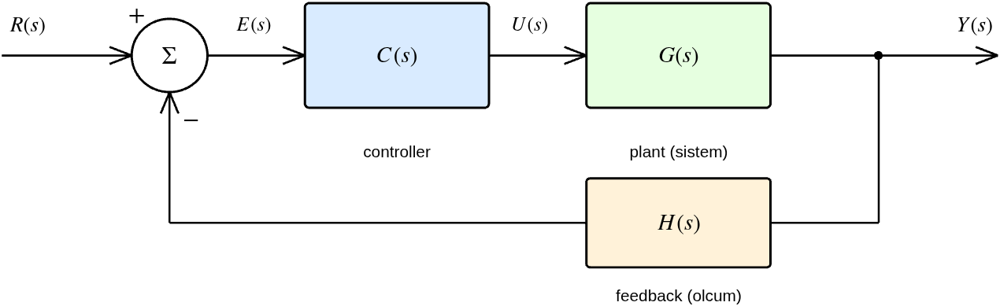
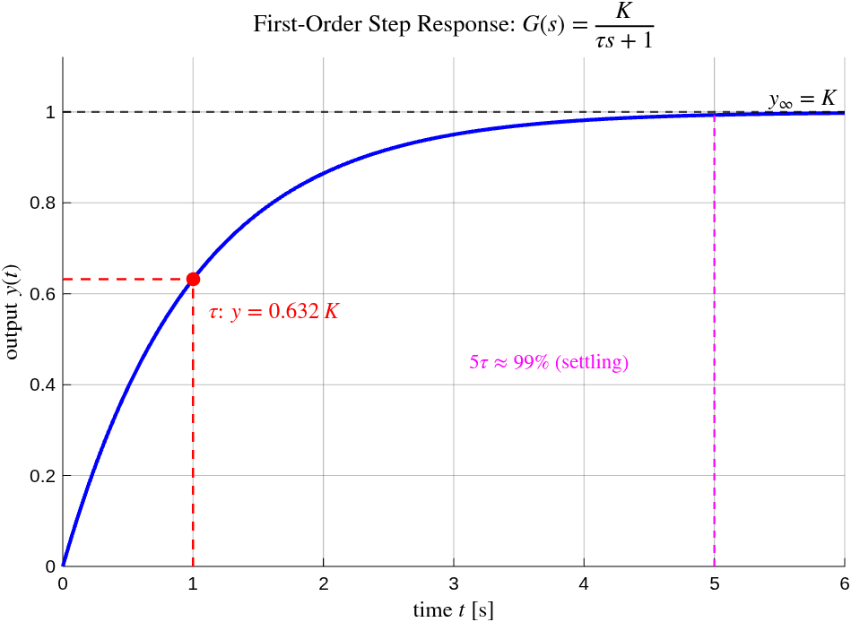
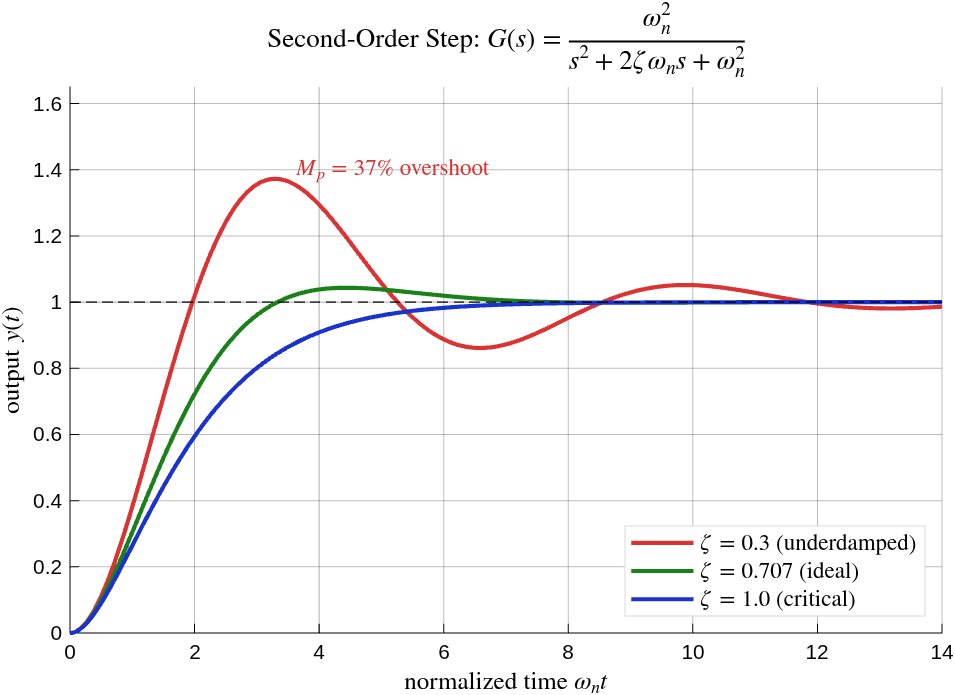
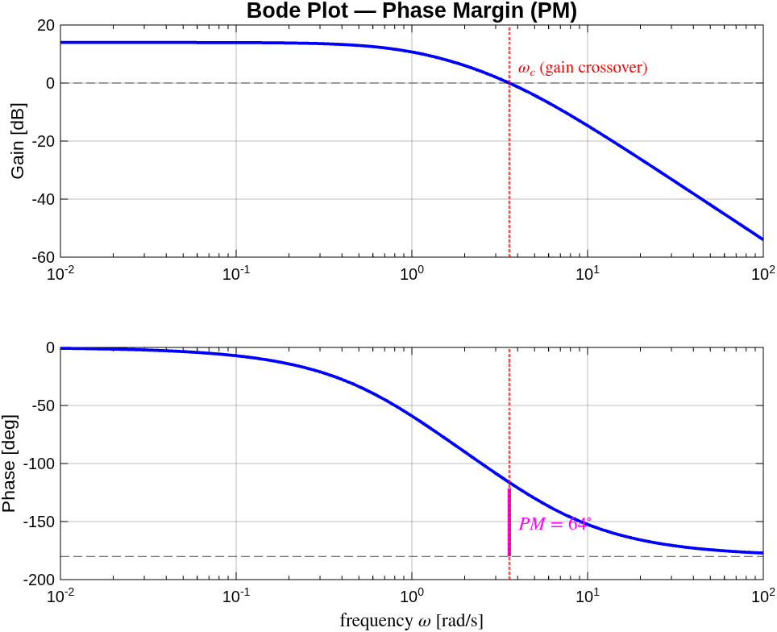

# Genel Bakış — Vizyon ve Ortak Kontrol Teorisi Primer'i

> **Bu belge kimin için?** Projeye yeni başlayan biri (üniversite 1. sınıf seviyesi) için **ortak teori temeli**. Tüm aşama belgeleri (`asama_0`…`asama_5`) buradaki kavramlara atıf verir; burada bir kez anlatılan transfer fonksiyonu, blok diyagram, kararlılık, Bode gibi kavramlar aşama belgelerinde tekrar edilmez.
>
> **Ekosistem:** Sistem mimarisi + donanım → [`asama_0_altyapi.md`](asama_0_altyapi.md). Model → [`asama_1_model.md`](asama_1_model.md). Kontrol → [`asama_2_kontrol.md`](asama_2_kontrol.md). Proje vitrini + mimari şema → [`../README.md`](../README.md). Plan → [`../ROADMAP.md`](../ROADMAP.md). Kaynaklar → [`../KAYNAKCA.md`](../KAYNAKCA.md).

---

## 1. Uzun Vadeli Vizyon

Bu proje **5 aşamalı kontrol mühendisliği yol haritası** üzerinden iki eksenli kamera gimbal'ına ulaşır. Her aşama bir öncekinin üzerine kurulur:

| Aşama | Hedef | Hangi teori? | MATLAB klasörü | Belge |
|---|---|---|---|---|
| **0 ✅** | Donanım entegrasyonu, koruma katmanları, USB CDC, IMU füzyonu | gömülü sistem, complementary filter | — | [`asama_0_altyapi.md`](asama_0_altyapi.md) |
| **1 ✅** | Tek motor sistem tanımlama (K, τ, dead-band) | §3, §4 (model, 1. derece) | `matlab/asama_1_model/` | [`asama_1_model.md`](asama_1_model.md) |
| **2 ✅** | Tek motor PI → cascade → IMU mirror | §3-§8 (PID, kapalı çevrim, Bode, tip sistem) | `matlab/asama_2_kontrol/` | [`asama_2_kontrol.md`](asama_2_kontrol.md) |
| **3 ⬜** | İki motor MIMO model + decoupling | MIMO, RGA, condition number | `matlab/asama_3_mimo_model/` | (gelecek) |
| **4 ⬜** | İki motor LQR/LQG + Kalman | optimal kontrol, durum kestirimi | `matlab/asama_4_mimo_kontrol/` | (gelecek) |
| **5 ⬜** | Gerçek 3D-print gimbal — stabilizasyon | gerçek-dünya entegrasyonu | `matlab/asama_5_gimbal/` | (gelecek) |

**Felsefe:** Her teknik karar **kaynaklı** ([`../KAYNAKCA.md`](../KAYNAKCA.md) etiketli). Tasarım MATLAB'da yapılır, doğrulama gerçek donanımda; Embedded Coder kullanılmaz — MATLAB çıktıları (kazançlar, eşikler) firmware'e **manuel** transfer edilir, kaynak yorumu eşliğinde.

**Sistem mimarisi (donanım blok şeması) ve repo haritası** vitrindedir → [`../README.md`](../README.md#-sistem-mimarisi). Bu belge donanımı tekrar etmez; **kontrol teorisinin ortak diline** odaklanır.

---

## 2. Ortak Kontrol Teorisi Primer'i

Bu bölüm, projedeki her aşamada kullanılan temel kavramları sıfırdan kurar. Amaç: bir okuyucu bu bölümü okuduktan sonra aşama belgelerindeki denklemleri ve grafikleri **adım adım** takip edebilsin.

### 2.1. Neden matematiksel model? Transfer fonksiyonu

Bir sistemi (motor, devre, mekanik) **kontrol** etmek için önce davranışını **tahmin edebilmemiz** gerekir: "şu girişi verirsem çıkış ne olur?" Bunu yapan matematiksel nesne **transfer fonksiyonudur**.

Zaman domeninde sistemler diferansiyel denklemlerle yazılır. Örneğin DC motorun hızı $\omega(t)$, uygulanan gerilim $v(t)$ ile:

$$\tau \frac{d\omega(t)}{dt} + \omega(t) = K\,v(t)$$

Diferansiyel denklemlerle cebir yapmak zordur. **Laplace dönüşümü** ($\mathcal{L}$), zaman domenindeki türev işlemini ($\frac{d}{dt}$) basit bir çarpmaya ($s$ ile) çevirir:

$$\mathcal{L}\left\{\frac{d\omega}{dt}\right\} = s\,\Omega(s)$$

Böylece diferansiyel denklem cebirsel hale gelir. Yukarıdaki motor denklemini Laplace'a taşıyıp düzenlersek **transfer fonksiyonu** çıkar — çıkışın girişe oranı:

$$G(s) = \frac{\Omega(s)}{V(s)} = \frac{K}{\tau s + 1}$$

Burada $s = \sigma + j\omega$ karmaşık bir frekans değişkenidir. $G(s)$ sistemin "parmak izidir": içindeki $K$ (DC kazanç) ve $\tau$ (zaman sabiti) sistemin tüm dinamiğini özetler. **Aşama 1'in tüm amacı** bu iki sayıyı gerçek motordan deneysel olarak çıkarmaktır (→ [`asama_1_model.md`](asama_1_model.md)).

### 2.2. Blok diyagram dili

Karmaşık sistemler **bloklar** ve **oklar** ile çizilir. Her blok bir transfer fonksiyonu, her ok bir sinyaldir. Geri besleme (feedback), çıkışı ölçüp girişle karşılaştırma fikridir — kontrolün kalbi:

*Şekil 1 — Genel kapalı-çevrim sistem. $R(s)$ referans (istenen değer), $\Sigma$ toplama noktası hatayı hesaplar ($E = R - $ ölçüm), $C(s)$ kontrolcü, $G(s)$ kontrol edilen sistem (plant), $H(s)$ ölçüm/geri besleme yolu, $Y(s)$ çıkış. Bu yapı projedeki **her kontrolcüde** tekrar eder: Aşama 2 hız PI'da $C(s)=K_p+K_i/s$, plant motor $G(s)=K/(\tau s+1)$.*

Üç temel blok cebri kuralı:

| Bağlantı | Sonuç transfer fonksiyonu |
|---|---|
| Seri (kaskat): $G_1$ sonra $G_2$ | $G_1 G_2$ |
| Paralel: $G_1$ ve $G_2$ toplanır | $G_1 + G_2$ |
| **Geri besleme** (negatif): ileri $G$, geri $H$ | $\dfrac{G}{1 + GH}$ |

Geri besleme formülünün paydası $1 + GH$, sistemin **kararlılığını** belirler (§2.5).

### 2.3. Birinci derece sistem — kazanç ve zaman sabiti

En basit dinamik sistem birinci derecedir: $G(s) = \frac{K}{\tau s + 1}$. Tek bir **kutbu** vardır (paydanın kökü): $s = -1/\tau$. Step (basamak) girişe yanıtı üstel bir yükseliştir:

$$\omega(t) = K\,(1 - e^{-t/\tau})$$

*Şekil 2 — Birinci derece step yanıtı. İki kritik kavram: **(1) Zaman sabiti $\tau$** — çıkışın son değerinin %63.2'sine ulaştığı an; sistem ne kadar "hızlı" olduğunu söyler. **(2) Oturma** — pratikte $5\tau$ sonra çıkış son değerin ~%99'una varır. $K$ (DC kazanç) ise son değeri belirler ($t\to\infty$ iken $\omega \to K$). Bu iki parametre Aşama 1'de motordan ölçüldü: $K=53.89$ rad/s/V, $\tau=60.5$ ms.*

**Kutup nerede, sistem nasıl?** Kutbun $s$-düzlemindeki yeri davranışı belirler — bu kavram tüm kontrol tasarımının temelidir (§2.5'te kararlılık olarak döner).

### 2.4. İkinci derece sistem — sönüm ve aşım

Kontrolcü eklenince (örneğin PI), kapalı çevrim genelde **ikinci derece** olur. Standart form:

$$G(s) = \frac{\omega_n^2}{s^2 + 2\zeta\omega_n s + \omega_n^2}$$

İki parametre davranışı yönetir: **$\omega_n$** (doğal frekans — hız) ve **$\zeta$** (sönüm oranı — salınım/aşım miktarı).

*Şekil 3 — Sönüm oranı $\zeta$'nın etkisi. $\zeta<1$ (az sönümlü): hızlı ama **aşım (overshoot)** var — çıkış hedefi aşıp salınır. $\zeta=1$ (kritik sönüm): aşımsız, en hızlı salınımsız yanıt. $\zeta=0.707$: kontrol mühendisliğinde "ideal" denge (hızlı + makul aşım). Aşım yüzdesi sadece $\zeta$'ya bağlıdır:*

$$M_p = e^{-\pi\zeta/\sqrt{1-\zeta^2}} \times 100\%$$

*Aşama 2.1'de hız PI tasarlanırken $\zeta=1.0$ seçildi (aşımsız hedef), bu denklemle gerekçelendirildi.*

### 2.5. Kapalı çevrim, karakteristik denklem, kararlılık

Geri besleme transfer fonksiyonu $\frac{G}{1+GH}$'nin paydasını sıfıra eşitlersek **karakteristik denklem** çıkar:

$$1 + G(s)H(s) = 0$$

Bu denklemin kökleri kapalı-çevrim **kutuplarıdır**. Kutupların $s$-düzlemindeki yeri kararlılığı belirler:

*Şekil 4 — $s$-düzlemi (kutup haritası). **Kural: tüm kutuplar sol yarı düzlemde (LHP, $\sigma<0$) ise sistem kararlıdır** — yanıt sönerek oturur. Sağ yarı düzlemde (RHP) bir kutup → yanıt patlar (kararsız). Motorumuzun tek kutbu $s=-1/\tau=-16.5$ sol yarı düzlemde → açık çevrimde zaten kararlı. Kontrol tasarımı = kapalı-çevrim kutuplarını istenen yere (hızlı + sönümlü bölgeye) **taşımak**; buna "pole placement" denir (Aşama 2.1).*

### 2.6. Frekans analizi — Bode, kazanç payı, faz payı

Bir sistemin farklı frekanslardaki sinüs girişlere tepkisi **Bode diyagramında** çizilir (kazanç dB + faz, log-frekans ekseninde). Bode, kapalı çevrimi açmadan **kararlılık marjını** ölçmemizi sağlar:

*Şekil 5 — Açık-çevrim Bode. **Kazanç geçiş frekansı $\omega_c$**: kazancın 0 dB'yi (birim) kestiği nokta. **Faz payı (PM)**: $\omega_c$'de fazın $-180°$'ye olan uzaklığı — ne kadar büyükse o kadar sönümlü/güvenli (genelde PM>45° istenir). **Kazanç payı (GM)**: faz $-180°$ iken kazancın 0 dB'ye uzaklığı. Bu marjlar Aşama 2.1'de 5 kontrolcüyü karşılaştırırken sağlamlık kriteriydi (seçilen kontrolcü PM=80.8°).*

### 2.7. Tip sistem ve kalıcı-hal hatası

Bir kontrol sisteminin **kalıcı-hal hatası** (steady-state error, $e_{ss}$) — uzun vadede referansı ne kadar ıskaladığı — açık çevrimdeki **integratör sayısına** ("sistem tipi") bağlıdır. Açık çevrim $L(s)$'de orijindeki ($s=0$) kutup sayısı tipi verir:

| Tip | Step girişe $e_{ss}$ | Ramp (rampa) girişe $e_{ss}$ |
|---|---|---|
| Tip-0 (integratör yok) | sonlu ($1/(1+K_p)$) | ∞ (takip edemez) |
| **Tip-1** (1 integratör) | **0** | sonlu ($\omega_{in}/K_v$) |
| Tip-2 (2 integratör) | 0 | 0 |

Buradaki **hata sabitleri** kritiktir:
- **Konum hata sabiti** $K_p = \lim_{s\to 0} L(s)$ — step takibini belirler.
- **Hız hata sabiti** $K_v = \lim_{s\to 0} s\,L(s)$ — ramp (sabit hızlı hareket) takibini belirler: $e_{ss} = \omega_{in}/K_v$.

Bu kavram Aşama 2'de iki kez belirleyici oldu: (1) pozisyon cascade'de plant tip-1 olduğu için P kontrolcü step'te sıfır hata verdi; (2) **IMU mirror** takibinde kazanç $K_p^{pos}$ doğrudan $K_v$'ye eşit olduğundan, ramp takip hatası hedefinden ($e_{ss}<5°$) **analitik** olarak $K_p^{pos}\geq 6$ hesaplandı (deneme-yanılma değil).

### 2.8. Ayrık zaman — neden firmware "örnekler"?

Yukarıdaki teori **sürekli zamandadır** ($s$-domeni). Ama firmware bir mikrodenetleyicide **ayrık adımlarla** çalışır: her $T_s$ saniyede bir ölçüm alır, hesaplar, çıktı verir. Sürekli tasarımı ayrık koda çevirmek için **Tustin (bilinear) dönüşümü** kullanılır:

$$s \approx \frac{2}{T_s}\cdot\frac{z-1}{z+1}$$

Burada $z$ ayrık-zaman operatörüdür ($z^{-1}$ = bir örnek gecikme). Bu dönüşüm, sürekli PI integralini firmware'de toplanabilir bir fark denklemine çevirir (Aşama 2.2). Örnekleme frekansı yeterince yüksek olmalı — projede iç hız döngüsü $T_s=5$ ms (200 Hz), kontrol bant genişliğinin çok üstünde.

---

## 3. MATLAB Araç Kutusu Felsefesi

Tasarım ve analiz MATLAB'da yapılır; her aşama belgesi kullandığı fonksiyonun **çalışma prensibini** açıklar (sadece "şu fonksiyonu çağırdık" demez). Sık kullanılan araçlar ve nerede anlatıldıkları:

| Fonksiyon | Toolbox | Ne yapar (prensip) | Detay |
|---|---|---|---|
| `lsqcurvefit` | Optimization | Parametreleri ölçüme uydurur (en küçük kareler, Levenberg-Marquardt) | [`asama_1_model.md`](asama_1_model.md) §10.3 |
| `tfest` | System Identification | Veriden transfer fonksiyonu kestirir (prediction-error) | [`asama_1_model.md`](asama_1_model.md) §10.3 |
| `tf`, `step`, `lsim` | Control System | TF kur, step/keyfi-giriş simülasyonu | [`asama_1_model.md`](asama_1_model.md), [`asama_2_kontrol.md`](asama_2_kontrol.md) |
| `bode`, `margin` | Control System | Frekans yanıtı + GM/PM hesabı | [`asama_2_kontrol.md`](asama_2_kontrol.md) §11.3 |
| `pidtune` | Control System | Otomatik PID (loop-shaping) — karşılaştırma için | [`asama_2_kontrol.md`](asama_2_kontrol.md) §11.7 |

**Tasarım-transfer kuralı:** MATLAB sonuçları firmware'e manuel aktarılır, kaynak yorumuyla (örn. `/* Kp matlab/.../design_speed_pi.m §2'den */`). Bu izlenebilirliği korur — her firmware sabiti bir MATLAB tasarımına ve bir literatür kaynağına bağlıdır.

---

> **Sonraki okuma:** Donanımın nasıl kurulduğu → [`asama_0_altyapi.md`](asama_0_altyapi.md). Motorun modeli nasıl çıkarıldı → [`asama_1_model.md`](asama_1_model.md). Kontrolcüler → [`asama_2_kontrol.md`](asama_2_kontrol.md).
