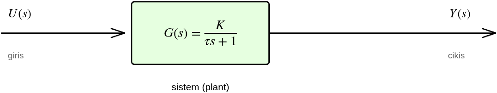

# Genel Bakış — Vizyon ve Ortak Kontrol Teorisi Primer'i

> **Bu belge kimin için?** Projeye yeni başlayan biri (üniversite 1. sınıf seviyesi) için **ortak teori temeli**. Tüm aşama belgeleri (`asama_0`…`asama_5`) buradaki kavramlara atıf verir; burada bir kez anlatılan transfer fonksiyonu, blok diyagram, kararlılık, Bode gibi kavramlar aşama belgelerinde tekrar edilmez.
>
> **Ekosistem:** Sistem mimarisi + donanım → [`asama_0_altyapi.md`](asama_0_altyapi.md). Donanım şeması/pin haritası → [`00_donanim_semasi.md`](00_donanim_semasi.md). Model → [`asama_1_model.md`](asama_1_model.md). Kontrol → [`asama_2_kontrol.md`](asama_2_kontrol.md). MIMO model → [`asama_3_mimo_model.md`](asama_3_mimo_model.md). Yüklü gimbal + stabilizasyon → [`asama_5_yuklu_gimbal.md`](asama_5_yuklu_gimbal.md). Proje vitrini + mimari şema → [`../README.md`](../README.md). Plan → [`../ROADMAP.md`](../ROADMAP.md). Kaynaklar → [`../KAYNAKCA.md`](../KAYNAKCA.md).

---

## 1. Uzun Vadeli Vizyon

Bu proje **5 aşamalı kontrol mühendisliği yol haritası** üzerinden iki eksenli kamera gimbal'ına ulaşır. Her aşama bir öncekinin üzerine kurulur:

| Aşama | Hedef | Hangi teori? | MATLAB klasörü | Belge |
|---|---|---|---|---|
| **0 ✅** | Donanım entegrasyonu, koruma katmanları, USB CDC, IMU füzyonu | gömülü sistem, complementary filter | — | [`asama_0_altyapi.md`](asama_0_altyapi.md) |
| **1 ✅** | Tek motor sistem tanımlama (K, τ, dead-band) | §2.1–§2.3 (transfer fn, 1. derece) | `matlab/asama_1_model/` | [`asama_1_model.md`](asama_1_model.md) |
| **2 ✅** | Tek motor PI → cascade → IMU mirror | §2.2–§2.8 (kapalı çevrim, PID, Bode, tip sistem, Tustin) | `matlab/asama_2_kontrol/` | [`asama_2_kontrol.md`](asama_2_kontrol.md) |
| **3 ✅** | İki motor MIMO model + decoupling | MIMO, RGA, condition number | `matlab/asama_3_mimo_model/` | [`asama_3_mimo_model.md`](asama_3_mimo_model.md) |
| **4 ⬜** | İki motor decoupling + LQR/LQI (optimal MIMO) | optimal kontrol (MIMO) | `matlab/asama_4_mimo_kontrol/` | (gelecek) |
| **5 🟡** | Gerçek 3D-print gimbal — stabilizasyon + LQG/Kalman durum kestirimi | gerçek-dünya entegrasyonu, durum kestirimi | `matlab/asama_5_gimbal/` | [`asama_5_yuklu_gimbal.md`](asama_5_yuklu_gimbal.md) |

**Felsefe:** Her teknik karar **kaynaklı** ([`../KAYNAKCA.md`](../KAYNAKCA.md) etiketli). Tasarım MATLAB'da yapılır, doğrulama gerçek donanımda; Embedded Coder kullanılmaz — MATLAB çıktıları (kazançlar, eşikler) firmware'e **manuel** transfer edilir, kaynak yorumu eşliğinde.

**Sistem mimarisi (donanım blok şeması) ve repo haritası** vitrindedir → [`../README.md`](../README.md#-sistem-mimarisi). Bu belge donanımı tekrar etmez; **kontrol teorisinin ortak diline** odaklanır.

---

## 2. Ortak Kontrol Teorisi Primer'i

Bu bölüm, projedeki her aşamada kullanılan temel kavramları sıfırdan kurar. Amaç: bir okuyucu bu bölümü okuduktan sonra aşama belgelerindeki denklemleri ve grafikleri **adım adım** takip edebilsin.

### 2.1. Neden matematiksel model? Transfer fonksiyonu

Bir sistemi (motor, devre, mekanik) **kontrol** etmek için önce davranışını **tahmin edebilmemiz** gerekir: "şu girişi verirsem çıkış ne olur?" Bunu yapan matematiksel nesne **transfer fonksiyonudur**.

Zaman domeninde sistemler diferansiyel denklemlerle yazılır. Örneğin DC motorun hızı $\omega(t)$, uygulanan gerilim $v(t)$ ile:

$$\tau \frac{d\omega(t)}{dt} + \omega(t) = K\,v(t)$$

Diferansiyel denklemlerle cebir yapmak zordur. **Laplace dönüşümü** ($\mathcal{L}$), zaman domenindeki türev işlemini ($\frac{d}{dt}$) basit bir çarpmaya ($s$ ile) çevirir:

$$\mathcal{L}\left\lbrace \frac{d\omega}{dt} \right\rbrace = s\,\Omega(s)$$

Böylece diferansiyel denklem cebirsel hale gelir. Yukarıdaki motor denklemini Laplace'a taşıyıp düzenlersek **transfer fonksiyonu** çıkar — çıkışın girişe oranı:

$$G(s) = \frac{\Omega(s)}{V(s)} = \frac{K}{\tau s + 1}$$

Burada $s = \sigma + j\omega$ karmaşık bir frekans değişkenidir. $G(s)$ sistemin "parmak izidir": içindeki $K$ (DC kazanç) ve $\tau$ (zaman sabiti) sistemin tüm dinamiğini özetler. **Aşama 1'in tüm amacı** bu iki sayıyı gerçek motordan deneysel olarak çıkarmaktır (→ [`asama_1_model.md`](asama_1_model.md)).

> **Sembol uyarısı** ($\omega$): Bu belgede $\omega$ üç farklı yerde geçer ve **karıştırılmamalıdır**: (1) motor açısal hızı $\omega(t)$ — fiziksel çıkış; (2) burada $s=\sigma+j\omega$'daki $\omega$ — karmaşık frekansın sanal bileşeni ($s$-düzleminin ekseni, frekans); (3) ileride $\omega_n$ — 2. derece sistemin doğal frekansı (§2.4). Aynı sembol, farklı kavramlar; bağlamdan ayırt edilir.

### 2.2. Blok diyagram dili

Karmaşık sistemler **bloklar** ve **oklar** ile çizilir. Her blok bir transfer fonksiyonu, her ok bir sinyaldir. Geri besleme (feedback), çıkışı ölçüp girişle karşılaştırma fikridir — kontrolün kalbi:

**Şekil 1 —** Genel kapalı-çevrim sistem. $R(s)$ referans (istenen değer), $\Sigma$ toplama noktası hatayı hesaplar ($E = R - Y$), $C(s)$ kontrolcü, $G(s)$ kontrol edilen sistem (plant), $H(s)$ ölçüm/geri besleme yolu, $Y(s)$ çıkış. Bu yapı projedeki **her kontrolcüde** tekrar eder: Aşama 2 hız PI'da $C(s)=K_p+K_i/s$, plant motor $G(s)=K/(\tau s+1)$.

> 📊 **Üreten betik:** `matlab/00_genel_teori/create_theory_diagrams.m`

Üç temel blok cebri kuralı:

| Bağlantı | Sonuç transfer fonksiyonu |
|---|---|
| Seri (kaskat): $G_1$ sonra $G_2$ | $G_1 G_2$ |
| Paralel: $G_1$ ve $G_2$ toplanır | $G_1 + G_2$ |
| **Geri besleme** (negatif): ileri $G$, geri $H$ | $\frac{G}{1 + GH}$ |

Geri besleme formülünün paydası $1 + GH$, sistemin **kararlılığını** belirler (§2.5).

### 2.3. Birinci derece sistem — kazanç ve zaman sabiti

En basit kontrol-edilen sistem, **kontrolcüsüz açık çevrimdir**: giriş doğrudan plant'a verilir, geri besleme yoktur. Tek bir bloktan ibarettir:

**Şekil 2a —** Açık-çevrim (kontrolcüsüz, geri beslemesiz) sistem: giriş $U(s)$ doğrudan plant $G(s)$'e, çıkış $Y(s)$. Aşama 1'de motoru bu şekilde — açık çevrimde, duty verip hızı ölçerek — modelledik. Kontrolcü ve geri besleme (Şekil 1) bunun üzerine Aşama 2'de eklenir.

> 📊 **Üreten betik:** `matlab/00_genel_teori/create_theory_diagrams.m`

En basit dinamik sistem birinci derecedir: $G(s) = \frac{K}{\tau s + 1}$. Tek bir **kutbu** vardır (paydanın kökü): $s = -1/\tau$. Step (basamak) girişe yanıtı üstel bir yükseliştir:

$$\omega(t) = K\,(1 - e^{-t/\tau})$$

**Şekil 2b —** Birinci derece step yanıtı (yukarıdaki Şekil 2a açık-çevrim yapısının zaman-domeni cevabı). İki kritik kavram: **(1) Zaman sabiti** $\tau$ — çıkışın son değerinin %63.2'sine ulaştığı an; sistem ne kadar "hızlı" olduğunu söyler. **(2) Oturma** — pratikte $5\tau$ sonra çıkış son değerin ~%99'una varır. $K$ (DC kazanç) ise son değeri belirler ($t\to\infty$ iken $\omega \to K$). Bu iki parametre Aşama 1'de motordan ölçüldü: $K=53.89$ rad/s/V, $\tau=60.5$ ms.

> 📊 **Üreten betik:** `matlab/00_genel_teori/create_theory_diagrams.m`

**Kutup nerede, sistem nasıl?** Kutbun $s$-düzlemindeki yeri davranışı belirler — bu kavram tüm kontrol tasarımının temelidir (§2.5'te kararlılık olarak döner).

### 2.4. İkinci derece sistem — sönüm ve aşım

Kontrolcü eklenince (örneğin PI), kapalı çevrim genelde **ikinci derece** olur. Standart form:

$$G(s) = \frac{\omega_n^2}{s^2 + 2\zeta\omega_n s + \omega_n^2}$$

İki parametre davranışı yönetir: $\omega_n$ (doğal frekans — hız) ve $\zeta$ (sönüm oranı — salınım/aşım miktarı).

**Şekil 3 —** Sönüm oranı $\zeta$'nın etkisi. $\zeta<1$ (az sönümlü): hızlı ama **aşım (overshoot)** var — çıkış hedefi aşıp salınır. $\zeta=1$ (kritik sönüm): aşımsız, en hızlı salınımsız yanıt. $\zeta=0.707$: kontrol mühendisliğinde "ideal" denge — kapalı-çevrimde maksimal-düz (Butterworth) yanıt verir (rezonans tepesi tam bu değerde kaybolur) ve hız/aşım arasında klasik dengeyi sağlar (hızlı + makul aşım — yüzde aşım yaklaşık %4.3) (`[Franklin2010] §6 / §3.4`). (Not: faz payı $\zeta$ ile **monoton artar**; $\zeta=0.707$ faz-payı maksimumu değildir.) Yüzde aşım $M_p$ (overshoot, %) — sıfırı-olmayan standart ikinci-derece sistemde — sadece $\zeta$'ya bağlıdır (`[Franklin2010] §3.4` — ikinci-derece geçici yanıt); PI gibi kontrolcüler kapalı-çevrime sıfır ekleyip aşımı artırabilir (asama_2 conservative $\zeta=1.0$ yine de %6.7 aşım — sıfır etkisi):

$$M_p = 100\,e^{-\pi\zeta/\sqrt{1-\zeta^2}}$$

Aşama 2.1'de hız PI tasarlanırken kâğıt-üzeri (conservative) $\zeta=1.0$ seçilmişti (aşımsız hedef), bu denklemle gerekçelendirildi — ancak bu tasarım gerçek motorda bang-bang verdi ve firmware'de kullanılmadı; çalışan iç döngü analitik yeniden tasarlandı ($\zeta=0.58$, $\omega_n=33$ rad/s — bkz §2.6 ve [`asama_2_kontrol.md`](asama_2_kontrol.md) §11.11.3).

> 📊 **Üreten betik:** `matlab/00_genel_teori/create_theory_diagrams.m`

### 2.5. Kapalı çevrim, karakteristik denklem, kararlılık

Geri besleme transfer fonksiyonu $\frac{G}{1+GH}$'nin paydasını sıfıra eşitlersek **karakteristik denklem** çıkar:

$$1 + G(s)H(s) = 0$$

Bu denklemin kökleri kapalı-çevrim **kutuplarıdır**. Kutupların $s$-düzlemindeki yeri kararlılığı belirler:

**Şekil 4 —** $s$-düzlemi (kutup haritası). **Kural:** tüm kutuplar sol yarı düzlemde (LHP, $\sigma<0$) ise sistem kararlıdır — yanıt sönerek oturur. Sağ yarı düzlemde (RHP) bir kutup → yanıt patlar (kararsız). Motorumuzun tek kutbu $s=-1/\tau=-16.5$ sol yarı düzlemde → açık çevrimde zaten kararlı. Kontrol tasarımı = kapalı-çevrim kutuplarını istenen yere (hızlı + sönümlü bölgeye) **taşımak**; buna "pole placement" denir (Aşama 2.1).

> 📊 **Üreten betik:** `matlab/asama_1_model/create_block_diagram.m` (Aşama 1 motoruna uygulanmış örnek)

### 2.6. Frekans analizi — Bode, kazanç payı, faz payı

Bir sistemin farklı frekanslardaki sinüs girişlere tepkisi **Bode diyagramında** çizilir (kazanç dB + faz, log-frekans ekseninde). Bode, kapalı çevrimi açmadan **kararlılık marjını** ölçmemizi sağlar:

**Şekil 5 —** Açık-çevrim Bode (3-kutuplu örnek sistem, faz $-180°$'yi geçer). **Kazanç geçiş frekansı** $\omega_c$ (kırmızı): kazancın 0 dB'yi kestiği nokta. **Faz payı (PM)** (kırmızı ok): $\omega_c$'de fazın $-180°$'ye uzaklığı — büyükse sönümlü/güvenli (tipik tasarım hedefi PM≥45°; örnekte 47°). **Kazanç payı (GM)** (mor ok): faz $-180°$'yi geçtiği frekansta kazancın 0 dB'ye uzaklığı (örnekte 12 dB; tipik hedef GM≥6 dB). Bu marj eşikleri klasik tasarım pratiğidir (`[Franklin2010] §6.1`, `[Ogata2010] §7`). Her ikisi de pozitifse sistem kararlıdır. Bu marjlar Aşama 2.1'de 5 kontrolcüyü karşılaştırırken sağlamlık kriteriydi (kâğıt-üzeri seçilen conservative'in PM'i 80.8° idi; ama bu tasarım gerçek motorda kullanılmadı — firmware'deki çalışan (analitik düzeltilmiş) döngünün PM'i ≈60°, bkz `asama_2_kontrol.md` §11.11.8).

**Bant genişliği (bandwidth):** $\omega_c$ kabaca kapalı-çevrimin **bant genişliğini** belirler — sistemin etkin biçimde *takip edebildiği* en yüksek frekans. Bunun üstündeki giriş bileşenleri zayıflatılır. Pratik kural: örnekleme frekansı bant genişliğinin çok üstünde seçilir (Aşama 2'de iç hız döngüsü $T_s=5$ ms = 200 Hz nominal — gerçek ana döngü IMU `GPIO_PULLUP` fix sonrası ~8 ms/~125 Hz (IMU okunurken gerçek; 6 ms IMU-NACK durumuydu, başarılı I2C okuma +2 ms ekler); eski "~140 Hz" ölçülmemiş varsayımdı, §12.14.1). Aşama 2'deki cascade'in $\sim0.3$ Hz bant genişliği bu kavramla yorumlanır.

> 📊 **Üreten betik:** `matlab/00_genel_teori/create_theory_diagrams.m`

### 2.7. Tip sistem ve kalıcı-hal hatası

Bir kontrol sisteminin **kalıcı-hal hatası** (steady-state error, $e_{ss}$) — uzun vadede referansı ne kadar ıskaladığı — açık çevrimdeki **integratör sayısına** ("sistem tipi") bağlıdır. Açık çevrim $L(s)$'de orijindeki ($s=0$) kutup sayısı tipi verir:

| Tip | Step girişe $e_{ss}$ | Ramp (rampa) girişe $e_{ss}$ |
|---|---|---|
| Tip-0 (integratör yok) | sonlu ($1/(1+K_p)$) | ∞ (takip edemez) |
| **Tip-1** (1 integratör) | **0** | sonlu ($\omega_{in}/K_v$) |
| Tip-2 (2 integratör) | 0 | 0 |

Buradaki **hata sabitleri** kritiktir:
- **Konum hata sabiti** $K_p = \lim_{s\to 0} L(s)$ — step takibini belirler. (Dikkat: buradaki $K_p$ konum **hata sabitidir**; §2.2'deki PI oransal kazancı $K_p$ ile aynı sembol, farklı kavram.)
- **Hız hata sabiti** $K_v = \lim_{s\to 0} s\,L(s)$ — ramp (sabit hızlı hareket) takibini belirler: $e_{ss} = \omega_{in}/K_v$ (burada $\omega_{in}$ = rampa girişin eğimi, yani sabit açısal hız, $°/s$ veya rad/s).

Bu kavram Aşama 2'de iki kez belirleyici oldu: (1) pozisyon cascade'de plant tip-1 olduğu için P kontrolcü step'te sıfır hata verdi; (2) **IMU mirror** takibinde kazanç $K_p^{pos}$ doğrudan $K_v$'ye eşit olduğundan, ramp takip hatası hedefinden ($e_{ss}<5°$) **analitik** olarak $K_p^{pos}\geq 6$ hesaplandı (deneme-yanılma değil).

### 2.8. Ayrık zaman — neden firmware "örnekler"?

Yukarıdaki teori **sürekli zamandadır** ($s$-domeni). Ama firmware bir mikrodenetleyicide **ayrık adımlarla** çalışır: her $T_s$ saniyede bir ölçüm alır, hesaplar, çıktı verir. Sürekli tasarımı ayrık koda çevirmek için **Tustin (bilinear) dönüşümü** kullanılır:

$$s \approx \frac{2}{T_s}\cdot\frac{z-1}{z+1}$$

Burada $z$ ayrık-zaman operatörüdür: bir sinyali bir örnek **geciktirmek** $z^{-1}$ ile gösterilir. İdeal (tam) ilişki $z = e^{sT_s}$'dir; Tustin bunun cebirsel olarak kullanışlı, kararlılığı koruyan bir **yaklaşımıdır** (üstel ifadeyi rasyonele çevirir). Bu dönüşüm, sürekli PI integralini firmware'de toplanabilir bir fark denklemine çevirir (Aşama 2.2). Örnekleme frekansı yeterince yüksek olmalı — projede iç hız döngüsü $T_s=5$ ms (200 Hz nominal; gerçek döngü ~8 ms/~125 Hz, IMU okunurken — 6 ms IMU-NACK durumuydu, başarılı I2C okuma +2 ms ekler — IMU pull-up fix sonrası §12.14.1), kontrol bant genişliğinin çok üstünde. (Nominal iç döngü $T_s=5$ ms gerçek ana döngünün ~$5/8=0.625$ katıdır.)

---

## 3. MATLAB Araç Kutusu Felsefesi

Tasarım ve analiz MATLAB'da yapılır; her aşama belgesi kullandığı fonksiyonun **çalışma prensibini** açıklar (sadece "şu fonksiyonu çağırdık" demez). Sık kullanılan araçlar ve nerede anlatıldıkları:

| Fonksiyon | Toolbox | Ne yapar (prensip) | Detay |
|---|---|---|---|
| `lsqcurvefit` | Optimization | Parametreleri ölçüme uydurur (en küçük kareler, Levenberg-Marquardt) | [`asama_1_model.md`](asama_1_model.md) §10.3 |
| `tfest` | System Identification | Veriden transfer fonksiyonu kestirir (prediction-error) | [`asama_1_model.md`](asama_1_model.md) §10.3 |
| `tf`, `step`, `lsim` | Control System | TF kur, step/keyfi-giriş simülasyonu | [`asama_1_model.md`](asama_1_model.md), [`asama_2_kontrol.md`](asama_2_kontrol.md) |
| `bode`, `margin` | Control System | Frekans yanıtı + GM/PM hesabı | [`asama_2_kontrol.md`](asama_2_kontrol.md) §11.3 |
| `pidtune` | Control System | Otomatik PID (loop-shaping) — karşılaştırma için | [`asama_2_kontrol.md`](asama_2_kontrol.md) §11.3 (prensip) / §11.7 (karşılaştırma) |

**Tasarım-transfer kuralı:** MATLAB sonuçları firmware'e manuel aktarılır, kaynak yorumuyla (örn. `/* Kp matlab/.../design_speed_pi.m §2'den */`). Bu izlenebilirliği korur — her firmware sabiti bir MATLAB tasarımına ve bir literatür kaynağına bağlıdır.

---

> **Sonraki okuma:** Donanımın nasıl kurulduğu → [`asama_0_altyapi.md`](asama_0_altyapi.md). Donanım şeması/pin haritası → [`00_donanim_semasi.md`](00_donanim_semasi.md). Motorun modeli nasıl çıkarıldı → [`asama_1_model.md`](asama_1_model.md). Kontrolcüler → [`asama_2_kontrol.md`](asama_2_kontrol.md). MIMO model → [`asama_3_mimo_model.md`](asama_3_mimo_model.md). Yüklü gimbal + stabilizasyon → [`asama_5_yuklu_gimbal.md`](asama_5_yuklu_gimbal.md).
