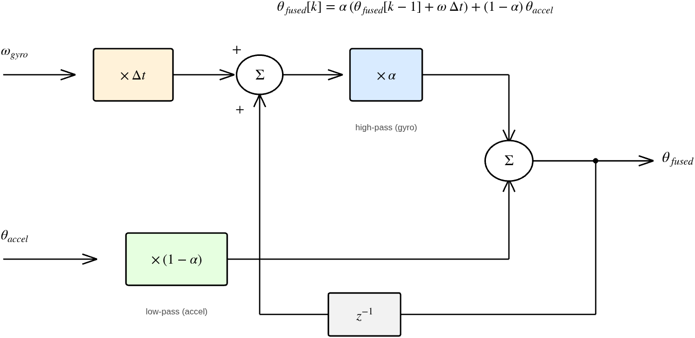
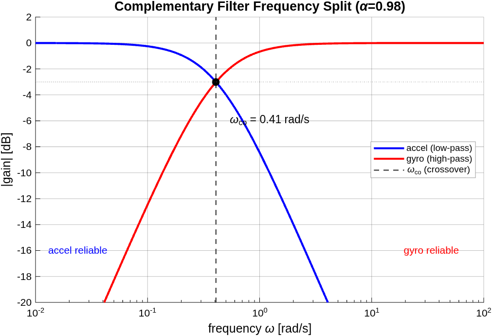
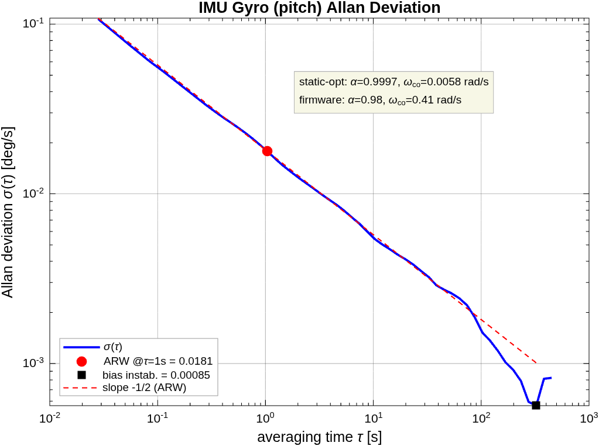

# Aşama 0 — Donanım Entegrasyonu ve Gömülü Altyapı

> **Ekosistem:** Bu belge, kontrol teorisi uygulanmadan önceki **temel donanım-yazılım altyapısını** açıklar. Genel bakış + sistem mimarisi → [`00_genel_bakis.md`](00_genel_bakis.md). Sonraki aşama → [`asama_1_model.md`](asama_1_model.md). Proje vitrini → [`../README.md`](../README.md). Kaynaklar → [`../KAYNAKCA.md`](../KAYNAKCA.md).

## Özet

Aşama 0, STM32F411 bare-metal firmware, MPU6050 IMU okuma, complementary filter ile sensör füzyonu, ±90° singülarite analizi, USB CDC iki yönlü iletişim, TB6612 motor sürücü + quadrature encoder ve koruma katmanlarını kapsar. Bu altyapı, Aşama 1 (sistem tanımlama) ve sonrasının zeminidir. Alt başlık numaraları (§2–§9) projenin gelişim sırasını korur.

---

## 2. STM32 Gömülü Yazılım Altyapısı

### 2.1. Başlatma Sırası (Boot Sequence)

Firmware, reset vektöründen itibaren aşağıdaki sırayı takip eder:

```
Reset Handler (startup_stm32f411xe.s)
  │
  ├─► HAL_Init()              → SysTick 1 ms, NVIC öncelik grubu
  ├─► SystemClock_Config()     → HSE → PLL → 96 MHz SYSCLK
  ├─► I2C1_Init()              → PB6/PB7, 100 kHz standart mod
  ├─► GPIO Init (PC13)         → LED çıkışı
  ├─► USB CDC Init             → Virtual COM Port başlatma
  ├─► HAL_Delay(2000)          → Host USB enumerasyonu bekleme
  ├─► MPU6050_Init()           → Uyku modundan çıkarma
  │
  └─► while(1) — Ana Döngü (bloklamayan, ~7 ms / ~140 Hz)
        ├─► MPU6050_Read()     → 14 byte burst I2C okuma
        ├─► dt hesabı          → DWT cycle counter (µs, 96 MHz) [ARM_DWT]
        ├─► İvmeölçer açısı    → atan2 hesabı
        ├─► Gyro hızı          → Ham değer / 131 LSB/(°/s)
        ├─► Complementary      → α·gyro + (1-α)·accel
        ├─► Kontrol (mod)      → DUTY / SP_W / POS / MIRROR
        └─► CDC_Transmit_FS()  → 40 Hz throttle (her 25 ms)
```

### 2.2. Saat Konfigürasyonu (Clock Tree)

STM32F411 dahili PLL kullanılarak harici kristalden (HSE) yüksek frekanslı sistem saati üretilir:

```
HSE (25 MHz)
  │
  ├─► PLLM = 25  →  VCO giriş = 1 MHz
  ├─► PLLN = 192 →  VCO çıkış = 192 MHz
  ├─► PLLP = 2   →  SYSCLK = 96 MHz
  └─► PLLQ = 4   →  USB CLK = 48 MHz  (USB 2.0 Full-Speed gereksinimi)
```

Bus hızları:
- **AHB** = 96 MHz (HCLK, DMA, çekirdek)
- **APB1** = 48 MHz (I2C1, Timer'lar — max 50 MHz)
- **APB2** = 96 MHz (SPI, USART1)

Flash erişim gecikmesi **LATENCY_3** (3 wait state) olarak ayarlanmıştır, çünkü HCLK > 90 MHz'de bu gereklidir (`[STM32F411_DS]` Table 6, Flash wait-state vs HCLK).

### 2.3. SysTick Zamanlayıcı

```c
void SysTick_Handler(void) {
    HAL_IncTick();   // Her 1 ms'de global tick sayacını artırır
}
```

`HAL_GetTick()` bu sayaca erişerek milisaniye cinsinden zaman ölçümü sağlar. **Watchdog, TX throttle (40 Hz) ve LED** zamanlaması bu ms sayacına dayanır; complementary filter `dt`'si ise daha hassas **DWT cycle counter**'ı kullanır (§5.4, jitter düzeltmesi).

### 2.4. I2C1 Perifer Konfigürasyonu

| Parametre | Değer | Açıklama |
|---|---|---|
| SCL Pini | PB6 (AF4) | Alternate Function: I2C1_SCL |
| SDA Pini | PB7 (AF4) | Alternate Function: I2C1_SDA |
| Mod | Open-Drain | I2C standardı gereği |
| Pull-up | Harici | Breadboard üzerinde 4.7kΩ |
| Clock Speed | 100 kHz | I2C Standard Mode |
| Adresleme | 7-bit | MPU6050 adresi: 0x68 |

I2C open-drain topolojisi, hat üzerinde birden fazla slave cihazın bulunmasına izin verir. Pull-up dirençleri hattı lojik 1'e (VCC) çeker; master veya slave hattı GND'ye çekerek lojik 0 oluşturur.

---

## 3. MPU6050 Sensör Arayüzü ([MPU6050_DS], [MPU6050_RM])

### 3.1. Sensör Özellikleri

MPU6050, tek bir çip üzerinde **3 eksen ivmeölçer** ve **3 eksen jiroskop** barındıran bir MEMS (Micro-Electro-Mechanical Systems) IMU'dur.

| Özellik | İvmeölçer | Jiroskop |
|---|---|---|
| Eksen | X, Y, Z | X, Y, Z |
| Varsayılan Aralık | ±2g | ±250°/s |
| Hassasiyet | 16384 LSB/g | 131 LSB/(°/s) |
| Çözünürlük | 16-bit (signed) | 16-bit (signed) |
| Gürültü | ~400 µg/√Hz | ~0.005 °/s/√Hz |

### 3.2. Başlatma (Wake-up)

MPU6050, power-on sonrası varsayılan olarak **uyku modundadır** (PWR_MGMT_1 register'ının SLEEP biti 1'dir). Aktif hale getirmek için bu register'a 0x00 yazılır:

```c
uint8_t data = 0x00;
HAL_I2C_Mem_Write(&hi2c1, MPU6050_ADDR, 0x6B,   // PWR_MGMT_1
                  I2C_MEMADD_SIZE_8BIT, &data, 1, HAL_MAX_DELAY);
```

Bu komut dahili 8 MHz osilatörü etkinleştirir ve tüm sensör eksenlerini aktive eder.

### 3.3. Burst Okuma (14 Byte)

MPU6050, register `0x3B`'den itibaren ardışık 14 byte veri sunar:

```
Adres   Veri               Byte
0x3B    ACCEL_XOUT_H       [0]  ─┐
0x3C    ACCEL_XOUT_L       [1]  ─┘ ax = (int16_t)(raw[0] << 8 | raw[1])
0x3D    ACCEL_YOUT_H       [2]  ─┐
0x3E    ACCEL_YOUT_L       [3]  ─┘ ay = (int16_t)(raw[2] << 8 | raw[3])
0x3F    ACCEL_ZOUT_H       [4]  ─┐
0x40    ACCEL_ZOUT_L       [5]  ─┘ az = (int16_t)(raw[4] << 8 | raw[5])
0x41    TEMP_OUT_H          [6]  ─┐
0x42    TEMP_OUT_L          [7]  ─┘ (kullanılmıyor)
0x43    GYRO_XOUT_H        [8]  ─┐
0x44    GYRO_XOUT_L        [9]  ─┘ gx = (int16_t)(raw[8] << 8 | raw[9])
0x45    GYRO_YOUT_H        [10] ─┐
0x46    GYRO_YOUT_L        [11] ─┘ gy = (int16_t)(raw[10] << 8 | raw[11])
0x47    GYRO_ZOUT_H        [12] ─┐
0x48    GYRO_ZOUT_L        [13] ─┘ gz = (int16_t)(raw[12] << 8 | raw[13])
```

Tek bir I2C transaction ile 14 byte okunarak sensör verisinin tutarlılığı (tüm eksenler aynı anda örneklenir) ve bus verimliliği sağlanır.

---

## 4. Sensör Verilerinin Matematiksel Temeli

### 4.1. İvmeölçer (Accelerometer) — Statik Açı Ölçümü

İvmeölçer, yerçekimi vektörünü (g⃗) üç bileşenine ayırarak ölçer. Sensör düz durduğunda:

```
                    Z ↑ (az ≈ +1g = 16384 LSB)
                    │
                    │
     Y ◄────────────┼────────────► X
    (ay ≈ 0)        │              (ax ≈ 0)
```

Sensör eğildiğinde yerçekimi vektörü eksenlere farklı projeksiyon yapar. Pitch (öne-arkaya eğim) ve Roll (sağa-sola eğim) açıları şu formüllerle hesaplanır:

$$\text{pitch} = \text{atan2}\left(a_x,\ \sqrt{a_y^2 + a_z^2}\right)\cdot\frac{180}{\pi}$$

$$\text{roll} = \text{atan2}\left(a_y,\ \sqrt{a_x^2 + a_z^2}\right)\cdot\frac{180}{\pi}$$

**Neden `atan2(x, √(y²+z²))` kullanılıyor?**

- Basit `atan(ax/az)` formülü `az = 0` olduğunda (sensör 90° eğik) sıfıra bölme hatası verir.
- `atan2(y, x)` fonksiyonu iki argümanın **işaretlerini ayrı ayrı** değerlendirir, böylece dört kadranı (açının hangi çeyrekte olduğunu) doğru ayırt eder; tek-argümanlı `atan(y/x)` bu işaret bilgisini kaybedip ±180° belirsizlik bırakır.
- Payda olarak `√(y²+z²)` kullanmak, diğer eksenin etkisini izole eder ve pitch-roll çapraz bağımlılığını (cross-coupling) azaltır.

**İvmeölçerin güçlü ve zayıf yönleri:**

| ✅ Güçlü | ❌ Zayıf |
|---|---|
| Uzun vadede kararlı (drift yok) | Titreşim ve lineer ivmeye duyarlı |
| Mutlak referans (yerçekimi) | Gürültülü çıkış (~400 µg/√Hz) |
| Ek kalibrasyon gerektirmez | Yalnız statik konumda doğru |

### 4.2. Jiroskop (Gyroscope) — Açısal Hız Ölçümü

Jiroskop, her eksen etrafındaki **açısal hızı** (°/s) ölçer. Ham dijital değerden fiziksel birime dönüşüm (MPU6050 ±250°/s skala, `[MPU6050_DS]`):

$$\omega\ [^\circ/s] = \frac{\text{raw [LSB]}}{131\ \text{LSB}/(^\circ/s)}$$

Açısal hız, sayısal entegrasyon ile açıya dönüştürülür:

$$\theta(t) = \theta(t-1) + \omega\cdot\Delta t$$

Burada $\Delta t$, iki ölçüm arası geçen süredir (firmwaredeki `dt`, `HAL_GetTick()` farkından hesaplanır). Bu entegrasyonun zayıflığı: $\omega$'daki küçük bias zamanla birikir → **drift** (§4.3, complementary filter bunu düzeltir).

**Jiroskobun güçlü ve zayıf yönleri:**

| ✅ Güçlü | ❌ Zayıf |
|---|---|
| Gürültüsüz, düzgün çıkış | Entegrasyon drift'i (zamanla birikir) |
| Dinamik hareketlerde doğru | Mutlak referansı yok |
| Titreşimden etkilenmez | Sıcaklığa bağlı bias kayması |

### 4.3. Neden Tek Sensör Yeterli Değil?

İvmeölçer ve jiroskop **tamamlayıcı (complementary) frekans karakteristiklerine** sahiptir:

```
       Hata
        ▲
        │
        │   İvmeölçer                   Jiroskop
        │   (kısa vadede               (uzun vadede
        │    gürültülü)                  drift'li)
        │      ╲                        ╱
        │       ╲                      ╱
        │        ╲      Füzyon        ╱
        │         ╲    (minimum)     ╱
        │          ╲     hata       ╱
        │           ╲   ╱─────╲   ╱
        │            ╲╱         ╲╱
        └──────────────────────────────► Frekans
              Düşük              Yüksek
```

- **İvmeölçer:** Düşük frekanslarda (uzun vadede) doğru, yüksek frekanslarda (kısa süreli hareketler) gürültülü
- **Jiroskop:** Yüksek frekanslarda doğru, düşük frekanslarda (uzun dönemde) drift'e maruz

Bu iki sensörün avantajlı frekans bölgelerini birleştirmek için **sensör füzyonu** gereklidir.

---

## 5. Complementary Filter — Sensör Füzyonu

### 5.1. Temel Denklem

Complementary filter, bir **yüksek geçiren filtre** (gyro için) ile bir **alçak geçiren filtre** (accelerometer için) birleşiminden oluşur (`[Mahony2008]`). Ayrık zaman temel denklemi:

$$\theta_{fused}[k] = \underbrace{\alpha\,\big(\theta_{fused}[k-1] + \omega_{gyro}\,\Delta t\big)}_{\text{gyro (high-pass)}} + \underbrace{(1-\alpha)\,\theta_{accel}}_{\text{accel (low-pass)}}$$

İki filtrenin ağırlıkları toplamı 1'dir ($\alpha + (1-\alpha) = 1$) — "tamamlayıcı" (complementary) adı buradan gelir: gyro'nun yüksek-frekans güvenilirliği ile ivmeölçerin düşük-frekans (mutlak) referansı çakışmadan birleşir.



*Şekil 5.1 — Complementary filter ayrık blok diyagramı. Üst kol: gyro hızı entegre edilir ($\times\Delta t$) ve önceki füzyon çıktısıyla toplanıp $\alpha$ ile ölçeklenir (yüksek geçiren). Alt kol: ivmeölçer açısı $(1-\alpha)$ ile ölçeklenir (alçak geçiren). $z^{-1}$ bir örnek gecikmedir ($\theta_{fused}[k-1]$ geri besleme). Bu yapı [`00_genel_bakis.md`](00_genel_bakis.md) §2.8'deki ayrık-zaman ($z$) operatörünü kullanır.*

> 📊 **Üreten betik:** `matlab/asama_0_altyapi/create_filter_diagram.m`

> **Kavram — alçak/yüksek geçiren filtre:** *Alçak geçiren* (low-pass) filtre düşük frekansları geçirir, yüksek frekans gürültüsünü süzer (ivmeölçer kolu — yavaş/mutlak referansı korur, titreşim gürültüsünü atar). *Yüksek geçiren* (high-pass) tersidir: hızlı değişimleri geçirir, yavaş drift'i süzer (gyro kolu). İkisinin frekans-bölünmesi §5.2'deki Bode'da (Şekil 5.2) görülür.

Firmwaredeki implementasyon:

```c
// α = 0.98 → Gyro'ya %98, ivmeölçere %2 ağırlık
fused_pitch = 0.98f * (fused_pitch - gy_dps * dt) + 0.02f * pitch;
fused_roll  = 0.98f * (fused_roll  + gx_dps * dt) + 0.02f * roll;
```

### 5.2. α Parametresinin Fiziksel Anlamı

`α` değeri, iki sensör arasındaki güven dengesini belirler:

| α Değeri | Gyro Ağırlığı | Accel Ağırlığı | Zaman Sabiti | Davranış |
|---|---|---|---|---|
| 0.99 | %99 | %1 | ~5 s | Çok düzgün, drift düzeltmesi yavaş |
| **0.98** | **%98** | **%2** | **~2.5 s** | **Dengeli (mevcut ayar)** |
| 0.95 | %95 | %5 | ~1 s | Accel gürültüsü belirginleşir |
| 0.80 | %80 | %20 | ~0.25 s | Accel'e çok bağımlı, gürültülü |

Zaman sabiti yaklaşık olarak $\tau \approx \Delta t\cdot\frac{\alpha}{1-\alpha}$. Mevcut ayarda $\tau \approx 0.05\cdot\frac{0.98}{0.02} \approx 2.45$ s, yani gyro drift'i yaklaşık 2.5 saniye içinde ivmeölçer referansına doğru düzeltilir.

#### α'nın analitik gerekçesi — kesim frekansı (neden 0.98?)

> **Analitik-önce tasarım** (CLAUDE.md): α "tipik 0.98" diye seçilmemeli, bir **kesim frekansı** kriteriyle gerekçelendirilmeli. Aşağıda α'nın hangi frekansta accel↔gyro geçişi yaptığı türetilir; tam optimum (Allan variance) açık konu olarak işaretlenir.

Complementary filter, gyro koluna bir **yüksek-geçiren**, accel koluna bir **alçak-geçiren** filtre uygular; ikisinin **kesim frekansı aynıdır** (tamamlayıcılık şartı). Ayrık fark denkleminden ($\theta[k]=\alpha(\theta[k-1]+\omega\Delta t)+(1-\alpha)\theta_{accel}$) bu kesim frekansı analitik olarak:

$$\omega_{co} = \frac{1-\alpha}{\alpha\,\Delta t}$$

Mevcut değerlerle ($\alpha=0.98$, $\Delta t=0.05$ s):

$$\omega_{co} = \frac{0.02}{0.98 \times 0.05} = 0.41\ \text{rad/s} \approx 0.065\ \text{Hz}$$

**Neden bu frekans makul?** Kesim, iki gürültü kaynağının kesiştiği yere yerleştirilmelidir:
- **Kesimin altında** (yavaş, $<0.065$ Hz): accel'e güven — yerçekimi mutlak referansı drift'siz; gyro burada drift biriktirir.
- **Kesimin üstünde** (hızlı): gyro'ya güven — accel burada titreşim/lineer-ivme gürültüsüne maruz.
- $\omega_{co}=0.41$ rad/s, motor kontrol bandının (cascade $\omega_c\approx1.9$ rad/s, [`00_genel_bakis.md`](00_genel_bakis.md) §2.6) **~5× altında** ve elle-sallama/titreşim bandının ($\gtrsim1$ Hz) çok altında → accel gürültüsü füzyona sızmaz, gyro kısa-vadeli dinamiği korunur. Bu yüzden 0.98 **makul bir mühendislik seçimidir**.



*Şekil 5.2 — Complementary filter frekans karakteristiği. Accel LPF (mavi) ve gyro HPF (kırmızı) kazançları $\omega_{co}=0.41$ rad/s'de kesişir; toplamları her frekansta 1'dir (tamamlayıcılık). Kesim, accel'in güvenilir olduğu düşük frekans ile gyro'nun güvenilir olduğu yüksek frekansı ayırır.*

> 📊 **Üreten betik:** `matlab/asama_0_altyapi/create_filter_diagram.m`

#### Veri-temelli doğrulama — Allan variance (2026-05-28) ✅

Kesim frekansının *tam optimum* yeri, accel açı gürültüsü ile gyro entegrasyon drift'inin eşitlendiği noktadır. Bunu veriyle çıkarmak için IMU 15 dk **sabit** tutulup ham gyro/accel loglandı (`scripts/imu_noise_log.py`, 32147 örnek @ 35.7 Hz), gyro'nun **overlapping Allan deviation**'ı hesaplandı (`analyze_allan_variance.m`, `[IEEE952]`).

**Ölçülen gürültü parametreleri (MPU6050 pitch gyro):**

| Parametre | Değer | Yorum |
|---|---|---|
| Angle random walk (ARW) | **1.09 °/√hr** (0.0181 °/√s @ τ=1s) | yüksek-frekans gyro gürültüsü — MPU6050 için tipik |
| Bias instability | **~3 °/hr** (0.00085 °/s, τ_B≈324 s) | düşük-frekans drift — sağlıklı, düşük |
| Accel açı gürültüsü σ | **0.238°** | statik pitch std (detrend) |



*Şekil 5.3 — Gyro Allan deviation (log-log). Düşük τ'da eğim $-1/2$ (ARW bölgesi, kırmızı kesikli referans); τ_B≈324 s'de minimuma (bias instability) iner. Klasik MEMS gyro karakteristiği — gyro statik koşulda çok kararlı.*

> 📊 **Üreten betik:** `scripts/imu_noise_log.py` (veri) + `matlab/asama_0_altyapi/analyze_allan_variance.m` (analiz)

**Sonuç — neden hâlâ α=0.98 (teorik statik-optimal 0.9997 değil):** Eşitlik $\text{ARW}\sqrt{\tau_{co}}=\sigma_{accel}$'den saf-statik optimal $\tau_{co}=171$ s, $\omega_{co}=0.006$ rad/s, $\alpha_{opt}=0.9997$ çıkıyor — yani gyro o kadar temiz ki saf gürültü-optimali "accel'e neredeyse hiç güvenme" diyor. **Ama bu yalnızca statik gürültü içindir.** α=0.98 (daha güçlü accel düzeltmesi) bilinçli ve güvenli bir mühendislik seçimidir, çünkü Allan testinin görmediği hatalar gerçekte baskındır:
- **Dinamik hatalar:** scale-factor hatası, g-duyarlılığı, montaj hizasızlığı — statik testte yok, harekette gyro açısını bozar.
- **Sıcaklık drift'i:** 15 dk sabit-sıcaklık testinde görünmez; uzun çalışmada gyro bias kayar.
- **Lineer-ivme bozulması:** accel açısı sadece statikte doğru; α=0.9997 ile accel düzeltmesi 171 s'ye yayılır → uzun gimbal kullanımında drift birikir. α=0.98 ($\tau\approx2.45$ s) bu drift'i hızla bağlar.

**Akademik kapanış:** Allan variance, gyro'nun *gürültü tabanını* veriyle doğruladı (sağlıklı, ARW/bias tipik) ve α=0.98'in **güvenli tarafta** olduğunu gösterdi — saf-statik optimum daha yüksek, ama robustluk (dinamik+termal+lineer-ivme) için daha düşük α tercih edilir. Bu, projenin *"ölç + analiz et, ama mühendislik yargısıyla karar ver"* ilkesinin (analitik-önce + Sokratik) somut örneğidir. (Kaynak: `[Mahony2008]` complementary filter teorisi; Allan variance için `[IEEE952]`.)

### 5.3. Gyro Eksen İşaret Yönleri

MPU6050 datasheet'inde tanımlanan eksen yönleri, sensörün fiziksel montaj yönüne göre firmware'deki işaret seçimini belirler:

```c
fused_pitch = α * (fused_pitch - gy_dps * dt) + ...   // negatif: GY ekseni ters
fused_roll  = α * (fused_roll  + gx_dps * dt) + ...   // pozitif: GX ekseni doğru
```

İşaret seçimi (`+` veya `-`), sensörün breadboard üzerindeki montaj yönüne bağlıdır. MPU6050'nin sağ-el kuralı konvansiyonu ile fiziksel pitch/roll tanımınız farklı olabilir. **Bu, deneme-yanılma ile kalibre edilmesi gereken bir parametredir** — algorithmic bir hata değil, fiziksel referans çerçevesi eşleştirmesidir.

### 5.4. Δt (Zaman Adımı) Hesabı

Ana döngü **bloklamayan** (`HAL_Delay`'siz) bir süper-loop olarak çalışır; `dt`, milisaniye çözünürlüklü `HAL_GetTick()` yerine **DWT cycle counter** (96 MHz) ile mikrosaniye hassasiyetinde ölçülür — çünkü ms çözünürlük ~7 ms'lik döngüde ±%14 jitter veriyordu (`[ARM_DWT]`):

```c
uint32_t cyc = DWT->CYCCNT;
uint32_t cyc_diff = cyc - last_cyc;               // unsigned fark — wrap-güvenli
float dt = (float)cyc_diff / 96000000.0f;         // SYSCLK 96 MHz → saniye
if (dt <= 0.0f || dt > 0.5f) dt = 0.005f;         // koruma: ilk döngü / overflow
last_cyc = cyc;
```

**Gerçek zamanlamalar (firmware, `src/main.c`):**
- **Ana döngü ~7 ms (~140 Hz):** sensör oku → filtre → kontrol → her iterasyonda; DWT ile ölçülür, `dt` fallback 5 ms.
- **Telemetri TX 40 Hz (25 ms throttle):** USB CDC bant genişliği için kısıtlanır (her döngüde değil).
- **Ölçülen örnekleme:** Allan testi (§5.2) telemetri akışını **35.7 Hz** kaydetti — TX throttle'ın (40 Hz) pratik karşılığı (seri/parse kaybı ile). Aşama 1 step-response da ~36 Hz örnekledi.

> **Not (tutarlılık):** Eski tasarımda ana döngü `HAL_Delay(50)` ile ~20 Hz hedefliyordu; mevcut firmware DWT-zamanlı bloklamayan döngüye geçti (jitter düzeltmesi, Aşama 2.3). Belgedeki "~20 Hz" eski değerler bu DWT zamanlamasıyla (kontrol ~140 Hz, telemetri ~40 Hz) güncellenmiştir.

---

## 6. ±90° Singülarite Problemi

### 6.1. Problemin Kökeni

İvmeölçer tabanlı açı hesabında kullanılan formül:

```
                    ax
pitch = atan2( ─────────────── )
               √(ay² + az²)
```

Bu fonksiyonun **çıktı aralığı matematiksel olarak [-90°, +90°] ile sınırlıdır**.

### 6.2. Neden 90°'yi Geçemiyor?

Düz durumdan başlayarak sensörü pitch ekseninde çevirdiğimizde yerçekimi bileşenleri şöyle değişir:

```
Gerçek Açı    ax          az         √(ay²+az²)    atan2 Sonucu
━━━━━━━━━━━━━━━━━━━━━━━━━━━━━━━━━━━━━━━━━━━━━━━━━━━━━━━━━━━━━━
   0°          0        +16384       16384           0°
  30°        +8192      +14189       14189          +30°
  45°        +11585     +11585       11585          +45°
  60°        +14189      +8192        8192          +60°
  90°        +16384         0        ≈ 0            +90°  ← TEPE
 120°        +14189      −8192        8192          +60°  ← GERİ!
 150°        +8192      −14189       14189          +30°  ← GERİ!
 180°         ≈0        −16384       16384           ≈0°  ← SIFIR!
```

**Kritik Gözlem:** 90°'yi geçtikten sonra `az` negatif olur, ancak `√(ay²+az²)` ifadesinde **karesini alıp karekök alıyoruz**, bu nedenle işaret bilgisi kaybolur. Sonuç olarak:
- **120° gerçek açı → atan2 60° hesaplar**
- **150° gerçek açı → atan2 30° hesaplar**
- **180° gerçek açı → atan2 ~0° hesaplar**

Fonksiyon 90° sonrası adeta bir **ayna gibi** geri yansıtır.

### 6.3. Complementary Filter'a Etkisi

90° aşıldığında filter, çelişkili bilgi alır:

```
                    ┌─────────────┐
  Gyro (%98):       │ "105°'e      │──► Sonuç: Füzyon yavaşça
  "Dönmeye devam    │  gidiyoruz"  │    accel tarafına çekilir
   ediyorum"        │              │    ve saçmalar
                    │              │
  Accel (%2):       │ "75°'deyiz"  │──► θ_fused yavaş yavaş
  "Hayır, geri      │              │    gerçek değerden uzaklaşır
   geldin"          └──────────────┘
```

Her iterasyonda %2'lik ivmeölçer düzeltmesi **yanlış yöne** çeker. Kısa sürede etkisi az gibi görünür (gyro hala dominant), ama birkaç saniye sonra drift belirginleşir ve açı değeri tutarsız hale gelir.

### 6.4. Gimbal Lock ile İlişkisi

Bu problem, 3D rotasyonlarda **Euler açılarının doğuştan gelen singülarite problemi** olan "gimbal lock" ile ilişkilidir. Pitch ±90°'ye ulaştığında:

- Roll ve Yaw eksenleri aynı fiziksel ekseni temsil etmeye başlar
- Bir serbestlik derecesi kaybolur
- Açılar sürekli tanımsız (degenerate) hale gelir

### 6.5. Olası Çözümler

#### Çözüm 1: `atan2(ax, az)` Formülü (Basit)

```c
float pitch = atan2f(fax, faz) * RAD2DEG;   // Aralık: [-180°, +180°]
```

- ✅ ±180° aralık sağlar
- ❌ Pitch ±90° civarında roll hesabı bozulur (problemin yerini değiştirir)
- ❌ Küçük açılarda lineerlik azalır

#### Çözüm 2: Madgwick Filtresi (Quaternion Tabanlı) — [Madgwick2010]

```
Quaternion: q = [w, x, y, z]   (4 boyutlu birim vektör)

Güncelleme: q(t) = q(t-1) + (½ × q(t-1) ⊗ ω_gyro - β × ∇f) × Δt
                                │                      │
                        Gyro entegrasyonu     Gradient descent
                                              (accel düzeltmesi)

Euler'e dönüşüm:
  pitch = asin(2(wx - yz))
  roll  = atan2(2(wy + xz), 1 - 2(x² + y²))
  yaw   = atan2(2(wz + xy), 1 - 2(y² + z²))
```

- ✅ Singülarite sorunu yok (quaternion'larda gimbal lock olmaz)
- ✅ Tam 360° kapsam
- ✅ Drift düzeltmesi gradient descent ile optimize edilmiş
- ❌ Daha fazla hesaplama yükü (STM32F411 FPU ile sorun değil)
- ❌ Implementasyonu daha karmaşık

#### Çözüm 3: Mahony Filtresi (PI Kontrol Tabanlı) — [Mahony2008]

Madgwick'e benzer quaternion tabanlı yaklaşım, ancak gradient descent yerine **PI kontrolcü** ile hata düzeltmesi yapar:

```
Hata = accel_measured × accel_estimated   (çapraz çarpım)
Gyro_düzeltilmiş = ω_gyro + Kp × Hata + Ki × ΣHata
q(t) = q(t-1) + ½ × q(t-1) ⊗ Gyro_düzeltilmiş × Δt
```

- ✅ Madgwick'ten hesaplama olarak daha hafif
- ✅ PI kazançları (Kp, Ki) sezgisel olarak ayarlanabilir
- ❌ Optimal olmayabilir (gradient descent gibi matematiksel garanti yok)

#### Karşılaştırma Tablosu

| Özellik | Complementary | Madgwick | Mahony |
|---|---|---|---|
| Çalışma aralığı | ±90° | 360° | 360° |
| Gimbal lock | Var | Yok | Yok |
| Hesaplama yükü | Çok düşük | Orta | Düşük-orta |
| Parametre sayısı | 1 (α) | 1 (β) | 2 (Kp, Ki) |
| Implementasyon | ~5 satır | ~50 satır | ~40 satır |
| Gimbal uygulaması | Yeterli (±45° aralık) | İdeal | İdeal |

### 6.6. Pratik Değerlendirme

Bir gimbal stabilizasyon sistemi genellikle **±30°—45°** aralığında çalışır. Mevcut complementary filter bu aralıkta mükemmel performans sergiler. ±90° sınırlaması, gerçek kullanım senaryosunda sorun yaratmaz. Ancak, ileri aşamada PID kontrolcü ve motor sürme eklendiğinde, sistemin sağlamlığı için quaternion tabanlı bir filtreye geçiş değerlendirilebilir.

---

## 7. Veri İletimi ve Görselleştirme

### 7.1. USB CDC (Virtual COM Port)

STM32F411'in dahili USB 2.0 Full-Speed perifer bloğu kullanılarak, ek donanım (UART-USB dönüştürücü) gerekmeden veri iletimi sağlanır. Linux tarafında `/dev/ttyACM0` olarak görünür.

Veri formatı (ASCII, her satır bir ölçüm):
```
P:<pitch>,R:<roll>,GX:<gyro_x>,GY:<gyro_y>,FP:<fused_pitch>,FR:<fused_roll>\r\n
```

Örnek:
```
P:12.3,R:-5.7,GX:1.2,GY:-0.8,FP:11.9,FR:-5.2
```

### 7.2. Python Görselleştirme (plot_angles.py)

`matplotlib.animation` kullanarak 4 panelli gerçek zamanlı grafik:

| Panel | İçerik | Renk |
|---|---|---|
| Sol üst | Pitch: Ham ivme + Füzyon | Mavi tonları |
| Sağ üst | Roll: Ham ivme + Füzyon | Yeşil/teal tonları |
| Sol alt | Gyro-X açısal hız (°/s) | Turuncu |
| Sağ alt | Gyro-Y açısal hız (°/s) | Pembe |

Her 30 saniyede bir `screenshots/` klasörüne PNG kaydedilir (maksimum 50 dosya).

---

## 8. Motor Sürücü ve Encoder Entegrasyonu

> **Aşama:** Plan onaylı, donanım entegrasyonu `feature/motor-encoder-tb6612` branch'inde.  
> **Hedef:** Tek motor + encoder + IMU stabilizasyon demosu.

### 8.1. Pin Atama Tablosu (donanım entegrasyonu)

Tüm pin seçimleri STM32F411 datasheet alternate function tablosuyla (`[STM32F411_DS]`) doğrulanmıştır. WeAct BlackPill V2.0 schematic'i (`[WeAct_BP]`) incelenerek SPI flash footprint çakışmaları (PA4-PA7) elimine edilmiştir.

| İşlev | Pin | Çevre birimi | Dayanak |
|---|---|---|---|
| I2C1 SCL (MPU6050) | PB6 | I2C1 | mevcut |
| I2C1 SDA (MPU6050) | PB7 | I2C1 | mevcut |
| USB DM | PA11 | OTG_FS | mevcut |
| USB DP | PA12 | OTG_FS | mevcut |
| LED | PC13 | GPIO | mevcut |
| SWD IO / CLK | PA13 / PA14 | SWJ-DP | mevcut |
| **Encoder A** | **PA15** | TIM2_CH1 | [RM0383] §23.3: SW-DP modunda JTDI serbest |
| **Encoder B** | **PB3** | TIM2_CH2 | [RM0383] §23.3: SW-DP modunda JTDO serbest |
| **Motor PWM** | **PB0** | TIM3_CH3 | SPI flash footprint dışı (PA6/PA7'den kaçınıldı) |
| **AIN1 (yön)** | **PB12** | GPIO | TIM1_BKIN alternatifi kullanılmıyor |
| **AIN2 (yön)** | **PB13** | GPIO | TIM1_CH1N alternatifi kullanılmıyor |
| **STBY (enable)** | **PB14** | GPIO | TIM1_CH2N alternatifi kullanılmıyor |

**Kullanılmayan pinler (gerekçe):**
- **PA0** — KEY butonuna bağlı (BlackPill schematic).
- **PA4, PA5, PA6, PA7** — SPI flash footprint pinleri. Eğer flash chip lehimliyse çakışma riski var; bu pinlerden kaçınıldı.

### 8.2. Encoder — Pololu 25D 48 CPR ([Pololu_25D])

Datasheet [Pololu_25D]: kırmızı/siyah motor güç, **mavi = encoder Vcc 3.5V – 20V**, yeşil = encoder GND, sarı = A çıkışı, beyaz = B çıkışı.

| Parametre | Değer |
|---|---|
| Çözünürlük | 48 CPR (motor devri başına; bu sayı **zaten** 4× kuadratür decoding'i içerir — [Pololu_25D], Test 2A.T1 doğruladı) |
| Dişli oranı | 9.7:1 |
| **Encoder Vcc** | **3.5 V minimum → BlackPill 5V pininden beslenir** |
| Encoder çıkış seviyesi | 5 V (Vcc'ye eşit, push-pull veya open-collector) |
| STM32 GPIO 5V toleransı | PA15 ve PB3 **FT (5V tolerant)** ✓ — direkt bağlanabilir |

**TIM2 32-bit counter:** STM32F411 datasheet [STM32F411_DS] sf 28: TIM2 ve TIM5 32-bit auto-reload sayaçlardır. **Çözünürlük zinciri:** 48 CPR **zaten 4×-decoded** sayımdır (her iki kanalın yükselen+düşen kenarları; Pololu konvansiyonu [Pololu_25D], Aşama 0 Test 2A.T1'de doğrulandı) → motor şaftında **48 count/devir**; 9.7:1 redüktörle çıkış milinde $48\times9.7 = 466$ count/devir → **0.773°/count** ($360/466$) açısal çözünürlük. (Aşama 2 cascade pozisyon kontrolü bu 466 değerini kullanır.) 32-bit sayaç ile ~9 milyon tam çıkış devri taşma sınırı — pratikte sınırsız.

**Pull-up:** Pololu enkoder çıkış tipi (push-pull / open-collector) datasheet'te net değil. Emniyet için **STM32 internal pull-up** (`GPIO_PULLUP`) aktif edilecek. Push-pull bile olsa pull-up zarar vermez (sadece akım kayıbı ihmal edilebilir düzeyde).

### 8.3. Motor Sürücü — TB6612FNG

TB6612FNG datasheet [TB6612_DS] (sayfa 3, 5, 7) inceleme sonuçları:

| Parametre | Spec | Bizim ayar | Notlar |
|---|---|---|---|
| Vcc (lojik) | 2.7 V – 5.5 V | 3.3 V (BlackPill 3V3) | sf 3 |
| VM (motor) | 4.5 V – 13.5 V | 12 V (lab PSU) | sf 3 |
| VIH (control) | min Vcc×0.7 = 2.31 V @ 3.3V | STM32 GPIO 3.3V | uyumlu, sf 5 |
| Iout (sürekli) | 1.2 A | Stall 1.6 A (kısa süreli) | margin yeterli, lab PSU 1.5 A limit |
| Iout (peak) | 3.2 A | — | 10 ms tek darbe limit |
| **fPWM max** | **100 kHz** | **20 kHz** | sf 3 |
| Vsat | 0.5 V @ 1 A | — | sistem tanımlamada hesaba katılır |
| **Dead-time (donanım)** | 50 ns (H→L), 230 ns (L→H) | — | sf 4-5: yön değişiminde yazılım dead-band GEREK YOK |

**H-SW kontrol mantığı (datasheet sf 4):**

| AIN1 | AIN2 | PWM | STBY | Çıkış | Mod |
|---|---|---|---|---|---|
| H | L | duty | H | AO1=H, AO2=L | CW (ileri) |
| L | H | duty | H | AO1=L, AO2=H | CCW (geri) |
| H | H | x | H | AO1=L, AO2=L | Short brake |
| L | L | H | H | AO1/AO2 = Hi-Z | Stop (free) |
| x | x | x | **L** | AO1/AO2 = Hi-Z | **Standby** |

**Decoupling (datasheet sf 7 typical application):** VM hattına **10 µF + 0.1 µF**. Robotistan/Direnç modülünde bu kapasitörler **yerleşik** — ek kapasitör eklemeye gerek yok, ancak motor uçlarında snubber arzu edilirse opsiyonel.

### 8.4. PWM Konfigürasyonu (TIM3_CH3 @ PB0)

Saat ağacı:
- SYSCLK = 96 MHz
- APB1 prescaler = 2 → PCLK1 = 48 MHz
- APB1 timer ×2 multiplier → **TIM3 input clock = 96 MHz**

```
fPWM = 96 MHz / ((PSC + 1) × (ARR + 1))
20 kHz = 96e6 / (1 × 4800)
```

**Seçim:** PSC = 0, ARR = 4799 → **20 kHz PWM, 4800 adım duty çözünürlüğü** ($\log_2 4800 \approx 12.23$ bit).

```c
htim3.Init.Prescaler = 0;
htim3.Init.Period    = 4799;
htim3.Init.CounterMode = TIM_COUNTERMODE_UP;
// Channel 3 → CCR3 ∈ [0, 4799], duty = CCR3 / 4800
```

20 kHz seçim gerekçeleri:
- Audible threshold üstünde (motor sirenlemesi duyulmaz)
- TB6612 100 kHz limitinin %20'si — geniş margin
- Motor inductance ile akım dalgalanması düşük

### 8.5. Akım ve Güç Bütçesi

**3V3 hattı (BlackPill AP7343, 300 mA limit):**

| Tüketici | Akım (typ) |
|---|---|
| BlackPill (STM32 + USB CDC + LED) | 50–80 mA |
| MPU6050 | 3.9 mA |
| TB6612FNG lojik (Vcc=3V3, max) | 2.2 mA |
| **Toplam** | **~85 mA** |
| **Margin** | **~215 mA** |

**5V hattı (USB direkt, 500 mA limit):**

| Tüketici | Akım |
|---|---|
| BlackPill 5V→3V3 regülatör girişi | ~100 mA |
| Pololu encoder (LED + IC) | ~25 mA |
| **Toplam** | **~125 mA** |

**12V hattı (Mervesan 12V/3A 36W duvar adaptörü):**

| Tüketici | Akım |
|---|---|
| TB6612FNG VM (lojik akım) | ~0.5 mA |
| Pololu motor — yüksüz | 75 mA |
| Pololu motor — stall (12V, açık döngü) | 1.6 A |
| Pololu motor — stall **duty cap %50** ile | **~0.8 A** |
| **Adaptör nominal kapasite** | **3.0 A** |

> **Donanım sigortası henüz yok.** Stall durumunda motor akımı yazılım katmanlarıyla sınırlanır (duty hard cap %50, stall detection 200 ms içinde STBY=L). Detaylı emniyet planı → `ROADMAP.md`.

### 8.6. Donanım Kurulum Notları

- **12V kaynak:** **Mervesan 12V/3A 36W duvar adaptörü.** Donanım sigortası planlı (henüz temin edilmedi).
  > **TODO:** VM hattına 1.5 A polyfuse veya 2 A cam sigorta eklenecek (kullanıcı temin edecek). Sigorta entegre edildiğinde ROADMAP.md'den "VM hattı sigorta entegrasyonu" maddesi aşamaya alınacak.
- **Manuel kill switch (önerilen, Aşama 2A test öncesi):** STBY hattı (PB14 → TB6612 STBY pini) üzerine seri normalde-açık basmalı buton. Buton basıldığında STBY GND'ye düşer, motor sürücü anında devre dışı kalır. Yazılım stall detection yedeği olarak fiziksel emniyet — özellikle ROADMAP § Test 2A.T5 (stall detection testi) öncesi hazırlanması önerilir.
- **Yazılım koruma katmanları (sigorta gelinceye kadar zorunlu) — Aşama 2A implementasyon durumu:**

  | # | Katman | Durum | Davranış |
  |---|---|---|---|
  | 1 | **Stall detection** | ✅ Aktif (2A.7) | `Motor_StallCheck()` 200 Hz çağrılır. Tetik: \|hız\| < 2 rad/s + current_duty > 0.20 + 200 ms. Rampa sırasında (current ≠ target) bypass. Tetiklenince `Motor_EmergencyStop()` (STBY=L + duty=0 + AIN=0). USB CDC'ye `STALL_DETECTED\r\n`. |
  | 2 | **Duty hard cap** | ✅ Aktif (2A.4) | `MOTOR_MAX_DUTY = 0.50f` motor.c iç sabiti. `Motor_SetDuty` clamp. Stall'da pik akım ~0.8 A, TB6612 1.2 A continuous altında. |
  | 3 | **Soft-start / rampa** | ✅ Aktif (2A.5) | Non-blocking: `Motor_SetDuty` target'ı set, `Motor_Tick()` 200 Hz'de 0.01 step yumuşatır. \|Δduty\| ≤ 0.10 anında uygulanır. Bloklayan `Motor_SoftStart()` init için. |
  | 4 | **5 sn lockout** | ✅ Aktif (2A.8) | Stall sonrası `Motor_SetDuty`/`Motor_Enable` sessizce reddedilir. Otomatik açılır, `Motor_ResetLockout()` erken kapatma (USB komut 2B). |
  | 5 | **LED durum kodu** | ✅ Aktif (2A.9) | Normal 500 ms, stall 100 ms (5 Hz) toggle — kullanıcı görsel uyarı. |
  | 6 | **Watchdog timeout** | ⏳ 2B'de aktive | USB CDC'den 1 sn komut yoksa PWM=0. |
  | 7 | **TB6612 dahili termal shutdown** | ✅ Sürücü içinde | 175 °C tetik, 20 °C histerezis (datasheet sf 5). Demo sırasında **manuel termal kontrol** (motora dokun). |

  **Debug aracı:** `PA0` KEY butonu basılı iken `Motor_DebugInjectFakeStall(true)` çağrılır — encoder hızı 0 sayılır, stall mantığı tetiklenir. Sıfır risk doğrulama (Test 2A.T5 Aşama A). Test 2A.T5 Aşama A ile yazılım mantığı PASS — gerçek motor stall (Aşama B) sonraki seansta eldivenle yapılacak.
- **Ortak GND:** BlackPill GND ↔ TB6612 GND ↔ 12V kaynak GND tek noktada birleşmeli (yıldız topology). Motor akımının dönüş yolu ve TB6612 lojik referansı bu hatta tutulmalı.
- **VM decoupling:** Modül üzerinde 10 µF + 0.1 µF kapasitörler yerleşik geliyor (Robotistan/Direnç). Harici eklemeye gerek yok.
- **Encoder beslemesi:** BlackPill 5V pininden (USB direkt). Datasheet'te 3.5 V minimum belirtildiği için 3V3 kullanılmaz.
- **Encoder pull-up:** STM32 internal `GPIO_PULLUP`. Harici direnç gerekmez.
- **STBY init sırası:** Tüm peripheral init'ler tamamlandıktan sonra (en son) STBY=HIGH yapılır. TB6612 input pinlerinde dahili 200 kΩ pull-down var (datasheet sf 2) — STM32 GPIO Hi-Z iken bile sürücü güvenli olarak kapalı kalır.

### 8.7. Donanım Bağlantı Şematiği

Aşama 2A donanım kurulumunun kalıcı referansı. Pin-pin bağlantı listesi ve sistem topolojisi.

#### 8.7.1. Bağlantı Tablosu

**MPU6050 ↔ BlackPill (I2C1):**

| MPU6050 pin | Kablo | BlackPill pin | Açıklama |
|---|---|---|---|
| VCC | kırmızı | **3V3** | Lojik besleme |
| GND | siyah | **GND** | Ortak referans |
| SCL | sarı | **PB6** | I2C1_SCL (AF4) |
| SDA | yeşil | **PB7** | I2C1_SDA (AF4) |
| INT | (boş) | — | Kullanılmıyor |
| AD0 | siyah | **GND** | I2C adresi 0x68 |

**TB6612FNG ↔ BlackPill (PWM + GPIO):**

| TB6612 pin | Kablo | BlackPill pin | Açıklama |
|---|---|---|---|
| Vcc | kırmızı | **3V3** | Lojik besleme (2.7–5.5 V) |
| GND | siyah | **GND** | Ortak referans |
| PWMA | mor | **PB0** | TIM3_CH3 (AF2), 20 kHz |
| AIN1 | turuncu | **PB12** | Yön kontrolü |
| AIN2 | sarı | **PB13** | Yön kontrolü |
| STBY | mavi | **PB14** | Sürücü enable (HIGH=aktif) |
| BIN1/BIN2/PWMB | (boş) | — | İkinci motor kullanılmıyor (Aşama 2'de) |

**TB6612FNG ↔ Pololu Motor:**

| TB6612 pin | Pololu kablo | Açıklama |
|---|---|---|
| **AO1** | kırmızı | Motor + (CW yönde) |
| **AO2** | siyah | Motor − (CW yönde) |
| **VM** | (12V kaynak +) | Motor besleme (4.5–13.5 V) |
| **GND** | (12V kaynak −) | **Ortak GND ile birleşmeli** |

**Pololu Encoder ↔ BlackPill (TIM2 quadrature):**

| Pololu kablo | BlackPill pin | Açıklama |
|---|---|---|
| Mavi (Vcc) | **5V** | Encoder besleme (3.5–20 V; 3V3 yetersiz) |
| Yeşil (GND) | **GND** | Ortak referans |
| Sarı (A) | **PA15** | TIM2_CH1 (AF1), GPIO_PULLUP |
| Beyaz (B) | **PB3** | TIM2_CH2 (AF1), GPIO_PULLUP |

#### 8.7.2. Güç Topolojisi (Yıldız GND)

```
                                    ┌───────────────┐
                                    │ Mervesan 12V/3A│
                                    │  Duvar Adaptör│
                                    └──┬─────────┬──┘
                                       │ 12V     │ GND
                                       │         │
                              VM ──────┘         │
                                       ┌─────────┘
                                       │
                              ┌────────┴────────────┐
                              │   TB6612FNG modülü  │
                              │                     │
        BlackPill 3V3 ────────► Vcc                 │
                              │ PWMA ◄────PB0       │
                              │ AIN1 ◄────PB12      │
                              │ AIN2 ◄────PB13      │
                              │ STBY ◄────PB14      │
                              │   AO1 ─► Motor +    │
                              │   AO2 ─► Motor −    │
                              │   GND ──┐           │
                              └─────────┼───────────┘
                                        │
                                        │
                                ┌───────┴────────┐
                                │  ⭐ YILDIZ GND  │ ←── BlackPill GND
                                │   (tek nokta)   │ ←── 12V adaptör GND
                                └────────────────┘ ←── Encoder GND (yeşil)
                                                    ←── MPU6050 GND

        BlackPill 5V ─────► Encoder Vcc (mavi)
        BlackPill PA15 ◄── Encoder A   (sarı)
        BlackPill PB3  ◄── Encoder B   (beyaz)

        BlackPill 3V3 ─────► MPU6050 VCC
        BlackPill PB6 ↔─── MPU6050 SCL (I2C1)
        BlackPill PB7 ↔─── MPU6050 SDA (I2C1)

        ST-Link V2 ──── SWD (PA13/PA14) — geliştirme için
        Type-C ──────── USB CDC (PA11/PA12) — veri akışı + 5V besleme
```

#### 8.7.3. Kritik Notlar

- **Ortak GND yıldız topology:** BlackPill GND, TB6612 GND, 12V adaptör GND, encoder GND, MPU6050 GND **tek noktada birleşir**. Motor akımı dönüş yolu için kritik; ground loop oluşmamalı.
- **VM ≠ Vcc:** TB6612'nin VM (motor 12V) ve Vcc (lojik 3.3V) **ayrı** beslenir. Karıştırma motoru yakar.
- **Encoder Vcc = 5V:** Pololu datasheet'inde min 3.5V belirtildiği için BlackPill 3V3 yetmez. USB direkt 5V kullanılır. STM32 PA15/PB3 **FT (5V tolerant)** olduğu için level shifter gerekmez.
- **Kill switch (opsiyonel):** STBY hattına seri NO buton — fiziksel emniyet katmanı, Aşama 2A.T5 öncesi önerilir.
- **Polyfuse (TODO):** VM hattında 1.5 A polyfuse veya 2 A cam sigorta planlı, henüz temin edilmedi. Sigortasız çalışmada yazılım koruma katmanları (stall detection, duty cap, soft-start, watchdog) zorunludur.

### 8.8. Motor Karakterizasyon — Vsat Düzeltmesi

PID kazanç ayarı için motor parametrelerinin (Kt, Ke, J, b) sistem tanımlamayla çıkarılması gerekir. TB6612'nin output saturating voltage'ı (Vsat ≈ 0.5 V @ 1 A) bu hesapta dikkate alınmalıdır:

```
V_motor_etkin = (duty × V_VM) − V_sat
              ≈ duty × 12 − 0.5     (12V besleme, 1A altı yük)
```

Bu formül Aşama 2'de kullanılacak Python sistem tanımlama scriptinde başlangıç eşiği (motor kalkış duty cycle'ı) hesabında kullanılacak.

---

## 9. Derleme ve Flash İşlemleri

### 9.1. Gereksinimler

- **PlatformIO Core CLI** (pipx ile kurulum önerilir)
- **ST-Link V2** programlayıcı (SWD bağlantısı)

### 9.2. Derleme

```bash
cd ~/workspace/2_Eksenli_Gimbal
pio run
```

PlatformIO otomatik olarak indirir:
- `toolchain-gccarmnoneeabi` (ARM cross-compiler, v7.2.1)
- `framework-stm32cubef4` (HAL kütüphaneleri, v1.28.1)
- `tool-openocd` (debug/flash aracı, v12.0)

`add_usb_middleware.py` scripti, build sırasında USB CDC Middleware kütüphanesini (STM32_USB_Device_Library) otomatik olarak derlemeye dahil eder.

### 9.3. Flash (ST-Link ile)

```bash
pio run -t upload
```

Bu komut:
1. Değişen kaynak dosyalarını yeniden derler
2. `.elf` dosyasını oluşturur
3. OpenOCD üzerinden ST-Link ile SWD protokolü kullanarak flash'lar
4. MCU'yu resetler ve firmware çalışmaya başlar

### 9.4. Seri Veri İzleme

```bash
# Yöntem 1: Ham veri (terminal)
pio device monitor

# Yöntem 2: Gerçek zamanlı grafik
python3 plot_angles.py /dev/ttyACM0
```

### 9.5. Bellek Kullanımı

```
RAM:    4,616 / 131,072 bytes  (  3.5%)
Flash: 40,056 / 524,288 bytes  (  7.6%)
```

(Aşama 0 + 1.1 sonrası: motor sürücü, encoder, USB RX, watchdog, DWT T_US dahil.)
Hem RAM hem de Flash kullanımı son derece düşüktür. PID kontrolcü, Kalman filter ve ikinci eksen eklendiğinde bile yeterli kapasite mevcuttur.

---

