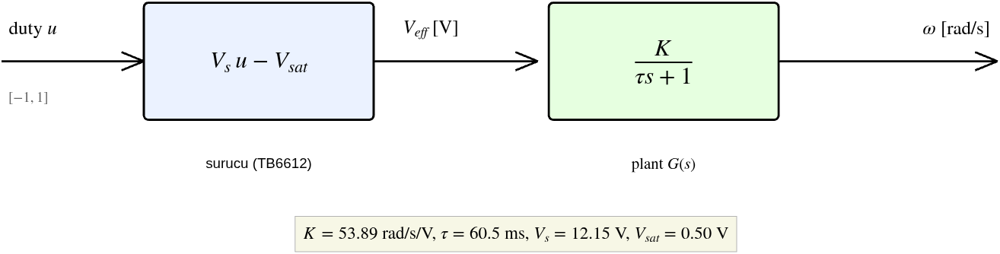
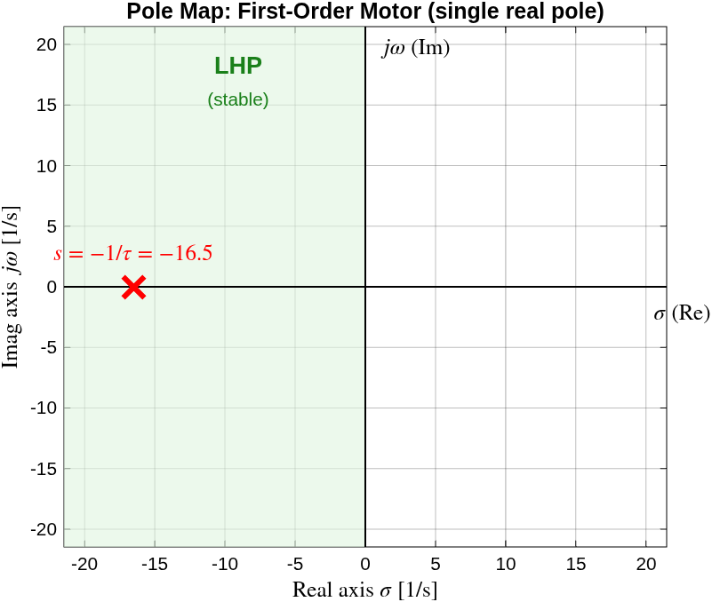
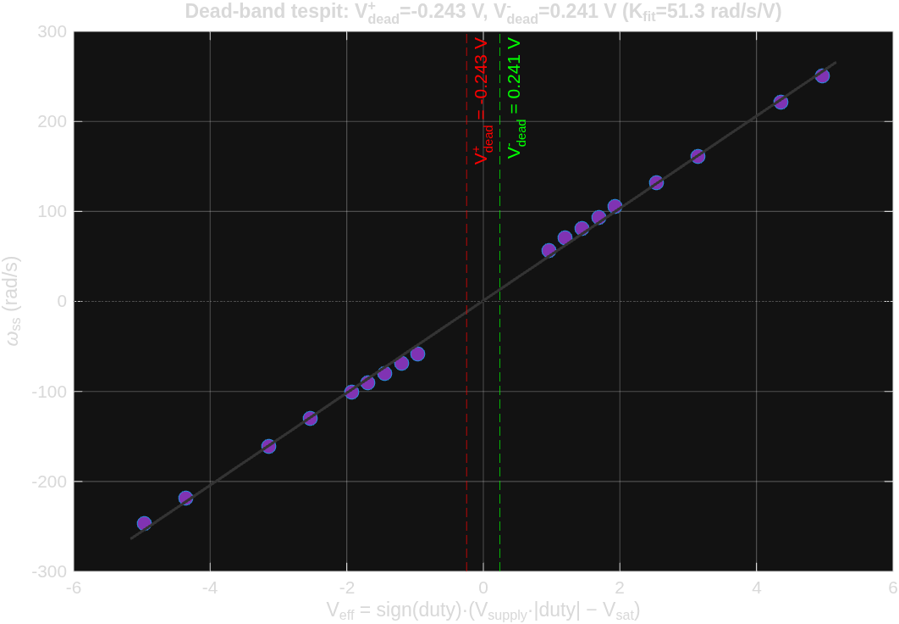
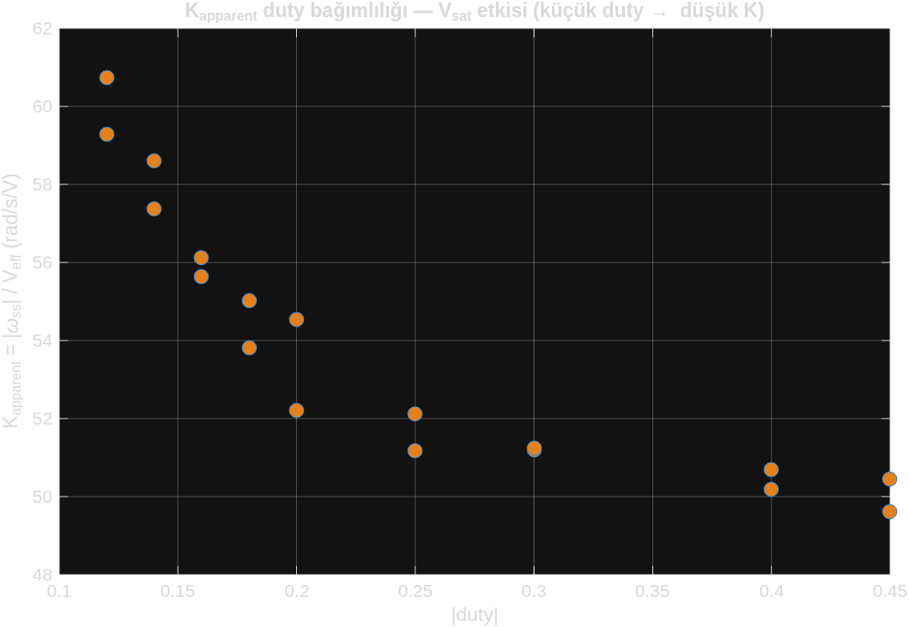
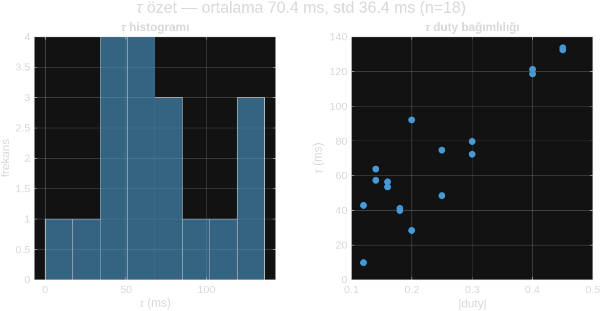
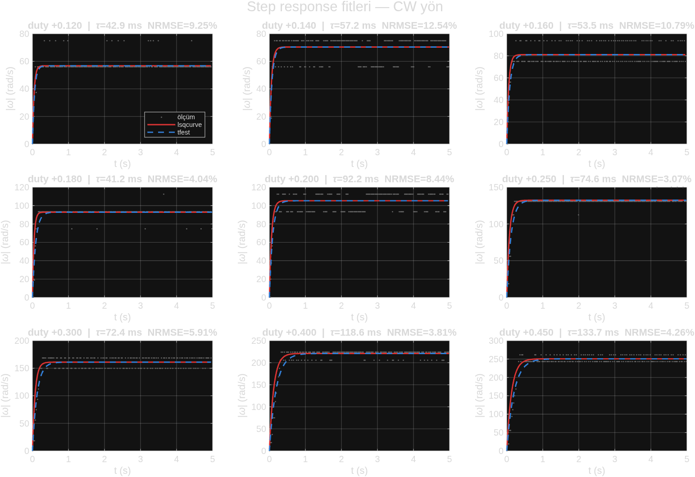
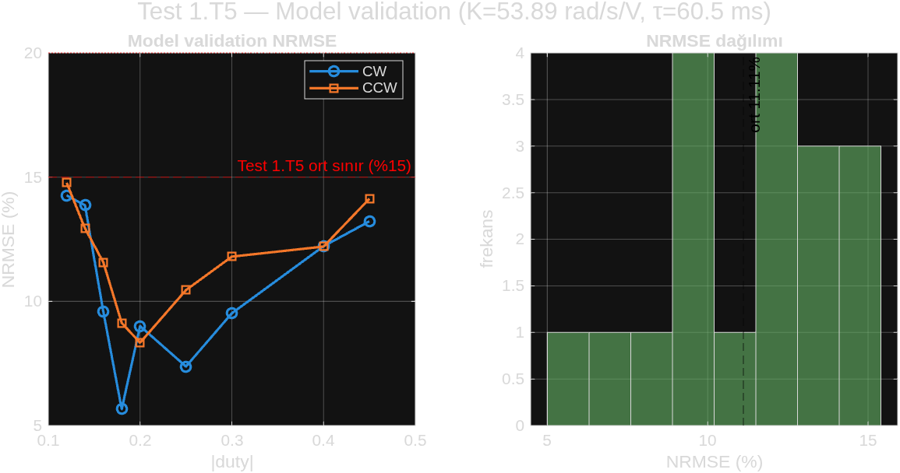

# Aşama 1 — Tek Motor Sistem Tanımlama

> **Ekosistem:** Tek motorun 1. derece dinamik modelinin (K, τ, dead-band) deneysel olarak çıkarılması. Altyapı → [`asama_0_altyapi.md`](asama_0_altyapi.md). Sonraki aşama → [`asama_2_kontrol.md`](asama_2_kontrol.md). MATLAB pipeline → [`../matlab/asama_1_model/`](../matlab/asama_1_model/). Kaynaklar → [`../KAYNAKCA.md`](../KAYNAKCA.md).

## Özet

Step response deneyleriyle (18 step: 9 duty × CW/CCW) DC motorun birinci-derece transfer fonksiyonu `G(s)=K/(τs+1)` tanımlandı: `K=53.89 rad/s/V, τ=60.5 ms, V_dead≈0, V_supply=12.15V`. Model lsqcurvefit + tfest ile fit edildi, çapraz-doğrulama NRMSE %11 (Test 1.T5 PASS). Bu model Aşama 2 kontrolcü tasarımının temelidir.

---

> **Branch:** `feature/asama-1-tek-motor-model`
> **MATLAB:** `matlab/asama_1_model/`
> **Veri:** `artifacts/1/step_response/20260518_011926/`
> **Sonuçlar:** `matlab/asama_1_model/results/20260518_011926/`

### 10.1. Ne — Sistem Tanımlama Nedir?

**Sistem tanımlama** (`[Ljung1999] §1, §3`), bir fiziksel sistemin **giriş-çıkış verisinden** matematiksel modelini çıkarma sürecidir. Bizim sistemimiz: PWM duty komutu → motor şaft hızı (rad/s). Bu adımda Pololu 25D motor + TB6612 sürücü kombinasyonunun **transfer fonksiyonu** çıkarıldı.

> **Ön bilgi:** Transfer fonksiyonu, Laplace dönüşümü, kutup ve 1. derece sistem kavramları → [`00_genel_bakis.md`](00_genel_bakis.md) §2.1–§2.3. Bu belge o temeli motora uygular.

Modellediğimiz sistem **açık çevrimdir** (henüz kontrolcü yok): duty komutu motoru sürer, çıkış serbestçe oturur. Sürücü, duty'yi efektif gerilime çevirir ($V_{eff}=V_s\,u - V_{sat}$); plant ise bu gerilimi şaft hızına dönüştürür:



*Şekil 10.0 — Açık-çevrim (kontrolcüsüz) motor modeli. Sürücü bloğu duty $u\in[-1,1]$'i efektif gerilime çevirir; plant $G(s)$ birinci derece dinamiktir. Aşama 1'in görevi $K$ ve $\tau$'yu deneysel olarak bulmaktır. Bu sistem Aşama 2'de bir kontrolcü ($C(s)$) ile geri-besleme döngüsüne sokulacaktır ([`00_genel_bakis.md`](00_genel_bakis.md) Şekil 1).*

> 📊 **Üreten betik:** `matlab/asama_1_model/create_block_diagram.m`

Birinci derece motor transfer fonksiyonu (sürücü kazancı dahil edilmeden, saf plant):

$$G(s) = \frac{\Omega(s)}{V_{eff}(s)} = \frac{K}{\tau s + 1}$$

Burada $K$ DC kazanç (girdiğimiz gerilime karşılık oturan hız), $\tau$ ise zaman sabitidir (sistemin ne kadar hızlı oturduğu). Tek kutbu $s=-1/\tau$ sol yarı düzlemdedir → açık çevrimde kararlı (§10.7, Şekil 10.x kutup haritası).

### 10.2. Neden — Niçin Önce Modelleme?

Aşama 2 (PI kontrolcü tasarımı) için **pole placement** (`[Franklin2010] §6.4`) yapacaksak, motorun K (DC kazanç) ve τ (zaman sabiti) değerlerini bilmemiz gerekir:
- **τ_cl = τ_ol / 5** kuralı (cascade) için τ_ol şart
- **Kp = (τ · ω_n²) / K** formülü için K şart
- Kazanç bilmeden kontrolcü = deneme-yanılma = akademik olmayan yaklaşım

### 10.3. Nasıl — Yöntem

**Adım 1 — Veri toplama** (`scripts/step_response.py`):
- 9 duty seviyesi × 2 yön = 18 step (0.12, 0.14, 0.16, 0.18, 0.20, 0.25, 0.30, 0.40, 0.45 × CW/CCW)
- Her step: 5 sn drive + 2 sn coast, 250 ms heartbeat, **DWT mikrosaniye timestamp** (`[ARM_DWT]`)
- 4497 örnek, 36 segment, gzip'li CSV → `artifacts/1/step_response/<id>/raw/data.csv.gz`

**Adım 2 — Step bazlı fit** (`fit_first_order.m`):

Birinci derece sistemin step yanıtı (§10.1'deki $G(s)$'in zaman domeni karşılığı):

$$\omega(t) = \omega_{ss}\left(1 - e^{-(t-t_0)/\tau}\right)$$

Bu eğriyi her step'in ölçülen verisine **uydurarak** (curve fitting) $\omega_{ss}$ ve $\tau$ bulunur. İki bağımsız yöntem koşturulur ve daha iyi uyanı seçilir:

- **Yöntem A — `lsqcurvefit`** (Optimization Toolbox, `[Soderstrom1989] §4`): Parametreleri ($\omega_{ss}, \tau, t_0$), model ile ölçüm arasındaki **kareler toplamını minimize** ederek bulan bir optimizasyon çözücüsüdür:

$$\min_{\theta}\ \sum_{k}\big(\omega_{\text{model}}(t_k;\theta) - \omega_{\text{meas}}(t_k)\big)^2,\qquad \theta=[\omega_{ss},\tau,t_0]$$

  **Çalışma prensibi:** Levenberg-Marquardt algoritması — gradyan inişi (uzaktayken güvenli) ile Gauss-Newton'u (yakınken hızlı) harmanlar. Başlangıç tahmininden başlayıp her iterasyonda hatayı azaltan yöne adım atar, yakınsayınca durur. Model denklemi açıkça bizim elimizde olduğu için **şeffaftır**.

- **Yöntem B — `tfest`** (System Identification Toolbox, `[Ljung1999] §4`): Veriden doğrudan transfer fonksiyonu kestirir (1 kutup, 0 sıfır istenir). **Çalışma prensibi:** prediction-error method (PEM) — modelin bir sonraki örneği tahmin etme hatasını minimize eder; iç yapıyı `tfest` kendi seçer ("kara kutuya" daha yakın). Girdi olarak `iddata` nesnesi (giriş `V_eff`, çıkış `ω`, örnekleme süresi) alır.

- Her step için ikisini de koştur, daha düşük NRMSE veren seçilir → 16/18 step'te `lsqcurvefit` kazandı (açık model varsayımı bu temiz step verisinde daha iyi uydu).

**Adım 3 — Dead-band tespit** (`compute_dead_band.m`):

Oturmuş hızların ($\omega_{ss}$) efektif gerilime ($V_{eff}$) karşı lineer regresyonu yapılır:

$$\omega_{ss} = K\cdot V_{eff} + b \quad\Rightarrow\quad V_{dead} = -\frac{b}{K}\ \ (\text{x-eksenini kestiği nokta})$$

Burada $V_{eff} = V_{supply}\cdot\text{duty} - V_{sat} = 12.15\cdot\text{duty} - 0.5$ (sürücü kaybı çıkarılmış efektif gerilim). $V_{dead}$ motorun dönmeye başladığı eşik gerilimdir; CW/CCW için ayrı fit edilir.

**Adım 4 — Simetri analizi:** CW/CCW K karşılaştırması (`plot_results.m §06`)

**Adım 5 — Model validation** (Test 1.T5, `validate_model.m`):
- Tek $(K_{avg}, \tau_{median})$ çiftiyle her step yeniden simüle et (`lsim`). **`lsim` prensibi:** verilen transfer fonksiyonunu, keyfi bir giriş sinyaline karşı zaman domeninde sayısal olarak çözer (durum-uzayı formuna çevirip adım adım entegre eder). Burada giriş gerçek deneydeki $V_{eff}$ basamağı, çıkış simüle $\omega$.
- Uyum kalitesi her step için **NRMSE** (normalize edilmiş RMS hatası) ile ölçülür:

$$\text{NRMSE} = \frac{\sqrt{\frac{1}{N}\sum_k\big(\omega_{\text{meas}}[k]-\omega_{\text{model}}[k]\big)^2}}{\omega_{\max}-\omega_{\min}}\times 100\%$$

  Sınır: ortalama < %15, maksimum < %20 (`[Ljung1999] §16` "good agreement" kriteri).
- Simulink modeli (`motor_model_asama1.slx`) programatik üretildi (blok diyagram kanıtı).

### 10.4. Nerede — Dosya ve Konum Referansları

| İş | Konum | Açıklama |
|---|---|---|
| Firmware T_US timestamp | `src/main.c:50-56, 158` | DWT.CYCCNT init + TX formatı |
| Veri toplama scripti | `scripts/step_response.py` | 18 step, 250 ms heartbeat |
| Ham veri | `artifacts/1/step_response/20260518_011926/raw/data.csv.gz` | 4497 örnek |
| Veri yükleyici | `matlab/asama_1_model/load_step_data.m` | T_US wrap düzeltmeli |
| Fit fonksiyonu | `matlab/asama_1_model/fit_first_order.m` | lsqcurve + tfest |
| Dead-band | `matlab/asama_1_model/compute_dead_band.m` | x-intercept regresyon |
| Plot | `matlab/asama_1_model/plot_results.m` | 7 PNG |
| Validation | `matlab/asama_1_model/validate_model.m` | Test 1.T5, 3 PNG |
| Simulink üretici | `matlab/asama_1_model/create_simulink_model.m` | .slx programatik |
| Pipeline orchestrator | `matlab/asama_1_model/run_pipeline.m` | tek komut tüm akış |
| **Sonuçlar (PNG+JSON+MD)** | `matlab/asama_1_model/results/20260518_011926/` | hoca/jüri klasörü |

### 10.5. Ne Sonuç Çıktı — Sayısal Parametreler

```json
{
  "model":         "first_order_with_deadband",
  "K_cw":          54.225,
  "K_ccw":         53.558,
  "tau_median_s":  0.0605,
  "tau_iqr_s":     0.0492,
  "V_dead_pos_V":  -0.243,
  "V_dead_neg_V":  +0.241,
  "V_supply_V":    12.15,
  "V_sat_V":       0.50,
  "symmetry_pct":  1.24,
  "R2_pos":        0.9998,
  "R2_neg":        0.9997,
  "validation_nrmse_mean": 11.11,
  "validation_nrmse_max":  14.77
}
```

**Aşama 2 girişi (kontrolcü tasarımı):**
```
K = 53.89 rad/s/V      (K_cw ve K_ccw ortalaması)
τ = 60.5 ms            (median, gürültüye dayanıklı)
V_dead ≈ 0             (dinamik dead-band yok)
```

Somut transfer fonksiyonu (dead-band çıkarılmış, Aşama 2 kontrolcü tasarımının temeli):

$$G(s) = \frac{K}{\tau s + 1} = \frac{53.89}{0.0605\,s + 1}$$

Tek kutup $s = -1/\tau = -16.5$ rad/s, sol yarı düzlemde → sistem açık çevrimde kararlı, salınımsız (§[`00_genel_bakis.md`](00_genel_bakis.md) §2.5 kararlılık kuralı):



*Şekil 10.6 — Motorun kutup haritası. Tek reel kutup $s=-16.5$ sol yarı düzlemde (LHP). Karmaşık (sanal) bileşeni yok → salınım yok; negatif reel → sönerek oturur. Aşama 2'de kontrolcü bu kutbu daha hızlı/sönümlü bir yere taşıyacak (pole placement).*

> 📊 **Üreten betik:** `matlab/asama_1_model/create_block_diagram.m`

### 10.6. Test Sonuçları

| Test | Beklenen | Ölçülen | Durum |
|---|---|---|---|
| 1.T1 — Veri toplama tutarlılığı | 18 step temiz, USB drop yok | 4497 örnek, hiç drop yok | ✅ PASS |
| 1.T2 — Step bazlı fit kalitesi | her step NRMSE < %5 | düşük duty %9-12, yüksek duty %3-5 | ⚠ PARTIAL |
| 1.T3 — CW/CCW simetri | < %5 | %1.24 | ✅ PASS |
| 1.T4 — Dead-band cross-check | V_dead < 0.5 V | -0.24 / +0.24 V (ihmal) | ✅ PASS |
| 1.T5 — Model validation | ort NRMSE < %15, max < %20 | ort %11.11, max %14.77 | ✅ PASS |

### 10.7. Akademik Tartışma

#### Bulgu 1 — Dinamik Dead-band Yok; Stiction Hipotezi Deneysel Reddedildi; R6 Analiz Artefaktıydı

> **Akademik mühendislik akıl yürütmesinin canlı örneği:** gözlem → hipotez → deneysel test → revizyon.

Pololu 25D motor %12 duty (V_eff=0.96 V) iken zaten 57 rad/s dönüyor. Aşama 1.3 lineer regresyon V_dead = **−0.24 V (negatif)** verdi — dönen motorda dead-band yok demektir.



*Şekil 10.1 — ω_ss vs V_eff lineer regresyonu. x-eksenini kestiği nokta (V_dead) ≈ ±0.24 V, neredeyse orijinde → dinamik dead-band ihmal edilebilir.*

> 📊 **Üreten betik:** `matlab/asama_1_model/plot_results.m` (regresyon `compute_dead_band.m`)

##### İlk hipotezimiz (Aşama 1.3 yorumu)

Önceki Test 2A.T2'de motor %20 duty'de döndü (+107 rad/s), Test 2A.T7'de aynı duty'de motor "+0.00 rad/s" gösterdi (R6 anomalisi). Bunu **statik sürtünme (stiction)** ile açıkladık (`[Franklin2010] §3.2 Coulomb + viscous friction`): T2'de motor önceden sürülmüş sıcak, T7'de coast'tan başladı soğuk, stiction eşiği aşılamadı.

##### Deneysel doğrulama testi (2026-05-18) — HİPOTEZ REDDEDİLDİ

Artifact: `artifacts/1/stiction_test/20260518_111200/`

**Test protokolü:**
- **Faz A:** 30 sn cold-start sonrası 8 duty seviyesi (%10-25), her birinin arasında 15 sn cooldown
- **Faz B:** Motor 0.30 ile 10 sn sürüş (sıcak), sonra düşük duty'ler kontrol grubu

**Sonuç:**

| duty | cold ω_ss | sıcak ω_ss | fark |
|---|---|---|---|
| 0.100 | +46.75 | +44.41 | %5.0 |
| 0.120 | +56.10 | +58.44 | %4.2 |
| 0.140 | +67.79 | +70.12 | %3.4 |
| 0.160 | +79.47 | +79.47 | %0.0 |

**Hepsi 🟢 BAŞLADI** — cold-start ile sıcak motor arasında ölçüm gürültüsü içinde fark var. **Stiction yok ya da minimal.**

##### R6 anomalisinin gerçek açıklaması

Stiction reddedildikten sonra T7 ham CSV log'u (`artifacts/2A/T7_integration/raw/test_2a7_integration.csv.gz`) yeniden incelendi. 8 cycle hepsinde CW%20 segmentinde encoder count **tutarlı şekilde artmış** (ΔEC ≈ 1750 / 3 sn → motor şaftında ~76 rad/s). Motor o testte **gerçekten dönmüş**.

**Anomalinin kaynağı:** T7 yapıldığında firmware USB CDC TX formatına `OMEGA:` alanını henüz eklememişti (sonradan `0f27dd3` commit'te eklendi). Python analiz scripti `OMEGA:` regex'ini bulamayınca varsayılan **0.0 raporladı**.

**R6 fiziksel bir fenomen değil, veri analizi / parsing artefaktıydı.** Dynamic dead-band yok, stiction da yok — Aşama 1 modeli (V_dead ≈ 0) zaten doğru söylüyordu, biz onu stiction olarak yanlış yorumladık.

##### Pratik etkisi (revize)

| Konu | Önceki yorum (stiction hipotezi) | Yeni yorum (deneysel doğrulama sonrası) |
|---|---|---|
| Düşük setpoint riski | Stiction nedeniyle gecikir | Motor %10 duty'den itibaren dönüyor, **sorun yok** |
| Stiction kicker önerisi | Aşama 2.3'te değerlendir | **Gerek yok** |
| Gain scheduling önerisi | Stiction kompanse için | Hâlâ **τ duty bağımlılığı** (Bulgu 3) için geçerli |

**Akademik vurgu:** İlk hipotezimizi (stiction) deneysel olarak test ettik ve reddettik. Yanlış bir yoruma sarılmadık. Bu mühendislik biliminin klasik döngüsü — `[Ljung1999] §16`'nın model validation prensibinin sokratik genişletmesi.

#### Bulgu 2 — V_sat Profili: TB6612 Datasheet Doğrulaması

K_apparent (= ω_ss / V_eff) profili **60 → 50 rad/s/V kademeli düşüş** (Grafik 05). Eğer V_sat sabit olsaydı (0.5 V varsayımımız gibi), K_apparent her duty'de aynı olurdu.



*Şekil 10.2 — K_apparent = ω_ss/V_eff profili. Sabit V_sat varsayımı altında düz olması beklenirdi; kademeli düşüş, V_sat'ın akıma bağlı (MOSFET R_DS_on×I) olduğunu görsel olarak doğrular (`[TB6612_DS]`).*

> 📊 **Üreten betik:** `matlab/asama_1_model/plot_results.m`

**Niçin düşüyor?** V_sat aslında **akıma bağlı** (MOSFET R_DS_on × akım):
- **Düşük duty** → düşük akım → gerçek V_sat ~0.3 V → modelimiz V_eff'i altta tahmin → K_apparent şişer
- **Yüksek duty** → yüksek akım → gerçek V_sat ~0.7 V → modelimiz V_eff'i üstte tahmin → K_apparent düşer

**Pratik etkisi:**
- Tek (K, τ) ile **tüm setpoint'leri %15 NRMSE içinde** temsil ediyoruz (Test 1.T5 PASS)
- Kontrolcü **integral aksiyonu (Ki)** bu küçük sapmaları otomatik kompanse eder → steady-state error sıfıra gider
- Test 1.T5 U-eğrisi: ortada %5.7, uçlarda %12-14 — modelin doğal sınırı

Bu, datasheet V_sat=0.5V varsayımımızın **görsel olarak doğrulanmasıdır**.

#### Bulgu 3 — τ Duty Bağımlılığı: 1. Derece Varsayımının Sınırı

τ değerleri 43 ms (düşük duty) ile 134 ms (yüksek duty) arasında değişiyor (Grafik 07). Bu **1. derece varsayımının sınırını** gösterir.



*Şekil 10.3 — τ dağılımı (median 60.5 ms) ve duty bağımlılığı. Saçılım, tek-τ 1. derece modelin ortalama bir yaklaşım olduğunu gösterir (`[Franklin2010] §3.5`).*

> 📊 **Üreten betik:** `matlab/asama_1_model/plot_results.m`

**Gerçek DC motor aslında 2. derecedir:**

$$G(s) = \frac{K}{(\tau_e s + 1)(\tau_m s + 1)}$$

- $\tau_e$ (elektriksel) $= L/R \approx 2\text{-}10$ ms
- $\tau_m$ (mekanik) $= J/b \approx 50\text{-}200$ ms

Bizim için τ_m / τ_e ≈ 12-25× → elektriksel kısım anında biter, mekanik baskın → **1. derece görünür**. 40 Hz USB örneklemesi τ_e'yi zaten göremez (25 ms aralık).

**τ duty bağımlılığının nedeni:**
- Düşük duty → düşük akım → düşük tork → τ_e baskın görünür
- Yüksek duty → yüksek akım → yüksek tork → τ_m baskın

Tek τ ile bunun **ortalamasını** yakalıyoruz. Kontrolcü tasarımı için yeterli (Test 1.T5 PASS), ancak `[Franklin2010] §3.5` model sadeleştirme trade-off'unu açıkça not eder.

#### Bulgu 4 — Test 1.T5 U-Eğrisi: Gain Scheduling Adayı

Tek (K, τ) ile validation NRMSE |duty|≈0.18'de minimum (%5.7), uçlarda yüksek (%12-14). Bu, K(duty) ve τ(duty) varyasyonunun doğal sonucudur.

**Gain scheduling kavramı:** Farklı çalışma noktalarında farklı (Kp, Ki) kullanmak. Bir tabloyla yerel kazanç değiştirilir:
```
ω_setpoint < 50 rad/s:    Kp=0.08, Ki=2.5   (düşük setpoint, τ_e baskın bölge)
50 ≤ ω_setpoint < 150:    Kp=0.12, Ki=4.0   (orta — bizim mevcut)
ω_setpoint ≥ 150:         Kp=0.15, Ki=5.5   (yüksek)
```

Şimdilik tek kazançla ilerliyoruz (Aşama 2.2). Aşama 2.3 testinde bazı setpoint'lerde performans kötüyse, gain scheduling eklenir.

### 10.8. Görsel Kanıtlar

**Step fit kalitesi** (Test 1.T2) — ölçüm vs model (lsqcurve + tfest), 9 duty:



*Şekil 10.4 — CW yönü step fitleri. Yüksek duty'de NRMSE %3-5 (mükemmel), düşük duty'de %9-12 (transient hızlı, 40 Hz örnekleme sınırı).*

> 📊 **Üreten betik:** `matlab/asama_1_model/plot_results.m` (fit `fit_first_order.m`)

**Model doğrulama** (Test 1.T5) — tek (K_avg, τ_median) ile tüm step'lerin yeniden simülasyonu:



*Şekil 10.5 — Validation NRMSE U-eğrisi. |duty|≈0.18'de minimum (%5.7), uçlarda %12-14. Ortalama %11.11, max %14.77 → Test 1.T5 PASS. U şekli, K(duty)/τ(duty) varyasyonunun (Bulgu 2-3) doğal sonucu — gain scheduling adayı (Bulgu 4).*

> 📊 **Üreten betik:** `matlab/asama_1_model/validate_model.m`

**Tüm grafikler** — `matlab/asama_1_model/results/20260518_011926/` altında:

| # | Dosya | Açıklama |
|---|---|---|
| 01 | `01_step_fits_cw.png` | CW step fitleri (ölçüm + lsqcurve + tfest), 9 alt grafik |
| 02 | `02_step_fits_ccw.png` | CCW step fitleri |
| 03 | `03_omega_vs_duty.png` | ω_ss vs duty, lineer regresyon (R² ≈ 0.9998) |
| 04 | `04_omega_vs_Veff.png` | Dead-band tespit (x-intercept, V_dead ≈ ±0.24 V) |
| 05 | `05_K_apparent_vs_duty.png` | K_apparent profil (V_sat etkisinin görsel kanıtı) |
| 06 | `06_cw_ccw_symmetry.png` | Test 1.T3 — K ve τ karşılaştırması |
| 07 | `07_tau_summary.png` | τ histogram + duty bağımlılığı (ort 70 ms, median 60.5) |
| 08 | `08_validation_cw.png` | Test 1.T5 model vs ölçüm (CW) |
| 09 | `09_validation_ccw.png` | Test 1.T5 model vs ölçüm (CCW) |
| 10 | `10_validation_summary.png` | Test 1.T5 NRMSE özet (U-eğrisi) |
| 11 | `11_block_diagram_openloop.png` | Açık-çevrim motor blok diyagramı (duty → sürücü → plant → ω) |
| 12 | `12_pole_map.png` | Birinci derece sistemin kutup haritası (s=−1/τ, kararlılık) |
| — | `motor_model_asama1.slx` | Simulink blok diyagramı (programatik üretildi) |
| — | `motor_params.json` | Aşama 2 girişi (firmware için kaynak) |
| — | `fit_report.md` | Detaylı sayısal rapor |

### 10.9. Bir Sonraki Aşama

**Aşama 2 — Tek Motor Kontrol (PI/PID/Cascade):**
- Hız iç döngü PI tasarımı (`K = 53.89, τ = 60.5 ms` ile pole placement)
- Anti-windup (`[AstromMurray2008] §10.4`)
- Pozisyon dış döngü P/PI + cascade
- IMU mirror bağlantısı (setpoint = +fused_pitch)

ROADMAP §2'ye bakınız.

---

