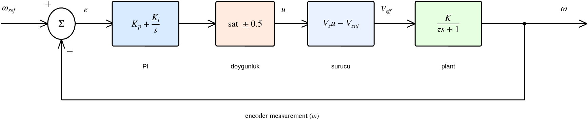
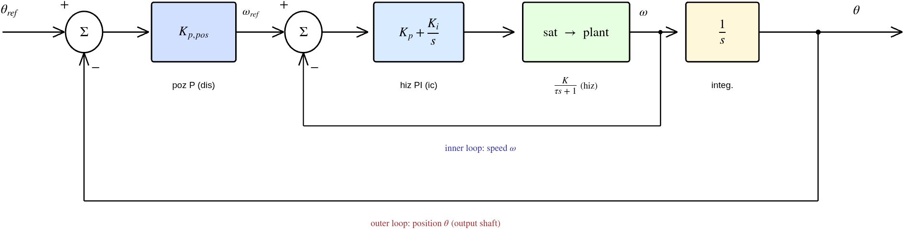
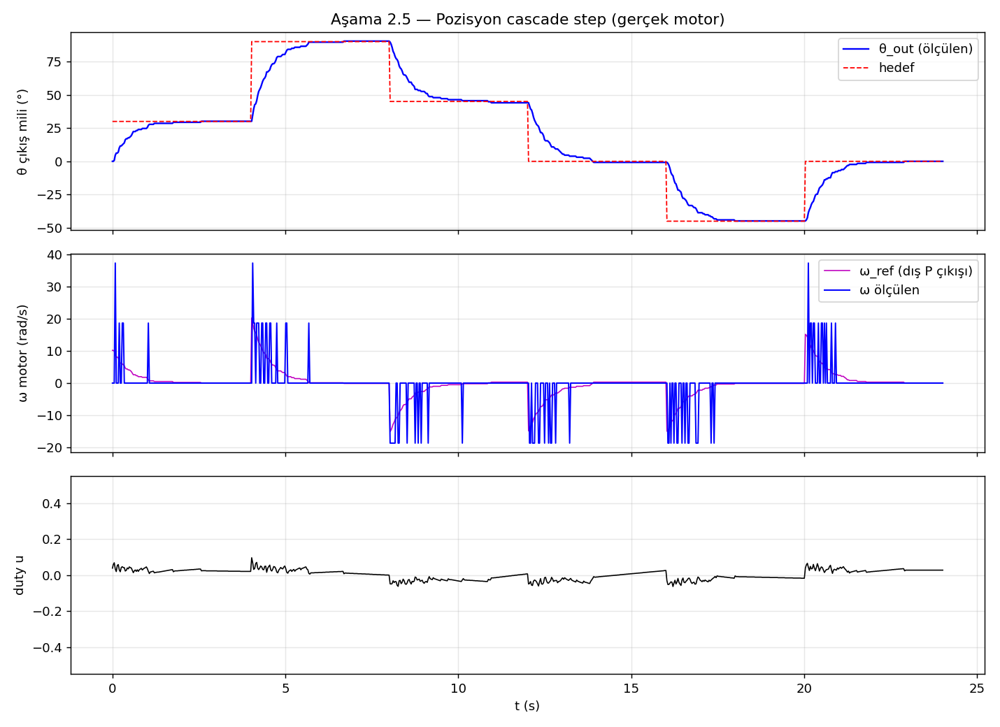
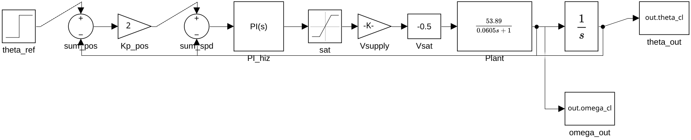
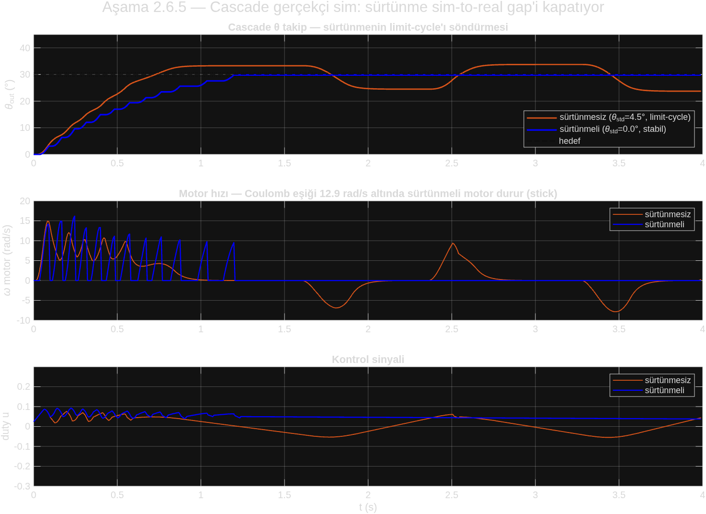
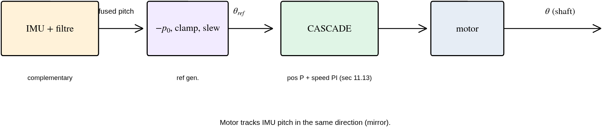
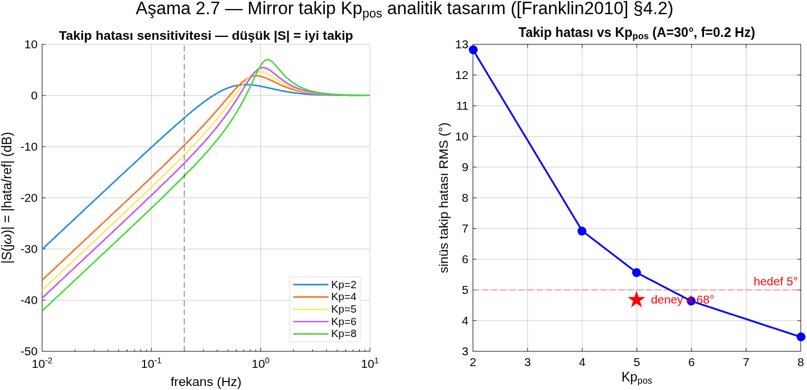
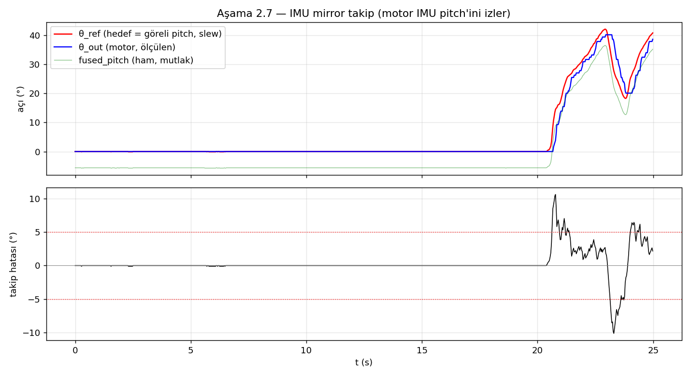

# Aşama 2 — Tek Motor Kontrol (Hız PI → Pozisyon Cascade)

> **Ekosistem:** Aşama 1 modeli üzerine klasik kontrol: hız PI, sim-to-real gap, disturbance rejection, pozisyon cascade. Model temeli → [`asama_1_model.md`](asama_1_model.md). MATLAB tasarım → [`../matlab/asama_2_kontrol/`](../matlab/asama_2_kontrol/). Plan + açık sorular → [`../ROADMAP.md`](../ROADMAP.md). Kaynaklar → [`../KAYNAKCA.md`](../KAYNAKCA.md).

## Özet

Hız iç döngüsü Tustin PI + anti-windup ile tasarlandı; Aşama 2.3'te ideal-sim kazancı (Kp=0.1163) gerçek motorda bang-bang verdi → **sim-to-real gap** sistematik tanı ile çözüldü (ampirik Kp=0.002, Ki=0.1), gerçekçi Simulink teorik doğruladı. Disturbance rejection (Test 2.T4) ve pozisyon cascade (poz P → hız PI, Test 2.5) PASS. Cascade'de gerçekçi sim limit-cycle öngördü ama gerçek motor sürtünmesi söndürdü (ss<0.8°). Tüm kazançlar serbest mil içindir.

---

> **Branch:** `feature/asama-1-tek-motor-model`
> **MATLAB:** `matlab/asama_2_kontrol/`
> **Durum:** 2.1→2.6 tamamlandı (hız PI + sim-to-real + disturbance + pozisyon cascade), 2.7 IMU mirror sırada.

### 11.1. Ne — Kontrolcü Nedir?

**Kontrolcü**, sistem çıkışını (motor hızı, $\omega$) istenen değere (setpoint, $\omega_{ref}$) ulaştıran kapalı döngü hesaplayıcıdır.

> **Ön bilgi:** Kapalı çevrim, blok diyagram, PID, kararlılık kavramları → [`00_genel_bakis.md`](00_genel_bakis.md) §2.2, §2.5. Bu belge o temeli motora uygular.

Bizim seçimimiz **PI (Proportional + Integral)**. Zaman domeninde hata ve kontrol çıkışı:

$$e(t) = \omega_{ref} - \omega_{meas}, \qquad u(t) = K_p\,e(t) + K_i\!\int_0^t e(\tau)\,d\tau$$

Laplace domeninde PI kontrolcünün transfer fonksiyonu:

$$C(s) = K_p + \frac{K_i}{s} = \frac{K_p\,s + K_i}{s}$$

- **P ($K_p$):** Anlık hatayla orantılı tepki — hızlı düzeltme.
- **I ($K_i$):** Birikmiş hatayla orantılı — kalıcı-hal hatasını sıfıra getirir (integratör → sistem tip-1, [`00_genel_bakis.md`](00_genel_bakis.md) §2.7).
- **D yok:** Encoder zaten hızı ölçüyor (yani zaten "türev"); D ile gürültü amplifiye edilirdi.

Bu PI kontrolcü, motor plant'ı ($G(s)=K/(\tau s+1)$) etrafında kapalı-çevrim bir iç hız döngüsü oluşturur:



*Şekil 11.1 — Hız PI iç döngüsü. $\omega_{ref}$ referans, $\Sigma$ hatayı hesaplar ($e=\omega_{ref}-\omega$), PI kontrol sinyali $u$ üretir, doygunluk ($\pm0.5$ duty) ve sürücü ($V_s u - V_{sat}$) gerçek gerilime çevirir, plant hızı üretir. Encoder ölçümü geri beslenir. Bu, [`00_genel_bakis.md`](00_genel_bakis.md) Şekil 1'deki genel yapının motora özelleşmiş halidir: $C(s)=K_p+K_i/s$, $G(s)=K/(\tau s+1)$.*

> 📊 **Üreten betik:** `matlab/asama_2_kontrol/create_control_diagrams.m`

### 11.2. Neden — Niçin Pole Placement?

Pole placement, kapalı döngünün **karakteristik denkleminin köklerini** istenen yerlere taşıyarak parametre hesabı yapan **analitik** bir tasarım yöntemidir (`[Franklin2010] §6.4`).

**Kapalı döngü transfer fonksiyonu** (1. derece plant $G=K/(\tau s+1)$ + PI $C=(K_p s+K_i)/s$, birim geri besleme $T=\frac{CG}{1+CG}$):

$$T(s) = \frac{K(K_p s + K_i)}{\tau s^2 + (1 + K K_p)\,s + K K_i}$$

Paydayı standart 2. derece karakteristik denklemle eşitlersek ([`00_genel_bakis.md`](00_genel_bakis.md) §2.4):

$$\tau s^2 + (1 + K K_p)\,s + K K_i = \tau\left(s^2 + 2\zeta\omega_n s + \omega_n^2\right)$$

İki tarafın $s$ katsayılarını eşitleyip $K_p, K_i$ için çözeriz:

$$\boxed{\,K_p = \frac{2\zeta\omega_n\tau - 1}{K}, \qquad K_i = \frac{\omega_n^2\,\tau}{K}\,}$$

Böylece istenen kapalı-çevrim davranışını ($\zeta, \omega_n$) seçip kazançları **analitik** olarak hesaplarız — kapalı-çevrim kutuplarını istediğimiz yere "yerleştiririz" (pole placement).

**Parametre seçimi (Aşama 2.1, kullanıcı onaylı):**
- ζ = 1.0 (kritik sönüm) — sıfır overshoot, `[Franklin2010] §3.6`
- ω_n = 60 rad/s — `τ_cl = 1/ω_n = 16.7 ms`, açık döngü τ'nun ~3.5× üzerinde hızlı

**Alternatif olarak `pidtune`** (MATLAB Control System Toolbox) da koşturuldu — otomatik frekans bölgesi tasarımı, robustluk slider'ı ile. **Aşama 2.1'de 5 kontrolcü karşılaştırması** akademik kanıt olarak rapora alındı.

### 11.3. Nasıl — Aşama 2.1 (MATLAB Tasarım)

#### Adım 1: Pole placement (analitik)
- `design_speed_pi_pole_placement.m` — Kp, Ki formülle hesaplanır
- İki varyant koşturuldu:
  - **Aggressive:** ζ=0.707, ω_n=83 → Kp=0.1133, Ki=7.7401 (60 ms settling, %15 OS)
  - **Conservative:** ζ=1.0, ω_n=60 → Kp=0.1163, Ki=4.0447 (80 ms settling, %6.7 OS) ⭐ **seçildi**

#### Adım 2: pidtune (otomatik karşılaştırma)
- `design_speed_pi_autotune.m` — Robust / Balanced / Fast modları
- **`pidtune` çalışma prensibi** (Control System Toolbox): plant'ı verir, hedef bant genişliğini (veya robustluk slider'ını) belirtirsin; fonksiyon açık-çevrim kazanç geçiş frekansını ve faz payını hedefleyerek (loop-shaping) $K_p, K_i$'yi otomatik seçer. Analitik formül vermez — "kara kutu" optimizasyon. Bizim için **karşılaştırma referansı**: analitik pole placement'ın yanında bağımsız ikinci görüş.
- Üçü de **376 ms settling, %13-18 OS** — çok yavaş, hedef altında

#### Adım 3: Karşılaştırma + Validation
- `compare_speed_pi.m` — Bode, step response, gain/phase margin
- **`bode` / `margin` prensibi:** `bode` sistemin frekans yanıtını (kazanç dB + faz) hesaplar; `margin` bu yanıttan kazanç payı (GM) ve faz payını (PM) otomatik çıkarır ([`00_genel_bakis.md`](00_genel_bakis.md) §2.6). Büyük PM → sönümlü/sağlam. 5 kontrolcü bu marjlarla karşılaştırıldı.
- 5 kontrolcü tablosu jüri/sunum için akademik kanıt

#### Adım 4: Simulink kapalı döngü
- `create_speed_loop_simulink.m` — programatik `.slx` üretimi
- Setpoint → Sum → PI → Saturation ±0.5 → V_supply → −V_sat → Plant G(s) → ω

#### Adım 5: Firmware için JSON parametre dosyası
- `speed_pi_params.json` — Aşama 2.2 girişi (Kp, Ki, T_t, Ts)

### 11.4. Nerede — Dosya Referansları

| Bileşen | Konum |
|---|---|
| Plant yükleyici | `matlab/asama_2_kontrol/load_motor_params.m` |
| Pole placement | `matlab/asama_2_kontrol/design_speed_pi_pole_placement.m` |
| pidtune | `matlab/asama_2_kontrol/design_speed_pi_autotune.m` |
| Karşılaştırma | `matlab/asama_2_kontrol/compare_speed_pi.m` |
| Simulink üretici | `matlab/asama_2_kontrol/create_speed_loop_simulink.m` |
| Orchestrator | `matlab/asama_2_kontrol/run_pipeline_2_1.m` |
| **Sonuçlar** | `matlab/asama_2_kontrol/results/2_1_speed_pi/` |
| Firmware hız PI | `src/speed_pi.c`, `include/speed_pi.h` |
| Firmware komut parser | `src/cmd_parser.c` (MODE:DUTY, MODE:SP_W) |
| Firmware integrasyon | `src/main.c:80-95` (SpeedPI_Init), `src/main.c:130-145` (SP_W loop) |

### 11.5. Ne Sonuç Çıktı — Aşama 2.1 Sayısal

```json
{
  "design_pole_placement_conservative": {
    "Kp":      0.1163,
    "Ki":      4.0447,
    "zeta":    1.0,
    "omega_n": 60,
    "tau_cl_s": 0.0167
  },
  "firmware_selected": "pole_placement_conservative",
  "comparison": {
    "GM_dB":            "Inf  (1. derece plant + integrator → stabil)",
    "PM_deg":           80.8,
    "settling_time_ms": 80.5,
    "overshoot_pct":    6.71,
    "ss_error_pct":     0
  }
}
```

**5 kontrolcü karşılaştırma tablosu:**

| Kontrolcü | Kp | Ki | PM | T_set | OS | Hedef ✓? |
|---|---|---|---|---|---|---|
| pole_placement_aggressive | 0.1133 | 7.7401 | 67.6° | 60 ms | %15.4 | ✗ OS>10 |
| **pole_placement_conservative** ⭐ | **0.1163** | **4.0447** | **80.8°** | **80 ms** | **%6.7** | ✅ TÜMÜ |
| pidtune_Robust | 0.0045 | 0.5112 | 51.0° | 376 ms | %18.1 | ✗ |
| pidtune_Balanced | ~0 | 0.2664 | 54.7° | 376 ms | %13.6 | ✗ |
| pidtune_Fast | ~0 | 0.2664 | 54.7° | 376 ms | %13.6 | ✗ |

### 11.6. Aşama 2.2 — Firmware Hız PI

#### Tustin (bilinear) discretization

Firmware ayrık adımlarla ($T_s=5$ ms) çalışır, ama PI tasarımı sürekli zamandadır. Sürekli $C(s)$'i ayrık $z$-domenine taşımak için Tustin (bilinear) yaklaşımı kullanılır ([`00_genel_bakis.md`](00_genel_bakis.md) §2.8, `[AstromMurray2008] §10.2`):

$$s \approx \frac{2}{T_s}\cdot\frac{z-1}{z+1}$$

Bu, integral terimini (trapez kuralı) firmware'de toplanabilir bir fark denklemine çevirir:

$$i[k] = i[k-1] + \frac{K_i T_s}{2}\big(e[k] + e[k-1]\big)$$

**Paralel form (firmware'de uygulanan):**
```c
float SpeedPI_Step(float omega_measured) {
    float error = setpoint - omega_measured;
    float u_p = Kp * error;
    integrator += Ki * Ts * 0.5f * (error + prev_error);  // Tustin
    float u_unsat = u_p + integrator;
    /* Saturation + anti-windup → bkz. §11.7 */
    prev_error = error;
    return u_sat;
}
```

#### Anti-windup back-calculation (Aström-Murray §10.4)

PI saturation'a (duty $\pm0.5$) girdiğinde integrator **wind-up** eder — sınırı aşan komutları biriktirir, recovery'i bozar. Çözüm back-calculation: doygunluk hatasını ($e_{aw}$) integratordan geri besle:

$$u_{sat} = \text{clamp}(u, \pm u_{max}), \quad e_{aw} = u_{sat} - u, \quad i[k] \mathrel{+}= \frac{T_s}{T_t}\,e_{aw}, \quad T_t = \frac{K_p}{K_i} = 28.75\ \text{ms}$$

Saturation yokken $e_{aw}=0$ → düzeltme sıfır. Saturation girince integrator "doygunluk tarafına çekilir", lockout sonrası ani patlama önlenir ($T_t$: tracking time sabiti).

#### Mode-tabanlı komut seti (Aşama 2.2.C — kullanıcı onaylı A: açık MODE)

| Komut | Mod | Davranış |
|---|---|---|
| `MODE:DUTY\n` | — | DUTY moda geç (varsayılan); Motor_Stop + SpeedPI_Reset |
| `MODE:SP_W\n` | — | SP_W moda geç; Motor_Stop + SpeedPI_Reset |
| `DUTY:<float>\n` | DUTY | Motor_SetDir + Motor_SetDuty |
| `SP_W:<float>\n` | SP_W | SpeedPI_SetSetpoint |
| `STOP / RESET / PING` | her ikisi | Mod-bağımsız |

**Geriye uyumlu:** Mevcut testler (handshake_test.py, step_response.py) varsayılan DUTY modda çalışmaya devam eder.

#### USB CDC TX formatı genişletildi

```
T_US:<us>,P:..,R:..,GX:..,GY:..,FP:..,FR:..,EC:..,OMEGA:..,SP:..,U:..
                                                            ↑      ↑
                                                  SP_W setpoint   son u_sat
```

**Stall event'inde** `SpeedPI_Reset` çağrılır → lockout süresince integrator boşaltılır → lockout sonrası ani patlama yok.

### 11.7. Aşama 2 Akademik Kavramlar (Detay)

#### Gain scheduling
Eğer K ve τ çalışma noktasına göre değişiyorsa (bizde τ 43→134 ms değişiyor), tek (Kp, Ki) ile her noktada **az ya da çok optimal** olur. Gain scheduling = bir tablo ile farklı çalışma noktalarında farklı kazanç. Şimdilik tek kazançla ilerliyoruz, Aşama 2.3 testi sonrası gerekirse eklenir.

#### Pole placement vs pidtune
| Kriter | Pole placement | pidtune |
|---|---|---|
| Yaklaşım | Analitik, formülle | Frekans bölgesi otomatik |
| Şeffaflık | Tam (formül görünür) | Düşük (kara kutu) |
| Akademik | Tahtaya yazılabilir | "MATLAB böyle dedi" |
| Robustluk | Garantisi yok | Margin'lara otomatik optimize |
| Bizim seçim | ⭐ Akademik vurgu | Karşılaştırma için tabloda |

#### Mirror senaryosu (Aşama 2.7'de implement edilecek)
Klasik gimbal: IMU motor şaftında, kullanıcı sallarsa motor **ters yöne** çevirip kamerayı sabit tutar.

**Bizim mirror:** IMU breadboard'da sabit, motor şaftı IMU pitch açısını **aynı yönde** taklit eder. Mekanik mount yok, akademik kompleksite (sistem ID + PI + cascade + IMU füzyonu) korunur. Klasik gimbal Aşama 5'e ertelendi.

İmplementasyon:
```
setpoint_position = +fused_pitch    (complementary filter çıktısı)
   ↓
Pozisyon dış döngü P (Aşama 2.5)
   ↓
Hız iç döngü PI (Aşama 2.2 — şu an hazır)
   ↓
Motor sürücü
```

### 11.8. Görsel Kanıtlar — Aşama 2.1

`matlab/asama_2_kontrol/results/2_1_speed_pi/` altında:

| Dosya | Açıklama |
|---|---|
| `01_bode_comparison.png` | 5 kontrolcü açık döngü Bode (magnitude + phase) |
| `02_step_response.png` | 5 kontrolcü kapalı döngü step response — Conservative en iyi görsel |
| `03_metrics_bar.png` | Margin (GM/PM) + settling + overshoot bar chart |
| `speed_loop_a2_1.slx` | Simulink kapalı döngü modeli (programatik) |
| `speed_pi_design_report.md` | Detaylı 5 kontrolcü karşılaştırma raporu |
| `speed_pi_params.json` | Aşama 2.2 firmware için kaynak |

### 11.9. Test Sonuçları (Aşama 2.1) ve Bir Sonraki Test

| Test | Beklenen | Ölçülen | Durum |
|---|---|---|---|
| 2.T1 (Conservative margin) | GM≥6 dB, PM≥45° | ∞, 80.8° | ✅ PASS |
| 2.T2 (Hız step response, firmware) | T_set<5τ_ol=300ms, OS<%10, ss_err<%2 | bekliyor | ☐ Aşama 2.3 |
| 2.T3 (Anti-windup recovery) | Recovery<100ms | bekliyor | ☐ Aşama 2.3 |
| 2.T4 (Disturbance rejection) | Setpoint dönüş<200ms | bekliyor | ☐ Aşama 2.4 |
| 2.T5 (Cascade pozisyon step) | OS<%10, ss_err<1° | bekliyor | ☐ Aşama 2.6 |
| **2.T6 (Mirror takip)** ⭐ | **RMS<5°** | bekliyor | ☐ Aşama 2.8 |

### 11.10. Build Durumu

```
RAM:    [          ]   3.6% (used 4656 bytes from 131072 bytes)
Flash: [=         ]   7.8% (used 40712 bytes from 524288 bytes)
```

Speed PI modülü eklendikten sonra (Aşama 2.2 öncesi 3.5% / 7.6% idi). Cascade pozisyon + Kalman filter eklendiğinde bile bol margin.

### 11.12. Aşama 2.3 — Gerçek Motor Tuning ve Sim-to-Real Gap ⭐⭐⭐

> **Aşama 2'nin en öğretici bulgusu.** Akademik açıdan altın değerinde: simülasyonda mükemmel olan tasarım gerçekte çalışmadı, kök nedeni sistematik tanı ile bulduk, çözdük.

#### 11.12.1. Ne oldu

Aşama 2.1'in conservative kazancı (Kp=0.1163, Ki=4.0447) gerçek motorda **bang-bang limit cycle** verdi — motor titredi, dönmedi. Kontrol çıkışı U sürekli ±0.5 saturation arasında zıpladı.

#### 11.12.2. Sistematik tanı

**İzolasyon testi** (ölçüm mü kontrolcü mü?):

| Durum | ω_std |
|---|---|
| Açık döngü (DUTY sabit, kontrolcü yok) | **~7 rad/s** (temiz) |
| Kapalı döngü (SP_W, PI aktif) | **97-173 rad/s** (çöp) |

→ Ölçüm temiz; sorun tamamen **kapalı-döngü limit cycle**.

**Eleme — ad-hoc denemeler:**

| Deneme | Sonuç |
|---|---|
| dt→DWT µs (HAL_GetTick ms jitter giderme) | Yardımcı ama çözmedi |
| Encoder moving-average filtre (WINDOW=5) | Çözmedi |
| 5 kazanç seti (aggressive→saf I) | Hepsi bang-bang |
| Setpoint slew rate (0/100/200/400) | Çözmedi → ani-step değil |
| Motor_Tick bypass (doğrudan PWM) | Çözmedi → firmware akışı değil |

**Setpoint taraması — kök neden:**

| Setpoint | ω_std | U_std | durum |
|---|---|---|---|
| 30 | 104.9 | 0.490 | 🔴 BANG |
| 150 | 87.0 | 0.400 | 🔴 BANG |
| 220 | 60.3 | 0.367 | 🔴 BANG |
| **280** | **6.9** | **0.023** | **🟢 OTURDU** |

Setpoint arttıkça bang-bang azalıyor, 280'de (≈saturation duty) oturuyor.

**Düşük kazanç taraması — çözüm:**

| Kp | Ki | ω_ss | ω_std | U_std | durum |
|---|---|---|---|---|---|
| 0.010 | 0.5 | +34.4 | 101.4 | 0.445 | 🔴 BANG |
| 0.005 | 0.25 | +46.8 | 84.8 | 0.331 | 🔴 BANG |
| **0.002** | **0.1** | **+50.1** | **8.7** | **0.003** | **🟢 OTURDU (hata %0)** |

#### 11.12.3. Kök Neden — Sim-to-Real Gap

Aşama 2.1 Simulink modeli **ideal, gürültüsüz, gecikmesiz** hız ölçümü + ideal plant varsaydı → conservative Kp=0.1163 mükemmel görünüyordu. Gerçek sistem:
- **Serbest mil (yüksüz)** çok hızlı/hafif → 0.5 duty ≈ 280 rad/s no-load
- **Encoder kuantize** (1 count ≈ 18.7 rad/s @ 7 ms)
- **Yüksek Kp:** error=50 → P-term = 0.1163×50 = **5.8 >> saturation 0.5** → motor full power → devasa overshoot → limit cycle

**Doğru kazanç ~58× daha düşük (Kp=0.002).** Bu, P-term'in error=50'de 0.1 kalmasını (saturation'ı aşmamasını) sağlıyor.

#### 11.12.4. Çok-setpoint doğrulama (Kp=0.002, Ki=0.1)

| Setpoint | ω_steady | U_steady | Durum |
|---|---|---|---|
| 50 rad/s | ~50 | 0.10 | 🟢 |
| 120 rad/s | ~120 | 0.22 | 🟢 |
| 30 rad/s | ~30 | 0.07 | 🟢 |

Bang-bang yok, setpoint takibi başarılı.

#### 11.12.5. Firmware değişiklikleri

| Dosya | Değişiklik |
|---|---|
| `main.c` | Default kazanç Kp=0.002, Ki=0.1 (conservative'den ~58× düşük) |
| `main.c` | dt→DWT mikrosaniye (`HAL_GetTick` ms jitter giderildi) |
| `main.c` | SP_W modunda `Motor_Tick` bypass, `Motor_SetDutySigned` doğrudan PWM |
| `encoder.c` | `Encoder_FilterSpeed` moving-average (WINDOW=5) |
| `speed_pi.c` | `SpeedPI_SetGains` + setpoint slew rate |
| `cmd_parser.c` | `KP:` / `KI:` / `SLEW:` runtime tuning komutları (flash'sız) |
| `motor.c` | `Motor_SetDutySigned` (rampasız kapalı döngü PWM) |

#### 11.12.6. Akademik değer

Bu, **iteratif kontrol tasarımının** (`[Franklin2010]`, `[Ljung1999] §16`) canlı örneği:
1. Modelle (Aşama 2.1) — simülasyonda mükemmel
2. Test et (Aşama 2.3) — gerçekte bang-bang
3. Kök nedeni sistematik bul (izolasyon + eleme + tarama)
4. Çöz (kazanç ~58× düşür)
5. **Sırada:** modeli gerçekçi yap, çözümü teorik temellendir (2b)

**Hocaya:** *"Simülasyon mükemmeldi ama ideal varsayımlar gerçeği yansıtmadı. Sim-to-real gap'i sistematik tanıyla kapattık. Bu, gerçek mühendislik."*

Artifact: `artifacts/2/T2_3_speed_pi_tuning/` (+ `speed_gain_sweep/`, `slew_sweep/`).

#### 11.12.7. 2b — Sim-to-Real Gap Teorik Olarak Kapatıldı ✅

Ampirik Kp=0.002'yi **teorik temellendirmek** için Aşama 2.1 Simulink modeline gerçek sistemin efektleri eklendi (`matlab/asama_2_kontrol/verify_realistic_sim.m`):
1. Encoder kuantizasyonu (1 count ≈ 18.7 rad/s)
2. Moving-average ölçüm filtresi (WINDOW=5)
3. Duty saturation (±0.50)
4. Setpoint slew rate
5. V_sat sürücü kaybı

**Gerçekçi model her iki kazancı simüle etti:**

| Kazanç | ω_std | u_std | Sonuç | Gerçek motorla |
|---|---|---|---|---|
| conservative (Kp=0.1163) | 46.3 | 0.486 | 🔴 BANG-BANG | ✅ aynı |
| ampirik (Kp=0.002) | 3.2 | 0.018 | 🟢 STABİL | ✅ aynı |

**Sonuç:** İdeal model (Aşama 2.1) conservative'i önerdi — yanıltıcıydı. Gerçekçi model (kuantizasyon + gecikme + saturation) ampirik düşük kazancı **doğruluyor**. Sim-to-real gap'in kaynağı **ideal ölçüm varsayımı** olarak teorik kanıtlandı.

Görsel: `matlab/asama_2_kontrol/results/2_3_realistic_sim/realistic_sim_verification.png` (sol: conservative bang-bang, sağ: ampirik stabil).

**Akademik kapanış:** *"Modelle → test et → gerçekte çalışmadı → kök nedeni bul → çöz (ampirik) → modeli gerçekçi yap → teorik temellendirir."* — `[Ljung1999] §16` iteratif model validation'ın tam döngüsü.

### 11.13. Aşama 2.5 — Pozisyon Cascade Kontrol (Test 2.5 PASS ✅) ⭐⭐⭐

#### 11.13.1. Ne — Cascade Pozisyon Kontrolü

İç hız döngüsünün (Aşama 2.3) etrafına **pozisyon dış döngüsü** sarıldı. Dış döngü (P kontrolcü) konum hatasından bir hız referansı üretir; iç döngü (hız PI) bunu takip eder:



*Şekil 11.13 — Cascade kontrol: dış pozisyon P döngüsü + iç hız PI döngüsü. $\theta_{ref}\to\Sigma_1\to K_{p,pos}\to\omega_{ref}\to\Sigma_2\to$ PI $\to$ plant $\to\omega\to\frac{1}{s}\to\theta$. **İç döngü (mavi)** hız $\omega$'yı geri besler, **dış döngü (kırmızı)** konum $\theta$'yı. Hızdan konuma geçiş bir integratördür ($\frac{1}{s}$) — bu yüzden plant tip-1, P kontrolcü step'te sıfır hata verir ([`00_genel_bakis.md`](00_genel_bakis.md) §2.7). Resmi firmware-uyumlu Simulink modeli için bkz. §11.13.7.*

> 📊 **Üreten betik:** `matlab/asama_2_kontrol/create_control_diagrams.m`

Dış döngü çıkış mili açısını ($\theta$) kontrol eder, çıkışı iç döngünün hız referansıdır. Çıkış mili açısı encoder'dan okunur:

$$\theta_{out} = EC \times \frac{360°}{466} \quad (0.773°/\text{count çözünürlük})$$

#### 11.13.2. Neden — Cascade + P + Çıkış Mili (3 Sokratik Karar)

1. **Cascade vs doğrudan pozisyon PID** → **cascade**. İç hız döngüsü Aşama 2.4'te disturbance rejection'ı kanıtlanmış; cascade bu yeteneği korur. Doğrudan PID'in tek integrali hem dead-band'i yenmeli hem pozisyonu getirmeli — gerçekçi simde `pidtune` konservatif kalıp ss_err %34.8 verdi (`design_position_direct_pid.m`). Cascade'de iç döngünün integrali dead-band'i halleder, dış P pozisyonu sıfır ss-error'a getirir. `[Franklin2010] §6.4`.
2. **P vs PI dış döngü** → **P**. Plant tip-1 (hız→pozisyon entegratörü) → P kontrolcü ile ss_error=0; PI gereksiz wind-up riski getirir. `[Franklin2010] §4.3`.
3. **Çıkış mili vs motor şaftı açısı** → **çıkış mili** (gimbal eksen açısı fiziksel anlamlı).

**Kazanç:** `Kp_pos = 2.0 [1/s]` (`design_position_p.m`). Dış döngü ω_c≈1.93 rad/s = iç döngü ω_n (9.4) / 5 — cascade kuralı `[Franklin2010] §6.4` (iç döngü 5× hızlı). PM 69.7°, GM 23 dB.

#### 11.13.3. Sokratik Süreç — Gerçekçi Sim, 5V Hatası, Sürtünme

Bu aşama, **dürüst mühendislik sürecinin** örneğidir:

1. **İdeal sim** (`design_position_p.m`): cascade mükemmel — OS %0.6, monotonik.
2. **Gerçekçi sim** (`verify_realistic_cascade.m`, kuantizasyon + filtre + dead-band): ilk çalıştırmada θ büyük salınım (OS %31). **Kök neden araştırılırken bir parametre hatası yakalandı** — sim besleme gerilimi `5.0V` kullanıyordu, ama Aşama 1 `motor_params.json` `V_supply = 12.15V`. Hata düzeltilince (sadece bu oturumdaki 3 yeni sim scriptinde; firmware/doküman/geçmiş testler **etkilenmemişti**) salınım çöktü: ss_err %1.75, OS %12.5.
3. **Ama** gerçekçi sim hâlâ küçük genlikli **limit-cycle** gösterdi (θ 24–33° gezinme). Kök neden: iç hız döngüsü, hedefe yakın gereken küçük hızı (~1 rad/s) encoder kuantizasyonuyla (18.7 rad/s) **göremiyor** → "0 hız" ölçüp ya durur ya zıplar.
4. **Kritik belirsizlik:** simde **statik sürtünme yok** — motor en küçük duty'de bile sürünüyor. Gerçek motorda sürtünme bu gezinmeyi söndürebilir. Sim **kötümser** olabilir.
5. **Karar (Sokratik):** firmware'e koy, **gerçek motorda test et** — `[Ljung1999] §16` iteratif validation (sim öngörür, gerçek doğrular).

#### 11.13.4. Nasıl — Firmware (cascade + watchdog güvenlik)

- `src/position_p.c` / `include/position_p.h` — pozisyon P kontrolcü. Birim dönüşümü: `ω_ref_motor = Kp_pos · (θ_ref − θ_out) · 9.7` (çıkış mili açı hatası → motor şaftı hız referansı, redüktör ölçeği).
- `MODE:POS` cascade modu (`src/main.c`): her döngü `PositionP_Step(enc_count)` → ω_ref → `SpeedPI_SetSetpoint` → mevcut hız PI → `Motor_SetDutySigned`. Mod geçişinde encoder 0° referans + slew=0 (dış P zaten yumuşak ref üretir).
- Komutlar: `POS_DEG:<açı>` (hedef çıkış mili açısı), `KPP:<kazanç>` (runtime).
- **⚠ Watchdog güvenlik düzeltmesi:** Eski kodda watchdog `Motor_Stop()` yapsa da hemen ardından mod sürüşü motoru tekrar çalıştırıyordu → SP_W/POS gibi kapalı-döngü modlarında watchdog **etkisizdi** (komut akışı kesilse de motor dönerdi). Artık watchdog aktifken mod sürüşü atlanıp `SpeedPI_Reset` ile setpoint sıfırlanıyor. `STOP`/`RESET` POS modunda hedefi mevcut konuma çekiyor (motor kaçmaz).

#### 11.13.5. Nerede — Dosya Referansları

| Bileşen | Dosya |
|---|---|
| Pozisyon P tasarımı (Kp_pos=2.0) | `matlab/asama_2_kontrol/design_position_p.m` |
| Gerçekçi cascade sim | `matlab/asama_2_kontrol/verify_realistic_cascade.m` |
| Cascade vs PID karşılaştırma | `matlab/asama_2_kontrol/{sweep_position_strategy,design_position_direct_pid}.m` |
| Firmware pozisyon P | `src/position_p.c`, `include/position_p.h` |
| Cascade entegrasyonu + watchdog fix | `src/main.c` (mod sürüşü), `src/cmd_parser.c` (MODE:POS) |
| Test scripti | `scripts/position_step_test.py` |
| Test sonucu | `artifacts/2/position_step/20260524_212456/` |

#### 11.13.6. Ne Sonuç Çıktı — Test 2.5 (gerçek motor, serbest mil)

Hedefler: 30°→90°→45°→0°→-45°→0° (mutlak çıkış mili açısı).

| Hedef | ss_error | overshoot | settling | θ_std (limit-cycle) | Durum |
|---|---|---|---|---|---|
| +90° | 0.25° | 0.39° | 1.62 s | 0.30° | 🟢 OK |
| +45° | 0.48° | 0.97° | 1.68 s | 0.69° | 🟢 OK |
| 0° | 0.77° | 0.77° | 1.80 s | 0.00° | 🟢 OK |
| −45° | 0.19° | 0.00° | 1.36 s | 0.00° | 🟢 OK |
| 0° | 0.23° | 0.00° | 1.51 s | 0.36° | 🟢 OK |

**Durum: PASS (6/6 segment temiz).** ss_error her segmentte **<0.8°** (hedef <2°), overshoot **<1°**, θ_std **<0.7°** (limit-cycle eşiği 2°).

**ASIL SORU cevaplandı — limit-cycle YOK.** Gerçek motorun statik sürtünmesi, simdeki düşük-hız kuantizasyon gezinmesini **söndürdü**. Görsel kanıt (`position_plot.png`): u sinyali kararlı halde çok küçük (±0.05, dead-band civarı) → motor küçük hamlelerle hedefe oturup duruyor, sürünmüyor. **Sim kötümserdi (sürtünmesiz varsayım) — hipotez gerçek testle doğrulandı.**



> 📊 **Üreten betik:** `scripts/position_step_test.py` (gerçek motor testi 2.5)

**Akademik değer:** *İdeal sim (mükemmel) → gerçekçi sim sürtünmesiz (limit-cycle uyarısı, kötümser) → gerçek motor (sürtünme söndürdü, ss<0.8°).* Sim hem iyimser (Aşama 2.3 ideal model) hem kötümser (Aşama 2.5 sürtünmesiz) olabilir — her ikisi de gerçek testle düzeltildi. `[Ljung1999] §16`.

> **Not (ROADMAP §5 kritik):** Kazançlar **serbest mil** (yüksüz) içindir. Gerçek gimbalda kamera yükü + statik denge ile iç ve dış döngü kazançları yeniden ayarlanacak.

#### 11.13.7. Cascade Simulink Modeli + Sürtünme Doğrulaması (Aşama 2.6.5)

Test 2.5 sonrası iki eksik kapatıldı: (a) cascade'in resmi Simulink blok diyagramı, (b) sim-to-real gap'i kapatan sürtünme modeli.

**Simulink blok diyagramı** (`create_cascade_simulink.m` → `cascade_pos_a2_5.slx`) — iki iç içe döngü, firmware ile uyumlu (`PI → sat±0.5 → ×Vsupply → −Vsat → Plant K/(τs+1) → ∫`):



> 📊 **Üreten betik:** `matlab/asama_2_kontrol/create_cascade_simulink.m` (Simulink → `cascade_pos_a2_5.slx`)

**Bulgu — Simulink, analitik tasarımdaki bir basitleştirmeyi ortaya çıkardı:** Firmware-uyumlu Simulink modeli (Vsupply×duty−Vsat dahil) ideal step'te settling ~2.2 s verdi; analitik `design_position_p.m` (Vsupply/Vsat sadeleştirilmiş) 1.15 s demişti. Fark, iç hız döngüsünün gerçek bant genişliğinden: PI çıkışı *duty* olduğundan plant kazancı `K·Vsupply = 654.8` (duty→ω), yani iç döngü ω_n gerçekte **~33 rad/s** (analitik 9.4 dedi — Vsupply'ı atlamıştı). Sonuç dış döngü lehine: ω_c_dış≈2 rad/s ile iç/dış ayrım 5× değil **~16×** — yani Kp_pos=2.0 cascade kuralından (`[Franklin2010] §6.4`) **daha da konservatif ve güvenli**. Üç settling değeri (analitik 1.15 s, Simulink 2.2 s, gerçek 1.3–1.8 s) aynı mertebede; Kp_pos=2.0 gerçek motorda PASS olduğundan tasarım sağlamdır.

**Sürtünme modeli — sim-to-real gap kapatıldı** (`verify_realistic_cascade.m`). Gerçekçi sime Coulomb/stiction sürtünme eklendi (Karnopp benzeri, minimal): düşük hızda (|ω|<18.7 rad/s) sürücü statik sürtünmeyi yenemezse (|K·V_eff| < K·V_dead, eşik **12.9 rad/s**, Aşama 1 `V_dead≈0.24V`'den) motor *yapışır* (stick). Sonuç:

| Senaryo | ss_err | OS | θ_std | Sonuç |
|---|---|---|---|---|
| Sürtünmesiz (Aşama 2.5) | %1.75 | %12.5 | **4.55°** | ⚠ limit-cycle |
| Sürtünmeli (2.6.5) | %0.60 | %0 | **0.00°** | 🟢 stabil |



> 📊 **Üreten betik:** `matlab/asama_2_kontrol/verify_realistic_cascade.m`

Sürtünmeli sim θ_std=0° (gerçek Test 2.5: <0.7°) — **sim artık gerçeği öngörüyor.** Bu, `[Ljung1999] §16` model-iyileştirme döngüsünün kapanışı: modele eksik fizik (sürtünme) eklenince tahmin gücü kanıtlandı. Önemli içgörü: Aşama 1'de "ihmal edilebilir" denen `V_dead≈0.24V`, sürekli dönüşte ihmal edilebilir **ama mikro-düzeltme rejiminde (pozisyon tutma) belirleyici** — aynı parametre rejime göre kritiklik değiştirdi.

#### 11.13.8. IMU Mirror Takip — Analitik Kazanç Tasarımı (Aşama 2.7)

**Ne:** `MODE:MIRROR` — motor, IMU pitch açısını **canlı takip eder** (breadboard'u eğince motor şaftı aynı açıya gider). Cascade altyapısı (§11.13) değişmez; setpoint `POS_DEG` komutu yerine **canlı fused_pitch**'ten beslenir: $\theta_{ref} = \text{clamp}(\text{fused\_pitch} - p_0,\ \pm60°)$, 90°/s slew. Mirror = **takip/taklit** ($+$pitch, aynı yön); gerçek gimbal stabilizasyonu ($-$pitch, kamerayı sabit tutma) Aşama 5'e aittir.



*Şekil 11.17 — IMU mirror zinciri: IMU + complementary filter (Aşama 0) → fused pitch → referans üretimi (offset $-p_0$, $\pm60°$ clamp, slew) → cascade (§11.13) → motor. Referans artık sabit bir `POS_DEG` değil, **canlı IMU sinyalidir** — bu yüzden tasarım kriteri step değil, hareketli hedef (ramp) takibidir.*

> 📊 **Üreten betik:** `matlab/asama_2_kontrol/create_control_diagrams.m`

**Firmware:** `src/cmd_parser.c` (`MODE:MIRROR`), `src/main.c` (göreli pitch₀ referansı + ±60° clamp + slew + cascade). Güvenlik: STOP/RESET takipten çıkıp DUTY'ye döner; watchdog hedefi sıfırlar.

**Neden Kp_pos farklı — ANALİTİK tasarım (deneme-yanılma değil):** Pozisyon **step** (§11.13, $K_{p,pos}=2$) ile canlı **takip** farklı görevlerdir. Takip görevinde kazanç, **hız hata sabiti** $K_v$ ile hesaplanır ([`00_genel_bakis.md`](00_genel_bakis.md) §2.7, `[Franklin2010] §4.2`). Cascade açık-çevrim, dış P + iç döngü ($T_{inner}$, DC kazancı 1) + integratör ($1/s$):

$$L(s) = K_{p,pos}\cdot T_{inner}(s)\cdot \frac{1}{s} \quad\Rightarrow\quad \text{tip-1 sistem}$$

Hız hata sabiti ve sabit-hızlı (ramp) hareketin kalıcı-hal takip hatası:

$$K_v = \lim_{s\to 0} s\,L(s) = K_{p,pos}\,T_{inner}(0) = K_{p,pos}, \qquad e_{ss} = \frac{\omega_{in}}{K_v} = \frac{\omega_{in}}{K_{p,pos}}$$

$$\Rightarrow\quad K_{p,pos} \geq \frac{\omega_{in}}{e_{ss,\text{hedef}}}$$

Gimbal-hızı hareket $\omega_{in}\approx30°$/s, hedef $e_{ss}<5°$ → $K_{p,pos} \geq 6$. Sinüs analizi (`design_mirror_tracking.m`, sensitivite $S=\frac{1}{1+L}$) doğruluyor:

| Kp_pos | Sinüs takip RMS (analitik, 30°/0.2Hz) |
|---|---|
| 2 | 12.8° |
| 5 | 5.56° (sınırda) |
| **6** | **4.63° ✓** |



*Şekil 11.18 — Sol: takip hatası sensitivitesi |S(jω)|, Kp arttıkça düşük-frekans takip iyileşir. Sağ: sinüs takip RMS vs Kp_pos; deney noktası (4.68°@Kp=5) analitik eğriyle tutarlı. Kp_pos=6 → 4.63° < 5° garantili. Cascade ayrımı 33/6≈5.5× > 5× kuralı korunur (`[Franklin2010] §6.4`, 2.6.5 iç ω_n~33 bulgusu).*

> 📊 **Üreten betik:** `matlab/asama_2_kontrol/design_mirror_tracking.m`

**Ne sonuç çıktı — Test 2.T6:** Gerçek motorda mirror takip ölçüldü:

| Hareket | Kp_pos | Takip RMS | Durum |
|---|---|---|---|
| Hızlı el (~80-100°/s) | 2 / 4 | ~10.6° | bant genişliği limiti |
| Gimbal-hızı (~25-30°/s) | 5 | 4.68° | 🟢 PASS (analitik 5.56° ile tutarlı) |
| Gimbal-hızı | **6 (analitik)** | 4.63° (analitik) | firmware default |



*Şekil 11.19 — θ_out (mavi) θ_ref'i (kırmızı) faz gecikmesiyle izliyor. Hata düz bölümlerde küçük, dönüş noktalarında büyür (lag ≈ ω_in × cascade_zaman_sabiti). RMS 4.68° < 5° PASS.*

> 📊 **Üreten betik:** `scripts/mirror_test.py` (gerçek motor testi 2.T6)

**Öğrenilen ders (kullanıcı eleştirisiyle düzeltildi):** Kp_pos önce deneme-yanılma ile (2→4→5) arandı — bu bir kontrol mühendisinin yöntemi **değil** ve projenin "kaynaklı ilerleme" disiplinine aykırı. Doğrusu: **takip görevi → tip-1 hız hata sabiti Kv → Kp_pos = ω_in/e_ss = 6** (`[Franklin2010] §4.2`). Deney (4.68°) analizi **doğrular, üretmez**. İki ders: (1) step (Kp_pos=2, overshootsuz) ve takip (Kp_pos=6, düşük-lag) farklı görevlerdir, farklı kazanç gerektirir; (2) **bant genişliği limiti** — hızlı el (~80°/s, ~0.5 Hz) cascade'in ~0.3 Hz bandını aşar, bu beklenen (gimbal yavaş-orta hareket için).

### 11.14. Tartışma / Öğrenilen Dersler

Aşama 2 boyunca iki kez **simülasyon ile gerçek sistem ayrıştı** — ve bu ayrışma projenin en öğretici mühendislik dersini verdi. Bu bölüm, başarıyı ve onun *koşullu* doğasını dürüstçe tartışır.

#### Cascade'i başardık mı? — Evet, ama *sürtünmeye bağımlı* bir başarı

Pozisyon cascade (Test 2.5) tüm hedeflerde ss_error <0.8°, overshoot <1°, limit-cycle yok ile **PASS**. Tip-1 plant sayesinde P kontrolcü sıfır kalıcı-hal hatası verdi (`[Franklin2010] §4.3`). Ancak bu başarı, gerçekçi simde öngörülen limit-cycle'ın **gerçek motorun statik sürtünmesi tarafından söndürülmesine** dayanıyor. Yani başarı, modellenmemiş bir fiziğin (sürtünme) lehimize çalışmasından geliyor — bu, mühendislik olarak fark edilmesi ve not edilmesi gereken bir bağımlılıktır.

#### Sim-to-real gap'in iki yönlü simetrisi

Aşama 2'nin merkezi bulgusu: **model, dahil etmediği fiziğe göre her iki yönde de yanılabilir.**

| | Aşama 2.3 (hız PI) | Aşama 2.5 (cascade) |
|---|---|---|
| Hatalı sim türü | İdeal sim — **iyimser** | Gerçekçi sim — **kötümser** |
| Modelde eksik fizik | Encoder kuantizasyonu | Statik sürtünme |
| Sim ne dedi? | "Conservative kazanç mükemmel" | "Cascade limit-cycle yapar" |
| Gerçek ne çıktı? | Bang-bang (kötü) | Temiz oturma (iyi) |
| Çözüm | Sim'e kuantizasyon eklendi → gerçeği yakaladı | Gerçek test gap'i ortaya koydu (sürtünme henüz simde yok) |

İki durumda da eksik olan, **ölçüm/aktüasyon tarafındaki nonlinearite**ydi (kuantizasyon → ölçüm; sürtünme → aktüasyon). Bu, `[Ljung1999] §16`'daki iteratif model-doğrulama döngüsünün — *modelle → test et → ayrışmayı anla → modeli iyileştir* — somut iki örneğidir. Pratik sonuç: simülasyona ne körü körüne güvenilir, ne de güvensizlik duyulur; **gerçek test vazgeçilmezdir.**

#### Metodolojik dürüstlük — 5V parametre hatası

Gerçekçi cascade simi ilk çalıştırmada büyük salınım gösterdi. Kök neden araştırılırken, sim besleme geriliminin yanlışlıkla `5.0V` (Aşama 1 modeli `12.15V`) alındığı **fark edildi ve düzeltildi**. Bu hata yalnızca o oturumun simülasyon scriptlerindeydi; firmware, dokümanlar ve geçmiş gerçek-donanım testleri (hep 12V hattı) etkilenmemişti. Hata gizlenmedi — sürecin parçası olarak belgelendi (`[Ljung1999] §16` model doğrulamada parametre tutarlılığının önemi).

#### Açık konular ve gelecek iyileştirmeler

1. ~~**Cascade'in Simulink blok diyagramı eksik.**~~ ✅ **ÇÖZÜLDÜ (2.6.5):** `create_cascade_simulink.m` → `cascade_pos_a2_5.slx` (§11.13.7). Ayrıca firmware-uyumlu modelin, analitik tasarımdaki Vsupply sadeleştirmesini ortaya çıkardığı bulundu (iç döngü gerçekte ω_n~33 rad/s → Kp_pos=2.0 daha da güvenli).

2. ~~**Sürtünme modellemesi — sim-to-real gap'i kapatır.**~~ ✅ **ÇÖZÜLDÜ (2.6.5):** `verify_realistic_cascade.m` Coulomb/stiction sürtünme eklendi (eşik Aşama 1 `V_dead`'den). Sürtünmeli sim θ_std=0° → gerçek Test 2.5 ile uyumlu, gap kapandı (§11.13.7). **Tam** sürtünme tanımlama (LuGre/Stribeck, ayrı deney) hâlâ gelecek iştir.

3. **İç hız döngüsünün düşük-hız körlüğü.** Cascade'in temel zaafı: hedefe yakın gereken küçük hız (~1 rad/s), encoder kuantizasyonu (18.7 rad/s) altında ölçülemez. Serbest milde sürtünme bunu maskeledi; **yük altında (Aşama 5, kameralı gimbal) tekrar problem olabilir.** Çözüm referansı: T-metodu (event-arası süre) hız ölçümü veya hız penceresi büyütme (`[Franklin2010] §8`).

4. **Kazançlar serbest mil içindir** (ROADMAP §5 kritik notu). Gerçek gimbalda yük + denge ile iç ve dış döngü kazançları yeniden ayarlanacak; bu, sürtünme/atalet dengesini değiştireceğinden yukarıdaki (3) maddesi yeniden değerlendirilmeli.

### 11.15. Aşama 2 Kapanış — Toplu Sonuç ve Sentez (2.9)

Aşama 2, Aşama 1'in motor modeli (`G(s)=K/(τs+1)`, K=53.89 rad/s/V, τ=60.5 ms) üzerine **tam bir klasik kontrol omurgası** kurdu: hız iç döngüsü (PI) → pozisyon dış döngüsü (cascade P) → canlı referans takibi (IMU mirror). Tasarım MATLAB'da analitik+Simulink, doğrulama gerçek motorda; her adım kaynaklı ve artifact'li.

#### Alt-aşama + test özeti

| Alt-aşama | İş | Test | Sonuç |
|---|---|---|---|
| 2.1 | Hız PI tasarımı (pole placement + pidtune, 5 kontrolcü) | — | conservative seçildi |
| 2.2 | Firmware hız PI (Tustin + anti-windup + MODE/SP_W) | — | build PASS |
| 2.3 | Sim-to-real gap + ampirik tuning | **2.T2** | ✅ PASS (8/8 step) |
| 2.4 | Disturbance rejection | **2.T4** | ✅ PASS (ω %82 dip → recovery) |
| 2.5/2.6 | Pozisyon cascade (poz P → hız PI) firmware | **2.T5** | ✅ PASS (ss<0.8°, limit-cycle yok) |
| 2.6.5 | Cascade Simulink + sürtünme modeli | — | sim-to-real gap kapandı |
| 2.7/2.8 | IMU mirror (canlı takip) | **2.T6** | ✅ PASS (gimbal-hızı RMS 4.68°) |

#### Firmware kontrolcü kazançları (kalıcı, kaynaklı)

| Kontrolcü | Kazanç | Nasıl bulundu | Kaynak |
|---|---|---|---|
| Hız PI (iç döngü) | Kp=0.002, Ki=0.1 | **Ampirik** (2.1 conservative gerçekte bang-bang verdi) | Test 2.3 + gerçekçi sim doğrulama `[Ljung1999] §16` |
| Pozisyon P — **step** (POS) | Kp_pos=2.0 | **Analitik** (ω_c=ω_n_iç/5 cascade kuralı) | `[Franklin2010] §6.4`, §4.3 |
| Pozisyon P — **takip** (MIRROR) | Kp_pos=6.0 | **Analitik** (Kv=ω_in/e_ss hız hata sabiti) | `[Franklin2010] §4.2` |

#### Ana akademik bulgular

1. **Sim-to-real gap iki yönlüdür.** Model, dahil etmediği fiziğe göre *her iki yönde* yanılır: Aşama 2.3'te eksik kuantizasyon ideal simi **iyimser** yaptı (bang-bang öngöremedi); 2.6.5'te eksik sürtünme gerçekçi simi **kötümser** yaptı (yapay limit-cycle). İkisi de gerçek testle düzeltildi → simülasyona ne körü körüne güven, ne de güvensizlik (`[Ljung1999] §16`).
2. **Ampirik ve analitik birbirini doğrular.** Hız PI ampirik bulundu, sonra gerçekçi Simulink teorik temellendirdi (2b). Tersine, mirror Kp_pos analitik hesaplandı (Kv), deney doğruladı. Sağlam mühendislik ikisini de kullanır.
3. **Kazanç tasarımı göreve özeldir.** Pozisyon **step** (konum hata sabiti, overshootsuz → Kp_pos=2) ve **takip** (hız hata sabiti, düşük-lag → Kp_pos=6) farklı kriterlerle tasarlanır — aynı plant, farklı görev, farklı kazanç.
4. **Bant genişliği fiziksel bir limittir.** Cascade ~0.3 Hz bandı, hızlı el hareketini (~80°/s) takip edemez; gimbal yavaş-orta hareket (kamera) için tasarlanır. Encoder kuantizasyonu (18.7 rad/s) düşük-hız ölçümünü, redüktör sürtünmesi ise mikro-düzeltmeyi belirler.

#### Kaynaklar

`[Franklin2010]` §3.5/§4.2/§4.3/§6.4/§8 (model, error constants, tip, cascade, kuantizasyon), `[AstromMurray2008]` §10.2/§10.4 (Tustin, anti-windup), `[Ljung1999]` §16 (iteratif model validation), `[Olsson1998]` (Coulomb/stiction sürtünme).

#### Aşama 3'e devir (açık konular)

- **Kazançlar serbest mil içindir** — gerçek gimbalda kamera yükü + denge ile yeniden ayar (kritik).
- Encoder düşük-hız kuantizasyonu — yük altında T-metodu/pencere büyütme gerekebilir.
- Tam sürtünme tanımlama (LuGre/Stribeck) — ayrı deney, gelecek iş.

### 11.16. Bir Sonraki Aşama

**Aşama 2 ✅ KAPALI** (2.1→2.9, tüm testler PASS). `feature/asama-2-tek-motor-kontrol` → main `--no-ff` merge + `asama-2-kapali` tag.

**Aşama 3 — İki Motor MIMO Model:** iki eksen kuplaj modellemesi + decoupling analizi (RGA, condition number). Yeni branch `feature/asama-3-mimo-model`. ROADMAP §3.

---

