# Aşama 3 — İki Motor MIMO Modelleme

> **Durum:** 🟡 AKTİF (2026-06-07 açıldı, `feature/asama-3-mimo-model`).
> Bu belge ders-kitabı disipliniyle (Ne/Neden/Nasıl/Nerede/Sonuç — global CLAUDE.md)
> aşama ilerledikçe doldurulur. Ortak teori kavramları → [`00_genel_bakis.md`](00_genel_bakis.md).

## 12. Aşama 3 — İki Motor MIMO

### 12.1. Ne / Neden (vizyon)

İkinci motor + encoder eklenir; **çapraz kuplaj** (motor 1 sürülürken motor 2 ekseninde
etki) karakterize edilir: 2×2 transfer matrisi $G(s)$, RGA analizi (`[Skogestad2005] §10`),
condition number → decoupling potansiyeli. Aşama 4 (MIMO kontrol/LQG) bu modelin üzerine kurulur.

### 12.2. Donanım — Tam Sistem Şeması (3.1 ✅ ONAYLANDI 2026-06-07)

Bu bölüm **tüm 2-motor MIMO sisteminin** bağlantı şemasıdır (MCU + 2 sürücü + 2 motor +
IMU + güç). Tek-motor (Aşama 0–2) görünümü [`asama_0_altyapi.md`](asama_0_altyapi.md) §8.1'dedir
ama **güncel ve eksiksiz şema burasıdır.** Tüm eşleşmeler `STM32F411_functions_map.csv`
(`[STM32F411_DS]` sf 38-52 AF tablosu) ile teyitli. Kısıtlar: PA4–PA7 (SPI-flash footprint,
`[WeAct_BP]`), PA0 (KEY), PB2 (BOOT1), PA13/14 (SWD).

> 📐 **Tam bağlantı şeması + master pin tablosu + renk-renk kablolama → [`00_donanim_semasi.md`](00_donanim_semasi.md)**
> (tek yaşayan donanım kaynağı — ACS712 Faz-2 rezervi dahil). Bu bölüm yalnız **motor-2 pin
> seçim gerekçelerini** tutar (gerekçe fazda, veri donanım belgesinde — tek doğruluk kaynağı).

**Motor-2 pin gerekçeleri:** Encoder-2 → **TIM1 (PA8/PA9)** — TIM2 enc-1'de dolu, TIM3 PWM'de
dolu, TIM4 PB6/7=I2C ✗, TIM5 PA0=KEY ✗ → tek temiz quadrature timer; PWM-2 → **PB1=TIM3_CH4**
(motor-1 ile aynı timer, aynı 20 kHz ARR, bağımsız CCR — ekstra timer harcamaz); AIN1/AIN2 →
**PB4/PB5** (PB4=JTRST yalnız SW-DP modunda serbest kalır, `[RM0383]` §23.3; PB5 zaten JTAG
pini değil → genel-amaçlı IO olarak baştan serbest); STBY-2 → **PB10 ayrı** (eksen-bağımsız
acil kesme; paylaşımlı-PB14 reddedildi — bir eksenin stall'ı diğerini söndürmesin, kullanıcı
kararı 2026-06-07). ACS712 → **PA1/PA2 (ADC1) rezerv** (Faz-2, henüz bağlı değil — donanım §5).

**Kaveat:** TIM1 **16-bit** (enc-1'in TIM2'si 32-bit'ti) → 466 count/devirde ±70 çıkış devrinde
sarar → encoder-2'de **yazılım count-genişletme** (int16 delta extension) — `src/encoder.c`
`Encoder2_GetCount` (3.2'de eklendi).

### 12.3. Firmware — Encoder-2 + Motor-2 sürücü + eksen mimarisi (3.2–3.3)

**3.2a — Encoder-2 (✅ bench PASS).** TIM1 (PA8/PA9) 16-bit quadrature + **yazılım 32-bit
genişletme** (int16 delta birikimi, wrap-safe): TIM1 16-bit'tir (enc-1'in TIM2'si 32-bit'ti),
466 count/devirde ±70 çıkış devrinde sarar; `Encoder2_GetCount` her okumada delta'yı 32-bit
akümülatöre ekler. Telemetri alanı **`EC2`**. Bench: EC2 her iki yönde 4843 count menzili,
çapraz-konuşma (motor-1 sürülürken EC2 kayması) 0 → `artifacts/3/enc2_test/`. Nerede:
`src/encoder.c` `Encoder2_Init/GetCount/Reset`.

**3.2b — Motor-2 sürücü (firmware ✅, bench testi bekliyor).**

- **Ne:** 2. TB6612'nin A-kanalı için **minimal açık-döngü** sürücü — `Motor2_Init/Enable/
  SetDutySigned/Stop/EmergencyStop` (`src/motor.c`). PWM **PB1=TIM3_CH4**, motor-1 ile **aynı
  `htim3`** üzerinde (bağımsız CCR, ekstra timer yok); yön **PB4/PB5** (GPIO), STBY-2 **PB10**.
- **Neden minimal (stall yok):** 3.2b yalnız yön/kimlik doğrulaması ister. Stall-detection +
  shared-struct refactor **3.3 baseline'a** ertelendi (motor-2 kapalı-döngüye geçince, her iki
  motor da stall'a ihtiyaç duyduğunda tek-kaynak refactor değerlendirilir). Sertifikalı motor-1
  kodu **dokunulmadı** (sıfır regresyon). Emniyet: watchdog (1 sn komutsuz → her iki motor durur)
  + duty-cap %50 (stall ≤0.8 A < TB6612 1.0 A, `[TB6612_DS]` sf 3) + denetimli kısa sürüş.
- **Nasıl kullanılır:** `DUTY2:<signed>` komutu (mod-bağımsız, rampasız, ±%50 clamp); telemetri
  alanı **`U2`** (motor-2 uygulanan signed duty) → EC2 ile yön korelasyonu. `STOP`/`RESET`/watchdog
  motor-2'yi de durdurur.
- **Doğrulama testi (kimlik/yön):** `scripts/motor2_sign_test.py` — motor-1'i referans sürer,
  motor-2'yi ±duty'de sürer, **polariteyi ampirik saptar** (motor-2 duty→encoder işareti motor-1
  ile **AYNI mı TERS mi**). Bu, 3.3 baseline'da Aşama-2 cascade'inin geri-besleme işareti için
  kritik: ters polarite → pozitif geri besleme → kaçış. PASS = motor-2 iki yönde döndü + işaretler
  zıt + ref döndü (FALSE-PASS önleme: ölü motor PASS vermez). Çıktı: `artifacts/3/motor2_sign/`.
- **Build:** PASS (Flash %8.4). **Bench (2026-06-09):** Motor-2 ✅ **PASS** — `DUTY2:±0.30`'da
  +1203 / −1199 count/s (simetrik, temiz), EC2 her iki yönde takip etti; **polarite +duty→+count
  = motor-1 ile AYNI** → 3.3 baseline'da Aşama-2 cascade'i motor-2'ye **işaret çevirmeden**
  yeniden kullanılabilir. `artifacts/3/motor2_sign/20260609_175520/`.

**3.3 — Instance-based eksen mimarisi (firmware ✅, 2026-06-11).** Tek-motor-ilerleme kararı
(aşağıdaki bulgu kutusu) üzerine tüm kontrol/güvenlik modülleri **instance-based** refactor edildi
(commit `9def197`): `SpeedPI_t`/`PositionP_t`/`SpeedFilter_t`/`MotorCh_t` + `axis.h` `g_axis[2]`
eksen demeti. **Cascade + MIRROR artık eksen-1'de (motor-2) bugün kullanılabilir** — komutlar
kök+`2` sonekiyle eksen-1'e yönlenir (`MODE2:POS`, `POS_DEG2:`, `KPP2:` …); eski komutlar
eksen-0'a (geriye uyumlu). Motor-2 böylece **stall-detection da kazandı** (3.2b'de ertelenen).
Telemetri eski alanları birebir korur + `OMEGA2/SP2/TR2` (10/10 script regex'i doğrulandı —
mevcut bench scriptleri değişmeden çalışır). Davranış-koruma: **21-ajanlı adversarial denetim**
(eski-HEAD vs yeni, her bulgu bağımsız doğrulama) 3 gerçek farkı yakaladı → 2'si düzeltildi
(RESET'te düşen motor-2 Stop; geçersiz `MODE:X`'in watchdog'u beslemesi), 1'i bilinçli kabul
(`DUTY2` artık eksen-1 DUTY-modu şartlı — `MODE2:POS`'tayken açık-döngü komutu cascade ile
çakışamaz; eski mod-bağımsız 3.2b semantiğinin güvenli daraltılması). Yeni motor entegrasyonu:
yalnız ünite değişir + yön/kimlik testi — **kod değişikliği gerekmez**.

> **⚠ Bench bulgusu — motorların karakteri farklı:** Rewire'da fiziksel roller değişti —
> Aşama 1-2'de karakterize edilen **sağlıklı ünite şimdi motor-2** (K=53.89, τ=60.5 ms; bench'te
> de iki yön simetrik). **Motor-1 fiziksel ünitesinde yöne-bağlı mekanik kusur var:** CCW serbest
> döner (−2065 count/s) ama **CW yönünde 0.50 duty'de bile periyodik takılır** (fit-fit, sürekli
> stall'a düşer; elle de bir yön belirgin zor). Görünür dış engel yok → gearbox-içi asimetri.
> Derin teşhis (2026-06-09/11): yüksek tork (0.8 duty) catch'i AŞMADI (tork↑ → CW rate↓:
> 165→40 count/s — stiction değil, sert mekanik blok); gearbox çıkarılınca da bind sürdü
> (motor-içi); dislodge/agitasyon çözmedi; CCW 2.5 sn'de 26.5 tur pürüzsüz → sargı/sürücü sağlam.
> **Kurtarılamaz — iki-yönlü kontrol için ünite değişmeli.**
>
> **Karar (kullanıcı, 2026-06-11):** Aynı motorun **redüktörsüzü sipariş edildi**; sağlam gearbox
> ona takılacak (eksen mekanik birebir korunur). O gelene kadar **proje TEK SAĞLAM MOTOR
> (motor-2 ekseni) üzerinden ilerletilip tamamlanır** — 3.3 instance-based mimari bunu sağlar.
> Yeni motor gelince: yön/kimlik testi (`motor2_sign_test.py` benzeri) + entegrasyon; kod değişmez.

### 12.4. K0 Kapanışı — gerçek-donanım sonuçları & sim-to-real analizi

> **Kontrol Yöntemleri Merdiveni'nde K0 ✅** (decentralized cascade, tek eksen). Bu bölüm,
> 3.3 firmware'inin gerçek-donanımda (tek sağlam motor = motor-2 ekseni) ürettiği üç sonucu
> — cascade pozisyon, IMU mirror, IMU stabilizasyon — ders-kitabı disipliniyle kapatır ve
> takip hatasını **analitik cascade modeliyle doğrular** (sim-to-real).

#### 12.4.1. Instance-based eksen mimarisi: decentralized $K(s)$

3.3 refactor'ü tüm kontrol/güvenlik modüllerini **örnek-bazlı** (instance-based) yaptı:
`SpeedPI_t`, `PositionP_t`, `SpeedFilter_t`, `MotorCh_t` yapıları + `axis.h` içinde
`Axis_t g_axis[2]` eksen demeti (`9def197`). Her eksen kendi cascade zincirini (pozisyon
$P$ → hız PI → PWM → encoder geri besleme) **bağımsız** taşır; komutlar kök/`2` sonekiyle
ilgili eksene yönlenir.

Kontrol-kuramsal okuma: iki-eksenli kontrolcü matrisi $K(s)$ burada **köşegen** (diagonal)
seçilmiştir,

$$K(s) = \mathrm{diag}\left(K_0(s),\,K_1(s)\right),$$

yani her eksen yalnız kendi hatasından sürülür; çapraz (off-diagonal) kontrolcü terimi
**yoktur**. Bu, cascade PID'nin "SISO" değil, MIMO $K(s)$'in **decentralized (merkezi-olmayan)
formu** olduğu anlamına gelir ([Skogestad2005] §10.6.4). Merdivendeki K0 (tek eksen) ve K1
(iki eksen) **aynı** decentralized yapıdır; fark yalnız etkin eksen sayısıdır. Gerçek yöntem
sıçraması (decentralized → centralized) ileride RGA karar kapısından (K4) sonra LQR'de (K6) gelir.

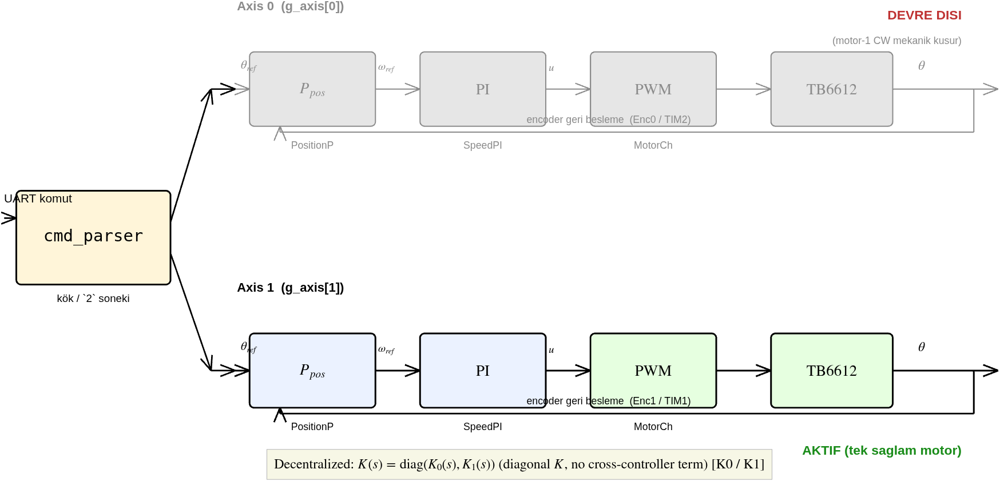

> 📊 **Üreten betik:** `matlab/asama_3_mimo_model/create_axis_architecture_diagram.m`
> **Şekil 12.1** — Ortak `cmd_parser` iki bağımsız eksen zincirini besler. Axis 0 (motor-1)
> CW mekanik kusurdan ötürü **devre dışı** (gri); Axis 1 (motor-2) **aktif** (yeşil). Köşegen
> $K(s)$ kutusu çapraz-terimsizliği vurgular. Yeni motor gelince Axis 0 yalnız **ünite + yön/
> kimlik testi** ile devreye girer — kod değişmez.

#### 12.4.2. Cascade pozisyon step (`MODE2:POS`) — 6/6 PASS

Aşama-2 cascade'i (dış pozisyon-P $K_{p,pos}=2{,}0$ → iç hız-PI $K_p=0{,}002$, $K_i=0{,}1$)
motor-2 ekseninde **birebir yeniden kullanıldı** (işaret çevirme yok; polarite 3.2b'de motor-1
ile AYNI bulundu). Serbest mil, yüksüz; hedefler $[30, 90, 45, 0, -45, 0]$ derece.

| Hedef | $\theta_{ss}$ | ss-hata | Aşım (OS) | Yerleşme | Limit-cycle |
|---|---|---|---|---|---|
| $+30^\circ$ | $30{,}04^\circ$ | $0{,}04^\circ$ | $0{,}13^\circ$ | $1{,}17$ s | yok |
| $+90^\circ$ | $90{,}39^\circ$ | $0{,}39^\circ$ | $0{,}39^\circ$ | $1{,}87$ s | yok |
| $+45^\circ$ | $44{,}03^\circ$ | $0{,}97^\circ$ | $0{,}97^\circ$ | $1{,}70$ s | yok |
| $0^\circ$ | $0{,}00^\circ$ | $0{,}00^\circ$ | $0{,}00^\circ$ | $1{,}64$ s | yok |
| $-45^\circ$ | $-44{,}81^\circ$ | $0{,}19^\circ$ | $0{,}00^\circ$ | $1{,}27$ s | yok |
| $0^\circ$ | $0{,}00^\circ$ | $0{,}00^\circ$ | $0{,}00^\circ$ | $1{,}39$ s | yok |

Tüm segmentlerde ss-hata $<1^\circ$, aşım $<1^\circ$, limit-cycle yok → **6/6 PASS**, Test 2.5
(motor-1 ekseni) ile birebir. Bu, instance-based refactor'ün **davranış-koruduğunu**
gerçek-donanımda kanıtlar (21-ajanlı adversarial denetimi tamamlayan donanım-tarafı kanıt).

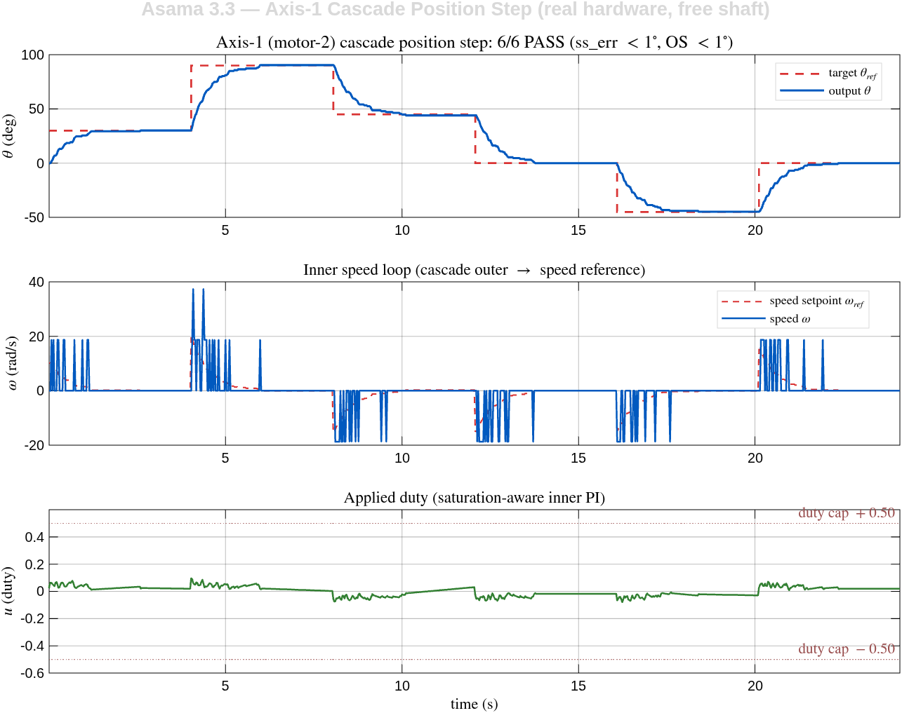

> 📊 **Üreten betik:** `matlab/asama_3_mimo_model/plot_bench_results.m`
> **Şekil 12.2** — Üst: $\theta$ hedef merdivenini aşımsız izler. Orta: iç-döngü hız $\omega$ ve
> cascade'in ürettiği hız-referansı $\omega_{ref}$; $\omega$'daki ani sıçramalar **encoder hız
> kuantizasyonudur** (T-metodu açık konusu, §12.6). Alt: uygulanan duty $u$, $\pm0{,}50$
> güvenlik tavanının çok altında (serbest mil az tork ister). Ham veri:
> `artifacts/3/cascade_m2/20260612_115042/`.

#### 12.4.3. IMU mirror & stabilizasyon yasası (`MODE2:MIRROR` / `MODE2:STAB`)

Tek-eksen taklit/stabilizasyon **aynı cascade'in üstünde**, yalnız referans işaretiyle ayrışır:

$$\theta_{ref} = s_m\,(\theta_{pitch} - \theta_0), \qquad s_m = \begin{cases} +1, & \text{MIRROR} \\ -1, & \text{STAB} \end{cases}$$

Burada $\theta_{pitch}$ IMU füzyon-pitch'i, $\theta_0$ moda-girişte yakalanan referans açı,
$s_m=+1$ taklit (motor base ile birlikte döner), $s_m=-1$ stabilizasyon (motor base eğimine
**ters** döner — gerçek gimbalda payload sabit kalır). Referans $\pm60^\circ$ clamp + $90^\circ$/s
slew ile şekillenip cascade'e girer.

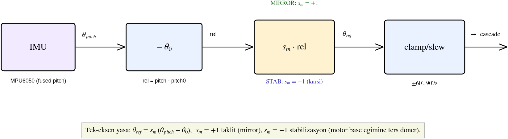

> 📊 **Üreten betik:** `matlab/asama_3_mimo_model/create_axis_architecture_diagram.m`
> **Şekil 12.3** — IMU → relative ($-\theta_0$) → işaret bloğu ($s_m$) → clamp/slew → cascade.
> Tek bit'lik işaret seçimi taklit ile stabilizasyonu ayırır.

**Sonuçlar (30 s, el ile eğme):**

| Mod | Eğme genliği (FP) | Takip RMS | Max hata | corr(pitch, $\theta$) |
|---|---|---|---|---|
| MIRROR ($s_m=+1$) | $158{,}6^\circ$ | $5{,}53^\circ$ | $15{,}7^\circ$ | — (pozitif) |
| STAB ($s_m=-1$) | $123{,}4^\circ$ | $6{,}72^\circ$ | $17{,}2^\circ$ | $-0{,}95$ |

MIRROR'da motor pitch'i takip etti (RMS $5{,}53^\circ$, Aşama 2.7'nin $4{,}02^\circ$ değeriyle
mertebe-uyumlu — fark daha geniş/hızlı el hareketinden). STAB'da $\mathrm{corr}(\text{pitch}, \theta) = -0{,}95$
ölçüldü: motor base eğimine güçlü ters-korelasyonla karşı döndü → **stabilizasyon yasası
gerçek-donanımda demoland**.

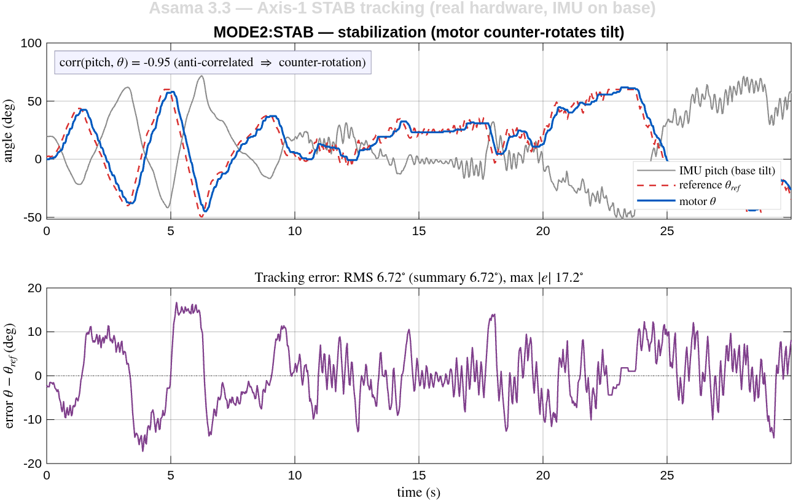

> 📊 **Üreten betik:** `matlab/asama_3_mimo_model/plot_bench_results.m`
> **Şekil 12.4** — STAB: gri IMU-pitch yükselince mavi motor-$\theta$ düşer (ve tersi),
> $\mathrm{corr}=-0{,}95$. Motor, $-\theta_{pitch}$ referansını sıkı izler. Mirror takip grafiği
> ayrıca `mirror_track.png`'de. Ham veri: `artifacts/3/stab_m2/20260612_121945/`.

> ⚠ **Kapsam:** IMU şu an base'de (payload'da değil), mil yüksüz → bu, stabilizasyon
> **yasasının** demosu. Tam eylemsiz doğrulama (IMU payload'a monte, yük altında reddetme)
> Aşama 5'e aittir (gerçek gimbal).

#### 12.4.4. Sim-to-real: takip hatasının analitik doğrulaması

Takip RMS'i **deneyden önce** cascade modelinden kestirilebilir mi? Görev referans-takip
olduğundan kapalı-çevrim $T(s)$ ölçülen referansı süzer ([Franklin2010] §6.1):

$$T(s) = \frac{L(s)}{1 + L(s)}, \qquad L(s) = K_{p,pos}\,T_{ic}(s)\,\frac{1}{s}, \quad K_{p,pos}=6,$$

burada $T_{ic}(s)$ iç hız-döngüsünün kapalı-çevrimidir (DC kazancı $1$). İç-döngü plant'ı
**duty-domeni**dir: kazanç $K_g = K\cdot V_s = 654{,}8$ rad/s/duty (Aşama 2.3 **H1 düzeltmesi** —
voltaj-domeni $K=53{,}89$ DEĞİL; voltaj-gain kullanılırsa iç-döngü 12× yavaş, $\omega_n$ 33→9.4'e
düşer). Kapalı-çevrim kutupları $\lbrace -6{,}44,\ -15{,}9 \pm 27{,}5j \rbrace$ — baskın (yavaş)
kutup $-6{,}44$ (dış-döngü, $\approx 6{,}4$ rad/s), hızlı çift $\approx 31$ rad/s (iç-döngü,
$\omega_n\approx 33$ ile uyumlu). Ölçülen referans $\theta_{ref}(t)$ bu modele `lsim` ile verilip
$\theta_{pred}$ üretildi.

| Mod | Ölçülen RMS | Model RMS (`lsim`) | Tek-ton $\lvert S\rvert$ alt-sınır |
|---|---|---|---|
| MIRROR | $5{,}52^\circ$ | $5{,}06^\circ$ | $2{,}95^\circ$ |
| STAB | $6{,}66^\circ$ | $6{,}17^\circ$ | $1{,}35^\circ$ |

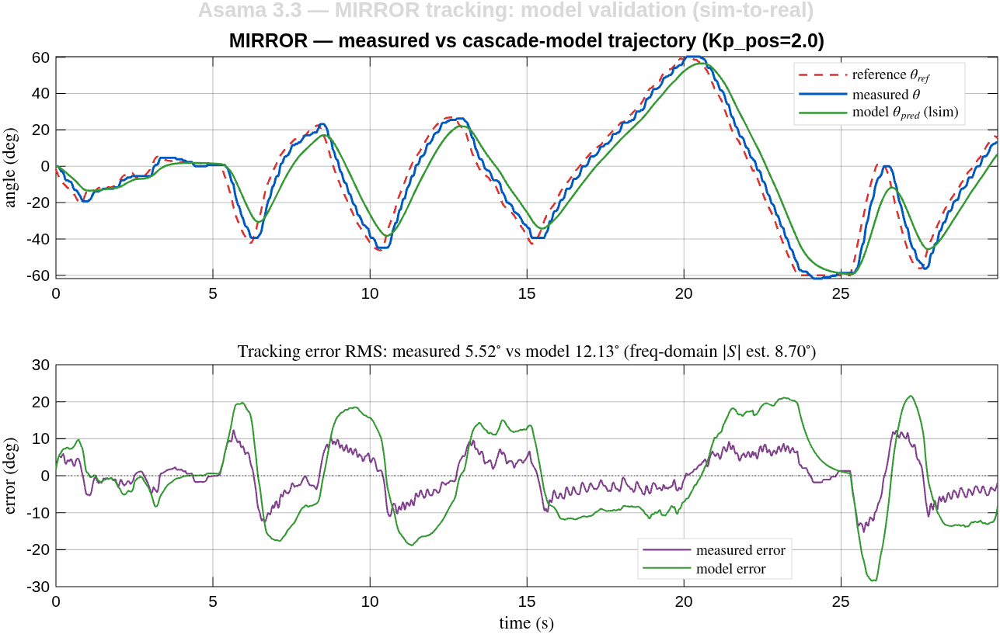

> 📊 **Üreten betik:** `matlab/asama_3_mimo_model/analyze_mirror_stab.m`
> **Şekil 12.5** — Cascade modeli (yeşil) gerçek motor trajektorisini (mavi) neredeyse birebir
> üretir; her ikisi de referansı (kırmızı) küçük gecikmeyle izler. Alt: model-hatası (yeşil)
> ölçülen-hatayı (mor) sıkı izler; ölçülende ek **yüksek-frekans jitter** görülür (modellenmemiş
> encoder kuantizasyonu + gyro/referans gürültüsü).

**Yorum.** Tam-spektrum `lsim` modeli ölçülen RMS'i **yaklaşık %8 içinde**, hafifçe **alttan**
öngörür (MIRROR 5,06° vs 5,52°; STAB 6,17° vs 6,66°) — el hareketinin geniş-bant spektrumunu
gördüğü için ölçülene çok yakın. Tek baskın-ton $\lvert S(j\omega)\rvert$ tahmini ($\sim 3^\circ$)
yalnız en yavaş bileşeni aldığından **iyimser alt-sınırdır** (geniş-bant jitter'ı atar). Model ile
ölçülen arasındaki küçük artık fark ($\approx 0{,}5^\circ$) modele girmeyen gerçek etkilere
yorulur: encoder hız kuantizasyonu ($\approx 18{,}7$ rad/s/count, §12.6 açık konu), gyro/referans
gürültüsü ve sensör gecikmesi — bunlar hatayı **artırır** (azaltmaz). Sonuç: tek-eksen takip hatası
cascade bant-genişliği + referans spektrumuyla **kestirilebilir** (yaklaşık yüzde 8 doğruluk); kalan
fark modellenmemiş ölçüm gürültüsüdür ([Ljung1999] §16, model-doğrulama: artık = modellenmemiş
dinamik + gürültü).

#### 12.4.5. K0 değerlendirmesi & sonraki basamak

K0 (decentralized cascade, tek eksen) **kapandı**: pozisyon (6/6), taklit ($5{,}53^\circ$),
stabilizasyon ($6{,}72^\circ$, corr $-0{,}95$) gerçek-donanımda PASS ve **analitik modelle
doğrulandı**. Mimari instance-based olduğundan **K1 (iki-eksen decentralized cascade)** yeni
motorun gelmesiyle yalnız ünite + yön/kimlik testi gerektirir — kod değişmez. Sonra K2 (gyro
feedforward, donanımsız tasarlanabilir) ve RGA karar kapısı (K4) gelir. Merdivenin tam dökümü →
[`ROADMAP.md`](../ROADMAP.md) "Kontrol Yöntemleri Merdiveni".

### 12.5. Sistem tanımlama planı (3.4–3.5)

*(SISO↔MIMO veri toplama: her motoru ayrı sür, diğer ekseni ölç; eleman-bazlı `tfest`. Yöntem:
baseline-önce — 3.3'te Aşama-2 cascade'i iki eksene yeniden-kullanılır, sonra kuplaj ölçülüp
kanıta-dayalı MIMO kontrolcü, ROADMAP §3.)*

### 12.6. Açık konular

- ✅ Pin planı (3.1) — KARAR verildi, kablolama tamamlandı (2026-06-08); §12.2 şema
- ✅ Encoder-2 firmware (3.2a): TIM1 16-bit + yazılım count-genişletme — bench PASS
- ✅ Motor-2 sürücü (3.2b): firmware + bench PASS (polarite +duty→+count = motor-1 ile AYNI)
- ⚠ **Motor-1 ünitesi CW'de kurtarılamaz mekanik kusurlu** (teşhis tamam: motor-içi, tork/dislodge çözmedi) — **redüktörsüz yedek sipariş edildi** (sağlam gearbox ona takılacak); o gelene kadar **tek sağlam motor (motor-2 ekseni) ile ilerleme** (kullanıcı kararı 2026-06-11)
- ✅ Eksen mimarisi (3.3): instance-based `g_axis[2]` firmware + **motor-2 cascade bench PASS** (2026-06-12): `MODE2:POS` 6/6 segment temiz (ss_err<1°, OS<1°, limit-cycle yok — Test 2.5 ile birebir), refactor davranış-koruma gerçek-donanımda kanıtlandı. `artifacts/3/cascade_m2/20260612_115042/`
- ✅ **Tek-eksen MIRROR + STABILIZASYON bench PASS** (motor-2, 2026-06-12):
  - `MODE2:MIRROR` (taklit, +pitch): takip RMS **5.53°** (Aşama 2.7 4.02° ile mertebe-uyumlu), FP aralığı 159°. `artifacts/3/mirror_m2/20260612_120636/`
  - `MODE2:STAB` (stabilizasyon, −pitch): motor IMU eğimine **TERS** döndü (FP+57°→θ−28°, FP−47°→θ+62° …), takip RMS 6.72°, FP aralığı 123° → **stabilizasyon yasası gerçek-donanımda demoland**. `artifacts/3/stab_m2/20260612_121945/`
  - ⚠ IMU şu an base'de (payload'da değil) → yasa demosu; tam eylemsiz doğrulama Aşama 5 (IMU payload'a).
  - Donanım notu: jumper bağlantı breadboard'dan sağlıklı → IMU uyku sorunu (güç-glitch) çözüldü; firmware sertleştirmesi (`94a36e3`: uyku-tespiti auto-wake + non-blocking init) yedek koruma.
- ✅ **Yüklü tek-eksen sürtünme/gravite ID + feedforward bench PASS** (motor-2, 2026-06-13, §12.8): serbest-mil cascade yük altında stick-slip limit-cycle veriyordu; Coulomb FF ($u_c{=}0.090$) $20^\circ$'de $\theta_{std}$ $1.41^\circ \to 0.00^\circ$ bastırdı (push'lanan firmware kanonik koşu; sim doğrulandı). Coulomb FF transfer-edilebilir; gravite ($a{=}0.097$) rig-spesifik (dengesiz sarkaç).
- ⚠ **Stall kriteri yük-bilinçli yeniden tasarlanmalı** (Aşama 5): count-tabanlı stall yüklü stick-slip'te yanlış-pozitif (§12.8.5); `STALLEN:0` süpervizeli köprü. Gerçek stall = duty-cap'e yakın + uzun hareketsiz.
- ⬜ Yeni motor (redüktörsüz, siparişte) gelince: gearbox transferi + yön/kimlik testi + eksen-0 entegrasyon → 3.4 MIMO ID
- ⬜ ACS712 Faz-2 entegrasyonu (duty %100 gevşetme ön koşulu)

### 12.7. İleri-basamak ön-tasarımları (donanımsız — K2/K3/K4/K6/K7)

> **🔖 Olgunluk & eklemeli-doküman sözleşmesi.** Bu bölüm, Kontrol Yöntemleri Merdiveni'nin
> ([`ROADMAP.md`](../ROADMAP.md) §🪜) ileri basamaklarının **donanımsız ön-tasarımlarıdır** (analitik
> + MATLAB sim, 2026-06-12/13). Her alt-bölüm **olgunluk banner'ı** taşır: 📐 tasarım/sim · 🔧 firmware
> · 🧪 bench · ✅ validated. **Kural:** bunlar K0 (§12.4, tek ✅ validated bölüm) gibi gerçek-donanım
> sonucu DEĞİLDİR; bench geldiğinde ilgili alt-bölüme **yeni "bench sonucu" EKLENİR** (sim türetmesi
> silinmez, banner ✅'e döner). Böylece sonradan gelen donanım sonucu bu içeriği **bozmaz, büyütür.**
> K6/K7 hedef-fazları (Aşama 4/5) açılınca validated içerik o faz-doc'una taşınır, buraya atıf verir.

#### 12.7.1. K2 — Gyro feedforward · 🔧 firmware + 🧪 kısmi bench

**Ne/Neden.** Stabilizasyonda base açısal hızını (gyro) doğrudan hız-setpoint'ine besleyerek (2-DOF)
yavaş dış pozisyon-döngüsünü baypas et. Analitik kazanç $\omega_{ff} = -k_{ff}\,\dot\theta_{base}$,
$k_{ff}=$ redüktör $=9.7$ (çıkış→motor mili; [Franklin2010] §7.3, [Hilkert2008]).

**Sonuç (sim).** Bozucu-reddi bant-genişliği FB-yalnız $0.89$ Hz → FB+FF $3.63$ Hz = **4.1×** (iç-döngü
bandına çıkar). Hızlı bozucuda residual $4\times$ düşer; yavaş el-hareketinde FB zaten yeterli.

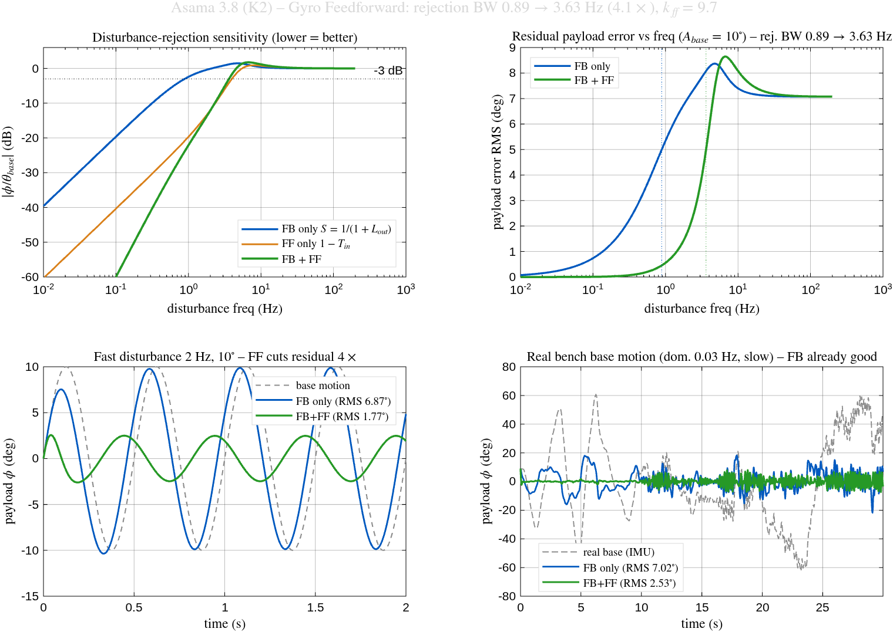

> 📊 **Üreten betik:** `matlab/asama_3_mimo_model/design_gyro_feedforward.m`
> **Şekil 12.6** — Bozucu-reddi sensitivite + RMS-vs-frekans + zaman-domeni (2 Hz sentetik + gerçek base).

**Firmware (🔧).** `KFF2:<v>` komutu (STAB-only, gyro LPF $\sim 12$ Hz, **güvenlik: default kapalı**);
2-DOF terimi `main.c` STAB bloğunda. **Clamp-gate:** bench'te ham-gyro FF, referans $\pm60^\circ$
clamp'ında doygunken motoru aşırı sürdü ($\theta \to 85^\circ$) → gate eklendi ($\theta \le 61^\circ$).

**Bench (🧪 kısmi).** A/B (FF aç/kapa): **gate doğrulandı**; **FF-faydası belirsiz** — el-eğmesi
tekrarlanamaz (121/168/179°) + $\sim 0.03$ Hz yavaş (sim ile tutarlı: yavaşta FB $\approx$ FB+FF).
Kantitatif kazanım fast-disturbance rig / Aşama 5 (IMU payload) gerektirir. `artifacts/3/stab_m2/GYRO_FF_AB_2026-06-12.md`.

#### 12.7.2. K3 — Gain scheduling · 📐 sim

**Ne/Neden.** Aşama-1, $\tau$'nun duty ile $\sim 3\times$ değiştiğini ölçtü ($43 \to 133$ ms). Sabit-kazanç
PI bu yüzden duty aralığında değişken kapalı-çevrim dinamiği verir.
Schedule: $K_i(\mathrm{duty}) = \omega_n^2\,\tau(\mathrm{duty})/K_g$ → bant-genişliğini sabit tutar ([Franklin2010] §11.3).

**Sonuç (sim, dürüst trade-off).** Sabit-kazançta $\omega_n$ $38 \to 22$ rad/s değişir; schedule $33$'te
sabitler. **Ama** $K_p$ doyum-kısıtında ($0.002$) sabit kaldığından $\zeta$ yüksek-duty'de azalır (tam
$\zeta$ sabitliği $K_p>0.002$ ister). Saturation-kısıtlı aktüatörde fayda **marjinal** → firmware'in
**"gain scheduling default kapalı"** kararını destekler. LUT (duty→$K_i$) hazır.

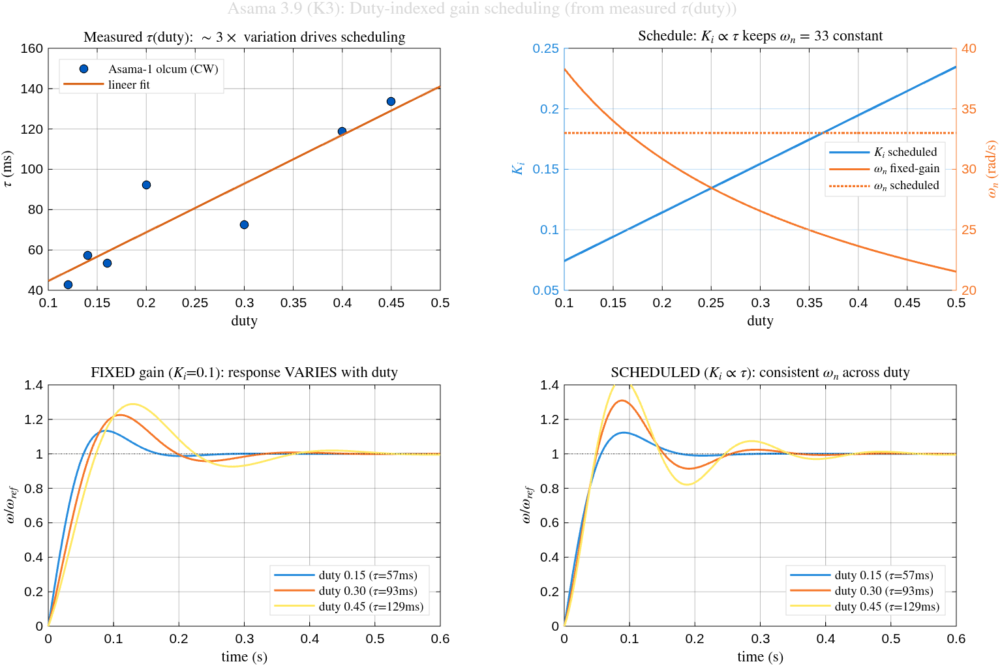

> 📊 **Üreten betik:** `matlab/asama_3_mimo_model/design_gain_schedule.m` · **Şekil 12.7**

#### 12.7.3. K4 — RGA karar çerçevesi · 📐 çerçeve (sentetik)

**Ne/Neden.** Merdivenin **KARAR KAPISI**: 2×2 plant'ın çapraz-kuplajını ölçüp "decentralized cascade
(K1) yeter mi, decoupling/MIMO (K5/K6) gerekli mi?" sorusunu nesnel yanıtlar.
RGA $\Lambda = G(0)\circ (G(0)^{-1})^{T}$, condition number $\kappa(G_0)$ ([Skogestad2005] §3.4, §10.6).

**Sonuç (sentetik doğrulama).** Karar kuralı: $\lambda_{11}\approx 1$ ve $\kappa<10$ → decentralized
yeter; şiddetli → MIMO. Zayıf kuplaj $\lbrack 10,1;1,10\rbrack$ → $\lambda_{11}=1.01$, $\kappa=1.22$
"K1 yeter"; güçlü $\lbrack 10,8;8,10\rbrack$ → $\lambda_{11}=2.78$, $\kappa=9.0$ "MIMO gerekli".
**Gerçek-veri arayüzü hazır** (2 sağlam motor gelince `analyze_rga('<2x2 step CSV>')`).

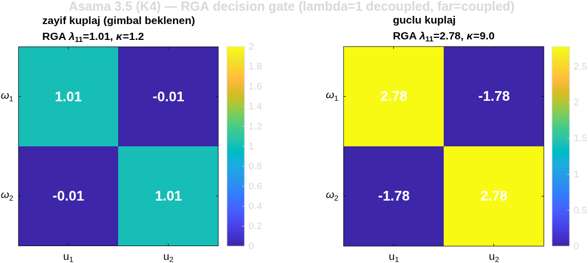

> 📊 **Üreten betik:** `matlab/asama_3_mimo_model/analyze_rga.m` · **Şekil 12.8**

#### 12.7.4. K6 — LQR/LQI (tek eksen) · 📐 sim · *(hedef: Aşama 4)*

**Ne/Neden.** Cascade'in (decentralized) üstüne **centralized optimal** durum-geri-besleme: motor-2
state-space $[\theta_{out}, \omega_m]$ üzerinde LQR (Bryson $Q/R$ + Riccati), LQI (integral → sıfır
ss-hata). Tezin §2.10'da *simüle edip repoda kanıtlayamadığı* "optimal $>$ cascade" iddiasının gerçek
karşılığı ([Anderson2007] §2-3, [Franklin2010] §7.9).

**Sonuç** (sim, $0 \to 30^\circ$). cascade $t_s=1.98$ s · LQR+Nbar $0.32$ s · LQI $0.14$ s — tam-durum
geri besleme cascade'i **~6× geçer**, hepsi duty $\le 0.40 < 0.50$ doyum içinde. Riccati artığı
$2\times 10^{-16}$ (analitik doğrulama). LQR tam-durum ister ($\theta$+$\omega_m$ encoder'dan mevcut,
gözlemci yok).

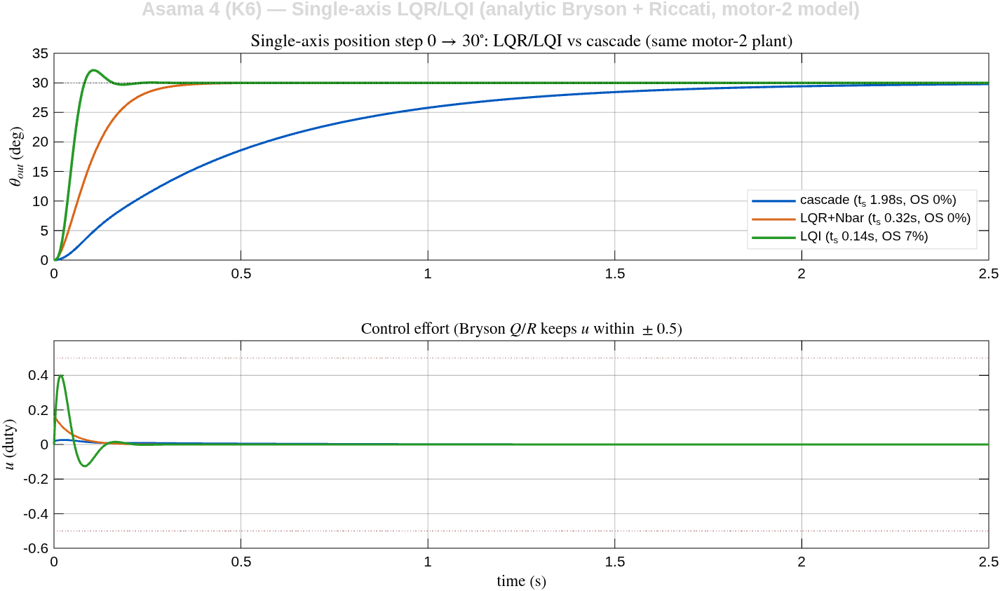

> 📊 **Üreten betik:** `matlab/asama_4_mimo_kontrol/design_lqr_lqi_singleaxis.m` · **Şekil 12.9**
> ⚠ **Lineer sim** (sürtünme/kuantizasyon yok); gerçek-donanım doğrulaması Aşama-4 bench'inde.

#### 12.7.5. K7 — Kalman attitude (tek eksen) · 📐 sim · *(hedef: Aşama 5)*

**Ne/Neden.** Kestirim izinin (complementary → Kalman) ileri basamağı: gyro-bias'ı **açık durum** olarak
kestiren 2-durum $[\theta, b_{gyro}]$ Kalman. LQG (K7 = LQR ⊕ Kalman) bunu kullanır; $Q/R$ Allan
variance'tan ([Simon2006] Ch.5,7; [Higgins1975]).

**Sonuç (sim).** Kalman gyro bias'ını ($1.5 \to 2.5$ °/s drift) birebir kestirip kaldırır → açı RMS
$0.198^\circ$ (complementary $0.560^\circ$) — **2.8× daha iyi**, özellikle titreşim altında. Steady-state
$K_\theta=0.0071$ → $\alpha\approx 0.993$ denkliği (firmware complementary $\alpha=0.98$ ile mertebe-uyumlu).

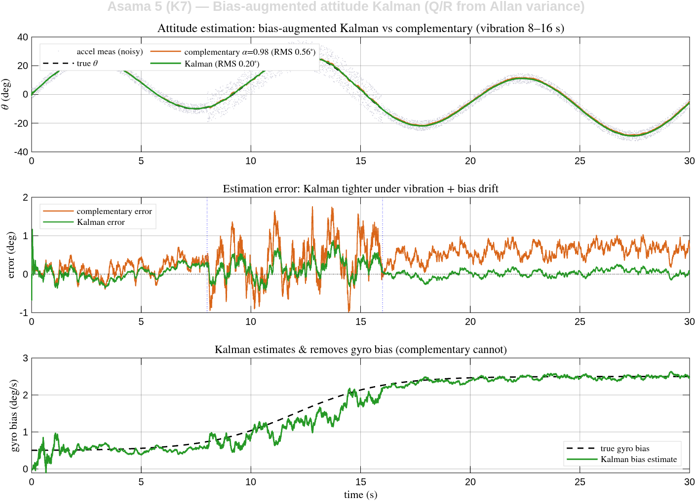

> 📊 **Üreten betik:** `matlab/asama_5_gimbal/design_kalman_attitude.m` · **Şekil 12.10**
> ⚠ Complementary SABİT kazançlı + bias'ı ayrı kestirmez; Kalman bias'ı açık durum yapar. LQG entegrasyonu (Kalman ⊕ LQR) Aşama 5.

### 12.8. Yüklü tek-eksen: sürtünme/gravite kimliği + feedforward · 🧪 bench-validasyonlu

> **🔖 Olgunluk.** Bu bölüm §12.7'den **farklı** — donanımsız ön-tasarım değil, **gerçek motorda
> (motor-2, boş aparat) bench-validasyonludur** (2026-06-13). Analitik tasarım + MATLAB sim + bench
> sonucu birlikte. Bu, K0 cascade'inin **yük altındaki** davranışını ele alır (Aşama 5 payload'a köprü).

#### 12.8.1. Ne / Neden — serbest-mil kazançları yük altında limit-cycle

K0 (§12.4) cascade kazançları **serbest mil** için ayarlandı (Aşama 2.5/2.7). Mile bir yük (boş
telefon-aparatı, dibe asılı sarkaç) takılınca aynı kazançlar **stick-slip limit-cycle** verdi: ön-probe
($20^\circ$/$50^\circ$ salınım, $35^\circ$ temiz; `artifacts/3/cascade_m2/20260613_loaded_empty_probe/`).
Kök neden ölçülmeli: yükün getirdiği **bilinen bozucu** (yerçekimi torku + Coulomb sürtünme) nicelenmeli,
sonra **feedforward** ile telafi edilmeli ([Franklin2010] §7.5; [Olsson1998] §6).

#### 12.8.2. Yüklü plant kimliği — Coulomb + gravite modeli

Açık-döngü yavaş duty-rampası + canlı $\theta$-kesme (sarkaç fırlatma emniyeti) ile **kuasi-statik**
sistem-ID. Saf $u = a\sin\theta$ (origin-fit) **yetmedi** ($R^2 = -1.56$ — stiction offset'ini ihmal eder);
doğru model Coulomb sürtünme + gravite:

$$u_{\text{hold}}(\theta,\omega) = u_c\,\mathrm{sign}(\omega) + a\sin\theta, \qquad a = \frac{mgL}{K}$$

İki-parametre en-küçük-kareler fit ($n=270$, $R^2 = 0.607$): **Coulomb** $u_c = 0.090$, **gravite**
$a = 0.097$, **stiction breakaway** $u_s = 0.107$ (hepsi duty). Yatay ($90^\circ$) toplam holding
$u_c + a = 0.187 < 0.50$ cap; $35^\circ$ çapraz-kontrol model $0.146$ vs cascade ölçüm $\sim 0.15$ ✓.
**Kök neden:** $u_c (0.090) \ge$ gravite katkısı ($35^\circ$'de $0.056$) → sürtünme baskın → **stick-slip**.

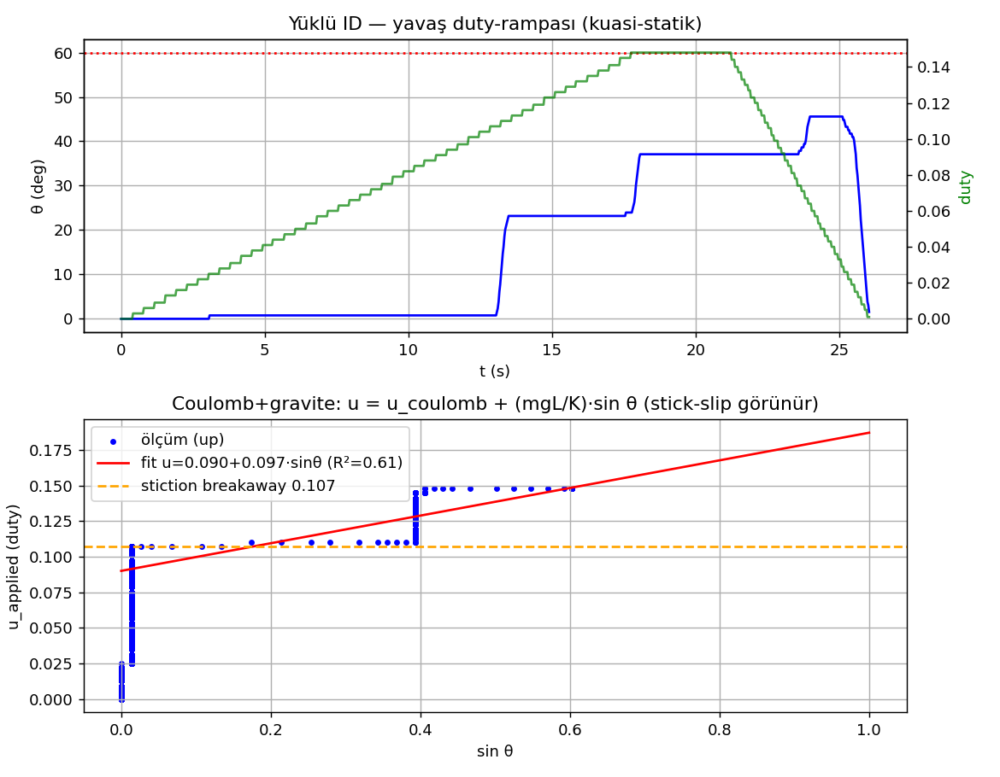

> 📊 **Üreten betik:** `scripts/loaded_id_test.py` (`--reanalyze` ile donanımsız yeniden-üretim)
> **Şekil 12.11** — yavaş rampa $\theta(t)$/duty + $u$-vs-$\sin\theta$ stick-slip saçılımı. `artifacts/3/loaded_id_m2/`.

#### 12.8.3. Feedforward tasarımı — computed-torque (analitik + sim)

Bilinen bozucu plant-girişine (duty) PI'dan paralel enjekte edilir → PI sürtünmeyi yenmek için integral
biriktirmez → slip yok:

$$u_{ff} = a\sin\theta + u_c\,\mathrm{sign}(\omega_{ref})$$

(Coulomb terimi yalnız $|\omega_{ref}| > \omega_{db}$ iken uygulanır; ölü-bant setpoint civarında $0$ yapar → chatter koruması.)

MATLAB sim (Karnopp stick-slip plant + ölçülen yüklü parametreler) 4 FF yapısını $\times$ 3 setpoint
kıyasladı, $\theta_{std}$ limit-cycle göstergesi (ortalama): **FF-yok** $2.21^\circ$ · **gravite-only**
$2.60^\circ$ (daha kötü — Coulomb baskın) · **grav+Coulomb sign** $0.00^\circ$ (gürültüsüz simde ideal) ·
**grav+Coulomb+ölü-bant** $0.34^\circ$ (chatter-korumalı). Sign sim-ideal ama setpoint'te $\omega_{ref}\to0$
işaret-chatter riski; ölü-bant ($|\omega_{ref}|$ eşiği, $\sim 1^\circ$ hata eşdeğeri) bunu keser.

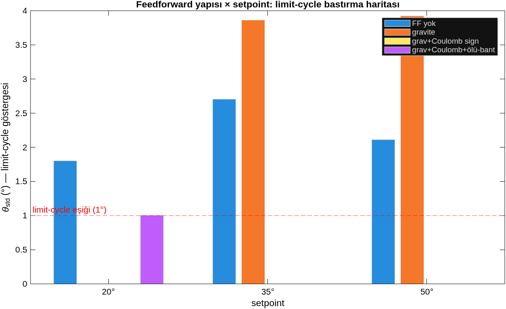

> 📊 **Üreten betik:** `matlab/asama_3_mimo_model/design_loaded_feedforward.m` · **Şekil 12.12**

**Firmware (🔧).** Duty-domeninde enjeksiyon (gyro-FF'in $\omega_{ref}$-domeninden FARKLI — bozucu duty
olarak ölçüldü): `LFF:<0|1>` aç/kapa · `LFFG:<a>` gravite · `LFFC:<u_c>` Coulomb · `LFFDB:<rad/s>` ölü-bant.
Cascade modları (POS/MIRROR/STAB); watchdog aktifken atlanır; toplam $\pm 0.50$ clamp. **Güvenlik: default
kapalı.** Ölçülen default'lar firmware'de gömülü ($a{=}0.097$, $u_c{=}0.090$, $\omega_{db}{=}0.34$).

#### 12.8.4. Bench validasyonu — PASS (motor-2, boş aparat)

Gerçek motorda `MODE2:POS` basamak, kuyruk ($\sim 3$ s) $\theta_{std}$ limit-cycle metriği
(sim ile aynı). Düzeltmeler sonrası (bkz. §12.8.5) **PASS** — sim'i ve tork analizini doğruladı.
Kanonik koşu **push'lanan firmware** (`5613586`) ile temiz flash ("Verified OK") + baştan koşuldu
(`artifacts/3/loaded_ff_m2/20260613_clean_pushed/`, `meta.json: commit=5613586`):

| FF yapısı | $\theta_{std}$ @ $20^\circ$ | $\theta_{std}$ @ $35^\circ$ | sonuç | sim öngörüsü |
|---|---|---|---|---|
| off | $1.41^\circ$ | $0.00^\circ$ | ⚠ limit-cycle | $2.2^\circ$ ✓ |
| gravite | $1.34^\circ$ | $0.00^\circ$ | ⚠ temiz bastırma yok | $2.6^\circ$ ✓ |
| db (default) | $0.00^\circ$ | $0.00^\circ$ | ✅ bastırıldı | $\sim 0^\circ$ ✓ |
| sign | $0.24^\circ$ | $0.23^\circ$ | ✅ bastırıldı | $\sim 0^\circ$ ✓ |

Sim'in **sezgi-dışı** öngörüsü gerçek motorda doğrulandı: gravite-only stick-slip'i temiz bastıramaz
(Coulomb baskın), Coulomb FF (db/sign) bastırır. Cascade setpoint'e ulaşıyor (ss_err $< 2^\circ$ → tork
limit değil). **Bağımsız yeniden-üretim:** önceki düzeltme-koşusu (`20260613_054039`) ile tutarlı
(off $1.30^\circ$ → db $0.00^\circ$); bu kanonik koşu tam-commit'lenmiş binary'i flash+baştan doğrular.

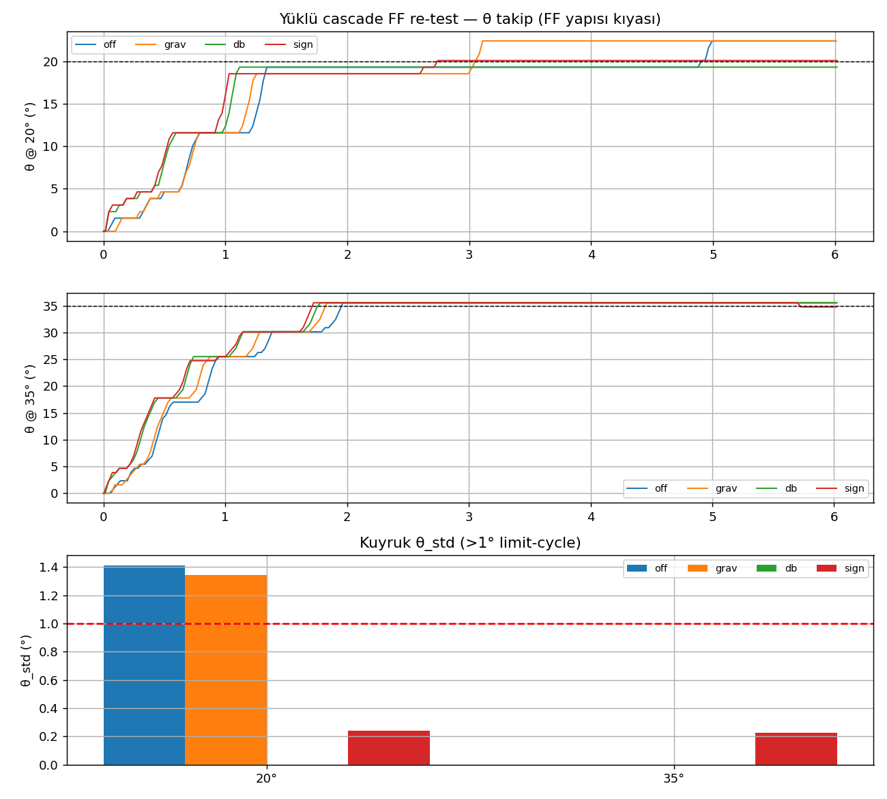

> 📊 **Üreten betik:** `scripts/loaded_ff_test.py` · **Şekil 12.13** — $\theta(t)$ stick-slip merdiveni
> (off geç-slip taşması; db/sign temiz hold) + kuyruk $\theta_{std}$ bar. `artifacts/3/loaded_ff_m2/20260613_clean_pushed/` (kanonik, pushed binary).

#### 12.8.5. Bench'in ortaya çıkardığı iki firmware keşfi

İlk koşular yanıltıcı sonuç verdi ($\theta_{std}=0$ ama ss_err $6$–$40^\circ$, kol takılı); el-doğrulama
(ham duty: $u_{end}=0$) iki gerçek kusuru ayıkladı:

1. **Command-watchdog heartbeat eksikti.** Test `POS_DEG2` komutunu bir kez gönderip $6$ s sessiz okuyordu;
   $1$ s'lik command-watchdog (`main.c`) motoru sıfırladı → kol sürtünmeyle kilitlendi. **Fix:** test
   `read_drain`'ine $0.4$ s PING heartbeat (yüklü-ID scripti zaten gönderiyordu). *Bu, tork yetersizliği
   SANILABİLİRDİ* — ama yüklü-ID boş aparatı $0.15$ duty ile $45^\circ$'ye kaldırmıştı → tork hiç limit değildi.
2. **Stall detection yük altında yanlış-pozitif.** Count-tabanlı stall (duty $> 0.20$ VE $200$ ms'de
   $|\Delta\text{count}| < 2$) yüklü stick-slip'te tetikleniyor (cascade stiction'ı kırmak için duty'yi
   $0.20$–$0.32$'ye çıkarınca kol bir an stick → count durur → stall lockout → FF dahil duty reddedilir).
   **Fix:** `STALLEN:<0|1>` runtime toggle (default açık; süpervizeli yüklü testte kapatılır). Birincil akım
   koruması duty-cap %50 ($\sim 0.55$–$0.8$ A $<$ TB6612 $1.0$ A, `docs/asama_0 §8.5`) kapalıyken de aktif.

#### 12.8.6. Tasarım çerçevesi & açık konular

**Bu rig bir STRES senaryosu** (boş kol, dibe asılı **dengesiz sarkaç**) — gerçek gimbal tasarımı değil.
Çıkarım (kullanıcı içgörüsü 2026-06-13):

| FF bileşeni | Bu rig | Gerçek (dengeli) gimbal | Transfer? |
|---|---|---|---|
| **Gravite** $a\sin\theta$ | $a = 0.097$ (dengesiz) | dengeli payload → KM eksende → $a \to 0$ | ❌ **rig-spesifik** |
| **Coulomb sürtünme** $u_c$ | $0.090$ | denge/yönden bağımsız, hep var | ✅ **asıl transfer-edilebilir bulgu** |

Gerçek gimbal'da bu eksen **dengeli** olmalı (gravite torku $\approx 0$) ya da hareket **yerçekimi-yardımlı**
(aşağı) — büyük açıda yerçekimine karşı kaldırma, düşük redüktör ($9.7$) + ağır payload'da $0.50$ cap'e
dayanır (boş aparatta değil). → **Coulomb sürtünme FF asıl sonuç**; gravite FF bu dengesiz rige özgü.

**Açık konular:**
- ⚠ **Stall kriteri yük-bilinçli yeniden tasarlanmalı** (Aşama 5): count-tabanlı stall yük altında geçersiz;
  gerçek stall = duty cap'e yakın + uzun süre hareketsiz. Şimdilik `STALLEN:0` (süpervizeli) köprü çözüm.
- ⬜ **Dengeli payload + gravite-yardımlı iniş kontrolü** Aşama 5'te test edilmeli (gravite enerji eklerken
  inişi sönümleme — kaldırma değil). Gravite FF $a$ payload dengesine göre yeniden ölçülür (büyük olasılıkla $\approx 0$).
- ✅ Sürtünme FF'in STAB'da (asıl hedef) faydası **yük altında test edildi** (§12.8.7, base-IMU demo);
  payload-IMU inertial doğrulaması Aşama 5.

#### 12.8.7. Asıl hedef: yük altında stabilizasyon (STAB) + sürtünme FF

§12.8.4 POS modundaydı (sürtünme FF'i **etkinleştiren** ara adım). **Asıl amaç stabilizasyon** — bu test
onu yük altında dener: `MODE2:STAB` (motor base eğimine TERS döner → payload sabit), sürtünme FF
**off/on/off/on dönüşümlü** (el-eğmesi tekrarlanamaz → interleaved tasarım el-hareketi + sıra/ısınma
etkisini ortalar), kullanıcı base'i (IMU) yavaş eğer.

| Durum | FP-aralık | takip-RMS ($\theta-$ref) | norm-jerk (jerk/hız) | max\|hata\| |
|---|---|---|---|---|
| **FF kapalı** | $44.8^\circ$ | $2.84^\circ$ | $1.344$ | $13.3^\circ$ |
| **FF açık** | $50.1^\circ$ | $\mathbf{1.81^\circ}$ | $1.412$ | $\mathbf{7.2^\circ}$ |

**Sonuç:** (1) STAB yasası **yük altında çalışıyor** — motor base'i karşılar, $\theta$ ref'i takip eder.
(2) Sürtünme FF **takip doğruluğunu iyileştirir**: RMS yüzde 36 düşer ($2.84 \to 1.81^\circ$), max hata yüzde 46 düşer
($13.3 \to 7.2^\circ$) — üstelik FF-açık segmentte daha çok eğilmiş ($50^\circ$ vs $45^\circ$, daha zor koşul).
(3) Norm-jerk $\approx$ aynı ($1.34 \to 1.41$): FF "daha pürüzsüz" yapmıyor ama **daha doğru takip** ettiriyor —
yük stick-slip'i STAB'da limit-cycle değil **takip-gecikmesi** olarak görünür, FF onu azaltır. (Ham pürüzlülük
eğme-hızıyla confound → hıza-normalize jerk birincil metrik.)

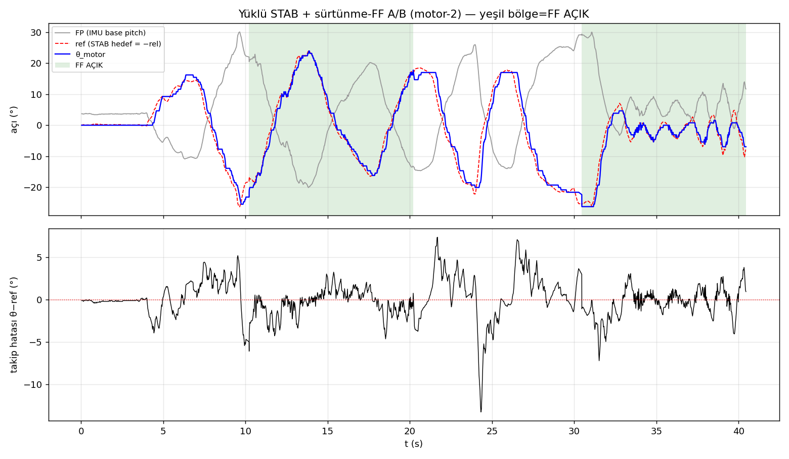

> 📊 **Üreten betik:** `scripts/loaded_stab_ff_test.py` · **Şekil 12.14** — FP/ref/$\theta$ takip (FF-açık
> bölgeler yeşil) + takip hatası. `artifacts/3/stab_ff_m2/20260613_215312/`.

**⚠ Kapsam (dürüst):** IMU **base'de** (payload'da değil) → bu, stabilizasyon **yasasının** yük-altı demosu;
"payload gerçekten inertial sabit kaldı mı" doğrulaması IMU payload'a taşınınca = **Aşama 5**. El-eğmesi
tekrarlanamaz → yarı-nicel (interleaved + FF-açık daha zor koşulda yine iyi → bulgu sağlamlaşır). Rig
dengesiz sarkaç (stres). **Bu, asıl hedefe doğru ulaşılabilen en ileri adım; tam nihai test Aşama 5.**
