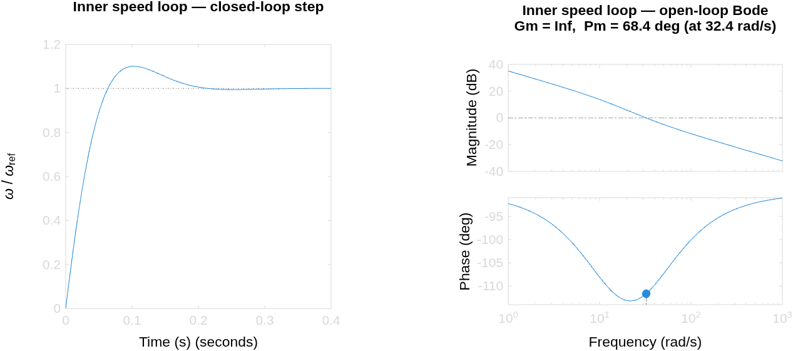
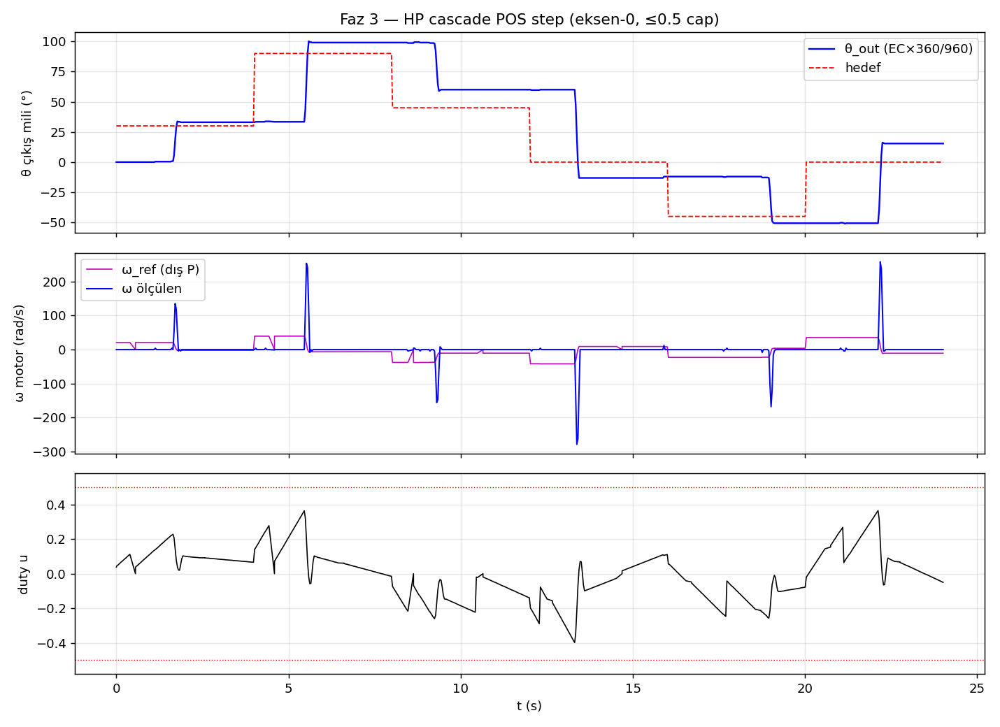
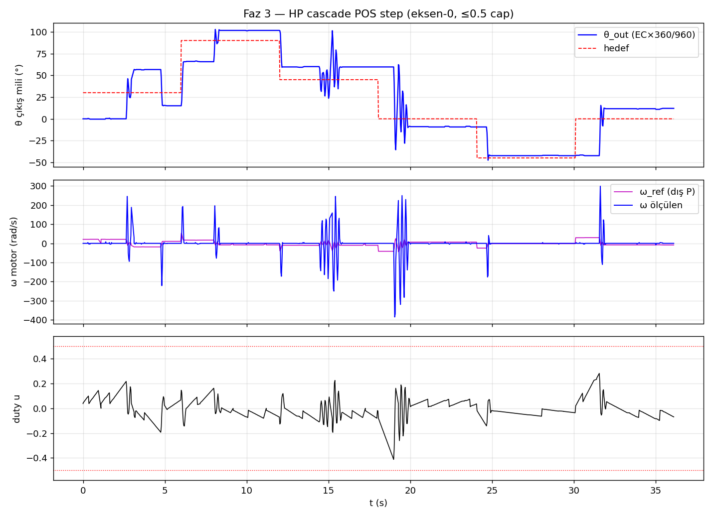

# Aşama 3 — İki Motor MIMO Modelleme

> **Durum:** ✅ KAPALI (2026-06-07 açıldı, 2026-06-24 yüksüz kapandı — tag `asama-3-kapali`, main'e `--no-ff` merge). Sıradaki: Aşama 5 (yüklü gimbal). Önceki branch `feature/asama-3-mimo-model`.
> Bu belge ders-kitabı disipliniyle (Ne/Neden/Nasıl/Nerede/Sonuç — global CLAUDE.md)
> aşama ilerledikçe doldurulur. Ortak teori kavramları → [`00_genel_bakis.md`](00_genel_bakis.md).

## 12. Aşama 3 — İki Motor MIMO

### 12.1. Ne / Neden (vizyon)

İkinci motor + encoder eklenir; **çapraz kuplaj** (motor 1 sürülürken motor 2 ekseninde
etki) karakterize edilir: 2×2 transfer matrisi $G(s)$, RGA analizi (`[Skogestad2005] §10`),
condition number → decoupling potansiyeli. Aşama 4 (MIMO kontrol/LQG) bu modelin üzerine kurulur.

### 12.2. Donanım — Tam Sistem Şeması (3.1 ✅ ONAYLANDI 2026-06-07)

Bu bölüm **tüm 2-motor MIMO sisteminin** bağlantı şemasıdır (MCU + 2 sürücü + 2 motor +
IMU + güç). Tek-motor (Aşama 0–2) görünümü [`asama_0_altyapi.md`](asama_0_altyapi.md) §8.1'dedir
ama **güncel ve eksiksiz şema burasıdır.** Tüm eşleşmeler `STM32F411_functions_map.csv`
(`[STM32F411_DS]` sf 38-52 AF tablosu) ile teyitli. Kısıtlar: PA4–PA7 (SPI-flash footprint,
`[WeAct_BP]`), PA0 (KEY), PB2 (BOOT1), PA13/14 (SWD).

> 📐 **Tam bağlantı şeması + master pin tablosu + renk-renk kablolama → [`00_donanim_semasi.md`](00_donanim_semasi.md)**
> (tek yaşayan donanım kaynağı — ACS712 Faz-2 rezervi dahil). Bu bölüm yalnız **motor-2 pin
> seçim gerekçelerini** tutar (gerekçe fazda, veri donanım belgesinde — tek doğruluk kaynağı).

**Motor-2 pin gerekçeleri:** Encoder-2 → **TIM1 (PA8/PA9)** — TIM2 enc-1'de dolu, TIM3 PWM'de
dolu, TIM4 PB6/7=I2C ✗, TIM5 PA0=KEY ✗ → tek temiz quadrature timer; PWM-2 → **PB1=TIM3_CH4**
(motor-1 ile aynı timer, aynı 20 kHz ARR, bağımsız CCR — ekstra timer harcamaz); AIN1/AIN2 →
**PB4/PB5** (PB4=JTRST yalnız SW-DP modunda serbest kalır, `[RM0383]` §23.3; PB5 zaten JTAG
pini değil → genel-amaçlı IO olarak baştan serbest); STBY-2 → **PB10 ayrı** (eksen-bağımsız
acil kesme; paylaşımlı-PB14 reddedildi — bir eksenin stall'ı diğerini söndürmesin, kullanıcı
kararı 2026-06-07). ACS712 → **PA1/PA2 (ADC1) rezerv** (Faz-2, henüz bağlı değil — donanım §5).

**Kaveat:** TIM1 **16-bit** (enc-1'in TIM2'si 32-bit'ti) → 466 count/devirde ±70 çıkış devrinde
sarar → encoder-2'de **yazılım count-genişletme** (int16 delta extension) — `src/encoder.c`
`Encoder2_GetCount` (3.2'de eklendi).

### 12.3. Firmware — Encoder-2 + Motor-2 sürücü + eksen mimarisi (3.2–3.3)

**3.2a — Encoder-2 (✅ bench PASS).** TIM1 (PA8/PA9) 16-bit quadrature + **yazılım 32-bit
genişletme** (int16 delta birikimi, wrap-safe): TIM1 16-bit'tir (enc-1'in TIM2'si 32-bit'ti),
466 count/devirde ±70 çıkış devrinde sarar; `Encoder2_GetCount` her okumada delta'yı 32-bit
akümülatöre ekler. Telemetri alanı **`EC2`**. Bench: EC2 her iki yönde 4843 count menzili,
çapraz-konuşma (motor-1 sürülürken EC2 kayması) 0 → `artifacts/3/enc2_test/`. Nerede:
`src/encoder.c` `Encoder2_Init/GetCount/Reset`.

**3.2b — Motor-2 sürücü (firmware ✅, bench testi bekliyor).**

- **Ne:** 2. TB6612'nin A-kanalı için **minimal açık-döngü** sürücü — `Motor2_Init/Enable/
  SetDutySigned/Stop/EmergencyStop` (`src/motor.c`). PWM **PB1=TIM3_CH4**, motor-1 ile **aynı
  `htim3`** üzerinde (bağımsız CCR, ekstra timer yok); yön **PB4/PB5** (GPIO), STBY-2 **PB10**.
- **Neden minimal (stall yok):** 3.2b yalnız yön/kimlik doğrulaması ister. Stall-detection +
  shared-struct refactor **3.3 baseline'a** ertelendi (motor-2 kapalı-döngüye geçince, her iki
  motor da stall'a ihtiyaç duyduğunda tek-kaynak refactor değerlendirilir). Sertifikalı motor-1
  kodu **dokunulmadı** (sıfır regresyon). Emniyet: watchdog (1 sn komutsuz → her iki motor durur)
  + duty-cap %50 (stall ≤0.8 A < TB6612 1.0 A, `[TB6612_DS]` sf 3) + denetimli kısa sürüş.
- **Nasıl kullanılır:** `DUTY2:<signed>` komutu (mod-bağımsız, rampasız, ±%50 clamp); telemetri
  alanı **`U2`** (motor-2 uygulanan signed duty) → EC2 ile yön korelasyonu. `STOP`/`RESET`/watchdog
  motor-2'yi de durdurur.
- **Doğrulama testi (kimlik/yön):** `scripts/motor2_sign_test.py` — motor-1'i referans sürer,
  motor-2'yi ±duty'de sürer, **polariteyi ampirik saptar** (motor-2 duty→encoder işareti motor-1
  ile **AYNI mı TERS mi**). Bu, 3.3 baseline'da Aşama-2 cascade'inin geri-besleme işareti için
  kritik: ters polarite → pozitif geri besleme → kaçış. PASS = motor-2 iki yönde döndü + işaretler
  zıt + ref döndü (FALSE-PASS önleme: ölü motor PASS vermez). Çıktı: `artifacts/3/motor2_sign/`.
- **Build:** PASS (Flash %8.4). **Bench (2026-06-09):** Motor-2 ✅ **PASS** — `DUTY2:±0.30`'da
  +1203 / −1199 count/s (simetrik, temiz), EC2 her iki yönde takip etti; **polarite +duty→+count
  = motor-1 ile AYNI** → 3.3 baseline'da Aşama-2 cascade'i motor-2'ye **işaret çevirmeden**
  yeniden kullanılabilir. `artifacts/3/motor2_sign/20260609_175520/`.

**3.3 — Instance-based eksen mimarisi (firmware ✅, 2026-06-11).** Tek-motor-ilerleme kararı
(aşağıdaki bulgu kutusu) üzerine tüm kontrol/güvenlik modülleri **instance-based** refactor edildi
(commit `9def197`): `SpeedPI_t`/`PositionP_t`/`SpeedFilter_t`/`MotorCh_t` + `axis.h` `g_axis[2]`
eksen demeti. **Cascade + MIRROR artık eksen-1'de (motor-2) bugün kullanılabilir** — komutlar
kök+`2` sonekiyle eksen-1'e yönlenir (`MODE2:POS`, `POS_DEG2:`, `KPP2:` …); eski komutlar
eksen-0'a (geriye uyumlu). Motor-2 böylece **stall-detection da kazandı** (3.2b'de ertelenen).
Telemetri eski alanları birebir korur + `OMEGA2/SP2/TR2` (10/10 script regex'i doğrulandı —
mevcut bench scriptleri değişmeden çalışır). Davranış-koruma: **21-ajanlı adversarial denetim**
(eski-HEAD vs yeni, her bulgu bağımsız doğrulama) 3 gerçek farkı yakaladı → 2'si düzeltildi
(RESET'te düşen motor-2 Stop; geçersiz `MODE:X`'in watchdog'u beslemesi), 1'i bilinçli kabul
(`DUTY2` artık eksen-1 DUTY-modu şartlı — `MODE2:POS`'tayken açık-döngü komutu cascade ile
çakışamaz; eski mod-bağımsız 3.2b semantiğinin güvenli daraltılması). Yeni motor entegrasyonu:
yalnız ünite değişir + yön/kimlik testi — **kod değişikliği gerekmez**.

> **⚠ Bench bulgusu — motorların karakteri farklı:** Rewire'da fiziksel roller değişti —
> Aşama 1-2'de karakterize edilen **sağlıklı ünite şimdi motor-2** (K=53.89, τ=60.5 ms; bench'te
> de iki yön simetrik). **Motor-1 fiziksel ünitesinde yöne-bağlı mekanik kusur var:** CCW serbest
> döner (−2065 count/s) ama **CW yönünde 0.50 duty'de bile periyodik takılır** (fit-fit, sürekli
> stall'a düşer; elle de bir yön belirgin zor). Görünür dış engel yok → gearbox-içi asimetri.
> Derin teşhis (2026-06-09/11): yüksek tork (0.8 duty) catch'i AŞMADI (tork↑ → CW rate↓:
> 165→40 count/s — stiction değil, sert mekanik blok); gearbox çıkarılınca da bind sürdü
> (motor-içi); dislodge/agitasyon çözmedi; CCW 2.5 sn'de 26.5 tur pürüzsüz → sargı/sürücü sağlam.
> **Kurtarılamaz — iki-yönlü kontrol için ünite değişmeli.**
>
> **Karar (kullanıcı, 2026-06-11):** Aynı motorun **redüktörsüzü sipariş edildi**; sağlam gearbox
> ona takılacak (eksen mekanik birebir korunur). O gelene kadar **proje TEK SAĞLAM MOTOR
> (motor-2 ekseni) üzerinden ilerletilip tamamlanır** — 3.3 instance-based mimari bunu sağlar.
> Yeni motor gelince: yön/kimlik testi (`motor2_sign_test.py` benzeri) + entegrasyon; kod değişmez.
>
> **⚠ SÜPERSEDED (2026-06-14/15):** yeni motorlar GELDİ, asimetrik eşleme — HP=Motor1/HW-039/BTS7960/20:1
> + LP=Motor2/TB6612/9.7:1; kusurlu eski motor-1 değiştirildi; HP §12.12'de (rijit re-char §12.13.5)
> karakterize. tek-sağlam-motor stratejisi kapandı.

### 12.4. K0 Kapanışı — gerçek-donanım sonuçları & sim-to-real analizi

> **Kontrol Yöntemleri Merdiveni'nde K0 ✅** (decentralized cascade, tek eksen). Bu bölüm,
> 3.3 firmware'inin gerçek-donanımda (tek sağlam motor = motor-2 ekseni) ürettiği üç sonucu
> — cascade pozisyon, IMU mirror, IMU stabilizasyon — ders-kitabı disipliniyle kapatır ve
> takip hatasını **analitik cascade modeliyle doğrular** (sim-to-real).

#### 12.4.1. Instance-based eksen mimarisi: decentralized $K(s)$

3.3 refactor'ü tüm kontrol/güvenlik modüllerini **örnek-bazlı** (instance-based) yaptı:
`SpeedPI_t`, `PositionP_t`, `SpeedFilter_t`, `MotorCh_t` yapıları + `axis.h` içinde
`Axis_t g_axis[2]` eksen demeti (`9def197`). Her eksen kendi cascade zincirini (pozisyon
$P$ → hız PI → PWM → encoder geri besleme) **bağımsız** taşır; komutlar kök/`2` sonekiyle
ilgili eksene yönlenir.

Kontrol-kuramsal okuma: iki-eksenli kontrolcü matrisi $K(s)$ burada **köşegen** (diagonal)
seçilmiştir,

$$K(s) = \mathrm{diag}\left(K_0(s),\,K_1(s)\right),$$

yani her eksen yalnız kendi hatasından sürülür; çapraz (off-diagonal) kontrolcü terimi
**yoktur**. Bu, cascade PID'nin "SISO" değil, MIMO $K(s)$'in **decentralized (merkezi-olmayan)
formu** olduğu anlamına gelir ([Skogestad2005] §10.6.4). Merdivendeki K0 (tek eksen) ve K1
(iki eksen) **aynı** decentralized yapıdır; fark yalnız etkin eksen sayısıdır. Gerçek yöntem
sıçraması (decentralized → centralized) ileride RGA karar kapısından (K4) sonra LQR'de (K6) gelir.

> 📊 **Üreten betik:** `matlab/asama_3_mimo_model/create_axis_architecture_diagram.m`
> **Şekil 12.1** — Ortak `cmd_parser` iki bağımsız eksen zincirini besler. Axis 0 (motor-1)
> CW mekanik kusurdan ötürü **devre dışı** (gri); Axis 1 (motor-2) **aktif** (yeşil). Köşegen
> $K(s)$ kutusu çapraz-terimsizliği vurgular. Yeni motor gelince Axis 0 yalnız **ünite + yön/
> kimlik testi** ile devreye girer — kod değişmez.

#### 12.4.2. Cascade pozisyon step (`MODE2:POS`) — 6/6 PASS

Aşama-2 cascade'i (dış pozisyon-P $K_{p,pos}=2{,}0$ → iç hız-PI $K_p=0{,}002$, $K_i=0{,}1$)
motor-2 ekseninde **birebir yeniden kullanıldı** (işaret çevirme yok; polarite 3.2b'de motor-1
ile AYNI bulundu). Serbest mil, yüksüz; hedefler $[30, 90, 45, 0, -45, 0]$ derece.

| Hedef | $\theta_{ss}$ | ss-hata | Aşım (OS) | Yerleşme | Limit-cycle |
|---|---|---|---|---|---|
| $+30^\circ$ | $30{,}04^\circ$ | $0{,}04^\circ$ | $0{,}13^\circ$ | $1{,}17$ s | yok |
| $+90^\circ$ | $90{,}39^\circ$ | $0{,}39^\circ$ | $0{,}39^\circ$ | $1{,}87$ s | yok |
| $+45^\circ$ | $44{,}03^\circ$ | $0{,}97^\circ$ | $0{,}97^\circ$ | $1{,}70$ s | yok |
| $0^\circ$ | $0{,}00^\circ$ | $0{,}00^\circ$ | $0{,}00^\circ$ | $1{,}64$ s | yok |
| $-45^\circ$ | $-44{,}81^\circ$ | $0{,}19^\circ$ | $0{,}00^\circ$ | $1{,}27$ s | yok |
| $0^\circ$ | $0{,}00^\circ$ | $0{,}00^\circ$ | $0{,}00^\circ$ | $1{,}39$ s | yok |

Tüm segmentlerde ss-hata $<1^\circ$, aşım $<1^\circ$, limit-cycle yok → **6/6 PASS**, Test 2.5
(motor-1 ekseni) ile birebir. Bu, instance-based refactor'ün **davranış-koruduğunu**
gerçek-donanımda kanıtlar (21-ajanlı adversarial denetimi tamamlayan donanım-tarafı kanıt).

> 📊 **Üreten betik:** `matlab/asama_3_mimo_model/plot_bench_results.m`
> **Şekil 12.2** — Üst: $\theta$ hedef merdivenini aşımsız izler. Orta: iç-döngü hız $\omega$ ve
> cascade'in ürettiği hız-referansı $\omega_{ref}$; $\omega$'daki ani sıçramalar **encoder hız
> kuantizasyonudur** (T-metodu açık konusu, §12.6). Alt: uygulanan duty $u$, $\pm0{,}50$
> güvenlik tavanının çok altında (serbest mil az tork ister). Ham veri:
> `artifacts/3/cascade_m2/20260612_115042/`.

#### 12.4.3. IMU mirror & stabilizasyon yasası (`MODE2:MIRROR` / `MODE2:STAB`)

Tek-eksen taklit/stabilizasyon **aynı cascade'in üstünde**, yalnız referans işaretiyle ayrışır:

$$\theta_{ref} = s_m\,(\theta_{pitch} - \theta_0), \qquad s_m = \begin{cases} +1, & \text{MIRROR} \\ -1, & \text{STAB} \end{cases}$$

Burada $\theta_{pitch}$ IMU füzyon-pitch'i, $\theta_0$ moda-girişte yakalanan referans açı,
$s_m=+1$ taklit (motor base ile birlikte döner), $s_m=-1$ stabilizasyon (motor base eğimine
**ters** döner — gerçek gimbalda payload sabit kalır). Referans $\pm60^\circ$ clamp + $90^\circ$/s
slew ile şekillenip cascade'e girer.

> 📊 **Üreten betik:** `matlab/asama_3_mimo_model/create_axis_architecture_diagram.m`
> **Şekil 12.3** — IMU → relative ($-\theta_0$) → işaret bloğu ($s_m$) → clamp/slew → cascade.
> Tek bit'lik işaret seçimi taklit ile stabilizasyonu ayırır.

**Sonuçlar (30 s, el ile eğme):**

| Mod | Eğme genliği (FP) | Takip RMS | Max hata | corr(pitch, $\theta$) |
|---|---|---|---|---|
| MIRROR ($s_m=+1$) | $158{,}6^\circ$ | $5{,}53^\circ$ | $15{,}7^\circ$ | — (pozitif) |
| STAB ($s_m=-1$) | $123{,}4^\circ$ | $6{,}72^\circ$ | $17{,}2^\circ$ | $-0{,}95$ |

MIRROR'da motor pitch'i takip etti (RMS $5{,}53^\circ$, Aşama 2.7'nin $4{,}02^\circ$ değeriyle
mertebe-uyumlu — fark daha geniş/hızlı el hareketinden). STAB'da $\mathrm{corr}(\text{pitch}, \theta) = -0{,}95$
ölçüldü: motor base eğimine güçlü ters-korelasyonla karşı döndü → **stabilizasyon yasası
gerçek-donanımda demoland**.

> 📊 **Üreten betik:** `matlab/asama_3_mimo_model/plot_bench_results.m`
> **Şekil 12.4** — STAB: gri IMU-pitch yükselince mavi motor-$\theta$ düşer (ve tersi),
> $\mathrm{corr}=-0{,}95$. Motor, $-\theta_{pitch}$ referansını sıkı izler. Mirror takip grafiği
> ayrıca `mirror_track.png`'de. Ham veri: `artifacts/3/stab_m2/20260612_121945/`.

> ⚠ **Kapsam:** IMU şu an base'de (payload'da değil), mil yüksüz → bu, stabilizasyon
> **yasasının** demosu. Tam eylemsiz doğrulama (IMU payload'a monte, yük altında reddetme)
> Aşama 5'e aittir (gerçek gimbal).

#### 12.4.4. Sim-to-real: takip hatasının analitik doğrulaması

Takip RMS'i **deneyden önce** cascade modelinden kestirilebilir mi? Görev referans-takip
olduğundan kapalı-çevrim $T(s)$ ölçülen referansı süzer ([Franklin2010] §6.1):

$$T(s) = \frac{L(s)}{1 + L(s)}, \qquad L(s) = K_{p,pos}\,T_{ic}(s)\,\frac{1}{s}, \quad K_{p,pos}=6,$$

burada $T_{ic}(s)$ iç hız-döngüsünün kapalı-çevrimidir (DC kazancı $1$). İç-döngü plant'ı
**duty-domeni**dir: kazanç $K_g = K\cdot V_s = 654{,}8$ rad/s/duty (Aşama 2.3 **H1 düzeltmesi** —
voltaj-domeni $K=53{,}89$ DEĞİL; voltaj-gain kullanılırsa iç-döngü 12× yavaş, $\omega_n$ 33→9.4'e
düşer).

> ⚠ **Mod-bağımlı kazanç (2026-06-17 düzeltmesi).** Firmware $K_{p,pos}$'u moda göre atar: **MIRROR/STAB
> takip** modunda $6$ (`cmd_parser.c:66` — mod girişinde `PositionP_SetGain(6.0)`, ayrı `KPP` komutu
> gerekmez; analitik $K_v$ tasarımı, Aşama 2.7), **POS step** modunda $2.0$ (`main.c:162` default,
> konservatif). Mirror/STAB bench koşuları `MODE:STAB`/`MIRROR` ile alındı → gerçekte $K_{p,pos}=6$
> **koştu.** (2026-06-14'te commit `121ffd6` bunu yanlışlıkla "$2.0$ koştu" sanıp modeli geçici $2.0$'a
> çekmişti — `git log -S`'i yalnız `main.c`'de koşturup `cmd_parser.c:66`'yı kaçırdı; §12.9.3 düzeltti.)

Mirror/STAB kazancı $K_{p,pos}=6$ ile kapalı-çevrim kutupları
$\lbrace -6{,}44,\ -15{,}86 \pm 27{,}49j \rbrace$ — baskın (yavaş) kutup $-6{,}44$ (dış-döngü,
$\approx 1{,}03$ Hz), hızlı çift $\approx 31{,}7$ rad/s (iç-döngü, $\omega_n\approx 33$ ile uyumlu).
Ölçülen referans $\theta_{ref}(t)$ bu modele `lsim` ile verilip $\theta_{pred}$ üretildi.

| Mod | Ölçülen RMS | Model `lsim` ($K_{p,pos}{=}6$) | Uyum | baskın ref → $\lvert S\rvert$ tahmin |
|---|---|---|---|---|
| MIRROR | $5{,}52^\circ$ | $\mathbf{5{,}06^\circ}$ | model %8 alttan | $0{,}067$ Hz, $\pm 60^\circ$ → $2{,}95^\circ$ |
| STAB | $6{,}66^\circ$ | $\mathbf{6{,}17^\circ}$ | model %7 alttan | $0{,}033$ Hz, $\pm 55^\circ$ → $1{,}35^\circ$ |

> 📊 **Üreten betik:** `matlab/asama_3_mimo_model/analyze_mirror_stab.m`
> **Şekil 12.5** — Gerçek runtime kazancı $K_{p,pos}=6$ ile cascade modeli (yeşil), ölçülen
> trajektoriyi (mavi) yakından izler ve referansı (kırmızı) takip eder: model RMS
> $5{,}06^\circ$ vs ölçülen $5{,}52^\circ$ (model %8 alttan). Alt: model-hatası (yeşil) ve ölçülen-hata
> (mor) yakın → takip RMS'i nominal cascade modeliyle **öngörülebiliyor** (yorum aşağıda).

**Yorum.** Cascade modeli (gerçek runtime kazancı $K_{p,pos}=6$) ölçülen takip RMS'ini **~%8 içinde**
öngörür (MIRROR model $5{,}06^\circ$ vs ölçülen $5{,}52^\circ$; STAB $6{,}17^\circ$ vs $6{,}66^\circ$).
Model hafif **alttan** kalır — kalan fark modellenmemiş encoder kuantizasyonu, gyro gürültüsü ve nonlineer
sürtünmeden ([Ljung1999] §16: artık = modellenmemiş dinamik + gürültü). **Sonuç: sim-to-real doğrulandı** —
tek-eksen takip RMS'i deneyden önce nominal cascade modelinden kestirilebiliyor. Frekans-domeni
$\lvert S\rvert$ tek-frekans tahmini ($2{,}95$ / $1{,}35^\circ$) ölçüleni alttan verir çünkü yalnız baskın
el-frekansını yakalar; gerçek referans çok-frekanslı olduğundan zaman-domeni `lsim` birincil metriktir.

> ℹ️ **İzlenebilirlik (2026-06-17 düzeltmesi).** Bu bölüm 2026-06-14'te (commit `121ffd6`) yanlışlıkla
> $K_{p,pos}=2.0$'a çekilip "model $2{,}2\times$ aşırı-öngörür, sim-to-real geri çekildi" denmiş ve grafikler
> geriye-dönük yeniden üretilmişti. O teşhis mirror/STAB'ın `cmd_parser.c:66` ile $6$ koştuğunu kaçırdı
> (yalnız `main.c` default $2.0$'a baktı). 2026-06-17 kapsamlı denetimi 4 bağımsız kanıtla düzeltti
> (`cmd_parser.c:66`=6.0f, `git show 288bb82` ffA/ffB build, `loaded_stab_ff_test.py:82` `MODE2:STAB`,
> 121ffd6 commit itirafı): gerçek kazanç $6$, uyum ~%8, **sim-to-real geçerli**. "Efektif kazanç gizemi"
> (§12.6) de bununla **çözüldü** — gizem yoktu, firmware mirror/STAB'da zaten $6$ komutluyor.

#### 12.4.5. K0 değerlendirmesi & sonraki basamak

K0 (decentralized cascade, tek eksen) **kapandı**: pozisyon (6/6), taklit ($5{,}53^\circ$),
stabilizasyon ($6{,}72^\circ$, corr $-0{,}95$) gerçek-donanımda PASS ve **analitik modelle
doğrulandı**. Mimari instance-based olduğundan **K1 (iki-eksen decentralized cascade)** yeni
motorun gelmesiyle yalnız ünite + yön/kimlik testi gerektirir — kod değişmez. Sonra K2 (gyro
feedforward, donanımsız tasarlanabilir) ve RGA karar kapısı (K4) gelir. Merdivenin tam dökümü →
[`ROADMAP.md`](../ROADMAP.md) "Kontrol Yöntemleri Merdiveni".

### 12.5. Sistem tanımlama planı (3.4–3.5)

> **⚠ SÜPERSEDED 2026-06-14/15** (ROADMAP:435/438): yeni motorlar GELDİ, asimetrik eşleme
> (HP=Motor1/HW-039/BTS7960/20:1 + LP=Motor2/TB6612/9.7:1); tek-sağlam-motor stratejisi kapandı,
> HP §12.12–§12.14'te karakterize; asıl MIMO ID (3.4) + K4 RGA + HP-K7 = Aşama 5.

*(SISO↔MIMO veri toplama: her motoru ayrı sür, diğer ekseni ölç; eleman-bazlı `tfest`. Yöntem:
baseline-önce — 3.3'te Aşama-2 cascade'i iki eksene yeniden-kullanılır, sonra kuplaj ölçülüp
kanıta-dayalı MIMO kontrolcü, ROADMAP §3.)*

### 12.6. Açık konular

- ✅ Pin planı (3.1) — KARAR verildi, kablolama tamamlandı (2026-06-08); §12.2 şema
- ✅ Encoder-2 firmware (3.2a): TIM1 16-bit + yazılım count-genişletme — bench PASS
- ✅ Motor-2 sürücü (3.2b): firmware + bench PASS (polarite +duty→+count = motor-1 ile AYNI)
- ⚠ **Motor-1 ünitesi CW'de kurtarılamaz mekanik kusurlu** (teşhis tamam: motor-içi, tork/dislodge çözmedi) — **redüktörsüz yedek sipariş edildi** (sağlam gearbox ona takılacak); o gelene kadar **tek sağlam motor (motor-2 ekseni) ile ilerleme** (kullanıcı kararı 2026-06-11). **⚠ SÜPERSEDED 2026-06-14/15** (ROADMAP:435/438): yeni motorlar GELDİ, asimetrik eşleme (HP=Motor1/HW-039/BTS7960/20:1 + LP=Motor2/TB6612/9.7:1); tek-sağlam-motor stratejisi kapandı, HP §12.12-§12.14'te karakterize.
- ✅ Eksen mimarisi (3.3): instance-based `g_axis[2]` firmware + **motor-2 cascade bench PASS** (2026-06-12): `MODE2:POS` 6/6 segment temiz (ss_err<1°, OS<1°, limit-cycle yok — Test 2.5 ile birebir), refactor davranış-koruma gerçek-donanımda kanıtlandı. `artifacts/3/cascade_m2/20260612_115042/`
- ✅ **Tek-eksen MIRROR + STABILIZASYON bench PASS** (motor-2, 2026-06-12):
  - `MODE2:MIRROR` (taklit, +pitch): takip RMS **5.53°** (Aşama 2.7 4.02° ile mertebe-uyumlu), FP aralığı 159°. `artifacts/3/mirror_m2/20260612_120636/`
  - `MODE2:STAB` (stabilizasyon, −pitch): motor IMU eğimine **TERS** döndü (FP+57°→θ−28°, FP−47°→θ+62° …), takip RMS 6.72°, FP aralığı 123° → **stabilizasyon yasası gerçek-donanımda demoland**. `artifacts/3/stab_m2/20260612_121945/`
  - ⚠ IMU şu an base'de (payload'da değil) → yasa demosu; tam eylemsiz doğrulama Aşama 5 (IMU payload'a).
  - Donanım notu: jumper bağlantı breadboard'dan sağlıklı → IMU uyku sorunu (güç-glitch) çözüldü; firmware sertleştirmesi (`94a36e3`: uyku-tespiti auto-wake + non-blocking init) yedek koruma.
- ✅ **Yüklü tek-eksen sürtünme/gravite ID + feedforward bench PASS** (motor-2, 2026-06-13, §12.8): serbest-mil cascade yük altında stick-slip limit-cycle veriyordu; Coulomb FF ($u_c{=}0.090$) $20^\circ$'de $\theta_{std}$ $1.41^\circ \to 0.00^\circ$ bastırdı (push'lanan firmware kanonik koşu; sim doğrulandı). Coulomb FF transfer-edilebilir; gravite ($a{=}0.097$) rig-spesifik (dengesiz sarkaç).
- ⚠ **Stall kriteri yük-bilinçli yeniden tasarlanmalı** (Aşama 5): count-tabanlı stall yüklü stick-slip'te yanlış-pozitif (§12.8.5); `STALLEN:0` süpervizeli köprü. Gerçek stall = duty-cap'e yakın + uzun hareketsiz.
- ✅ ~~Yeni motor (redüktörsüz, siparişte) gelince: gearbox transferi + yön/kimlik testi + eksen-0 entegrasyon → 3.4 MIMO ID~~ **SÜPERSEDED 2026-06-14/15** (ROADMAP:435/438): yeni motorlar GELDİ, asimetrik eşleme (HP=Motor1/HW-039/BTS7960/20:1 + LP=Motor2/TB6612/9.7:1); HP §12.12-§12.14'te karakterize; asıl MIMO ID (3.4)+K4 RGA+HP-K7 = Aşama 5
- ⬜ ACS712 Faz-2 entegrasyonu (duty %100 gevşetme ön koşulu)
- ✅ $K_{p,pos}$ **mod-bağımlı kazanç (§12.9.3) — ÇÖZÜLDÜ (2026-06-17):** firmware $K_{p,pos}$'u moda göre
  atıyor (POS step $2.0$ `main.c:162`; MIRROR/STAB takip $6$ `cmd_parser.c:66`). Mirror/STAB testleri $6$
  koştu → §12.4.4 sim-to-real **geçerli** (~%8 uyum). 2026-06-14'ün "$2.0$ koştu / geri çekildi" teşhisi
  hataydı (`cmd_parser.c:66` kaçırıldı), 2026-06-17 denetimi düzeltti. **Tuning açığı yok.** Teşhis: `.claude/skills/teshis/`
- ✅ ~~Efektif pozisyon-kazanç açığı~~ **ÇÖZÜLDÜ (2026-06-17) — açık değildi.** 2026-06-14'te "gerçek sistem
  nominal $2.0$'dan $\sim 2{,}2\times$ iyi izliyor, efektif $K_v\approx 6$, kök-neden açık" denmişti. Gerçek
  neden: mirror/STAB zaten $K_{p,pos}=6$ koşuyordu (`cmd_parser.c:66`) — "açık", $2.0$ yanlış varsayımından
  doğan hayalî bir açıktı. $6$'da model ölçüleni ~%8 öngörür (§12.4.4); "firmware hız-yolu trace" **gereksiz.**

### 12.7. İleri-basamak ön-tasarımları (donanımsız — K2/K3/K4/K6/K7)

> **🔖 Olgunluk & eklemeli-doküman sözleşmesi.** Bu bölüm, Kontrol Yöntemleri Merdiveni'nin
> ([`ROADMAP.md`](../ROADMAP.md) §🪜) ileri basamaklarının **donanımsız ön-tasarımlarıdır** (analitik
> + MATLAB sim, 2026-06-12/13). Her alt-bölüm **olgunluk banner'ı** taşır: 📐 tasarım/sim · 🔧 firmware
> · 🧪 bench · ✅ validated. **Kural:** bunlar K0 (§12.4, tek ✅ validated bölüm) gibi gerçek-donanım
> sonucu DEĞİLDİR; bench geldiğinde ilgili alt-bölüme **yeni "bench sonucu" EKLENİR** (sim türetmesi
> silinmez, banner ✅'e döner). Böylece sonradan gelen donanım sonucu bu içeriği **bozmaz, büyütür.**
> K6/K7 hedef-fazları (Aşama 4/5) açılınca validated içerik o faz-doc'una taşınır, buraya atıf verir.

#### 12.7.1. K2 — Gyro feedforward · 🔧 firmware + 🧪 kısmi bench

**Ne/Neden.** Stabilizasyonda base açısal hızını (gyro) doğrudan hız-setpoint'ine besleyerek (2-DOF)
yavaş dış pozisyon-döngüsünü baypas et. Analitik kazanç $\omega_{ff} = -k_{ff}\,\dot\theta_{base}$,
$k_{ff}=$ redüktör $=9.7$ (çıkış→motor mili; [Franklin2010] §7.3, [Hilkert2008]).

**Sonuç (sim).** Bozucu-reddi bant-genişliği FB-yalnız $0.89$ Hz → FB+FF $3.63$ Hz = **4.1×** (iç-döngü
bandına çıkar). Hızlı bozucuda residual $4\times$ düşer; yavaş el-hareketinde FB zaten yeterli.

> 📊 **Üreten betik:** `matlab/asama_3_mimo_model/design_gyro_feedforward.m`
> **Şekil 12.6** — Bozucu-reddi sensitivite + RMS-vs-frekans + zaman-domeni (2 Hz sentetik + gerçek base).

**Firmware (🔧).** `KFF2:<v>` komutu (STAB-only, gyro LPF $\sim 12$ Hz, **güvenlik: default kapalı**);
2-DOF terimi `main.c` STAB bloğunda. **Clamp-gate:** bench'te ham-gyro FF, referans $\pm60^\circ$
clamp'ında doygunken motoru aşırı sürdü ($\theta \to 85^\circ$) → gate eklendi ($\theta \le 61^\circ$).

**Bench (🧪 kısmi).** A/B (FF aç/kapa): **gate doğrulandı**; **FF-faydası belirsiz** — el-eğmesi
tekrarlanamaz (121/168/179°) + $\sim 0.03$ Hz yavaş (sim ile tutarlı: yavaşta FB $\approx$ FB+FF).
Kantitatif kazanım fast-disturbance rig / Aşama 5 (IMU payload) gerektirir. `artifacts/3/stab_m2/GYRO_FF_AB_2026-06-12.md`.

#### 12.7.2. K3 — Gain scheduling · 📐 sim

**Ne/Neden.** Aşama-1, $\tau$'nun duty ile $\sim 3\times$ değiştiğini ölçtü ($43 \to 133$ ms). Sabit-kazanç
PI bu yüzden duty aralığında değişken kapalı-çevrim dinamiği verir.
Schedule: $K_i(\mathrm{duty}) = \omega_n^2\,\tau(\mathrm{duty})/K_g$ → bant-genişliğini sabit tutar ([Franklin2010] §11.3).

**Sonuç (sim, dürüst trade-off).** Sabit-kazançta $\omega_n$ $38 \to 22$ rad/s değişir; schedule $33$'te
sabitler. **Ama** $K_p$ doyum-kısıtında ($0.002$) sabit kaldığından $\zeta$ yüksek-duty'de azalır (tam
$\zeta$ sabitliği $K_p>0.002$ ister). Saturation-kısıtlı aktüatörde fayda **marjinal** → firmware'in
**"gain scheduling default kapalı"** kararını destekler. LUT (duty→$K_i$) hazır.

> 📊 **Üreten betik:** `matlab/asama_3_mimo_model/design_gain_schedule.m` · **Şekil 12.7**

#### 12.7.3. K4 — RGA karar çerçevesi · 📐 çerçeve (sentetik)

**Ne/Neden.** Merdivenin **KARAR KAPISI**: 2×2 plant'ın çapraz-kuplajını ölçüp "decentralized cascade
(K1) yeter mi, decoupling/MIMO (K5/K6) gerekli mi?" sorusunu nesnel yanıtlar.
RGA $\Lambda = G(0)\circ (G(0)^{-1})^{T}$, condition number $\kappa(G_0)$ ([Skogestad2005] §3.4, §10.6).

**Sonuç (sentetik doğrulama).** Karar kuralı: $\lambda_{11}\approx 1$ ve $\kappa<10$ → decentralized
yeter; şiddetli → MIMO. Zayıf kuplaj $\lbrack 10,1;1,10\rbrack$ → $\lambda_{11}=1.01$, $\kappa=1.22$
"K1 yeter"; güçlü $\lbrack 10,8;8,10\rbrack$ → $\lambda_{11}=2.78$, $\kappa=9.0$ "MIMO gerekli".
**Gerçek-veri arayüzü hazır** (2 sağlam motor gelince `analyze_rga('<2x2 step CSV>')`).

> 📊 **Üreten betik:** `matlab/asama_3_mimo_model/analyze_rga.m` · **Şekil 12.8**

#### 12.7.4. K6 — LQR/LQI (tek eksen) · 📐 sim · *(hedef: Aşama 4)*

**Ne/Neden.** Cascade'in (decentralized) üstüne **centralized optimal** durum-geri-besleme: motor-2
state-space $[\theta_{out}, \omega_m]$ üzerinde LQR (Bryson $Q/R$ + Riccati), LQI (integral → sıfır
ss-hata). Tezin §2.10'da *simüle edip repoda kanıtlayamadığı* "optimal $>$ cascade" iddiasının gerçek
karşılığı ([Anderson2007] §2-3, [Franklin2010] §7.9).

**Sonuç** (sim, $0 \to 30^\circ$). cascade $t_s=1.98$ s · LQR+Nbar $0.32$ s · LQI $0.14$ s — tam-durum
geri besleme cascade'i **~6× geçer**, hepsi duty $\le 0.40 < 0.50$ doyum içinde. Riccati artığı
$2\times 10^{-16}$ (analitik doğrulama). LQR tam-durum ister ($\theta$+$\omega_m$ encoder'dan mevcut,
gözlemci yok).

> 📊 **Üreten betik:** `matlab/asama_4_mimo_kontrol/design_lqr_lqi_singleaxis.m` · **Şekil 12.9**
> ⚠ **Lineer sim** (sürtünme/kuantizasyon yok); gerçek-donanım doğrulaması Aşama-4 bench'inde.

#### 12.7.5. K7 — Kalman attitude (tek eksen) · 📐 sim · *(hedef: Aşama 5)*

**Ne/Neden.** Kestirim izinin (complementary → Kalman) ileri basamağı: gyro-bias'ı **açık durum** olarak
kestiren 2-durum $[\theta, b_{gyro}]$ Kalman. LQG (K7 = LQR ⊕ Kalman) bunu kullanır; $Q/R$ Allan
variance'tan ([Simon2006] Ch.5,7; [Higgins1975]).

**Sonuç (sim).** Kalman gyro bias'ını ($1.5 \to 2.5$ °/s drift) birebir kestirip kaldırır → açı RMS
$0.198^\circ$ (complementary $0.560^\circ$) — **2.8× daha iyi**, özellikle titreşim altında. Steady-state
$K_\theta=0.0071$ → $\alpha\approx 0.993$ denkliği (firmware complementary $\alpha=0.98$ ile mertebe-uyumlu).

> 📊 **Üreten betik:** `matlab/asama_5_gimbal/design_kalman_attitude.m` · **Şekil 12.10**
> ⚠ Complementary SABİT kazançlı + bias'ı ayrı kestirmez; Kalman bias'ı açık durum yapar. LQG entegrasyonu (Kalman ⊕ LQR) Aşama 5.

### 12.8. Yüklü tek-eksen: sürtünme/gravite kimliği + feedforward · 🧪 bench-validasyonlu

> **🔖 Olgunluk.** Bu bölüm §12.7'den **farklı** — donanımsız ön-tasarım değil, **gerçek motorda
> (motor-2, boş aparat) bench-validasyonludur** (2026-06-13). Analitik tasarım + MATLAB sim + bench
> sonucu birlikte. Bu, K0 cascade'inin **yük altındaki** davranışını ele alır (Aşama 5 payload'a köprü).

#### 12.8.1. Ne / Neden — serbest-mil kazançları yük altında limit-cycle

K0 (§12.4) cascade kazançları **serbest mil** için ayarlandı (Aşama 2.5/2.7). Mile bir yük (boş
telefon-aparatı, dibe asılı sarkaç) takılınca aynı kazançlar **stick-slip limit-cycle** verdi: ön-probe
($20^\circ$/$50^\circ$ salınım, $35^\circ$ temiz; `artifacts/3/cascade_m2/20260613_loaded_empty_probe/`).
Kök neden ölçülmeli: yükün getirdiği **bilinen bozucu** (yerçekimi torku + Coulomb sürtünme) nicelenmeli,
sonra **feedforward** ile telafi edilmeli ([Franklin2010] §7.5; [Olsson1998] §6).

#### 12.8.2. Yüklü plant kimliği — Coulomb + gravite modeli

Açık-döngü yavaş duty-rampası + canlı $\theta$-kesme (sarkaç fırlatma emniyeti) ile **kuasi-statik**
sistem-ID. Saf $u = a\sin\theta$ (origin-fit) **yetmedi** ($R^2 = -1.56$ — stiction offset'ini ihmal eder);
doğru model Coulomb sürtünme + gravite:

$$u_{\text{hold}}(\theta,\omega) = u_c\,\mathrm{sign}(\omega) + a\sin\theta, \qquad a = \frac{mgL}{K}$$

İki-parametre en-küçük-kareler fit ($n=270$, $R^2 = 0.607$): **Coulomb** $u_c = 0.090$, **gravite**
$a = 0.097$, **stiction breakaway** $u_s = 0.107$ (hepsi duty). Yatay ($90^\circ$) toplam holding
$u_c + a = 0.187 < 0.50$ cap; $35^\circ$ çapraz-kontrol model $0.146$ vs cascade ölçüm $\sim 0.15$ ✓.
**Kök neden:** $u_c (0.090) \ge$ gravite katkısı ($35^\circ$'de $0.056$) → sürtünme baskın → **stick-slip**.

> 📊 **Üreten betik:** `scripts/loaded_id_test.py` (`--reanalyze` ile donanımsız yeniden-üretim)
> **Şekil 12.11** — yavaş rampa $\theta(t)$/duty + $u$-vs-$\sin\theta$ stick-slip saçılımı. `artifacts/3/loaded_id_m2/`.

#### 12.8.3. Feedforward tasarımı — computed-torque (analitik + sim)

Bilinen bozucu plant-girişine (duty) PI'dan paralel enjekte edilir → PI sürtünmeyi yenmek için integral
biriktirmez → slip yok:

$$u_{ff} = a\sin\theta + u_c\,\mathrm{sign}(\omega_{ref})$$

(Coulomb terimi yalnız $|\omega_{ref}| > \omega_{db}$ iken uygulanır; ölü-bant setpoint civarında $0$ yapar → chatter koruması.)

MATLAB sim (Karnopp stick-slip plant + ölçülen yüklü parametreler) 4 FF yapısını $\times$ 3 setpoint
kıyasladı, $\theta_{std}$ limit-cycle göstergesi (ortalama): **FF-yok** $2.21^\circ$ · **gravite-only**
$2.60^\circ$ (daha kötü — Coulomb baskın) · **grav+Coulomb sign** $0.00^\circ$ (gürültüsüz simde ideal) ·
**grav+Coulomb+ölü-bant** $0.34^\circ$ (chatter-korumalı). Sign sim-ideal ama setpoint'te $\omega_{ref}\to0$
işaret-chatter riski; ölü-bant ($|\omega_{ref}|$ eşiği, $\sim 1^\circ$ hata eşdeğeri) bunu keser.

> 📊 **Üreten betik:** `matlab/asama_3_mimo_model/design_loaded_feedforward.m` · **Şekil 12.12**

**Firmware (🔧).** Duty-domeninde enjeksiyon (gyro-FF'in $\omega_{ref}$-domeninden FARKLI — bozucu duty
olarak ölçüldü): `LFF:<0|1>` aç/kapa · `LFFG:<a>` gravite · `LFFC:<u_c>` Coulomb · `LFFDB:<rad/s>` ölü-bant.
Cascade modları (POS/MIRROR/STAB); watchdog aktifken atlanır; toplam $\pm 0.50$ clamp. **Güvenlik: default
kapalı.** Ölçülen default'lar firmware'de gömülü ($a{=}0.097$, $u_c{=}0.090$, $\omega_{db}{=}0.34$).

#### 12.8.4. Bench validasyonu — PASS (motor-2, boş aparat)

Gerçek motorda `MODE2:POS` basamak, kuyruk ($\sim 3$ s) $\theta_{std}$ limit-cycle metriği
(sim ile aynı). Düzeltmeler sonrası (bkz. §12.8.5) **PASS** — sim'i ve tork analizini doğruladı.
Kanonik koşu **push'lanan firmware** (`5613586`) ile temiz flash ("Verified OK") + baştan koşuldu
(`artifacts/3/loaded_ff_m2/20260613_clean_pushed/`, `meta.json: commit=5613586`):

| FF yapısı | $\theta_{std}$ @ $20^\circ$ | $\theta_{std}$ @ $35^\circ$ | sonuç | sim öngörüsü |
|---|---|---|---|---|
| off | $1.41^\circ$ | $0.00^\circ$ | ⚠ limit-cycle | $2.2^\circ$ ✓ |
| gravite | $1.34^\circ$ | $0.00^\circ$ | ⚠ temiz bastırma yok | $2.6^\circ$ ✓ |
| db (default) | $0.00^\circ$ | $0.00^\circ$ | ✅ bastırıldı | $\sim 0^\circ$ ✓ |
| sign | $0.24^\circ$ | $0.23^\circ$ | ✅ bastırıldı | $\sim 0^\circ$ ✓ |

Sim'in **sezgi-dışı** öngörüsü gerçek motorda doğrulandı: gravite-only stick-slip'i temiz bastıramaz
(Coulomb baskın), Coulomb FF (db/sign) bastırır. Cascade setpoint'e ulaşıyor (ss_err $< 2^\circ$ → tork
limit değil). **Bağımsız yeniden-üretim:** önceki düzeltme-koşusu (`20260613_054039`) ile tutarlı
(off $1.30^\circ$ → db $0.00^\circ$); bu kanonik koşu tam-commit'lenmiş binary'i flash+baştan doğrular.

> 📊 **Üreten betik:** `scripts/loaded_ff_test.py` · **Şekil 12.13** — $\theta(t)$ stick-slip merdiveni
> (off geç-slip taşması; db/sign temiz hold) + kuyruk $\theta_{std}$ bar. `artifacts/3/loaded_ff_m2/20260613_clean_pushed/` (kanonik, pushed binary).

#### 12.8.5. Bench'in ortaya çıkardığı iki firmware keşfi

İlk koşular yanıltıcı sonuç verdi ($\theta_{std}=0$ ama ss_err $6$–$40^\circ$, kol takılı); el-doğrulama
(ham duty: $u_{end}=0$) iki gerçek kusuru ayıkladı:

1. **Command-watchdog heartbeat eksikti.** Test `POS_DEG2` komutunu bir kez gönderip $6$ s sessiz okuyordu;
   $1$ s'lik command-watchdog (`main.c`) motoru sıfırladı → kol sürtünmeyle kilitlendi. **Fix:** test
   `read_drain`'ine $0.4$ s PING heartbeat (yüklü-ID scripti zaten gönderiyordu). *Bu, tork yetersizliği
   SANILABİLİRDİ* — ama yüklü-ID boş aparatı $0.15$ duty ile $45^\circ$'ye kaldırmıştı → tork hiç limit değildi.
2. **Stall detection yük altında yanlış-pozitif.** Count-tabanlı stall (duty $> 0.20$ VE $200$ ms'de
   $|\Delta\text{count}| < 2$) yüklü stick-slip'te tetikleniyor (cascade stiction'ı kırmak için duty'yi
   $0.20$–$0.32$'ye çıkarınca kol bir an stick → count durur → stall lockout → FF dahil duty reddedilir).
   **Fix:** `STALLEN:<0|1>` runtime toggle (default açık; süpervizeli yüklü testte kapatılır). Birincil akım
   koruması duty-cap %50 ($\sim 0.55$–$0.8$ A $<$ TB6612 $1.0$ A, `docs/asama_0 §8.5`) kapalıyken de aktif.

#### 12.8.6. Tasarım çerçevesi & açık konular

**Bu rig bir STRES senaryosu** (boş kol, dibe asılı **dengesiz sarkaç**) — gerçek gimbal tasarımı değil.
Çıkarım (kullanıcı içgörüsü 2026-06-13):

| FF bileşeni | Bu rig | Gerçek (dengeli) gimbal | Transfer? |
|---|---|---|---|
| **Gravite** $a\sin\theta$ | $a = 0.097$ (dengesiz) | dengeli payload → KM eksende → $a \to 0$ | ❌ **rig-spesifik** |
| **Coulomb sürtünme** $u_c$ | $0.090$ | denge/yönden bağımsız, hep var | ✅ **asıl transfer-edilebilir bulgu** |

Gerçek gimbal'da bu eksen **dengeli** olmalı (gravite torku $\approx 0$) ya da hareket **yerçekimi-yardımlı**
(aşağı) — büyük açıda yerçekimine karşı kaldırma, düşük redüktör ($9.7$) + ağır payload'da $0.50$ cap'e
dayanır (boş aparatta değil). → **Coulomb sürtünme FF asıl sonuç**; gravite FF bu dengesiz rige özgü.

**Açık konular:**
- ⚠ **Stall kriteri yük-bilinçli yeniden tasarlanmalı** (Aşama 5): count-tabanlı stall yük altında geçersiz;
  gerçek stall = duty cap'e yakın + uzun süre hareketsiz. Şimdilik `STALLEN:0` (süpervizeli) köprü çözüm.
- ⬜ **Dengeli payload + gravite-yardımlı iniş kontrolü** Aşama 5'te test edilmeli (gravite enerji eklerken
  inişi sönümleme — kaldırma değil). Gravite FF $a$ payload dengesine göre yeniden ölçülür (büyük olasılıkla $\approx 0$).
- ✅ Sürtünme FF'in STAB'da (asıl hedef) faydası **yük altında test edildi** (§12.8.7, base-IMU demo);
  payload-IMU inertial doğrulaması Aşama 5.

#### 12.8.7. Asıl hedef: yük altında stabilizasyon (STAB) + sürtünme FF

§12.8.4 POS modundaydı (sürtünme FF'i **etkinleştiren** ara adım). **Asıl amaç stabilizasyon** — bu test
onu yük altında dener: `MODE2:STAB` (motor base eğimine TERS döner → payload sabit), sürtünme FF
**off/on/off/on dönüşümlü** (el-eğmesi tekrarlanamaz → interleaved tasarım el-hareketi + sıra/ısınma
etkisini ortalar), kullanıcı base'i (IMU) yavaş eğer.

| Durum | FP-aralık | takip-RMS ($\theta-$ref) | norm-jerk (jerk/hız) | max\|hata\| |
|---|---|---|---|---|
| **FF kapalı** | $44.8^\circ$ | $2.84^\circ$ | $1.344$ | $13.3^\circ$ |
| **FF açık** | $50.1^\circ$ | $\mathbf{1.81^\circ}$ | $1.412$ | $\mathbf{7.2^\circ}$ |

**Sonuç:** (1) STAB yasası **yük altında çalışıyor** — motor base'i karşılar, $\theta$ ref'i takip eder.
(2) Sürtünme FF **takip doğruluğunu iyileştirir**: RMS yüzde 36 düşer ($2.84 \to 1.81^\circ$), max hata yüzde 46 düşer
($13.3 \to 7.2^\circ$) — üstelik FF-açık segmentte daha çok eğilmiş ($50^\circ$ vs $45^\circ$, daha zor koşul).
(3) Norm-jerk $\approx$ aynı ($1.34 \to 1.41$): FF "daha pürüzsüz" yapmıyor ama **daha doğru takip** ettiriyor —
yük stick-slip'i STAB'da limit-cycle değil **takip-gecikmesi** olarak görünür, FF onu azaltır. (Ham pürüzlülük
eğme-hızıyla confound → hıza-normalize jerk birincil metrik.)

> 📊 **Üreten betik:** `scripts/loaded_stab_ff_test.py` · **Şekil 12.14** — FP/ref/$\theta$ takip (FF-açık
> bölgeler yeşil) + takip hatası. `artifacts/3/stab_ff_m2/20260613_215312/`.

**⚠ Kapsam (dürüst):** IMU **base'de** (payload'da değil) → bu, stabilizasyon **yasasının** yük-altı demosu;
"payload gerçekten inertial sabit kaldı mı" doğrulaması IMU payload'a taşınınca = **Aşama 5**. El-eğmesi
tekrarlanamaz → yarı-nicel (interleaved + FF-açık daha zor koşulda yine iyi → bulgu sağlamlaşır). Rig
dengesiz sarkaç (stres). **Bu, asıl hedefe doğru ulaşılabilen en ileri adım; tam nihai test Aşama 5.**

### 12.9. Teşhis: stabilizasyonda "geriden gelme" (takip-gecikmesi) — kök-neden analizi · 🔬 veri-temelli

**Belirti (kullanıcı gözlemi, 2026-06-14).** STAB modunda gimbal *"geriden geliyor ve yeterince hızlı
değil"* — base hareketini gecikmeyle karşılıyor. Soru: bu bir **hassasiyet/çözünürlük** sorunu mu,
yoksa **cascade kontrol** sorunu mu? (Teşhis disiplini: `.claude/skills/teshis/`; bu vaka disiplini
doğurdu.)

**Yöntem.** Spekülasyon değil — üç bağımsız kanıt yolu paralel (`stab-lag-diagnosis` workflow):
(a) firmware+MATLAB cascade tasarımı, (b) ölçülen STAB artefaktları (ffA/ffB ham CSV, 5 ms ince-resample
çapraz-korelasyon), (c) kontrol-teorisi analitik lag-bütçesi. **Ayırt edici deney:** gyro-FF aç/kapa,
geri kalan her şey sabit.

#### 12.9.1. Ayırt edici kanıt — FF aç/kapa lag (model-bağımsız)

Aynı encoder, aynı gyro, aynı firmware; yalnız gyro-FF durumu değişti:

| Metrik | FF KAPALI | FF AÇIK | Kanıt |
|---|---|---|---|
| Komut→motor lag (xcorr) | $160$–$165$ ms | $\mathbf{0}$ ms | ffA / ffB |
| Base bozucu→çıkış lag | $186$–$298$ ms | $0$–$7$ ms | ffA / ffB |
| Faz ($\sim 0.5$ Hz) | $34$–$54^\circ$ | $\sim 0^\circ$ | xcorr |

Korelasyon imzası teyit eder: FF-kapalı pozitif lag'de **net tepe** ($0.996$ @ $165$ ms); FF-açık
lag-$0$'dan **monoton düşer** (tepe yok). Doygunluk artefaktı değil — ffB2_gated %94.8 doymamış veriyle
bile $0$ ms.

**→ Bu precision DEĞİL.** Çözünürlük (encoder kuantizasyonu $\approx 18.7$ rad/s/count) hiç değişmeden,
yalnız FF ile lag $165 \to 0$ ms indi. Sonsuz çözünürlüklü sensör bile $e_{ss}=\omega_{in}/K_v$ lag'ini
sıfırlamaz; bunu yalnız FF veya yüksek $K_v$ kapatır. İki eksen fiziksel olarak ayrı: çözünürlük ↔
**statik jitter**, bandwidth/$K_v$ ↔ **dinamik lag**.

#### 12.9.2. Kök-neden: feedback-only cascade'in yapısal takip hatası

Cascade açık-çevrim tip-1 (tek integratör): $L(s)=K_{p,pos}\,T_{ic}(s)\,\frac{1}{s}$, hız hata sabiti
$K_v=K_{p,pos}$. Hareketli referansta yapısal (kaçınılmaz) takip hatası:

$$e_{ss}=\frac{\omega_{in}}{K_v}$$

Feedforward bu terimi cebirsel iptal eder (base hızını iç hız-setpoint'ine besler → yavaş dış
pozisyon-döngüsünü baypas eder). Ölçülen $165 \to 0$ ms bunun doğrudan deneysel ispatıdır. Ladder
**K2** (§12.7.1) tam bunun için tasarlanmıştı; lag faydası artık **ölçülerek kanıtlı** (RMS faydası
hâlâ konfound — bkz 12.9.4).

#### 12.9.3. $K_{p,pos}$ izlenebilirlik — mod-bağımlı kazanç (2026-06-17 düzeltildi)

Teşhis sırasında bir "tutarsızlık" sanıldı; **2026-06-17 kapsamlı denetimi bunun gerçekte mod-bağımlı
kazanç olduğunu, çelişki olmadığını ve 2026-06-14 teşhisinin kendisinin yanıldığını** ortaya koydu.

| Mod | Firmware $K_{p,pos}$ | Yer |
|---|---|---|
| **MIRROR / STAB (takip)** | **6** | `cmd_parser.c:66` — mod girişinde `PositionP_SetGain(6.0)` (KPP komutu gerekmez) |
| POS (step) | $2.0$ | `src/main.c:162` default (konservatif) |

Mirror/STAB bench koşuları `MODE:STAB`/`MIRROR` ile alındı → gerçekte $K_{p,pos}=6$ **koştu** (mod girişi
kazancı atar, ayrı `KPP` gerekmez). MATLAB modeli + docs §12.4.4 + artefakt etiketleri $6$ **doğruydu.**

⚠ **2026-06-14 hatası (commit `121ffd6`) ve düzeltmesi.** O seans `git log -S "6"`'yı yalnız `main.c`'de
koşturup (orada $6$ yok — yalnız POS default $2.0$) ve "`mirror_test.py` `KPP` göndermez" çıkarımıyla
"mirror/STAB $2.0$ koştu" sonucuna vardı; `cmd_parser.c:66`'daki `MODE:MIRROR/STAB → 6.0` handler'ını
**kaçırdı.** Sonuç: doğru model geçici $2.0$'a çekilip "$2{,}2\times$ aşırı-öngörür, sim-to-real geri
çekildi" denmiş + grafikler geriye-dönük yeniden üretilmişti. 2026-06-17 denetimi 4 bağımsız kanıtla
düzeltti (`cmd_parser.c:66`=6.0f okuması, `git show 288bb82` ffA/ffB build, `loaded_stab_ff_test.py:82`
`MODE2:STAB`, 121ffd6 commit itirafı).

Sonuçlar:

1. **§12.4.4 sim-to-real doğrulaması GEÇERLİ** ($K_{p,pos}=6$: model $5{,}06$/$6{,}17^\circ$ vs ölçülen
   $5{,}52$/$6{,}66^\circ$, ~%8). 2026-06-14'ün "$2{,}2\times$ aşırı-öngörür / geri çekildi" sonucu **iptal**;
   grafikler $6$'da yeniden üretildi.
2. **§12.6 efektif-kazanç "gizemi" ÇÖZÜLDÜ** — gizem yoktu; firmware mirror/STAB'da zaten $6$
   komutluyor (`cmd_parser.c:66`). "Firmware ölçek audit" gereksiz.
3. **Lag bulgusu (§12.9.1) model-bağımsızdı** (FF aç/kapa $165\to0$ ms ölçümü) → bu düzeltmeden etkilenmez;
   $e_{ss}=\omega_{in}/K_v$ ramp-sınırı $K_v=6$ ile $\approx 8^\circ$ (ölçülen $7^\circ$ ile tutarlı).

**Ders (izlenebilirlik):** çok-dosyalı runtime değerlerinde `git log -S` + tek-dosya kontrolü yetmez —
kazancı **hangi kod yolunun** atadığını (init default mı, mod-handler mı, runtime komut mu) izlemek gerek.
Mod-bağımlı kazanç firmware'de **zaten doğru** (POS=2.0, MIRROR/STAB=6); tuning açığı **yok.**

#### 12.9.4. Kök-neden sıralaması & düzeltme

| # | Kök-neden | Kanıt | Düzeltme | Olgunluk |
|---|---|---|---|---|
| 1 | Feedforward yokluğu (FF default kapalı) | lag $165\to 0$ ms ölçüldü | gyro-FF (K2) etkinleştir | kolay |
| 2 | Tip-1 takip hatası $e_{ss}=\omega_{in}/K_v$ | analitik + lag | FF cebirsel iptal; $K_v\uparrow$ kısmi | orta |
| 3 | Dış-döngü bandwidth ($\sim 0.31$ Hz) | `main.c:157`; FB-red $0.89$ Hz | FF reddi-bandı $4.1\times$ açar | orta |
| 4 | $K_{p,pos}$ izlenebilirlik çelişkisi ($2.0$ vs $6$) | git + model + etiket | reconcile (12.9.3) | kolay (donanımsız) |
| 5 | Füzyon/örnekleme faz lag (compl. $\alpha{=}0.98$, $\sim 34$ Hz) | analitik (ikincil) | Kalman → Aşama 5 | aşama-5 |

**⚠ RMS konfoundu (dürüst).** Ham RMS FF-açıkta *yüksek* görünür ($8.5$–$9.5^\circ$ vs $6.7$–$7.0^\circ$)
AMA FF-açık koşuları elle daha sert eğilmiş (`fp_std` $41/35$ vs $25/29$, span $168/179^\circ$ vs
$121/123^\circ$). Temiz metrik **lag**'dir, RMS değil. FF'in kantitatif RMS faydası tekrarlanabilir
hızlı-bozucu rig'i veya Aşama 5 (IMU payload) ister (sim: fayda $>1$ Hz'de, reddi-bant $0.89\to 3.63$ Hz).

> 📊 **Üreten analiz:** `stab-lag-diagnosis` workflow (4 paralel inceleme + sentez, ham CSV xcorr) —
> `artifacts/3/stab_m2/{20260612_ffA_baseline, 20260612_ffB_gyroff, 20260612_ffB2_gated}`. Teşhis
> yöntemi: `.claude/skills/teshis/`.

### 12.10. Teşhis: HP sürücü zinciri — HW-039 yavaşlığı, HP-on-TB6612 deneyi, kablo arızaları (2026-06-17) · 🔬 veri-temelli

> **Bağlam (dürüst kayıt).** Yük-taşıyan eksen sürücüsü HW-039/BTS7960 karakterizasyonda **çok yavaş**
> çıktı; alternatif olarak HP'yi TB6612'ye almak denendi ama **kablo arızaları** ortaya çıktı. Bu bölüm
> tüm teşhisi (besleme-eleme, hat-gürültüsü ayrımı, pin tutarlılık denetimi, donanım sağlık
> değerlendirmesi) ve **interim kararı** kaydeder. **Sim değil — gerçek bench ölçümleri.**

#### 12.10.1. HW-039/BTS7960 τ_eff ≈ 400–450 ms — sürücü-domeni yavaşlık

HP step-ID (serbest mil, `T_US` µs-zamanlı telemetri, 20 kHz):

- **Kazanç SAĞLAM:** $K_{HP} = 83.35$ rad/s/V (LP'nin $1.55\times$'i — no-load hız oranıyla uyumlu).
- **τ_eff ≈ 400–450 ms** — motorun mekanik τ'su DEĞİL (LP 60.5 ms; back-EMF damping τ'yu küçültür, büyütmez).
  PWM-freq sweep (1/2/20 kHz) **frekans-bağımsız**: 515 / 466 / 448 ms → **sürücü-inherent slew/filtreleme**,
  yazılımla düzelmez. Slow-decay zaten aktif (EN sabit HIGH). Ek: çalışırken aralıklı **dropout** (EC donması).

**Sonuç:** HW-039 ekseni $\sim 0.4$ Hz bant — hızlı stabilizasyon için kötü. Bu bulgu sonraki sürücü
arayışını (HP-on-TB6612 denemesi, ardından DFRobot siparişi) tetikledi.

> ⚠ **REVİZE EDİLDİ (§12.11, 2026-06-22) — bu "~0.4 Hz inherent slew" hükmü YANLIŞ.** Ölçülen
> 450 ms **firmware rampası** confound'uydu (analitik + literatür + kod + temiz bench yakınsadı);
> HW-039 aslında **HIZLI** ($\tau \approx 70\text{-}100$ ms). DFR0601 hız için gereksiz. Detay → §12.11.

Kaynak: `artifacts/3/hp_stepid/`, `artifacts/3/hp_driver_diag/20260615_freq_sweep/`; betik `scripts/hp_stepid_test.py`.

#### 12.10.2. HP-on-TB6612 deneyi — iki semptom (bench 12V)

HP'yi iki-kanal paralel TB6612'ye alma denendi. Bench supply ile ölçüm:

| Faz | Ölçüm | Beklenen | Durum |
|---|---|---|---|
| HP forward (`DUTY:0.50`) | ΔEC = **−1 (ÖLÜ)** | birkaç bin cnt | ✗ |
| HP reverse (`DUTY:-0.50`) | ΔEC = −2408 (ω ≈ −274 rad/s) | — | ✓ döndü |
| LP encoder (`DUTY2:0.25`) | **59992 cnt/s (imkânsız)** | ~bin cnt/s | ✗ garabet |

#### 12.10.3. Ayırt edici teşhis (3 deney — hipotez izolasyonu)

1. **Besleme-eleme (bench supply):** Tek-adaptör → regüle/akım-limitli bench geçişinde **iki semptom da
   sürdü** → besleme / voltaj-sag / ortak-GND gürültüsü **elendi**.
2. **Encoder idle-drift (motor KAPALI):** EC ve EC2 3 sn / 91 örnek **kaya gibi sabit** (ΔEC = ΔEC2 = 0).
   LP garabeti yalnız motor sürülünce → **floating/kopuk hat değil**, motor PWM-anahtarlama **gürültü
   kuplajı** (encoder GND veya A/B hattı marjinal; LP eskiden temizdi → rewiring bozdu).
3. **Firmware doğrulama:** `MotorCh_SetDir` simetrik ve doğru (`src/motor.c:234,240` CW→AIN1=H; init
   `:145` PB12+PB13 birlikte output). Reverse (AIN2=PB13) çalışıyor → PB13 yolu sağlam; forward (AIN1=PB12)
   ölü → arıza **spesifik olarak AIN1 yolu** (tel / `AIN1═BIN1` paralel jumper), firmware değil.

#### 12.10.4. Pin tutarlılık denetimi — firmware↔docs sürücü-etiketi sürüklenmesi

Adversarial workflow (3 paralel çıkarıcı + denetim, her değer dosya:satır teyitli). **Pin-seviyesi TAM
tutarlı** (tüm aktif pinler firmware = docs §1–§4; VCC rayları encoder 5V / sürücü-lojik + IMU 3.3V / VM
12V tutarlı — tarihsel 5V/3.3V IMU hatası gibi tehlikeli çelişki YOK). **Tek sürüklenme:** Motor1
sürücü-**TİPİ** etiketi (pin değil) — deney sırasında firmware struct=TB6612, ama `include/motor.h` başlık
+ docs §7.2 hâlâ BTS7960. HP-on-TB6612 geri alınınca (interim HW-039) hepsi BTS7960'a senkronlanır (§12.10.6).

> **Not (HW-039 revert sonrası, 2026-06-17).** Yukarıdaki "pin-seviyesi TAM tutarlı" denetimi
> HP-on-TB6612 deneyi **sırasında** geçerliydi. HW-039 revert'inden sonra §1 ASCII (PB0/PB12-13/TB6612-1)
> firmware (PB8/PB9/PB14) ile çelişir hâle geldi; pin-tutarlılığı §2 master tablosunda korunur, §1 ASCII
> INTERIM banner'lı (`00_donanim_semasi` §1).

#### 12.10.5. Donanım sağlık değerlendirmesi — hiçbir şey yanmadı (kanıtlı)

| Bileşen | Kanıt | Sonuç |
|---|---|---|
| HP motor | reverse güçlü döndü (ω ≈ 274 rad/s) | **sağlam** — ölü motor dönmez; sargı/fırça/dişli OK |
| Her iki encoder | motor KAPALIYKEN sabit (idle-drift) | **sağlam** — Hall OK; garabet = gürültü, hasar değil |
| MCU (STM32F411) | reverse sürüyor; PWM + USB telemetri + encoder canlı | **büyük ölçüde sağlam** |

Henüz %100 elenemeyen (düşük olasılık): PB12 GPIO zayıflığı (forward'da 3.3V mı — multimetre testi
hazır, `scripts/hold_dir.py fwd`); TB6612-1 kanal-A high-side (reverse AO1'i kullanıp çalıştığı için tam
ölü değil).

#### 12.10.6. Kök-neden + interim karar (2026-06-17)

İki bağımsız **kablo arızası** (besleme/firmware değil — son rewiring/lehim işinden):

1. **HP forward ölü** → AIN1 (PB12) teli veya `AIN1═BIN1` paralel jumper kopuk.
2. **LP encoder garabet** → encoder GND / A-B hattı PWM-gürültü kuplajı.

**Interim karar:** HP-on-TB6612 deneyi **askıya alındı** (kablo arızaları + tek-kanal TB6612'nin HP için
yetersiz olma riski). **HP → HW-039/BTS7960** (yavaş ama karakterize ve çalışır), **LP → TB6612**
(doğrulanmış). Kalıcı çözüm için **DFRobot motor sürücü sipariş edildi** — gelince HP ekseni yeniden
değerlendirilecek. Firmware'de BTS7960 yolu (`is_bts7960` toggle) korunur, anında geri dönülebilir.

> 📊 **Üreten betikler:** `scripts/hp_tb6612_diag.py` (forward/reverse/LP), `scripts/enc_idle_drift.py`
> (hat-gürültüsü vs PWM-kuplaj ayrımı), `scripts/hold_dir.py` (statik AIN multimetre-probe),
> `scripts/hp_on_lp_driver.py` (HP motor sağlık — LP'nin sağlam TB6612-2'sinde),
> `scripts/lp_noise_recheck.py` (LP encoder garabet: gerçek-dönüş vs gürültü, duty-orantı testi). Pin denetimi:
> `pin-map-consistency-audit` workflow. Ham veri: `artifacts/3/hp_tb6612_diag/`. Teşhis yöntemi:
> `.claude/skills/teshis/`.

### 12.11. Teşhis REVİZYONU: HW-039 "yavaşlık" çürütüldü — firmware-ramp confound + EMI (2026-06-22) · 🧪 bench-validated

> **§12.10.1'in "HW-039 ~0.4 Hz inherent slew" hükmü YANLIŞTI.** Dört bağımsız yol yakınsadı: ölçülen
> ~450 ms, açık-döngü step-ID'deki **firmware rampasının** ölçüm artefaktıydı; HW-039 + HP motor aslında
> **HIZLI** ($\tau \approx 70\text{-}100$ ms, $\sim 10\text{-}15$ Hz bant). §12.10 silinmez (eklemeli kayıt,
> sim≠validasyon) — bu bölüm onu revize eder. Teşhis disiplini: `.claude/skills/teshis/`.

#### 12.11.1. Dört-yol yakınsama

| Yol | Bulgu | Kaynak |
|---|---|---|
| **Analitik** | HP mekanik $\tau_m \approx 34$ ms ($RJ/Ke^2$; LP'nin ölçülen 60.5 ms'inden aynı $J$ ile) | §12.11.2 |
| **Literatür** | BTS7960 çip switch-delay 3-25 µs, slew 1.6-11 V/µs, giriş RC YOK, charge-pump YOK → çip 450 ms üretemez | Infineon DS Rev1.1; `driver-motor-literatur` wf |
| **Kod** | `MOTOR_RAMP_STEP=0.01`/tick × **ölçülen ~32 ms döngü** (`motor.c:298` "~7ms" BAYAT idi → düzeltildi) → orijinal 0.30→0.50 adımı (20 tick) için **~640 ms** rampa $\approx$ ölçülen 450 ms; rampalı `DUTY` kullanılmış | `motor.c:298`, `main.c:383`, `hp_stepid_test.py:75` |
| **Bench (temiz)** | rampasız `DUTYR` + running-base + Δ0.10 direkt step → $\tau_{63} \approx 70\text{-}100$ ms | `scripts/hp_stepid_clean.py` |

**§12.10'un kanıt hatası:** "frekans-bağımsızlık (515/466/448 ms) → sürücü-inherent slew" çıkarımı geçersiz —
**yazılım rampası da frekanstan bağımsızdır** → kanıt sürücü-slew ile firmware-ramp arasında ayrım yapmaz.

#### 12.11.2. Analitik motor τ (LP-ölçümüyle çapraz-doğrulanmış)

$R = V/I_{stall}$: HP $12/5.6 = 2.14\,\Omega$, LP $12/1.1 = 10.9\,\Omega$. $Ke \approx (V - I_0 R)/\omega_0$:
HP $0.0109$, LP $0.0185$ V·s/rad. LP'nin ölçülen $\tau = 60.5$ ms'inden $J$ geri-çözülür; aynı 25D frame
→ $J_{HP} \approx J_{LP}$:

$$\tau_{HP} = \tau_{LP}\cdot\frac{R_{HP}}{R_{LP}}\cdot\frac{Ke_{LP}^2}{Ke_{HP}^2} = 60.5\cdot\frac{2.14}{10.9}\cdot\frac{0.0185^2}{0.0109^2} \approx 34\text{ ms}$$

HP (düşük direnç, high-power) LP'den bile hızlı → mekanik domen 450 ms'i veremez.

#### 12.11.3. Firmware düzeltmesi — `DUTYR` (rampasız)

Açık-döngü `DUTY` (axis-0) RAMPALI'dır (soft-start); step-ID'de (a) $\tau$'yu şişirir, (b) kısa kick'i
rampa yer → motor base'de stall, $0 \to$ stiction-startup ölçülür ($\tau \sim 2600$ ms garbage — bench'te
görüldü). **`DUTYR` komutu** eklendi (`SetDutySigned`, rampa+dead-band YOK; BTS7960 yönü dahil) → etkili
kick + temiz step. Kapalı-döngü cascade zaten `SetDutySigned` kullanır → ID artık kontrol-plant'ıyla aynı
($\to$ `cmd_parser.c` DUTYR/DUTYR2 bloğu).

#### 12.11.4. EMI + dropout kapasitörleri (tam envanter)

Temiz testte encoder **noise spike'ları** (62314, 126893 cnt/s = fiziksel imkânsız) + **aralıklı dropout**
(EC donması) çıktı = motor PWM/fırça gürültüsü Pololu 6-telli ortak kabloda encoder hatlarına kuplajlanıyor
(§12.10'daki "garabet"/"dropout" ile aynı sınıf). Üç-katmanlı kapasitör çözümü (kanonik donanım kaydı:
`docs/00_donanim_semasi.md §4.1`):

| Konum | Kapasitör | İşlev |
|---|---|---|
| **M+/M−** (motor terminali, 🔴↔⚫) | 0.1µF (104) seramik | fırça/komütasyon HF gürültüsü → encoder noise-spike'ları **GİTTİ** |
| **VCC/GND** (lojik, 🔵↔🟢) | 0.1µF (104) seramik | lojik decoupling (besleme dalgalanması) |
| **B+/B−** (güç rayı) | 2×470µF/25V paralel ≈ **940µF** bulk | inrush tamponu → adaptör OCP-hiccup önlenir (§12.11.6 dropout fix) |

İlk iki 104 seramik noise spike'larını sildi (temiz EC rampası, `scripts/hp_observe.py` A/B); 940µF bulk ise
0.50 step dropout'unu çözdü (§12.11.6).

#### 12.11.5. Düzeltilmiş karar

- **HW-039 hızlı** ($\tau \approx 70\text{-}100$ ms) → "0.4 Hz çok yavaş" çürütüldü; stabilizasyon için yeterli.
- **DFR0601 HIZ için gereksiz.** Kalan değeri: 12 A akım başlığı (HP stall 5.6 A > TB6612 3.2 A) + 2-kanal
  entegrasyon + temiz PCB. **HW-039 ile devam edilebilir** (hız engeli yok); DFR0601 gelince entegrasyon
  kolaylığı için değerlendirilir, **aciliyet yok.**
- **EMI** 104 kapasitörlerle çözüldü.

#### 12.11.6. Açık konular

- **Dropout — ÇÖZÜLDÜ (bulk kapasitör bench-doğrulandı, 2026-06-23):** Kök-neden **Sagemcom CS50001
  adaptörünün OCP-hiccup'ı** (`motor-noise-dropout-literatur` workflow + datasheet + bench yakınsadı):
  Salcomp OEM, 12V/5A/60W kesin tavan, headroom yok; OCP ~6A'da → **komple kapanır + ~1s reset**, bench
  supply gibi akım-limitlemez. **BTS7960 kendi UVLO'su DEĞİL** — o Vs(B+)≤5.4V (12V'tan 6.6V sag) ister,
  imkânsız. HP inrush ~5.6A @12V (R=2.14Ω) + 0.50 duty akımı → ~6A OCP'yi aşar → hiccup → dropout. Önceki
  bench: 104-cap encoder-noise'u, 33µF+yeni-RPWM base(0.40)'ı (4/4) çözdü AMA 0.50 hâlâ düşüyordu (74ms'te
  ω→0) = 33µF inrush'ı yutamayacak kadar küçük.
  **FİX DOĞRULANDI:** **~940µF low-ESR bulk** (2×470µF/25V paralel) B+/B−'a takıldı (+ M+/M− & VCC/GND'de
  0.1µF 104 seramik, §12.11.4) → 0.50 step **dropout YOK**: `hp_observe` 0.40→0.50 EC kesintisiz artar (ΔEC +14018/4s, donma yok);
  `hp_stepid_clean` τ63=76ms, ω 2977→3764 cnt/s (ham-veri el-doğrulandı, `artifacts/3/hp_stepid_clean/`).
  Mekanizma: bulk, ms-ölçekli inrush'ı yerelden besler → adaptör spike görmez → OCP tetiklenmez.
  ⚠ **Kapsam sınırı (dürüst):** bulk yalnız **geçici inrush'ı** (ms) çözer, **sürekli akım tavanını
  YÜKSELTMEZ** — daha yüksek duty / gerçek stall (5.6A sürekli) için ≥6-7A / CC-capable besleme hâlâ
  gerçek fix; bu test 0.50'yi doğruladı, tam zarf (kapalı-çevrim + bozucu) için besleme yükseltmesi gerekir.
  Whine ayrı konu: 20kHz carrier yan-bantları (magnetostriction), **zararsız** (workflow + DS sf11 slew 6V/µs).
- **ÇÖZÜLDÜ (birim hatası) —** $K_{eff}$ "23 rad/s/V" yanlıştı: `encoder.c:16` `EVENTS_PER_REV=48` (Pololu
  CPR zaten ×4-decoded, TI12 mode), analizde ÷192 (fazladan ×4) kullanılmıştı. Doğru ÷48 ile
  $K_{eff} \approx 89$ rad/s/V → orijinal $K_{HP}=83.35$ + datasheet $K \approx 89$ ile **tutarlı**. Fark yok.
- **τ:** dropout-fix sonrası kararlı sayı alındı — **τ63 = 76 ms** (2026-06-23, ~940µF (2×470µF) bulk'lı temiz
  DUTYR koşu, ham-veri el-doğrulandı); önceki 70-140 ms aralığı dropout/loop-jitter ile genişti. Ayrıca
  firmware **döngü ~31 Hz** (IMU-bağlı, `main.c:383`) → kontrol bant-genişliği için **ayrı** darboğaz adayı. ⚠ Bu ~31 Hz/32 ms **kopuk-IMU I2C-BUSY-timeout artefaktıydı** (IMU bağlı değildi) — §12.13'te `GPIO_PULLUP` ile **6 ms (~167 Hz)**'e düzeltildi.

> 📊 **Üreten betikler:** `scripts/hp_stepid_clean.py` (DUTYR temiz step), `scripts/hp_observe.py`
> (EMI/dropout gözlem), `scripts/hp_stepid_rampasiz.py` (ilk A/B — ramp-sabote, ders). Literatür:
> `driver-motor-literatur` workflow. Ham veri: `artifacts/3/hp_stepid_clean/`.

### 12.12. HP ekseni (eksen-0) cascade — karakterizasyon + analitik tasarım + stick-slip teşhisi (2026-06-23) · 🧪 bench

> **Ne:** RPWM kablo-fix + ~940µF bulk (§12.11.6) sonrası HP eksenini (Motor1/HW-039, 20:1) serbest-milde
> temiz karakterize et → analitik cascade tasarla → firmware'e taşı → bench doğrula. **Neden:** firmware
> eksen-0'a o güne dek **LP parametreleri** (gear 9.7, cpr 466, Kg 654.8) uyguluyordu (geçici, `docs/00_donanim_semasi.md` §7.2) — HP
> 20:1 ve farklı motor olduğundan cascade yanlıştı. **Sonuç:** karakterizasyon + tasarım temiz; bench
> **stick-slip** (stiction) ortaya çıkardı; analitik Coulomb FF denendi ama **ÇÖZMEDİ** → "asıl darboğaz ~32 ms loop-rate" sanıldı (§12.12.5) **ama 32 ms kopuk-IMU artefaktıydı → `GPIO_PULLUP` ile loop 32→6 ms (§12.13; gerçek 8 ms IMU-okunurken §12.14.1); HP stick-slip re-test YAPILDI (§12.13.4 rijit — gross çözüldü, residual limit-cycle yapısal→K7)**. Üç-faz onaylı plan (Faz-kapılı).

#### 12.12.1. Faz 1 — HP karakterizasyon (mil serbest, ≤0.5 duty cap, EC-canary)

Onaylı tam paket: dead-band (iki yön) → K(duty) eğrisi (iki yön) → step-ID τ (iki yön). Güvenlik: duty 0.5
sert cap (akım — ACS712 yok), EC-freeze canary, kısa burst + soğuma.

| Parametre | fwd | rev | Hüküm |
|---|---|---|---|
| Kg (cnt/s/duty, regresyon eğimi) | 7965 | ~7900 | **%2 simetrik** |
| Kg (rad/s motor/duty) | 1043 | — | LP'nin (655) **1.6×**'i (hızlı motor) |
| τ63 | 63 ms | 64 ms | **simetrik** (clean 76ms; rijit re-char §12.13.5 → 71.9/71.5 ms DOĞRULADI) |
| Statik kopma (breakaway) | 0.21 | 0.22 | rijit §12.13.5: **0.22/0.25 yön-asimetrik** |
| Kinetik dropout (sustain min) | 0.14 | ~0.18 | rijit §12.13.5: **0.14/0.20** (stiction/kinetik ≈1.6×) |
| K_motor | ≈87 rad/s/V | — | önceki 83.35 ile tutarlı |

> ⚠ **Rijit-mengene re-karakterizasyon (§12.13.5, 2026-06-23) bu Faz-1 değerlerini DOĞRULADI** (Kg ~974/897
> rad/s/duty, τ ~72 ms — ~%7 fark, gainler değişmez) **VE sürtünme YÖN-ASİMETRİSİNİ açtı** (kinetik $u_c$ 0.14
> fwd / **0.20** rev). Yukarıdaki tablo pre-rijit Faz-1; kanonik rijit-mount değerleri **§12.13.5**'tedir.

**Üç kritik bulgu:** (1) **Forward (CW/RPWM) artık TEMİZ** — eskiden flaky/ölüydü (§12.10), kablo-fix
doğrulandı; iki yön simetrik → **tek cascade tasarımı yeter**. (2) **Büyük stiction:** statik 0.21 ≫
kinetik 0.14 → stick-slip eğilimi (cascade'de telafi ister). (3) **0.5 cap güvenli** — hiç dropout/OCP yok.

> 📊 **Üreten:** `scripts/hp_characterize.py`, `scripts/hp_deadband.py`. Ham veri:
> `artifacts/3/hp_charac/`, `artifacts/3/hp_deadband/`.

#### 12.12.2. Faz 2 — analitik cascade tasarımı

LP'de doğrulanmış yöntem (doyum-kısıtı + doğru-plant pole placement, §11.11.3) HP plant'ına uygulandı.

**İç hız-PI** — plant $G_p(s) = K_g/(\tau s + 1)$, $K_g = 1043$, $\tau = 0.070$. Kapalı-çevrim karakteristik:

$$\tau s^2 + (1 + K_g K_p)\,s + K_g K_i = 0 \;\Rightarrow\; \omega_n^2 = \frac{K_g K_i}{\tau},\quad 2\zeta\omega_n = \frac{1 + K_g K_p}{\tau}$$

- Doyum-kısıtı (Aşama 2.3 bang-bang dersi): $K_p = u_{max}/\omega_{max} = 0.5/300 = 0.00167$.
- Pole placement: $\omega_n = 2/\tau = 28.6$ rad/s $\Rightarrow K_i = \omega_n^2 \tau / K_g = 0.0548$, ortaya çıkan $\zeta = 0.68$.
- **Toolbox doğrulama:** PM $= 68.4^\circ$, GM $= \infty$, $\omega_c = 32.4$ rad/s; `pidtune` (@$\omega_c$) $K_p=0.0014/K_i=0.062$ → analitikle **~%15-20 uyum** (doyum-kısıtı için bilinçli fark, `pidtune` stiction'ı bilmez).

**Dış pozisyon-P** — açık-çevrim $L_{out}(s) = K_{p,pos}\,T_{in}(s)/s$; redüktör ileri/geri sadeleşir → $\omega_c = K_{p,pos}$. 5× kuralı [Franklin2010 §6.4]: $\omega_c \le \omega_{n,\mathrm{in}}/5 = 5.7$ (iç döngü). Seçim $K_{p,pos}=2.0$ ($\omega_c=2.0$, PM $88^\circ$, proven LP değeri).

| Blok | Parametre | HP | LP (değişmez) |
|---|---|---|---|
| İç PI | Kp / Ki | 0.00167 / 0.0548 | 0.002 / 0.1 |
| Dış P | Kp_pos | 2.0 | 2.0 |
| Mekanik | gear / cpr | 20 / 960 | 9.7 / 466 |

> 📊 **Üreten betik:** `matlab/asama_3_mimo_model/hp_cascade_design.m` → `results/hp_cascade/`. Firmware:
> `main.c` eksen-0 `SPEED_PI_CFG_HP`/`POS_P_CFG_HP` (manuel transfer, yorum atıflı).

#### 12.12.3. Faz 3 — bench TEŞHİS: stick-slip (stiction limit-cycle) · 🔬 veri-temelli

Firmware'e (per-eksen config split) taşındıktan sonra POS step bench (hedefler 30/90/45/0/−45/0°, ≤0.5 cap).
**Sonuç PASS değil — ama dropout da DEĞİL:** motor her step'e yanıt verdi, fakat hedefi **3-15° aşıp yapıştı**.

İki düzeltme: **(a) TR telemetri = setpoint** (ölçülen açı değil); gerçek ölçüm $\theta = EC\times 360/960$ (HP
cpr=960). **(b) Script "DROPOUT" hükmü yanlış-pozitif** — canary stiction-stuck'ı OCP sandı; duty hiç 0.5'e
değmedi (max ~0.37), motor donmadı **lurch** yaptı.

**Dört-yol kanıt (plot):**

| Sinyal | Gözlem | Yorum |
|---|---|---|
| duty | testere dişi: yavaş rampa ~0.21-0.37 → düşüş | integral stiction'a karşı yavaş şişiyor, kopunca boşalıyor |
| ω ölçülen | ω_ref ~20-40 ama ölçülen **130-280 ani spike** | **lurch** (ani fırlama), arada ω≈0 (yapışık) |
| θ | her hedefi 3-15° aşıp yapışıyor | breakaway sonrası slip, stiction past-target kilitliyor |

**Kök neden (4 faktör birleşik):** (1) büyük stiction (breakaway $u_s = 0.21$); (2) **zayıf efektif Ki** —
Tustin sabit $T_s = 0.005$ vs gerçek loop $\approx 32$ ms → $K_{i,\text{eff}} = K_i\,T_s/dt \approx 0.16\,K_i$,
hedefe yakın breakaway'i $\approx 12$ s'de kırıyor (4 s hold yetmiyor); §12.11.6'da işaret edilen ~31 Hz
loop darboğazı (Ts/dt de-rating) **HP'nin büyük stiction'ında ısırıyor**; (3) hızlı HP motoru kopunca yavaş loop frenleyemeden aşıyor; (4) ~32 ms loop fast
lurch'ü yakalayamıyor. **Analitik tasarım doğru — modellenmemiş stiction + loop-hızı baskın** (sim ≠ validasyon, §12.7).

> 📊 Ham veri: `artifacts/3/hp_cascade_bench/`. Üreten: `scripts/hp_cascade_bench.py`.

#### 12.12.4. Coulomb feedforward — ANALİTİK tasarım (deneme-yanılma DEĞİL)

Çözüm: ölçülen Coulomb sürtünmesini **önceden besle** ki kontrolcü integral şişirmeden koparsın
[Franklin2010 §7.5 bilinen-bozucu FF, Olsson1998 §6 sürtünme telafisi]. FF değeri **sürtünme modelinin
kendisi** (ölçülen kinetik sürtünme), keyfi değil:

$$u_{ff} = u_c\cdot\mathrm{sign}(\omega_{ref}),\qquad K_{ff,coul} = u_c = 0.14\ \text{(Faz1 kinetik dropout)}$$

- $K_{ff,grav} = 0$ — serbest-mil HP **dengeli** (Faz1 K-eğrisi fwd/rev simetrik → gravite asimetrisi yok; aksi halde $|u_{fwd}| \ne |u_{rev}|$ olurdu).
- FF sonrası PI'nın kıracağı **artık stiction** $= u_s - u_c = 0.07$ → integral windup **3.0× azalır** ($u_s/(u_s-u_c)$).
- Ölü-bant (`coul_db`): $u_{\text{db}} = K_{p,pos}\cdot\text{gear}\cdot e_{off} = 2\cdot 20\cdot(0.5^\circ) = 0.35$ rad/s (setpoint-civarı sign-chatter'ı keser; FF $\pm 0.5^\circ$ bandında kapanır).
- Beklenen breakaway: FF yok $\approx 12$ s $\to$ FF var $\approx 3.9$ s (yine de $K_{i,\text{eff}}$ zayıf → tam settle için Ki düzeltmesi $K_i\,dt/T_s \approx 0.35$ **ayrı adım**, izole değişken disiplini).

**Runtime (reflash yok, eksen-0):** `LFFG:0` · `LFFC:0.14` · `LFFDB:0.35` · `LFF:1`.

**🔬 Bench sonucu — FF stick-slip'i ÇÖZMEDİ (dürüst):** Analitik FF (kff_coul=0.14) açıkken POS step
(hold 6s) — ss_err **tutarsız** (seg5 temiz 2.79°, ama seg1-4/6 hâlâ 7-15°) ve **bazı segmentlerde KÖTÜLEŞTİ**:
bipolar sign-FF (ω_ref işaret çevirince ±0.14 = 0.28 sıçrama) stick-slip salınımına **enerji pompaladı** →
t=14-20s'de **limit-cycle** (θ çılgın salınım, ω ±100-380 rad/s spike). FF off↔on ~aynı mertebe (3-15°), on
bazen daha kötü. **Hüküm: Coulomb FF tek başına yetersiz** — asıl darboğaz daha derin (§12.12.5).

> 📊 **Üreten betik:** `matlab/asama_3_mimo_model/hp_cascade_design.m §4b` (analitik FF). Firmware FF:
> `LoadFF_Apply` (`main.c`), runtime `LFF*` (`cmd_parser.c`). Kaynak: `[Franklin2010]`, `[Olsson1998]`.

#### 12.12.5. Asıl darboğaz — loop hızı (analitik) · 🔬 kök-neden · ⚠ 32 ms ARTEFAKT ÇIKTI → §12.13

> ⚠ **GÜNCELLEME (2026-06-23, §12.13):** Aşağıdaki tüm analiz **32 ms loop** varsayımına dayanır. Sonradan
> kanıtlandı: **32 ms kopuk-IMU I2C-bus-wedge artefaktıydı** (IMU bağlı değildi → BUSY-flag 25 ms HAL-timeout).
> Tek-satır `GPIO_PULLUP` fix → **loop 32→6 ms**, $T_s/dt$ 0.16→**0.83**. Dolayısıyla aşağıdaki "kazanç-uzayı
> tüketildi / mimari (timer-ISR) fix gerekli" hükmü **32 ms'e özgüydü**, büyük olasılıkla **artık geçerli değil**
> — HP stick-slip **re-test YAPILDI (§12.13.4 rijit; gross çözüldü, residual yapısal→K7)**. Aşağıdaki veri (Ki süpürme, sürekli-takip) gerçektir ama
> **IMU-suz 32 ms firmware'le** alınmıştır.

FF'in çözememesi + LP cascade'in temiz çalışması (Test 2.5, 6/6 PASS) karşıtlığı asıl nedeni gösterir:
**~32 ms IMU-bağlı loop, hızlı HP motorunu büyük stiction'la kontrol etmek için çok yavaş.**

Breakaway sonrası HP **lurch hızı ~200 rad/s motor** (gözlenen ω spike) = **573°/s çıkış**. Bir loop
periyodunda ($dt = 32$ ms) motor **18.3° çıkış** kat eder — settling band'ından (2°) **9× büyük**. Loop,
motoru hedefi aşmadan **frenleyemiyor** (overshoot ancak gerçekleştikten SONRA ölçülüyor):

$$dt_{\text{gerekli}} = \frac{\theta_{band}}{\dot\theta_{lurch}} = \frac{2^\circ}{573^\circ/\text{s}} \approx 3.5\ \text{ms} \;\Rightarrow\; \sim 9\times$$

→ yani **~9× daha hızlı loop** gerekir.

LP (yavaş motor, $K$ 1.6× küçük + küçük stiction) sample başına az hareket → 32 ms yakalayabiliyordu; HP
yakalanamıyor. Üstelik **integral, motor yapışıkken aşırı şişiyor** (zayıf $K_{i,\text{eff}}$ geç unwind) →
kopunca depolanmış enerji motoru sertçe sürüyor → overshoot; sign-FF bunu bang-bang ile besliyor.

**Sonuç (32 ms'e göre — üstteki ⚠ güncellemeyi oku):** 32 ms'te HP temiz pozisyon kontrolü **mimari** çözüm
ister görünüyordu (timer-ISR ~1 kHz). **AMA 32 ms kopuk-IMU artefaktıydı (§12.13);** `GPIO_PULLUP` ile loop
6 ms (gerçek 8 ms, §12.14.1) → mimari rebuild **gereksiz** (re-test YAPILDI §12.13.4: gross stick-slip çözüldü; residual limit-cycle yapısal, temiz fix K7).

**Kazanç-uzayı TÜKETİLDİ (ampirik kanıt — iki uç da başarısız):** Loop **ölçüldü** (T_US deltaları): medyan
**32 ms (~31 Hz)**, de-rating $T_s/dt = 0.16$ → efektif $K_{i,\text{eff}} = K_i\cdot T_s/dt = 0.0088$.

- **Sürekli takip** (sinüs A=40°/f=0.2 Hz, FF kapalı): RMS **49.5°**, **motor %95 stuck** — salınan referans
  zayıf integrali breakaway'e ulaştıramadan tersine dönüyor → motor stiction'ı **hiç kıramıyor**. ("Sürekli
  hareket baypas eder" öngörüsü **çürüdü** — premis (motor hareketli) gerçekleşmiyor.)
- **Ki düzeltme** ($K_i: 0.0548 \to 0.35 = K_i\,dt/T_s$, efektifi tasarım 0.0548'e geri getirir): **şiddetli
  kararsız limit-cycle** (θ ±200°, ω ±480 rad/s) — 32 ms örnekleme gecikmesi tasarım bant-genişliğini
  ($\omega_n = 28.6$) destekleyemiyor.

→ **Zayıf Ki = stuck, güçlü Ki = kararsız; arada çalışan değer YOK.** 32 ms'de kararlı bant-genişliği
hızlı+sticky HP'yi kontrol etmeye yetmiyor — **kök çözüm kesinleşti: kontrol döngüsü hızlandırılmalı.** Bu,
gain tuning'in (FF/Ki/Kp_pos) HP pozisyon için neden palyatif kaldığının **ampirik ispatı.**
> 📊 Üreten: `scripts/hp_track_test.py` (sürekli takip), `scripts/hp_cascade_bench.py --ki` (Ki süpürme). Ham: `artifacts/3/hp_track/`, `artifacts/3/hp_cascade_bench/`.

#### 12.12.6. Açık konular + yol haritası

- **Loop-rate fix ✅ ÇÖZÜLDÜ (§12.13):** "BİRİNCİL mimari fix" sanılan sorun aslında **kopuk-IMU I2C bus-float**'tı — `I2C1_Init` `GPIO_PULLUP` (tek satır) → loop **32→6 ms** (gerçek 8 ms IMU-okunurken, §12.14.1), $T_s/dt$ 0.16→0.625. Timer-ISR rebuild GEREKMEDİ. ✅ **HP stick-slip re-test YAPILDI (§12.13.4 rijit):** mevcut gain'ler (Kp=0.00167/Ki=0.0548) **gross stick-slip'i çözdü**; kalan residual sürtünme-limit-cycle **yapısal** (kazanç-uzayı değil), temiz fix K7/Kalman (Aşama-5).
- **STAB + gyro-FF (belirsiz, base-tilt ister):** sürekli-takip proxy'si stuck verdi AMA gerçek STAB'de gyro-FF (§12.9) $\omega_{ref}$'i jiroskoptan doğrudan besler → motoru sürekli hareket ettirip stiction'ı baypas edebilir (proxy'de FF yoktu). Düşük öncelik; loop-rate fix sonrası daha anlamlı.
- **Yük:** serbest-mil tasarımı; gravite-FF + yüklü stiction = Aşama 5 (payload inertial).

### 12.13. (1) Loop-rate kök-neden ÇÖZÜLDÜ — kopuk-IMU BUSY-timeout, tek-satır GPIO_PULLUP fix · ✅ loop 32→6 ms

> **Olgunluk:** ✅ ÇÖZÜLDÜ (2026-06-23): 3 paralel workflow + bench-teşhis + **fix uygulandı & ölçüldü**.
> "32 ms loop" inherent DEĞİLDİ — **kopuk-IMU I2C bus-wedge artefaktı**; `GPIO_PULLUP` ile **loop 32→6 ms**.
> §12.12 "loop-rate kök-neden"i doğruydu ama nedeni yanlış teşhis edilmişti (mimari değil, bus-float). ⏳ HP
> stick-slip re-test motor hazır olunca (de-rating 0.16→0.83 → mevcut gain'lerle çalışması beklenir).

#### 12.13.1. Git arkeolojisi — "REGRESYON" ÇÜRÜTÜLDÜ (7 ms hiç ölçülmedi)

5-açılı git-arkeolojisi workflow'u (`loop-slowdown-archaeology`) **yakınsadı**: önceki "loop 7 ms→32 ms
YAVAŞLADI" çerçevem (d9ff8f2) **YANLIŞTI** — düzeltildi.

| Kanıt | Bulgu |
|---|---|
| **7 ms'in kökeni** | `ff0647c` (05-30) docs'a **düz iddia** olarak girdi; `HAL_Delay(5)` nominalinden (200 Hz → jitter-iskonto ~140 Hz) **türetilmiş VARSAYIM**. `6bc2ff5` "ölçülen" etiketledi ama döngüsel atıf (yorum→§5.4→ölçüm-yok). |
| **İlk gerçek ölçüm** | `41c037f` (06-15): TX throttle 25→5 ms düşünce ilk T_US-Δ görünür = **32 ms** (projenin İLK loop-period ölçümü). |
| **Throttle maskesi** | T_US Aşama 0-2 boyunca 25 ms throttle'lıydı → 7 ms loop'u delta ile GÖSTEREMEZDİ (her delta ≥25 ms). "~36 Hz telemetri" = throttle limiti, loop değil. |
| **Bloklayan iş eklenmedi** | `asama-2-kapali→HEAD` loop gövdesine ~25 ms ekleyen commit YOK; `HAL_Delay(5)` `6c549ec`'ten (05-05) sabit; IMU self-heal event-gated (40-fail+2 s); CDC non-blocking. |
| **"donanımda doğrulandı"** | git'te ölçüm-artefaktı YOK — `ff0647c` bir **doküman** commit'iydi. |

→ **HÜKÜM: Loop YAVAŞLAMADI — muhtemelen HEP ~32 ms'ti.** "7 ms/140 Hz" hiç doğrulanmamış varsayımdı,
"ölçülen/donanımda doğrulandı" etiketiyle ~3 hafta yayıldı. **İzlenebilirlik dersi:** niteleyicisiz değer +
döngüsel atıf = yanlış-"ölçüm" iddiası — projenin kendi disiplininin bir vakası (arkeoloji yakaladı).

#### 12.13.2. Profil + I2C teşhis — gerçek kök-neden: **kopuk-IMU BUSY-flag timeout (25 ms HAL sabiti)**

**(a) Profil** (DWT-timestamp, idle, 179 örnek): loop ~32 ms'nin **26 ms'i `MPU6050_Read`'de** (kontrol+füzyon
36 µs, telemetri 51 µs ihmal). 14 byte @100 kHz ~1.3 ms olmalıyken **20× yavaş**; ⚠ **min=max=26000 µs (TAM
sabit)** → değişken transaction değil, deterministik gecikme.

**(b) I2C teşhis workflow'u** (`imu-26ms-diagnosis`, 3 açı: HAL kaynağı + MPU6050 datasheet + F411 timing)
HAL kaynağında kanıtı buldu: `HAL_I2C_Mem_Read` girişte **BUSY-flag bekler** ve kullanıcının
`IMU_I2C_TIMEOUT_MS=3`'ünü DEĞİL, `I2C_TIMEOUT_BUSY_FLAG = 25 ms` HAL sabitini (`hal_i2c.c:320`) kullanır.
`> Timeout` strict + 1 SysTick tick = **25+1 = 26 ms** → TAM-sabit 26000 µs'i birebir açıklar.

**(c) Bench teşhis** (geçici I2CPROF enstrümantasyonu; config DOĞRU çıktı — PCLK1=48 MHz, CCR=240 → SCL=100 kHz):

| Alan | Ölçülen (IMU yok, NOPULL) | Anlam |
|---|---|---|
| BUSY@giriş | **1 (152/152)** | 🔴 I2C BUSY flag **girişte stuck** |
| ST / ERR | 2 (BUSY) / 0x20 (TIMEOUT) | okuma **BAŞARISIZ** |
| FP (fused_pitch) | 0.0 sabit | füzyon **stale — IMU hiç okunmuyor** |
| RD | 26000 µs | = 25 ms BUSY-timeout |

→ **GERÇEK KÖK-NEDEN: IMU fiziksel BAĞLI DEĞİLDİ** (sıfırdan kurulum, yalnız HP motoru bağlı). `I2C1_Init`'te
`Pull=GPIO_NOPULL` → MCU iç pull-up yok + modül pull-up'ı yok (modül takılı değil) → **SCL/SDA float → BUSY
flag hep SET** → her okuma 25 ms HAL BUSY-timeout'unda kilitlenir → loop 32 ms. "26 ms IMU read inherent yavaş"
yorumu (§12.13.2 v1) **YANLIŞTI** — okuma yavaş değil, **hiç başaramıyordu**. Tüm HP-cascade bench'leri de bu
IMU-suz 32 ms'li firmware'le koştu → Ki de-rating → stick-slip = **artefakt zinciri** (§12.12.5 re-test gerek).

#### 12.13.3. FIX — tek satır `GPIO_PULLUP` + sonuç (ölçüldü)

`I2C1_Init`: `gpio.Pull = GPIO_NOPULL → GPIO_PULLUP` (`main.c`, `I2C1_Init` fonksiyonu içinde). İç pull-up (~40 kΩ) bus'ı **idle-HIGH**
tutar → BUSY flag temizlenir → IMU yokken okuma **hızlı NACK** (AF/0x04), takılıyken ~1.5 ms başarılı okuma.

| Metrik | Önce (NOPULL) | Sonra (PULLUP) | |
|---|---|---|---|
| BUSY@giriş | 1 (stuck) | **0 (temiz)** | ✓ |
| IMU read (RD) | 26000 µs | **94 µs** | **277×** |
| **LOOP** | **32 ms** | **6.00 ms** (T_US Δ) | **5.3×** |
| Efektif $T_s/dt$ | 5/32 = 0.16 | **5/6 = 0.83** | de-rating ~giderildi |

→ "(1) loop-rate fix" sanılan **timer-ISR mimari rebuild GEREKMEDİ** — kök-neden inherent loop değil, kopuk-IMU
bus-float'tı. Tek satır pull-up loop'u 32→6 ms yaptı; $T_s/dt$ 0.16→0.83 → HP stick-slip'in Ki-derating
mekanizması büyük ölçüde giderildi → mevcut HP cascade gain'leriyle çalışması beklenir (re-test bekliyor).

#### 12.13.4. HP re-test — loop-fix VALİDE (gross stick-slip çözüldü); rijit-mount **sürtünme-limit-cycle** açığa çıktı

**✅ Loop-rate kök-neden VALİDE.** 32 ms'te motor %95 stuck'tı; 6 ms'te HER hedefte hareket ediyor (FF ile
90°→ss_err 0.00°). §12.12.5'in "kazanç-uzayı tüketildi / mimari (timer-ISR) fix gerekli" hükmü 32 ms artefaktına
dayanıyordu → **geçersiz; timer-ISR GEREKMEDİ.** Bu kazanım tutuş-yönteminden bağımsız (stuck motoru tutuş
takip ettiremez).

**Rijit-mount re-test (mengene, 2026-06-23 — el-tutuşu konfoundunu giderir):** 3 koşu (FF-siz / hard-sign FF /
pürüzsüz tanh FF) — **ÜÇÜ DE LIMIT_CYCLE.** Kritik: **el-tutuşu limit-cycle'ı SÖNÜMLÜYORMUŞ** → rijit mount
gerçeği açtı (önceki "ince residual" hand-held tablosu bununla geçersiz).

| Koşu (mengene) | Büyük-adım θ_std | Dead-band ss_err | Durum |
|---|---|---|---|
| FF-siz | 90°: **10°**, son-0°: **22°** | 2.6–8.9° | LIMIT_CYCLE |
| Hard-sign FF | 1.6–3.2° | 0.4–5.3° | LIMIT_CYCLE |
| **Pürüzsüz tanh FF** | 2.8–5.7° | **0.2–0.6°** (büyük adımda ~0) | LIMIT_CYCLE |

**Teşhis (ham veriden):** limit-cycle **yavaş** (~0.25 Hz, ±3–28°), `u` **bang-bang DEĞİL** (1 işaret-flip/2 s)
→ hız-kuantizasyon bang-bang'i **değil**, **sürtünme-kaynaklı limit-cycle**: iç hız PI'nin **integrali Coulomb
stiction'a karşı hunting** (motor yapışık → integral şişer → kopar → overshoot → ters yöne yapışır). ω
**kuantize** (21.8 rad/s/count @6 ms; 32 ms'te 4'tü) → kaba+gecikmeli hız geri-beslemesi aggrave ediyor.
**FF (sign VEYA tanh) bunu ÇÖZMÜYOR** — dead-band'i (ss_err) iyileştiriyor ama limit-cycle iç-PI integral+sürtünme
etkileşimi, FF sign-flip değil (pürüzsüz tanh da limit-cycle verdi → kanıt).

→ **Kök çözüm = analitik cascade+Coulomb yeniden-tasarımı, FF tuning DEĞİL** (3 koşu sonrası deneme-yanılma
durduruldu — analitik-önce). Seçenekler (sonraki oturum, MATLAB cascade+friction modeli + describing-function):
- **(B) Pozisyon-integrali** (P→PI dış döngü + anti-windup): integrali POZİSYONA taşı (yavaş) → iç hız loop
  nazik → hunting azalır; tip-2 → yapısal ss_err=0. **Birincil aday.**
- **(D) Daha iyi hız kestirimi:** period-timing (kenarlar-arası süre) veya gözlemci/Kalman (Aşama 5 planı) →
  21.8 rad/s kuantizasyonu giderir → iç loop ince çalışır.
- **(C) İç Ki↓ / integral dead-zone:** hunting'i bastırır ama bozucu-reddi düşer (palyatif).

> **Sim sonucu (`matlab/.../hp_cascade_redesign.m`, 2026-06-23 — nonlineer Karnopp+kuantizasyon, rijit §12.13.5
> modeli):** no-FF limit-cycle'ı ÜRETTİ (θ_std~3°, bench'le tutarlı — mekanizma doğrulandı) ve **(B)'yi KESİN
> ELEDİ:** iç P-only ($u=K_{p,in}\cdot w_{err}$) sürtünmeyi kıramaz — $u_s=0.22$ için $w_{err}>132$ rad/s gerek →
> ss_err 88°. **İç integral sürtünme-kırma için ZORUNLU**, B yanlış. ⚠ Ama sim **FF-limit-cycle'ı ÜRETEMEDİ**
> (sim FF temiz ~1°, bench FF limit-cycle ~3-6°; ω-kuant + pozisyon-kuant + MA-gecikme eklense de gap kapanmadı)
> → **FF fix sim'le güvenilir tasarlanamaz** (modellenmemiş mekanizma; muhtemel: nonlineer sürtünme detayı /
> motor dinamiği / FF-zamanlama). **Ölçülen kök = ω-kuantizasyon 21.8 rad/s@6ms** → proper fix **(D) iyi
> hız-kestirimi** (period-timing/Kalman, Aşama-5'e bağlanır); FF/dead-zone band-aid'leri **bench-validasyon**
> ister (analitik-motive: yön-bağımlı FF §12.13.5 friction-asimetrisi). Analitik-önce'nin değeri: B firmware'e
> geçmeden elendi.

> Pürüzsüz tanh FF firmware'de KALDI (`main.c` `LoadFF_Apply`; default KAPALI) — §12.12.4 sert sign-FF
> chatter'ına göre ilkesel iyileştirme; ama rijit-mount limit-cycle'ı FF değil **cascade-yapısı** sorunudur.

##### 12.13.4.1. HP KAPANIŞI — K2 FF atışı + kontrol-merdiveni kararı (2026-06-23)

**Yön-bağımlı friction FF** (K2/computed-torque atışı; rijit-ölçülen $u_c$ 0.14 fwd / 0.20 rev §12.13.5, pürüzsüz
tanh) rijit-mount bench'te denendi → **hâlâ LIMIT_CYCLE (3/6)**. Yani **FF (symmetric VEYA yön-bağımlı)
limit-cycle'ı ÇÖZMÜYOR** (sim'in FF-gap uyarısı bench'le doğrulandı). Yön-asimetri düzeltmesi **doğru-formülasyon**
(firmware'de kaldı: HP eksen-0 `kff_coul=0.14` / `kff_coul_rev=0.20`, eski `0.090` LP-placeholder'ını düzeltti;
default KAPALI) ama fix değil.

**Kontrol-merdiveni kararı (ROADMAP §🪜):** HP = **fonksiyonel K0/K1 baseline** (gross stick-slip ÇÖZÜLDÜ;
motor her hedefe gidiyor). Residual limit-cycle'ın temiz fix'i, ölçülen-kök (ω-kuantizasyon 21.8 rad/s@6 ms)
gereği **K7 (Kalman/iyi-kestirim, Aşama-5)** — ki orada zaten planlı. Merdiven ilkesi *"baseline-önce; üst basamak
ölçülünce; kapatılabilir milestone'da dur"* → K7'yi Aşama-3'e **öne çekmeyiz**. **HP baseline KAPALI;** sıradaki
gerçek iş = **K1 (2-eksen) → K4 (MIMO/RGA, Aşama-3 ödülü)** — fiziksel olarak **LP+IMU bağlantısı** ister.
- ⚙ **Opsiyonel** — $dt=T_s$ tam eşitleme: loop 6 ms, $T_s=5$ ms → $T_s/dt=0.83$. Tam 1.0 için loop'u 5 ms'e
  pace et (HAL_Delay ayarı) veya $T_s=0.006$. Minör (0.83 yeterli); gerekirse.
- 🔌 **IMU bağlanınca:** iç ~40 kΩ pull-up 100 kHz için zayıf — GY-521 modül 4.7 kΩ pull-up'ları devreye girer
  (idealdir); doğrulama: okuma ~1.5 ms başarılı olmalı, FP tilt'le değişmeli.

#### 12.13.5. Rijit-mount re-karakterizasyon — plant DOĞRULANDI + sürtünme yön-asimetrisi (YENİ)

Mengeneyle sabitlendikten sonra (el-tutuşu konfoundu giderildi) HP **sıfırdan re-karakterize edildi**
(`hp_characterize.py` + `hp_deadband.py`, 2026-06-23) — eski (muhtemelen non-rijit) char'a karşı:

| Parametre | Eski | Rijit (fwd / rev) | Sonuç |
|---|---|---|---|
| $K_g$ (rad/s/duty) | 1043 | ~974 / 897 | ✅ DOĞRULANDI (~%7 fark, %8 yön-simetri) |
| $\tau_{63}$ | ~70 ms | 71.9 / 71.5 ms | ✅ DOĞRULANDI |
| $u_s$ statik (breakaway) | 0.21 | 0.22 / 0.25 | ~aynı + yön-asimetri |
| $u_c$ kinetik (Coulomb) | 0.14 | **0.14 / 0.20** | fwd aynı, **REV %43↑ (YENİ)** |

**Bulgu:** (1) **Plant (Kg, τ) konfoundlu DEĞİLMİŞ** — eski cascade tasarımı (Kp=0.00167/Ki=0.0548) sağlam
temelli; limit-cycle plant-hatası değil, **yapısal** (iç-PI+Coulomb, §12.13.4). (2) **Sürtünme yön-asimetrik**
($u_c$ rev 0.20 > fwd 0.14, %43) — simetrik FF reverse'i eksik telafi ediyordu → asimetrik limit-cycle'a katkı;
telafi **yön-bağımlı** olmalı. (3) Stiction/kinetik ≈1.6× (makul, ekstrem değil).

→ Re-karakterizasyon (kullanıcı çağrısı, analitik-önce disiplini) **modeli güvenceye aldı + asimetriyi açtı** →
cascade redesign artık **güvenilir rijit-mount modeli** üzerinden yapılır (tahminle değil). Üreten:
`scripts/hp_characterize.py`, `scripts/hp_deadband.py`; ham `artifacts/3/hp_charac|hp_deadband/`.

> 📊 Üreten: `loop-slowdown-archaeology` + `imu-26ms-diagnosis` workflow'ları + geçici I2C teşhis enstrümantasyonu
> (kaldırıldı). FIX: `main.c` `I2C1_Init` → `GPIO_PULLUP`. Kanıt: I2CPROF BUSY@giriş 1→0, RD 26000→94 µs, LOOP 32→6 ms.

---

### 12.14. Bench bring-up + LP rijit re-do + K0/K1 rijit validasyon (2026-06-23) · 🧪 bench-validated

Tüm bench (IMU + LP/Motor2/TB6612 + HP/Motor1/HW-039) **mengeneli (rijit) + serbest milli** bağlandı; tek 12 V.
"LP sıfırdan + K0 rijit re-validate" planı yürütüldü.

#### 12.14.1. Bring-up + gerçek loop-rate (8 ms — IMU okunurken)

Smoke test dört alt-sistemi bağımsız doğruladı (artifact `3.SMOKE`):
- **Loop = 8.00 ms / 125 Hz** — IMU **okunurken** gerçek değer. ⚠ **§12.13'teki "6 ms" IMU-NACK durumuydu**
  (IMU yanıt vermeyince hızlı-NACK → 6 ms); başarılı I2C okuma +2 ms ekler → **8 ms gerçek**. 32 ms artefaktı kesin
  gitti. Kontrol de-rating: $T_s/dt = 5/8 = 0.625$ (32 ms'in 0.16'sından çok iyi; §12.13'ün NACK-temelli 0.83'ünün altında).
- **IMU:** FP = −64.8°, GX/GY canlı. Bring-up'ta **SCL teli gevşekti** — teşhis: FP/GX/GY tam `0.0` **+ loop 6.00 ms TAM**
  (hızlı-NACK imzası; başarılı okuma 8 ms verirdi). Re-seat → IMU okudu. **Ders:** hızlı loop tek başına IMU çalışıyor
  demek değil — NACK de 6 ms verir; IMU'yu **veri** kanıtlar, loop değil.
- **Encoder'lar:** elle çevirmede EC + EC2 sayıyor. **Motorlar:** HP/LP ±0.30 duty iki yönde döndü, ilgili encoder
  tutarlı-işaret ΔEC üretti (HP +2054/−2010, LP +1162/−1135).

#### 12.14.2. LP rijit plant karakterizasyon (sıfırdan) — §12.13.5'in LP eşleniği

`scripts/lp_deadband.py` + `scripts/lp_stepid.py` (OMEGA2 rad/s telemetrisi, çok-duty en-küçük-kareler fit).
Artifact `3.LP-deadband`, `3.LP-stepid`.

| Parametre | LP (fwd / rev) | HP (§12.13.5) | Yorum |
|---|---|---|---|
| $K_g$ (rad/s/duty) | 559.8 / 555.1 | ~974 / 897 | LP simetrik (Δ<%1); HP'den yavaş (motor/sürücü farkı) |
| $\tau_{63}$ | 40 / 40 ms | ~72 ms | LP daha hızlı |
| Coulomb ofset (duty0) | 0.024 / 0.023 | 0.14 / 0.20 | LP çok düşük + simetrik |
| Statik breakaway | ~0.05 / ~0.05 | 0.22 / 0.25 | LP munis |
| stiction/kinetik | ~1.0× | ~1.6× | LP **stick-slip eğilimi YOK** |

ω-duty **mükemmel lineer** (0.15→70.5 … 0.50→266 rad/s). **Bulgu:** LP **simetrik, lineer, düşük-sürtünme, hızlı** —
HP'nin yön-asimetrisi + stiction'ı YOK → LP cascade'i HP'nin limit-cycle derdini yaşamaz. **vs eski Aşama-1 LP**
(K=53.89 rad/s/V → ~647 rad/s/duty nominal, τ=60.5 ms): ölçülen $K_g$ ~%14 düşük (TB6612 Vds-drop + duty→voltaj
yaklaşımı), τ 40<60.5 ms (eski muhtemelen ramp/yük confound) → **rijit+serbest-mil = kanonik LP modeli.**

#### 12.14.3. K0 — LP cascade rijit re-validation (hand-held confound kapatıldı)

Eski LP K0 testleri hand-held olabilirdi → rijit mount + 8 ms loop'ta **mevcut gain'lerle** tekrarlandı:

| Test | Sonuç | Aşama-2 kıyas |
|---|---|---|
| Pozisyon cascade (30 90 45 0 −45 0) | **PASS 6/6**, ss_err 0.00–0.74°, θ_std ≤ 1.05° | 6/6 (tutarlı) |
| IMU mirror | **PASS RMS 5.72°** | 5.53° (tutarlı) |
| Stabilizasyon (ters-dönme) | **PASS RMS 5.08°**, ref ±60° içinde, FP↑→ref↓ net | corr −0.95 (tutarlı) |

→ **K0 (LP decentralized cascade) RİJİT TEYİT** — plant re-char gain'lerin hâlâ uygun olduğunu doğruladı.
(Stab ilk koşuda ref −60° doygundu: giriş anı board kıpırdıyordu → pitch0 yanlış; sabit başlangıçla temiz tekrar.)

#### 12.14.4. K1 — 2-eksen decentralized cascade (DEMONSTRE)

HP+LP **eşzamanlı** pozisyon cascade (`scripts/k1_2axis_test.py`, artifact `3.K1-2axis`):

| Eksen | Ulaşılan | Max θ_std | Yorum |
|---|---|---|---|
| **LP** | 6/6 (ss_err ≤ 2.5°) | 0.69° | Temiz |
| **HP** | 2/6 | 8.34° | Hedefi ~6° aşıp stiction-hold (§12.13.4 residual) |

**Bulgu:** İki cascade **paralel koştu, her eksen kendi hedefini BAĞIMSIZ izledi** (LP temiz dururken HP kendi
sürtünme-residual'ını yaşadı — **çapraz-girişim yok**) → **decentralized K1 mimarisi ÇALIŞIYOR.** HP doğruluğu kendi
sürtünme-plant'ıyla sınırlı (§12.13.4, temiz fix K7/Kalman, Aşama-5) — 2-eksen sorunu değil. **Anlamlı kuplaj
(RGA/K4) yüklü gimbalda** (serbest-milde mekanik bağ yok → kuplaj ~0).

#### 12.14.5. K4 coupling-check — serbest-mil off-diagonal ~0 (decentralized SAYIYLA doğrulandı)

`scripts/k4_coupling_check.py` (artifact `3.K4-coupling`): bir ekseni POS 0'da aktif tut, diğerini ±0.40 duty
sür → tutulan eksenin sapması = mekanik/elektriksel kuplaj.

| off-diagonal | Sürülen döndü | Tutulan saptı | Kuplaj |
|---|---|---|---|
| **G21** (LP←HP) | 1584° | 0.77° | **0.05%** |
| **G12** (HP←LP) | 1839° | 0.00° | **0.0%** |

**Bulgu:** off-diagonal ~0 → decentralized cascade (K0/K1) **veriyle gerekçeli** (LP'nin 0.77°'si cascade tutma
toleransı, ihmal). Serbest-milde 2×2 $G$ ~diagonal ($G_{11}/G_{22}$ = §12.13.5/§12.14.2 plant'ları, $G_{12}/G_{21}\approx 0$).
⚠ **Anlamlı kuplaj (RGA, decoupling kararı = K4'ün asıl payoff'u) YÜKLÜ gimbalda** (iki eksen mekanik bağlı →
Aşama-5); bu test bağsız baseline'ı belgeler, gerçek MIMO ID yüklü montajda yapılır.

#### 12.14.6. HP Coulomb-FF deneyi — statik-offset'i düzeltir, chatter kalır (§12.13.4 rafine)

K1'de HP 2/6 (hedefi ~6° aşıp stiction-hold). Coulomb-FF (yön-bağımlı 0.14/0.20) açıldı — ⚠ **gravite-FF
KAPALI** (`LFFG:0`; HP `kff_grav=0.097` LP-rig placeholder, serbest-milde yanlış tork). `scripts/hp_ff_compare.py`
(artifact `3.HP-FF-compare`):

| | FF-OFF | FF-ON |
|---|---|---|
| Ortalama ss_err | 5.23° | **1.18°** (−4.05°, %77↓) |
| θ_std (chatter) | ~0 (stuck) | ~4.3° |

**Bulgu — §12.13.4'ü RAFİNE EDER:** Coulomb-FF HP **statik-offset'i %77 azaltır** (motor near-target stiction'ı
kırıp hedefe ulaşır) **AMA ~4° chatter** ekler (küçülmüş limit-cycle). HP residual'ın **iki bileşeni**: (1) statik-offset
→ **FF düzeltir** (yeni), (2) chatter/limit-cycle → **K7 (Kalman) gerekir** (§12.13.4'ün "FF limit-cycle'ı çözmedi"
hükmü chatter için doğru). ⚠ **Açık karar:** HP `load_ff_en` default'u şu an KAPALI — doğruluk (−4° ss_err) vs
pürüzsüzlük (+4° chatter) ödünleşimi; K7 ikisini birden çözeceği için default değişikliği kullanıcı kararına bırakıldı.

#### 12.14.7. İzlenebilirlik denetimi + Ts de-rate düzeltmesi + K3 (yüksüz tamamlama)

Kullanıcı çağrısıyla HP parametreleri **eski-değer/placeholder** açısından denetlendi. Kazançlar ANALİTİK
(deneme-yanılma YOK) ama birkaç değer eski/kopya çıktı → `main.c`'de düzeltildi:

| Parametre | Önce | Sonra | Neden |
|---|---|---|---|
| HP `k_ff` (gyro-FF) | 9.7 | **20.0** | = HP redüktör; 9.7 = **LP-placeholder** → K2'de HP gyro-FF 2× zayıftı |
| HP `kff_grav` | 0.097 | **0.0** | LP-rig placeholder; HP yüksüz gravite yok (loaded char = Aşama-5) |
| HP `Ki` | 0.0548 | **0.0570** | rijit $K_g$=974/τ72ms'ten (önce eski $K_g$=1043) |
| HP+LP `Ts` | 5 ms | **8 ms** | loop HİÇ 5 ms olmadı; gerçek 8 ms (§12.14.1) → integral de-rate giderildi |

**Ts bulgusu (en önemli):** iç-PI `Ts=5 ms` sabiti, loop'un hiç koşmadığı 200 Hz'i varsayıyordu (loop 32 ms'di,
şimdi 8 ms) → integral kronik **de-rated** ($T_s/dt=0.625$). Düzeltince (Ts=8 ms):
- **HP FF-off ss_err 5.23° → 2.21°** (chatter YOK) — de-rated integral HP statik-offset'in **kök katkısıymış**;
  integral otoritesi düzelince stiction'ı **FF'siz** yendi. **Analitik düzeltme FF band-aid'ini geçti** (§12.14.6
  FF-on 1.04° ama +4° chatter).
- **K1 HP 2/6 → 4/6**; LP K0 6/6 + K1 LP 6/6 **BOZULMADI** (LP `Ki`=0.1 conservative-valide bırakıldı; rijit-textbook
  $4/(\tau K_g)$=0.18 not edildi — agresif, quantization-chatter riski → Aşama-5 tune).
- Kalan HP residual (std ~6-8° chatter) **yapısal → K7 (Kalman)**.

**K3 (gain scheduling) — GEREKSİZ:** HP τ-vs-duty (`k3_tau_vs_duty.py`, artifact `3.K3-tau-duty`): τ = 40–49 ms
(base 0.15–0.50, oran **1.22×**) ~sabit → **tek-kazanç tüm çalışma-aralığında yeterli**, scheduling gerekmiyor.
(Aşama-1 NRMSE U-eğrisi duty-bağımlılık sezgisi rijit-mengenede çürüdü.)

**Yüksüz iş durumu:** plant char + K0 + K1 + K4-coupling + HP-FF + izlenebilirlik/Ts düzeltmeleri + K3 + **K2 (§12.14.8)**
→ **TAMAM (yüksüz tüm merdiven basamakları bench-valide).** **Derin RGA/K7/loaded** = Aşama-5.

#### 12.14.8. K2 — gyro-FF rijit re-validate: stabilizasyon lag 272→32 ms (DOĞRULANDI)

LP STAB modunda gyro-FF off/on A/B (`motor_mirror_test.py --kff 0|9.7`, artifact `stab_m2/k2_OFF|k2_ON`), HP `k_ff`
düzeltmesinden (§12.14.7) sonra. Metrik: **xcorr lag** (fp → −motor), amplitüd-bağımsız (RMS konfound — §12.9 dersi):

| | lag | peak corr | RMS @ eğme |
|---|---|---|---|
| gyro-FF KAPALI | **272 ms** | 0.94 | 5.92° @ 81° |
| gyro-FF AÇIK | **32 ms** | 0.99 | 2.24° @ 128° |

**Bulgu:** gyro-FF stabilizasyon lag'ını **272→32 ms (%88↓)** düşürdü + korelasyon 0.94→0.99; ON-pass 2× sert
eğmeye rağmen RMS düştü (muhafazakâr kıyas) → **K2 rijit DOĞRULANDI** (§12.9'un 165→0 ms sezgisi teyit; mutlak
değer tilt-pattern'e bağlı). Gyro-FF dışsal sinyal → cascade kararlılığını bozmaz; default KAPALI (gate, §12.7).

> 📊 Üreten: `scripts/{lp_deadband,lp_stepid,motor_cascade_test,motor_mirror_test,k1_2axis_test,k4_coupling_check,hp_ff_compare,k3_tau_vs_duty}.py`.
> Artifact: `artifacts/3/{smoke_test,lp_deadband,lp_stepid,cascade_m2,mirror_m2,stab_m2,k1_2axis,k4_coupling,hp_ff_compare,k3_tau_duty}/`.
