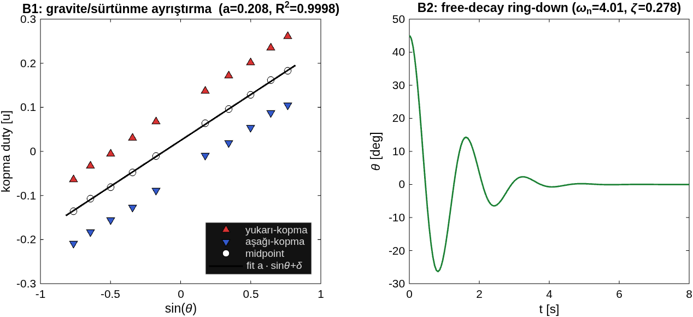

# Aşama 5 — Yüklü Gimbal: Sistem Tanımlama & Kontrol

> **Bu belge ne cevaplar:** Yüklü gimbal (LP eksen + telefon-tilt yükü) için sistem tanımlama
> neden serbest-milden farklı yürütülür, yüklü plant nedir, kontrolcü nasıl yeniden tasarlanır.
> Okuyucu: gelecek-ben / danışman. Vitrin → [`README.md`](../README.md); plan → [`ROADMAP.md`](../ROADMAP.md).
>
> **Durum (2026-06-24):** Aşama 3 (yüksüz MIMO) kapalı. Aşama 5 açık — yüklü **sistem tanımlama**
> tamamlandı (sistematik duty-step); **kontrolcü yeniden tasarımı** firmware'de yazılı, **bench-validasyon
> GATED**. Ad-hoc dönemin firmware/script kalıntıları kod-review ile temizlendi (§12.5.6).

---

## 12.5.0 — Neden yüklü tanımlama serbest-milden FARKLI (metodoloji)

**Geçmiş hata (2026-06-24, kullanıcı eleştirisi):** Serbest milde temiz, sistematik sistem tanımlama
yapıldı (Aşama 1: belli duty ver → çıktıyı ölç → model fit). Yüklüde ilk denemede bu sistematik
**atlandı**, dağınık testler (free-decay, hold-release, kinematik) koşuldu → saatlerce confound. Ders:
**aynı sistematik metodoloji yüklüde de uygulanmalıydı.** Bu bölüm hem doğru sonucu hem de **neden
metodun bir parçasının zorunlu olarak değiştiğini** belgeler.

### Gerçek ve zorunlu fark

| | **Serbest mil (Aşama 1)** | **Yüklü gimbal (Aşama 5)** |
|---|---|---|
| Fiziksel sistem | motor + boş mil | motor + **gravite sarkacı** (telefon-tilt yükü) |
| Mertebe | **1.** | **2.** (sarkaç) + **sürtünme nonlineeritesi** |
| Duty step → ne oturur | sabit **HIZA** ($K\cdot u$) | sabit **AÇIYA** (motor torku = gravite torku) |
| Ölçülen çıktı | hız (encoder rate) | **açı** (FP/encoder) |
| Fit | $K,\tau$ (1. mertebe) | $\omega_n, \zeta$ + **stiction/ölü-bölge** |
| Kısıt | yok (serbest döner) | **±90° kablo limiti** → duty sınırlı |

**Sonuç:** *Metodoloji aynı* (sınırlı duty ver → çıktıyı ölç → fit), ama **ölçülen büyüklük (hız→açı)
ve model yapısı (1.→2. mertebe + sürtünme) zorunlu olarak değişir** çünkü plant fiziksel olarak farklı.
Bu farkı atlamak (hızı ölçmeye çalışmak) yüklüde anlamsızdır — sistem sabit hıza oturmaz.

---

## 12.5.1 — Sistematik yüklü sistem tanımlama (açık-döngü duty-step)

**Ne:** Açık-döngü DUTY modunda (FF kapalı, saf plant) sınırlı duty oranları verildi, **açı yanıtı**
ölçüldü. **Nerede:** `scripts/loaded_sysid_systematic.py` → `artifacts/5/loaded_sysid/`.
**Nasıl:** duty ∈ {±0.05, ±0.08, ±0.10}, her biri 3 s; |FP|>78° güvenlik-STOP; denge-relatif açı.

### Sonuç (sayısal)

| duty | sabit açı (denge-rel) | overshoot | kazanç (°/duty) |
|---|---|---|---|
| +0.05 | **−0.9°** | yok | −18 |
| +0.08 | **−1.8°** | yok | −23 |
| −0.05 | +10.6° | yok | −211 |
| −0.08 | +9.5° | yok | −119 |
| +0.10 | −27.2° | yok | −272 |
| −0.10 | +33.6° | yok | −336 |

### Bulgular (dağınık testlerin KAÇIRDIĞI)

1. **YÖN-ASİMETRİK STICTION (ölü-bölge):** **+ yön ~0.10'a kadar TAKILI** (kopma eşiği yüksek);
   **− yön 0.05'te hareket** ediyor. Küçük + kontrol çabaları **hiçbir şey yapmıyor** → kontrolcü ince
   ayar yapamıyor, "yekpare/takılı" davranış. **Tüm kontrol karışıklığının kök-nedeni budur.**
2. **Overshoot YOK** → sürtünme, **sürülürken** rezonansı söndürüyor. (Serbest-coast free-decay'de
   görülen $\omega_n{=}4$ salınımı, motor sürerken kaybolur — sürtünme baskın.)
3. **Statik kazanç** (kopma üstü) ~**−300°/duty**; asılı denge ~−1° (base elle tutulduğu için drift'li).
   > ⚠ **İzlenebilirlik:** `meta.json` `K_static=−200°/duty` der — bu, TÜM duty'lere (takılı +0.05/+0.08
   > dahil, kazanç ~−20) lineer en-küçük-kareler fit'idir → ölü-bölge bölgesi eğimi aşağı çeker. Fiziksel
   > **kopma-üstü** kazanç ~−300 (±0.10 satırları −272/−336). LS-fit ham metni, kopma-üstü değer fiziği —
   > kontrol-tasarımına kopma-üstü ~−300 girer ("türetilmiş metrik ≠ ham", §12.5.4).

### Tamamlayıcı tanımlama (diğer ölçümler)

- **Sarkaç doğal dinamiği (serbest-coast free-decay):** $\omega_n \approx 4$ rad/s (0.65 Hz),
  $\zeta \approx 0.1$ — `scripts/loaded_pendulum_id.py`. (Bu **sürülmemiş** sarkaç; sürülünce stiction baskın.)
- **Kinematik kazanç:** $k_{kin} = \Delta FP/\Delta\theta_{out} = -0.84$ (`loaded_pos_hold` veri-fit;
  arşivdeki Adım-1 değeri −1.04 idi, gerçek −0.84). Negatif → stabilizasyon polaritesi `stab_dir = +1`.
- **Gravite FF kazancı:** $k_{ff,grav} = 0.21$ (yüklü; asılı-dışı açıyı tutmak için duty/sin θ).
- **Aktif pozisyon-tutma KANITLI:** `loaded_pos_hold` — motor stand'ı komut açılarında ±0.3° tuttu,
  uzak açıda duty harcadı (gravite taklit edemez) → cascade + gravite-FF aktif çalışıyor.

---

## 12.5.2 — Yüklü plant modeli (tam)

$$G(s) = \frac{FP}{u} = \frac{K_m/J}{s^2 + 2\zeta\omega_n s + \omega_n^2}, \quad \omega_n=4,\ \zeta=0.1,\ \frac{K_m}{J}=\frac{\omega_n^2}{k_{ff,grav}}=\frac{16}{0.21}\approx 76$$

**+ YÖN-ASİMETRİK Coulomb stiction (nonlineer):** kopma duty'si + yön ~0.09–0.10, − yön ~0.04–0.05.
Sürtünme, sürülen rejimde rezonansı söndürür (osilasyon riski düşük).

> 📊 **Üreten betik:** `scripts/loaded_sysid_systematic.py` (duty-step ID). Plant türetimi
> ($K_m/J = \omega_n^2/k_{ff,grav}$) bu belgede; sayısal değerler ham veriden.

---

## 12.5.3 — Kontrolcü yeniden tasarımı (yüklü, analitik)

**Sorun:** Şimdiye dek **yüksüz kazançlarla** (cascade $K_{p,pos}=2$, hız PI Aşama-2) yüklü gimbal
kontrol edildi (ROADMAP KRİTİK NOT: yük altında yeniden ayar gerekir — yarım yapılmıştı).

**BİRİNCİL çözüm — sürtünme/ölü-bölge telafisi (asimetrik Coulomb FF):**
Firmware mevcut: `kff_coul` fwd / `kff_coul_rev` rev (`LFFC:` komutu). Veriden: **+ yön ~0.09, − yön ~0.05.**
Bu, ölü-bölgeyi besleme-ileri ile geçer → kontrolcü ince ayar yapabilir hale gelir. + gravite FF
($k_{ff,grav}=0.21$). Mevcut cascade ($K_{p,pos}=2$) + bu FF ile bench-test edilecek.

> ⚠ **Rezonans-damping (gyro/notch) GEREKSİZ görünüyor — superseded.** Önceki dağınık iş, yüklü plant'ı
> "hafif-sönümlü rezonans" sanıp gyro/notch damping tasarladı (`loaded_pendulum_damping_design.m`,
> `loaded_controller_redesign.m` — **2026-06-24 SİLİNDİ**, yedek `archive-asama5-scattered`). Sistematik
> ID gösterdi ki **sürülen rejimde sürtünme rezonansı zaten söndürüyor** (overshoot yok) → asıl sorun
> rezonans DEĞİL, **stiction ölü-bölgesi**. Önceki "0.8 Hz osilasyon = rezonans" yorumu büyük ihtimal
> **stick-slip limit-cycle** idi. Gyro-damping ancak Coulomb-FF sonrası bir ihtiyaç çıkarsa değerlendirilir.

---

## 12.5.4 — Öğrenilen dersler (kalıcı)

- **Sistematik > dağınık:** yüklü ID'yi serbest-mil metodolojisiyle (sınırlı duty → çıktı → fit) yapmak
  şarttı; dağınık testler stiction'ı kaçırdı, sistematik tek testte buldu. (`CLAUDE.md` "Çalışma
  Disiplini §6 veri-önce" + `/memory/veri-once-imu-encoder-analiz`.)
- **Türetilmiş metrik ≠ ham IMU:** "%5'e döndü" gibi metrikler gravite/drift confound'unu maskeledi;
  ham FP+θ_out izi gerçeği söyledi.
- **Base elle tutulunca drift eder** (asılı denge +14→+26→−1° kaydı) → mutlak-açı testleri bozulur;
  denge-relatif / off-hanging ölçüm gerekir.

## 12.5.5 — Yol haritası: yüklü nonlineer plant (B Yolu — MODEL-ÖNCE)

> ⚠ **Plant yapısı (2026-06-24, kullanıcı netleştirdi):** LP tilt ekseni **YERÇEKİMİ-YÜKLÜ** — eksende
> $mgL\sin\theta$ torku etkir; **θ=0 referansı = gravitasyonel-nötr başlangıç** (asılı denge / dip).
> "Denge" = başlangıç-pozisyonu nötrlüğü (karşı-ağırlık/CG-dengeleme DEĞİL). Plant = 2.mertebe nonlineer açı-plantı:
>
> $$J\ddot\theta + b\dot\theta + \tau_c\,\mathrm{sign}(\dot\theta) + mgL\sin\theta = K_m\,u$$
>
> → gravite plantın **çekirdek terimi** (ihmal edilemez), gravite-FF birincil.

> ⚠ **§12.5.1 sistematik ID = iyi BAŞLANGIÇ ama Aşama-1 rigoruna göre EKSİK:** tek koşum, 6 duty,
> gravite↔sürtünme tek-açıda **karışık**, NRMSE/bağımsız-2.doğrulama yok, $K$/$a$ fit raporu yok. Aşama-5
> "sistematik modelleme ipini" ad-hoc testlere dalarak kaybetmişti (§12.5.0) — şimdi **B1 FF-tuning'e
> geçmeden ÖNCE** o ipi rigorous biçimde kapatıyoruz (model-önce; aksi = yine ad-hoc'a dönüş riski).

### Y0 — Yüklü plant RİGOROUS ID (model kapanışı) · **SIRADAKİ**
Aşama-1 disipliniyle; gravite/sürtünme/atalet **TEMİZ AYRILMIŞ** + validasyonlu:

- [ ] **Gravite haritası $a\sin\theta$:** yarı-statik duty → denge-açısı (tüm güvenli aralık, +/− yön);
      $\sin\theta$ şeklini doğrula (gerçekten sarkaç mı), $a=mgL/K_m$ çıkar.
- [ ] **Sürtünme (yön-asimetrik), graviteden AYRIK:** **çok-açıda** +/− kopma duty'si → her açıda gravite
      ($a\sin\theta$) çıkarılır → kalan = stiction (yön-bağımlı). *Tek-açı ölçümü ikisini karıştırır
      (mevcut ID'nin açığı).*
- [ ] **Dinamik $\omega_n,\zeta,\tau$:** sürülen-adım geçici-rejiminden (free-decay $\omega_n\approx4$ ile çapraz-doğrula).
- [ ] **Validasyon:** nonlineer modeli ölçülen duty profiliyle simüle → NRMSE (held-out adım) + bağımsız 2.koşum.
- [ ] **Çıktı:** `loaded_motor_params.json` + `loaded_fit_report.md` + docs §12.5.2 güncelle (Aşama-1 gibi rigor).

### Y1 — Analitik kontrolcü (Y0 modelinden TÜRETİLMİŞ, deneme-yanılma yok)
- [ ] gravite-FF ($a$) · yön-asimetrik sürtünme-FF ($u_{c,+},u_{c,-}$) · cascade re-tune ($\omega_n,\tau$'dan).
- [ ] Operasyon-noktası kazanç değişimi ($\cos\theta$ ile) → gain-schedule mi robust tek-kazanç mı (kanıtla-sonra-karar).

### Y2 — Bench-validasyon (model-DESTEKLİ; **fiziksel motorlu → "hazırım" onayı zorunlu, CLAUDE.md §4**)
- [ ] İnce-POS A/B (FF off/on, **±10°'dan büyük**, ham FP+θ_out izi) → FF model-doğru mu (`loaded_fine_pos_test.py`).
- [ ] Off-hanging STAB + base bozucu → **OFF-vs-ON aynı hızlı sarsıntı**; base-eğim ölçülür; ⚠ `STABDIR2:1`
      doğrula (yoksa runaway). (`loaded_stab_reject.py`.)

### Y3 — Gyro-FF / K7 (Y2 sonrası)
- [ ] Gyro-FF pratik faydası: küçük $k_{ff}$'ten kademeli (analitik IRAKSADI, güvenli ~3); işaret `stab_dir`-bağlı (§12.5.6).
- [ ] K7 Kalman entegrasyonu (IMU payload'a — donanım önkoşulu).

---

## 12.5.6 — Kod-review + ad-hoc kalıntı temizliği (2026-06-24)

**Ne:** Çok-ajanlı kod-review (15 bulgu) Aşama-5 ad-hoc döneminin (rezonans-yanlış-odağı → frustrasyon →
sistematik-ID course-correction) firmware/script **kalıntılarını** ortaya çıkardı. Davranış-nötr +
latent-yol düzeltmeleri uygulandı (motorsuz; firmware derlendi, RAM 4.0%/Flash 9.9%).

### Firmware (`src/main.c`, `include/axis.h`, `src/cmd_parser.c`)
- **`stab_theta0` kaldırıldı (ölü kod).** `be2adfe`'nin "off-hanging giriş θ_out yakala" alanı YAPISAL
  olarak **hep 0** idi: `cmd_set_mode` STAB girişinde `PositionP_Reset` (θ_out=0) + `enc_reset` çağırıyor,
  main-loop edge bunu *sonra* okuyordu. Off-hanging giriş-tutuşunu zaten `enc_reset` sağlıyor (giriş = 0°
  referans) → `target = stab_dir·rel`'e sadeleşti, **davranış değişmedi**.
- **Gyro-FF işareti `stab_dir`'e bağlandı.** Eski `ω_ff=+k_ff·gy` yalnız yüksüz `stab_dir=−1` için
  doğruydu; yüklü LP `stab_dir=+1`'de ters-işaret (anti-reddi) verirdi → `ω_ff = −stab_dir·k_ff·gy`.
  (Latent: gyro-FF default kapalı; yüklü kazanç bench-gated, IRAKSAMA notu kodda.)
- **`coul_db=0` NaN-guard.** `LFFDB:0` ("saf sign-FF") + `ω_ref=0` → `0/0=NaN` duty riski guard'landı.
- **MIRROR↔STAB geçişinde edge zorlandı** (`mirror_prev=false`) → bayat `mirror_ref` lurch'ü önlendi.
- **`STABDIR2:0` no-op** (kazara "kapat" niyeti +1 runaway-işaretine düşmesin).
- **İzlenebilirlik:** bayat `k_kin=−1.04`→`−0.84`, `kff_grav=0.097`→`0.21` (sistematik ID) yorumlarda düzeltildi.
- ⚠ Default `stab_dir=−1` (yüksüz) **DEĞİŞMEDİ** — yüklü LP `STABDIR2:1` operasyonel kuralı korunur
  (atlanırsa runaway; interlock tek-taraflı eklenmedi). Mutlak-encoder referansı (gravite-FF dip-referansını
  da düzeltir) = **bench-gated ileri tasarım**.

### Bench scriptleri (5× `loaded_*.py`)
- **`STALLEN:0`→`STALLEN2:0` (KRİTİK):** yüklü eksen (axis-2) stall-koruması artık doğru kapatılıyor; eski
  hâli HP'yi (axis-0) hedefliyordu → LP yük altında **yanlış-pozitif lockout** riski (testi sessizce keserdi).
- **`atexit` safe-stop:** exception/Ctrl-C'de motor STOP + serial kapanır (STOP global, her iki ekseni durdurur).
- Boş-telemetri guard (NO_DATA, çökme yerine), `summary.md`+`status` (artifact disiplini), ölü kod temizliği.
- **`loaded_stab_reject` auto-verdict CONFOUND'lu etiketlendi** (θ_out_range pasif-gravite/creep ile şişer →
  kesin reddi kanıtı değil); `status=INCONCLUSIVE`; gerçek yargı = OFF-vs-ON hızlı-sarsıntı kıyası + göz.

### Yeniden-sınıflama (dürüstlük)
`loaded_fine_pos` (%25 MAE↓) ve `loaded_stab_reject` (θ_out_range 66°) **VALIDATED DEĞİL** — ham-iz analizi
yok / metrik confound'lu. B1/B2 (§12.5.5) ile doğrulanacak.

### Silinen ad-hoc scriptler (dosya-geçmişi — `archive-asama5-scattered-20260624`)
`9741468` cleanup'ı dağınık MATLAB'ın yanı sıra şu confound'lu test scriptlerini de sildi:
`loaded_stab_offhang.py` (be2adfe'nin `stab_theta0` doğrulama testi — kod kalmıştı, alan şimdi kaldırıldı),
`loaded_gyro_sign` / `stab_ab` tipi A/B scriptleri. Güncel araçlar: `loaded_plant_id_capture.py`
(Y0 — aşağıda) + `loaded_pendulum_id` / `loaded_pos_hold_check` / `loaded_sysid_systematic` /
`loaded_fine_pos_test` / `loaded_stab_reject`.

---

## 12.5.7 — Y0: yüklü plant ID protokolü + estimator doğrulama (analitik-önce)

**Ne:** §12.5.5 "Y0 rigorous ID"in **analitik-önce tasarımı** — ölçüm protokolü + parametre-ayrıştırma
matematiği türetildi ve estimator **sentetik veride** (bilinen parametre → ölç-benzet → fit → geri-kurtar)
doğrulandı. Bench verisine güvenmeden **ÖNCE** aracın çalıştığı kanıtlandı.

**Nerede:** `matlab/asama_5_gimbal/loaded_plant_id_design.m` (tasarım+doğrulama, MATLAB) ·
`scripts/loaded_plant_id_capture.py` (B1 üçgen-rampa + B3 validasyon bench-yakalama) ·
`scripts/loaded_pendulum_id.py` (B2 free-decay).

**Ayrıştırma matematiği (mevcut tek-açı ID'nin KAÇIRDIĞI — iki AYRI rejim):**
- **B1 — gravite + statik sürtünme (sürülen, çok-açılı kopma).** Statik denge bandı
  $u\in[a\sin\theta-s_-,\,a\sin\theta+s_+]$. Çok açıda yukarı/aşağı kopma ölç:
  $\text{mid}(\theta)=a\sin\theta+\tfrac{s_+-s_-}{2}$, $\text{halfgap}=\tfrac{s_++s_-}{2}$. **Lineer fit**
  $\text{mid}$ vs $\sin\theta$ → eğim $=a$, kesişim $=\tfrac{s_+-s_-}{2}$ → **$a,s_+,s_-$ temiz ayrılır.**
  (Tek açıda ölçüm $a\sin\theta$ ile sürtünmeyi karıştırır.)
- **B2 — dinamik $\omega_n,\zeta$ (pasif free-decay).** Yüklüde **sürülen-step OSİLE ETMEZ** (Coulomb
  overshoot'u söndürür — §12.5.1 "overshoot YOK" bulgusu) → $\omega_n,\zeta$ ring-down'dan; $\omega_n$
  frekanstan (sürtünme büyüklüğünden bağımsız).
- **Validasyon:** tam nonlineer model held-out duty profilde simüle → **NRMSE** (Aşama-1 disiplini).

**Sentetik doğrulama (estimator PASS — gerçek parametre → geri-kurtarma):**

| Parametre | Gerçek (sentetik) | Tahmin | Hata |
|---|---|---|---|
| $a$ (gravite) | 0.210 | 0.208 | **−0.8%** (R²=0.9998) |
| $s_+$ (statik sürt. +) | 0.100 | 0.100 | **−0.0%** |
| $s_-$ (statik sürt. −) | 0.050 | 0.050 | **+0.9%** |
| $\omega_n$ | 4.00 | 4.01 | **+0.3%** |
| NRMSE (held-out) | — | 5.94% | **< %15** ✓ |

> 📊 **Üreten betik:** `matlab/asama_5_gimbal/loaded_plant_id_design.m`

> ⚠ **Açık konu — ζ Coulomb-bias'ı:** free-decay log-decrement'i Coulomb coast-sürtünmesiyle **şişer**
> (sentetik ζ 0.12 → tahmin 0.278) → ζ "efektif üst-sınır", saf-viskoz değil. Kontrol için muhafazakâr
> (daha çok sönüm = güvenli). Saf viskoz için: ring-down zarfı Coulomb'da LİNEER / viskozda ÜSTEL → ayrı fit
> (gelecek rafine). $\omega_n$ (frekans) ve $a,s_\pm$ güvenilir.

**Sonraki (bench-GATED, "hazırım"):** `loaded_plant_id_capture.py` (B1+B3) + `loaded_pendulum_id.py` (B2)
koş → ham veri → aynı estimator ile **gerçek** $a,s_+,s_-,\omega_n,\zeta$ + `loaded_motor_params.json` +
`loaded_fit_report.md` (Aşama-1 rigoru) → Y1 analitik kontrol.
